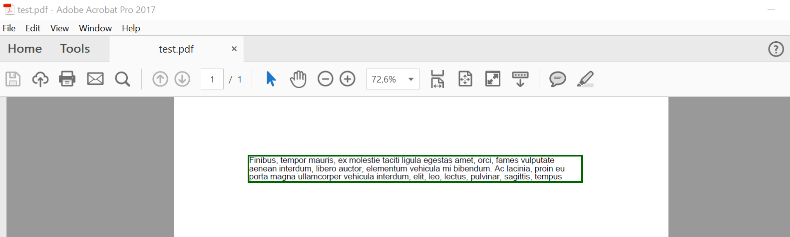

## Basics of using the FloatingBox tool

The Floating Box tool is a special tool for placing text and other content on a PDF page. Its main feature is text clipping when it overlaps the size of the FloatingBox.

```python

    import aspose.pdf as ap

    # Create PDF document
    with ap.Document() as document:
        # Add page to pages collection of PDF
        page = document.pages.add()
        # Create and fill box
        box = ap.FloatingBox(400, 30)
        box.border = ap.BorderInfo(ap.BorderSide.ALL, 1.5, ap.Color.dark_green)
        box.is_need_repeating = False
        box.paragraphs.add(ap.text.TextFragment("text example"))
        # Add box
        page.paragraphs.add(box)
```  

In the example above, we are creating a FloatingBox with a width of 400 pt and a height of 30 pt.
Also, in this example, more text was intentionally created than could fit in the given size.
As a result, the text was cut off.



Property `is_need_repeating` with `False` vaule limit text with 1 page.

If we set this property to `true` the text will be reflow to the next page in the same position.


## Advanced features of FloatingBox

### Multi-column support

#### Multi-column layout (simple case)

`FloatingBox` supports multi-column layout. To create such a layout, you must define the values ​​of the ColumnInfo properties.

* `column_widths` is a string with enumeration of width in pt.
* `column_spacing` is a string with width of the gap between columns.
* `column_count` is a number of columns.

```python

    import aspose.pdf as ap

    # Create PDF document
    with ap.Document() as document:
        # Add page to pages collection of PDF
        page = document.pages.add()
        # Set margin settings
        page.page_info.margin = ap.MarginInfo(36, 18, 36, 18)
        column_count = 3
        spacing = 10
        width = page.page_info.width - page.page_info.margin.left - page.page_info.margin.right - (column_count - 1) * spacing
        column_width = width / 3
        # Create FloatingBox
        box = ap.FloatingBox()
        box.is_need_repeating = True
        box.column_info.column_widths = f"{column_width} {column_width} {column_width}"
        box.column_info.column_spacing = f"{spacing}"
        box.column_info.column_count = 3
        phrase = "text example"
        paragraphs = ["phrase", "phrase", "phrase", "phrase", "phrase", "phrase", "phrase", "phrase", "phrase", "phrase"]
        for paragraph in paragraphs:
            box.paragraphs.add(ap.text.TextFragment(paragraph))
        # Add a box to a page
        page.paragraphs.add(box)
        # Save PDF document
        document.save(path_outfile)
```

We used the additional library LoremNET in the above example and created 20 paragraphs. These paragraphs were divided into three columns and filled the following pages until the text ran out.

#### Multi-column layout with forced column start

We will do the same with the following example as the previous one. The difference is that we created 3 paragraphs. We can force FloatingBox to render each paragraph in the new column. To do that we need to set `is_first_paragraph_in_column` when we adding text to the FloatingBox object.

```python

    import aspose.pdf as ap

    # Create PDF document
    with ap.Document() as document:
        # Add page to pages collection of PDF
        page = document.pages.add()
        # Set margin settings
        page.page_info.margin = ap.MarginInfo(36, 18, 36, 18)
        column_count = 3
        spacing = 10
        width = page.page_info.width - page.page_info.margin.left - page.page_info.margin.right - (
                    column_count - 1) * spacing
        column_width = width / 3
        # Create FloatingBox
        box = ap.FloatingBox()
        box.is_need_repeating = True
        box.column_info.column_widths = f"{column_width} {column_width} {column_width}"
        box.column_info.column_spacing = f"{spacing}"
        box.column_info.column_count = 3
        phrase = "text example"
        paragraphs = ["phrase", "phrase", "phrase", "phrase", "phrase", "phrase", "phrase", "phrase", "phrase",
                        "phrase"]
        for paragraph in paragraphs:
            text = ap.text.TextFragment(paragraph)
            text.is_first_paragraph_in_column = True
            box.paragraphs.add(text)
        # Add a box to a page
        page.paragraphs.add(box)
        # Save PDF document
        document.save(path_outfile)
```

### Background support

You can set desired background color by using `background_color` property.

```python

    import aspose.pdf as ap

    # Create PDF document
    with ap.Document() as document:
        # Add page to pages collection of PDF
        page = document.pages.add()
        # Create and fill box
        box = ap.FloatingBox(400, 30)
        box.background_color = ap.Color.light_green
        box.is_need_repeating = False
        box.paragraphs.add(ap.text.TextFragment("text example"))
        # Add box
```

### Positioning support

The location of the FloatingBox on the generated page is determined by the `positioning_mode`, `left`, `top` properties.
When the `positioning_mode` value is

- `ParagraphPositioningMode.DEFAULT` (default value)

The location is determined by the previously placed elements.
Adding an element is taken into account when determining the location of subsequent elements.
If the value of at least one of the Left, Top properties is not zero, then they are also taken into account, but this uses a not entirely obvious logic and it is better not to use this.

- `ParagraphPositioningMode.ABSOLUTE`

The location is specified by the Left and Top values, does not depend on previous elements and does not affect the location of subsequent ones.

```python

    import aspose.pdf as ap

    # Create PDF document
    with ap.Document() as document:
        # Add page to pages collection of PDF
        page = document.pages.add()
        # Create and fill box
        box = ap.FloatingBox(400, 30)
        box.top = 45
        box.left  = 15
        box.positioning_mode = ap.ParagraphPositioningMode.ABSOLUTE
        box.border = ap.BorderInfo(ap.BorderSide.ALL, 1.5, ap.Color.dark_green)
        box.paragraphs.add(ap.text.TextFragment("text example 1"))
        page.paragraphs.add(ap.text.TextFragment("text example 2"))
        # Add the box to the page
        page.paragraphs.add(box)
        page.paragraphs.add(ap.text.TextFragment("text example 3"))
```
