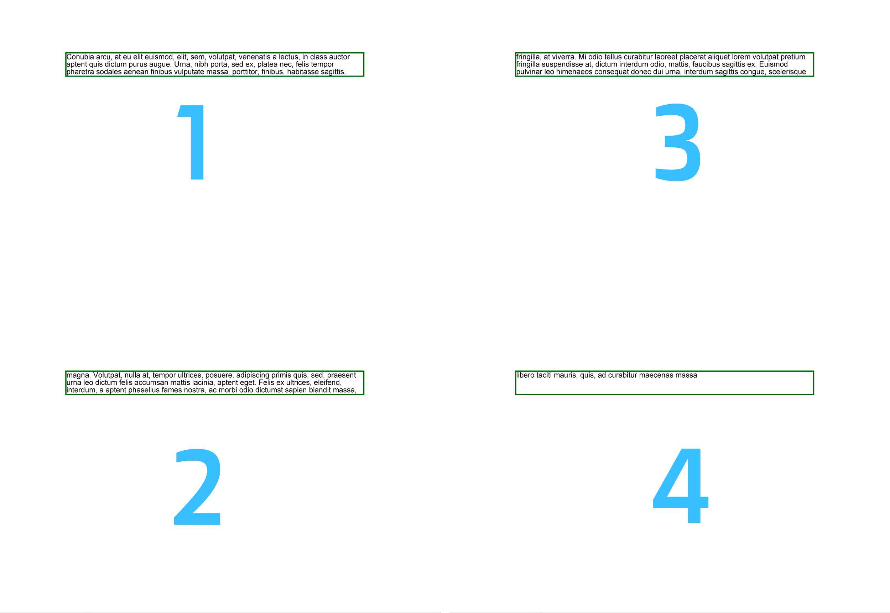

## Basics of using the FloatingBox tool

The Floating Box tool is a special tool for placing text and other content on a PDF page. Its main feature is text clipping when it overlaps the size of the FloatingBox. Create and add a FloatingBox to a PDF document using Aspose.PDF for Python. A FloatingBox acts as a movable text container, allowing more control over layout positioning, borders, and styling compared to regular text paragraphs.

1. Create a New PDF Document.
1. Add a Page to the Document.
1. Create a FloatingBox.
1. Set the Box Border Style.
1. Control Box Repetition.
1. Add Text Content to the Box.
1. Add the FloatingBox to the Page.
1. Save the Final PDF Document.

```python

import math
import os
import aspose.pdf as ap

# Global configuration
DATA_DIR = "your path here"

def create_and_add_floating_box(outfile):
    """
    Create and add a basic floating box to a PDF document.

    Demonstrates the fundamental usage of FloatingBox to create a bordered
    text container with Lorem ipsum content. Shows basic box creation,
    styling, and text content addition.

    Args:
        outfile (str): Path where the PDF with floating box will be saved.

    Returns:
        None: The function creates and saves a PDF file with a floating box.

    Note:
        - Creates a FloatingBox with dimensions 400x30
        - Applies dark green border with 1.5 width
        - Sets is_need_repeating to False for single occurrence
        - Contains Lorem ipsum text fragment
        - Demonstrates basic floating box functionality

    Example:
        >>> create_and_add_floating_box("basic_floating_box.pdf")
        # Creates a PDF with a simple bordered floating text box
    """

    # Create PDF document
    with ap.Document() as document:
        # Add page to pages collection of PDF
        page = document.pages.add()
        # Create and fill box
        box = ap.FloatingBox(400, 30)
        box.border = ap.BorderInfo(ap.BorderSide.ALL, 1.5, ap.Color.dark_green)
        box.is_need_repeating = False
        phrase = "Lorem ipsum dolor sit amet, consectetur adipiscing elit. Fusce quam odio, sollicitudin ac mauris vel, suscipit pellentesque nisi."
        box.paragraphs.add(ap.text.TextFragment(phrase))
        # Add box
        page.paragraphs.add(box)
        document.save(outfile)
```  

In the example above, we are creating a FloatingBox with a width of 400 pt and a height of 30 pt.
Also, in this example, more text was intentionally created than could fit in the given size.
As a result, the text was cut off.


Property `is_need_repeating` with `False` vaule limit text with 1 page.

If we set this property to `true` the text will be reflow to the next page in the same position.



## Advanced features of FloatingBox

### Multi-column support

#### Multi-column layout (simple case)

`FloatingBox` supports multi-column layout. To create such a layout, you must define the values ​​of the ColumnInfo properties.

* `column_widths` is a string with enumeration of width in pt.
* `column_spacing` is a string with width of the gap between columns.
* `column_count` is a number of columns.

```python

import math
import os
import aspose.pdf as ap

# Global configuration
DATA_DIR = "your path here"

def multi_column_layout(outfile):
    """
    Create a multi-column layout using FloatingBox.

    Demonstrates advanced layout capabilities by creating a three-column
    text layout within a floating box. Shows dynamic width calculation
    and column spacing configuration.

    Args:
        outfile (str): Path where the PDF with multi-column layout will be saved.

    Returns:
        None: The function creates and saves a PDF file with multi-column text.

    Note:
        - Creates 3 equal-width columns with 10-unit spacing
        - Calculates column width based on page margins and spacing
        - Uses is_need_repeating for content continuation across columns
        - Adds multiple Lorem ipsum paragraphs for column demonstration
        - Automatically distributes content across columns

    Example:
        >>> multi_column_layout("multi_column.pdf")
        # Creates a PDF with text arranged in three columns
    """
    # Create PDF document
    with ap.Document() as document:
        # Add page to pages collection of PDF
        page = document.pages.add()
        # Set margin settings
        page.page_info.margin = ap.MarginInfo(36, 18, 36, 18)
        column_count = 3
        spacing = 10
        width = (
            page.page_info.width
            - page.page_info.margin.left
            - page.page_info.margin.right
            - (column_count - 1) * spacing
        )
        column_width = width / 3
        # Create FloatingBox
        box = ap.FloatingBox()
        box.is_need_repeating = True
        box.column_info.column_widths = f"{column_width} {column_width} {column_width}"
        box.column_info.column_spacing = f"{spacing}"
        box.column_info.column_count = 3
        phrase = "Lorem ipsum dolor sit amet, consectetur adipiscing elit. Fusce quam odio, sollicitudin ac mauris vel, suscipit pellentesque nisi."
        paragraphs = [
            phrase,
            phrase,
            phrase,
            phrase,
            phrase,
            phrase,
            phrase,
            phrase,
            phrase,
            phrase,
        ]
        for paragraph in paragraphs:
            box.paragraphs.add(ap.text.TextFragment(paragraph))
        # Add a box to a page
        page.paragraphs.add(box)
        # Save PDF document
        document.save(outfile)
```

We used the additional library LoremNET in the above example and created 20 paragraphs. These paragraphs were divided into three columns and filled the following pages until the text ran out.

#### Multi-column layout with forced column start

We will do the same with the following example as the previous one. The difference is that we created 3 paragraphs. We can force FloatingBox to render each paragraph in the new column. To do that we need to set `is_first_paragraph_in_column` when we adding text to the FloatingBox object.

```python

import math
import os
import aspose.pdf as ap

# Global configuration
DATA_DIR = "your path here"

def multi_column_layout_2(outfile):
    """
    Create a multi-column layout with paragraph column control.

    Demonstrates advanced multi-column layout with explicit control over
    paragraph positioning within columns. Uses is_first_paragraph_in_column
    to control text flow and column breaks.

    Args:
        outfile (str): Path where the PDF with controlled multi-column layout will be saved.

    Returns:
        None: The function creates and saves a PDF file with controlled column text.

    Note:
        - Creates 3 equal-width columns with 10-unit spacing
        - Uses is_first_paragraph_in_column for explicit column control
        - Calculates column width dynamically based on page dimensions
        - Demonstrates precise paragraph positioning within columns
        - Shows advanced column layout management techniques

    Example:
        >>> multi_column_layout_2("controlled_columns.pdf")
        # Creates a PDF with precisely controlled multi-column text flow
    """

    # Create PDF document
    with ap.Document() as document:
        # Add page to pages collection of PDF
        page = document.pages.add()
        # Set margin settings
        page.page_info.margin = ap.MarginInfo(36, 18, 36, 18)
        column_count = 3
        spacing = 10
        width = (
            page.page_info.width
            - page.page_info.margin.left
            - page.page_info.margin.right
            - (column_count - 1) * spacing
        )
        column_width = width / 3
        # Create FloatingBox
        box = ap.FloatingBox()
        box.is_need_repeating = True
        box.column_info.column_widths = f"{column_width} {column_width} {column_width}"
        box.column_info.column_spacing = f"{spacing}"
        box.column_info.column_count = 3
        phrase = "Lorem ipsum dolor sit amet, consectetur adipiscing elit. Fusce quam odio, sollicitudin ac mauris vel, suscipit pellentesque nisi."
        paragraphs = [
            phrase,
            phrase,
            phrase,
            phrase,
            phrase,
            phrase,
            phrase,
            phrase,
            phrase,
            phrase,
        ]
        for paragraph in paragraphs:
            text = ap.text.TextFragment(paragraph)
            text.is_first_paragraph_in_column = True
            box.paragraphs.add(text)
        # Add a box to a page
        page.paragraphs.add(box)
        # Save PDF document
        document.save(outfile)
```

### Background support

Apply a background color to a FloatingBox in a PDF document using Aspose.PDF for Python via .NET.
A FloatingBox is a container for text or other elements, and by assigning a background color, you can make the content stand out visually — useful for headers, highlights, or styled sections.

This code snippet shows how to create a simple light green text box with sample content.

```python

import math
import os
import aspose.pdf as ap

# Global configuration
DATA_DIR = "your path here"

def background_support(outfile):
    """
    Demonstrate FloatingBox background color support.

    Shows how to apply background colors to floating boxes to create
    visually distinct text containers. Demonstrates basic styling
    capabilities for enhanced visual presentation.

    Args:
        outfile (str): Path where the PDF with colored background box will be saved.

    Returns:
        None: The function creates and saves a PDF file with a colored floating box.

    Note:
        - Applies light green background color to the floating box
        - Creates a 400x30 box with sample text content
        - Sets is_need_repeating to False for single occurrence
        - Demonstrates visual styling options for floating boxes
        - Shows how background colors enhance text presentation

    Example:
        >>> background_support("colored_background.pdf")
        # Creates a PDF with a light green background floating box
    """

    # Create PDF document
    with ap.Document() as document:
        # Add page to pages collection of PDF
        page = document.pages.add()
        # Create and fill box
        box = ap.FloatingBox(400, 30)
        box.background_color = ap.Color.light_green
        box.is_need_repeating = False
        box.paragraphs.add(ap.text.TextFragment("text example"))
        # Add box
        page.paragraphs.add(box)
        # Save PDF document
        document.save(outfile)
```

### Positioning support

The location of the FloatingBox on the generated page is determined by the `positioning_mode`, `left`, `top` properties.
When the `positioning_mode` value is

 - `ParagraphPositioningMode.DEFAULT` (default value)

The location is determined by the previously placed elements.
Adding an element is taken into account when determining the location of subsequent elements.
If the value of at least one of the Left, Top properties is not zero, then they are also taken into account, but this uses a not entirely obvious logic and it is better not to use this.

 - `ParagraphPositioningMode.ABSOLUTE`

The location is specified by the Left and Top values, does not depend on previous elements and does not affect the location of subsequent ones.

```python

import math
import os
import aspose.pdf as ap

# Global configuration
DATA_DIR = "your path here"

def offset_support(outfile):
    """
    Demonstrate FloatingBox positioning and offset support.

    Shows how to position floating boxes at specific coordinates using
    absolute positioning mode. Demonstrates integration of floating boxes
    with regular text content and precise layout control.

    Args:
        outfile (str): Path where the PDF with positioned floating box will be saved.

    Returns:
        None: The function creates and saves a PDF file with positioned floating box.

    Note:
        - Uses absolute positioning mode for precise box placement
        - Sets box position to top=45, left=15 coordinates
        - Creates bordered box with dark green border
        - Integrates floating box with regular text paragraphs
        - Demonstrates layered content with mixed positioning

    Example:
        >>> offset_support("positioned_box.pdf")
        # Creates a PDF with a floating box at specific coordinates
    """

    # Create PDF document
    with ap.Document() as document:
        # Add page to pages collection of PDF
        page = document.pages.add()
        # Create and fill box
        box = ap.FloatingBox(400, 30)
        box.top = 45
        box.left = 15
        box.positioning_mode = ap.ParagraphPositioningMode.ABSOLUTE
        box.border = ap.BorderInfo(ap.BorderSide.ALL, 1.5, ap.Color.dark_green)
        box.paragraphs.add(ap.text.TextFragment("text example 1"))
        page.paragraphs.add(ap.text.TextFragment("text example 2"))
        # Add the box to the page
        page.paragraphs.add(box)
        page.paragraphs.add(ap.text.TextFragment("text example 3"))
        document.save(outfile)
```

### Align Floating Boxes with Vertical and Horizontal Alignment in PDF

Align FloatingBox elements within a PDF page using different vertical and horizontal alignment options in Aspose.PDF for Python via . NET. It shows how to control layout positioning (top, center, bottom, left, right) to achieve precise visual alignment of floating containers. Each floating box is assigned a distinct position to showcase alignment flexibility for page layout, header/footer placement, or side annotations.

1. Create a New PDF Document.
1. Add a Page to the Document.
1. Create the First FloatingBox (Bottom-Right Alignment).
1. Create the Second FloatingBox (Center-Right Alignment).
1. Create the Third FloatingBox (Top-Right Alignment).
1. Save the Document.

```python

import math
import os
import aspose.pdf as ap

# Global configuration
DATA_DIR = "your path here"

def align_text_to_float(outfile):
    """
    Demonstrate text alignment options for FloatingBox elements.

    Shows different vertical and horizontal alignment options for floating
    boxes. Creates multiple boxes with different alignment settings to
    demonstrate positioning flexibility.

    Args:
        outfile (str): Path where the PDF with aligned floating boxes will be saved.

    Returns:
        None: The function creates and saves a PDF file with variously aligned boxes.

    Note:
        - Creates three 100x100 floating boxes with different alignments
        - First box: bottom-right alignment
        - Second box: center-right alignment
        - Third box: top-right alignment
        - All boxes have blue borders for visual distinction
        - Demonstrates comprehensive alignment control options

    Example:
        >>> align_text_to_float("aligned_boxes.pdf")
        # Creates a PDF with floating boxes in different alignment positions
    """
    # Create PDF document
    with ap.Document() as document:
        # Add page to pages collection of PDF
        page = document.pages.add()

        # Create float box
        float_box = ap.FloatingBox(100, 100)
        # Set settings to float box
        float_box.vertical_alignment = ap.VerticalAlignment.BOTTOM
        float_box.horizontal_alignment = ap.HorizontalAlignment.RIGHT
        float_box.paragraphs.add(ap.text.TextFragment("FloatingBox_bottom"))
        float_box.border = ap.BorderInfo(ap.BorderSide.ALL, ap.Color.blue)
        # Add float box
        page.paragraphs.add(float_box)

        # Create float box
        float_box_2 = ap.FloatingBox(100, 100)
        # Set settings to float box
        float_box_2.vertical_alignment = ap.VerticalAlignment.CENTER
        float_box_2.horizontal_alignment = ap.HorizontalAlignment.RIGHT
        float_box_2.paragraphs.add(ap.text.TextFragment("FloatingBox_center"))
        float_box_2.border = ap.BorderInfo(ap.BorderSide.ALL, ap.Color.blue)
        # Add float box
        page.paragraphs.add(float_box_2)

        # Create float box
        float_box_3 = ap.FloatingBox(100, 100)
        # Set settings to float box
        float_box_3.vertical_alignment = ap.VerticalAlignment.TOP
        float_box_3.horizontal_alignment = ap.HorizontalAlignment.RIGHT
        float_box_3.paragraphs.add(ap.text.TextFragment("FloatingBox_top"))
        float_box_3.border = ap.BorderInfo(ap.BorderSide.ALL, ap.Color.blue)
        # Add float box
        page.paragraphs.add(float_box_3)

        # Save the document
        document.save(outfile)
```