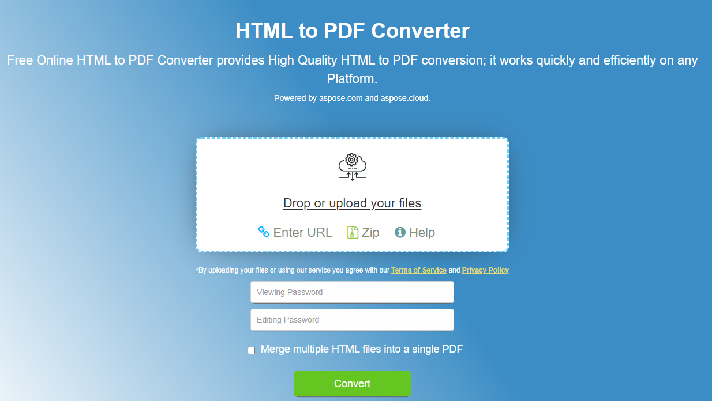

## Python HTML to PDF Conversion

**Aspose.PDF for Python via .NET** lets you convert existing HTML documents to PDF with flexible rendering options. You can fine-tune how the output is generated to match your layout, styling, accessibility, and archiving requirements.

## Convert HTML to PDF

The following Python example shows the basic workflow for converting an HTML document to PDF.

1. Create an instance of the [HtmlLoadOptions](https://reference.aspose.com/pdf/python-net/aspose.pdf/htmlloadoptions/) class.
1. Initialize a [Document](https://reference.aspose.com/pdf/python-net/aspose.pdf/document/) object with the source HTML file.
1. Save the output PDF document by calling `document.save()`.

```python
from os import path
import aspose.pdf as ap

path_infile = path.join(self.data_dir, infile)
path_outfile = path.join(self.data_dir, "python", outfile)

load_options = ap.HtmlLoadOptions()
load_options.page_layout_option = ap.HtmlPageLayoutOption.SCALE_TO_PAGE_WIDTH
document = ap.Document(path_infile, load_options)
document.save(path_outfile)
print(infile + " converted into " + outfile)
```

{}
**Try to convert HTML to PDF online**

Aspose presents the free online application ["HTML to PDF"](https://products.aspose.app/html/en/conversion/html-to-pdf), where you can test the conversion quality and output.

[](https://products.aspose.app/html/en/conversion/html-to-pdf)
{}

## Convert HTML to PDF using media type

This example shows how to convert an HTML file to PDF using specific rendering options.

1. Create an instance of the [HtmlLoadOptions()](https://reference.aspose.com/pdf/python-net/aspose.pdf/htmlloadoptions/) class.
1. Set `html_media_type` to apply CSS rules intended for screen or print layouts, such as `HtmlMediaType.SCREEN` or `HtmlMediaType.PRINT`.
1. Load the HTML into an `ap.Document` using the load options.
1. Save the document as a PDF.

```python
from os import path
import aspose.pdf as ap

path_infile = path.join(self.data_dir, infile)
path_outfile = path.join(self.data_dir, "python", outfile)

load_options = ap.HtmlLoadOptions()
load_options.html_media_type = ap.HtmlMediaType.SCREEN
document = ap.Document(path_infile, load_options)
document.save(path_outfile)
print(infile + " converted into " + outfile)
```

## Prioritize the CSS `@page` rule during HTML-to-PDF conversion

Some documents use [the `@page` rule](https://developer.mozilla.org/en-US/docs/Web/CSS/@page) for page layout. If those styles conflict with other settings, you can control the priority with `is_priority_css_page_rule`.

1. Create an instance of the [HtmlLoadOptions](https://reference.aspose.com/pdf/python-net/aspose.pdf/htmlloadoptions/) class.
1. Set `is_priority_css_page_rule = False` to let other styles take precedence over `@page` rules.
1. Load the HTML into an `ap.Document` with the configured options.
1. Save the document as a PDF.

```python
from os import path
import aspose.pdf as ap

path_infile = path.join(self.data_dir, infile)
path_outfile = path.join(self.data_dir, "python", outfile)

load_options = ap.HtmlLoadOptions()
# load_options.is_priority_css_page_rule = False
document = ap.Document(path_infile, load_options)
document.save(path_outfile)
print(infile + " converted into " + outfile)
```

## Convert HTML to PDF with embedded fonts

This example shows how to convert an HTML file to PDF while embedding fonts. If you need the output PDF to preserve the original typography more reliably, set `is_embed_fonts` to `True`.

1. Create `HtmlLoadOptions()` to configure HTML-to-PDF conversion.
1. Set `is_embed_fonts = True` to embed the fonts used in the HTML directly into the PDF.
1. Load the HTML into an `ap.Document` with these options.
1. Save the document as a PDF.

```python
from os import path
import aspose.pdf as ap

path_infile = path.join(self.data_dir, infile)
path_outfile = path.join(self.data_dir, "python", outfile)

load_options = ap.HtmlLoadOptions()
load_options.is_embed_fonts = True
document = ap.Document(path_infile, load_options)
document.save(path_outfile)
print(infile + " converted into " + outfile)
```

## Render HTML content on a single PDF page

This example demonstrates how to convert an HTML file into a single-page PDF using Aspose.PDF for Python via .NET. Use the `is_render_to_single_page` property when you want the full HTML content rendered onto one continuous page.

1. Create an instance of `HtmlLoadOptions()` to configure the conversion process.
1. Enable `is_render_to_single_page` to render the full HTML content on one page.
1. Load the document with the configured options into an `ap.Document`.
1. Save the result as a PDF file.

```python
from os import path
import aspose.pdf as ap

path_infile = path.join(self.data_dir, infile)
path_outfile = path.join(self.data_dir, "python", outfile)

options = ap.HtmlLoadOptions()
options.is_render_to_single_page = True

doc = ap.Document(path_infile, options)
doc.save(path_outfile)
```

## Create logical structure from HTML tags

Logical structure, also called a tagged PDF, preserves the semantic hierarchy of the original HTML, such as headings, paragraphs, and lists. This makes the resulting PDF more accessible, searchable, and suitable for structured document workflows.

By enabling logical structure during conversion, the HTML DOM is mapped into a PDF tag tree rather than rendered only as visual content.

To meet accessibility requirements, a PDF should include logical structure elements that define reading order, provide alternate text for screen readers, and preserve the hierarchy of the content.

> The quality of the logical structure in the output PDF depends directly on the quality of the original HTML markup. Poorly structured or invalid HTML may result in incomplete or inaccurate tagging in the converted PDF.

1. Create an HtmlLoadOptions instance to control how the HTML is converted.
1. Activate semantic tagging so the PDF contains structured elements.
1. Open the HTML file using the configured options.
1. Save the structured PDF.

```python
import aspose.pdf as ap

# Path to the source HTML
input_html_path = "input.html"
# Path for the Logical Structure PDF
output_pdf_path = "output_logical_structure.pdf"
# Initialize HtmlLoadOptions
options = ap.HtmlLoadOptions()
# Convert HTML markup to PDF logical structure elements
options.create_logical_structure = True
# Open PDF document
with ap.Document(input_html_path, options) as document:
    # Save PDF document
    document.save(output_pdf_path)
```

## Convert MHTML to PDF

This example shows how to convert an MHT or MHTML file into a PDF document using Aspose.PDF for Python via .NET with specific page dimensions.

1. Create an instance of `ap.MhtLoadOptions()` to configure MHTML file processing.
1. Set various parameters, such as page size.
1. Initialize the document with the input file and configured loading options.
1. Save the resulting document as a PDF.

```python
from os import path
import aspose.pdf as ap

path_infile = path.join(self.data_dir, infile)
path_outfile = path.join(self.data_dir, "python", outfile)
load_options = ap.MhtLoadOptions()
load_options.page_info.width = 842
load_options.page_info.height = 1191
document = ap.Document(path_infile, load_options)
document.save(path_outfile)
print(infile + " converted into " + outfile)
```

## Related conversions

- [Convert PDF to HTML](/pdf/python-net/convert-pdf-to-html/) when you need web-ready output from existing PDF files.
- [Convert other file formats to PDF](/pdf/python-net/convert-other-files-to-pdf/) for EPUB, XPS, text, and PostScript conversion workflows.
- [Convert images to PDF](/pdf/python-net/convert-images-format-to-pdf/) when your source content is image-based instead of HTML markup.