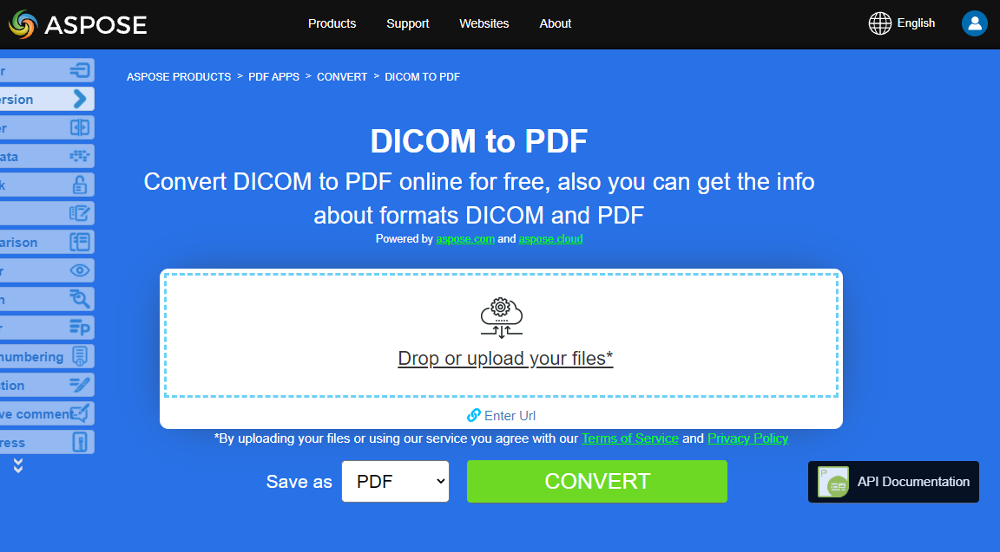

## Overview

This article explains how to convert various Images formats to PDF using Python. It covers these topics.

_Format_: **BMP**
- [Python BMP to PDF](#python-bmp-to-pdf)
- [Python Convert BMP to PDF](#python-bmp-to-pdf)
- [Python How to convert BMP image to PDF](#python-bmp-to-pdf)

_Format_: **CGM**
- [Python CGM to PDF](#python-cgm-to-pdf)
- [Python Convert CGM to PDF](#python-cgm-to-pdf)
- [Python How to convert CGM image to PDF](#python-cgm-to-pdf)

_Format_: **DICOM**
- [Python DICOM to PDF](#python-dicom-to-pdf)
- [Python Convert DICOM to PDF](#python-dicom-to-pdf)
- [Python How to convert DICOM image to PDF](#python-dicom-to-pdf)

_Format_: **EMF**
- [Python EMF to PDF](#python-emf-to-pdf)
- [Python Convert EMF to PDF](#python-emf-to-pdf)
- [Python How to convert EMF image to PDF](#python-emf-to-pdf)

_Format_: **GIF**
- [Python GIF to PDF](#python-gif-to-pdf)
- [Python Convert GIF to PDF](#python-gif-to-pdf)
- [Python How to convert GIF image to PDF](#python-gif-to-pdf)

_Format_: **PNG**
- [Python PNG to PDF](#python-png-to-pdf)
- [Python Convert PNG to PDF](#python-png-to-pdf)
- [Python How to convert PNG image to PDF](#python-png-to-pdf)

_Format_: **SVG**
- [Python SVG to PDF](#python-svg-to-pdf)
- [Python Convert SVG to PDF](#python-svg-to-pdf)
- [Python How to convert SVG image to PDF](#python-svg-to-pdf)

_Format_: **TIFF**
- [Python TIFF to PDF](#python-tiff-to-pdf)
- [Python Convert TIFF to PDF](#python-tiff-to-pdf)
- [Python How to convert TIFF image to PDF](#python-tiff-to-pdf)

## Python Images to PDF Conversions

**Aspose.PDF for Python via .NET**  allows you to convert different formats of images to PDF files. Our library demonstrates code snippets for converting the most popular image formats, such as - BMP, CGM, DICOM, EMF, JPG, PNG, SVG and TIFF formats.

## Convert BMP to PDF

Convert BMP files to PDF document using **Aspose.PDF for Python via .NET** library.

<abbr title="Bitmap Image File">BMP</abbr> images are Files having extension. BMP represent Bitmap Image files that are used to store bitmap digital images. These images are independent of graphics adapter and are also called device independent bitmap (DIB) file format.

You can convert BMP to PDF files with Aspose.PDF for Python via .NET API. Therefore, you can follow the following steps to convert BMP images:

Steps to Convert BMP to PDF in Python:

1. Creates an empty PDF document.
1. Adds a new A4-sized page.
1. Places the image (from infile) inside the page using the defined rectangle.
1. Saves the document as PDF.

So the following code snippet follows these steps and shows how to convert BMP to PDF using Python:

```python

    from io import FileIO
    from os import path
    import os
    import shutil
    import aspose.pdf as apdf
    import inspect

    path_infile = path.join(self.data_dir, infile)
    path_outfile = path.join(self.data_dir, "python", outfile)

    document = apdf.Document()
    rectangle = apdf.Rectangle(0, 0, 595, 842, True)  # A4 size in points
    page.add_image(path_infile, rectangle)
    document.save(path_outfile)

    print(infile + " converted into " + outfile)
```

{}
**Try to convert BMP to PDF online**

Aspose presents you online free application ["BMP to PDF"](https://products.aspose.app/pdf/conversion/bmp-to-pdf/), where you may try to investigate the functionality and quality it works.

[](https://products.aspose.app/pdf/conversion/bmp-to-pdf/)
{}

## Convert CGM to PDF

Converts a CGM (Computer Graphics Metafile) into PDF (or another supported format) using Aspose.PDF for Python via .NET.

<abbr title="Computer Graphics Metafile">CGM</abbr> is a file extension for a Computer Graphics Metafile format commonly used in CAD (computer-aided design) and presentation graphics applications. CGM is a vector graphics format that supports three different encoding methods: binary (best for program read speed), character-based (produces the smallest file size and allows for faster data transfers) or cleartext encoding (allows users to read and modify the file with a text editor).

Check next code snippet for converting CGM files to PDF format.

Steps to Convert CGM to PDF in Python:

1. Define File Paths
1. Set Load Options for CGM.
1. Convert CGM to PDF
1. Print Conversion Message

```python

    from io import FileIO
    from os import path
    import os
    import shutil
    import aspose.pdf as apdf
    import inspect

    path_infile = path.join(self.data_dir, infile)
    path_outfile = path.join(self.data_dir, "python", outfile)

    options = apdf.CgmLoadOptions()

    # Open PDF document
    document = apdf.Document(path_infile, options)
    document.save(path_outfile)
    print(infile + " converted into " + outfile)
```

## Convert DICOM to PDF

<abbr title="Digital Imaging and Communications in Medicine">DICOM</abbr> format is the medical industry standard for the creation, storage, transmission, and visualization of digital medical images and documents of examined patients.

**Aspose.PDF for Python** allows you to convert DICOM and SVG images, but for technical reasons to add images you need to specify the type of file to be added to PDF.

The following code snippet shows how to convert DICOM files to PDF format with Aspose.PDF. You should load DICOM image, place the image on a page in a PDF file and save the output as PDF.

1. Load the DICOM file.
1. Extract image dimensions.
1. Print image size.
1. Create a new PDF document.
1. Prepare the DICOM image for PDF.
1. Set PDF page size and margins.
1. Add the image to the page.
1. Save the PDF.
1. Print Conversion Message.

```python

    from io import FileIO
    from os import path
    import os
    import shutil
    import aspose.pdf as apdf
    import inspect
    import pydicom


    path_infile = path.join(self.data_dir, infile)
    path_outfile = path.join(self.data_dir, "python", outfile)

    # Load the DICOM file
    dicom_file = pydicom.dcmread(path_infile)

    # Get the dimensions of the image
    rows = dicom_file.Rows
    columns = dicom_file.Columns

    # Print the dimensions
    print(f"DICOM image size: {rows} x {columns} pixels")

    # Initialize new Document
    document = apdf.Document()
    page = document.pages.add()
    image = apdf.Image()
    image.file_type = apdf.ImageFileType.DICOM
    image.file = path_infile

    # Set page dimensions

    page.page_info.height = rows
    page.page_info.width = columns
    page.page_info.margin.bottom = 0
    page.page_info.margin.top = 0
    page.page_info.margin.right = 0
    page.page_info.margin.left = 0
    page.paragraphs.add(image)

    document.save(path_outfile)
    print(infile + " converted into " + outfile)
```

{}
**Try to convert DICOM to PDF online**

Aspose presents you online free application ["DICOM to PDF"](https://products.aspose.app/pdf/conversion/dicom-to-pdf/), where you may try to investigate the functionality and quality it works.

[](https://products.aspose.app/pdf/conversion/dicom-to-pdf/)
{}

## Convert EMF to PDF

<abbr title="Enhanced metafile format">EMF</abbr> stores graphical images device-independently. Metafiles of EMF comprises of variable-length records in chronological order that can render the stored image after parsing on any output device.

The following code snippet shows how to convert an EMF to PDF with Python:

```python

    from io import FileIO
    from os import path
    import os
    import shutil
    import aspose.pdf as apdf
    import inspect
    import pydicom
    
    path_infile = path.join(self.data_dir, infile)
    path_outfile = path.join(self.data_dir, "python", outfile)

    document = apdf.Document()
    page = document.pages.add()
    rectangle = apdf.Rectangle(0, 0, 595, 842, True)  # A4 size in points
    # add image to new pdf page
    page.add_image(path_infile, rectangle)

    # Save the file into PDF format
    document.save(path_outfile)
    print(infile + " converted into " + outfile)
```

{}
**Try to convert EMF to PDF online**

Aspose presents you online free application ["EMF to PDF"](https://products.aspose.app/pdf/conversion/emf-to-pdf/), where you may try to investigate the functionality and quality it works.

[](https://products.aspose.app/pdf/conversion/emf-to-pdf/)
{}

## Convert GIF to PDF

Convert GIF files to PDF document using **Aspose.PDF for Python via .NET** library.

<abbr title="Graphics Interchange Format">GIF</abbr> is able to store compressed data without loss of quality in a format of no more than 256 colors. The hardware-independent GIF format was developed in 1987 (GIF87a) by CompuServe for transmitting bitmap images over networks.

So the following code snippet follows these steps and shows how to convert BMP to PDF using Python:

```python

    from io import FileIO
    from os import path
    import os
    import shutil
    import aspose.pdf as apdf
    import inspect
    import pydicom

    path_infile = path.join(self.data_dir, infile)
    path_outfile = path.join(self.data_dir, "python", outfile)

    document = apdf.Document()
    page = document.pages.add()
    rectangle = apdf.Rectangle(0, 0, 595, 842, True)  # A4 size in points
    page.add_image(path_infile, rectangle)

    document.save(path_outfile)
    print(infile + " converted into " + outfile)
```

{}
**Try to convert GIF to PDF online**

Aspose presents you online free application ["GIF to PDF"](https://products.aspose.app/pdf/conversion/gif-to-pdf/), where you may try to investigate the functionality and quality it works.

[](https://products.aspose.app/pdf/conversion/gif-to-pdf/)
{}

## Convert PNG to PDF

**Aspose.PDF for Python via .NET** support feature to convert PNG images to PDF format. Check the next code snippet for realizing you task.

<abbr title="Portable Network Graphics">PNG</abbr> refers to a type of raster image file format that use loseless compression, that makes it popular among its users.

You can convert PNG to PDF image using the below steps:

1. Create a New PDF Document
1. Define Image Placement
1. Save the PDF
1. Print Conversion Message

Moreover, the code snippet below shows how to convert PNG to PDF with Python:

```python

    from io import FileIO
    from os import path
    import os
    import shutil
    import aspose.pdf as apdf
    import inspect
    import pydicom

    path_infile = path.join(self.data_dir, infile)
    path_outfile = path.join(self.data_dir, "python", outfile)

    document = apdf.Document()
    page = document.pages.add()
    rectangle = apdf.Rectangle(0, 0, 595, 842, True)  # A4 size in points
    page.add_image(path_infile, rectangle)
    document.save(path_outfile)

    print(infile + " converted into " + outfile)
```

{}
**Try to convert PNG to PDF online**

Aspose presents you online free application ["PNG to PDF"](https://products.aspose.app/pdf/conversion/png-to-pdf/), where you may try to investigate the functionality and quality it works.

[](https://products.aspose.app/pdf/conversion/png-to-pdf/)
{}

## Convert SVG to PDF

**Aspose.PDF for Python via .NET** explains how to convert SVG images to PDF format and how to get dimensions of the source <abbr title="Scalable Vector Graphics">SVG</abbr> file.

Scalable Vector Graphics (SVG) is a family of specifications of an XML-based file format for two-dimensional vector graphics, both static and dynamic (interactive or animated). The SVG specification is an open standard that has been under development by the World Wide Web Consortium (W3C) since 1999.

SVG images and their behaviors are defined in XML text files. This means that they can be searched, indexed, scripted, and if required, compressed. As XML files, SVG images can be created and edited with any text editor, but it is often more convenient to create them with drawing programs such as Inkscape.

{}
**Try to convert SVG format to PDF online**

Aspose.PDF for Python via .NET presents you online free application ["SVG to PDF"](https://products.aspose.app/pdf/conversion/svg-to-pdf), where you may try to investigate the functionality and quality it works.

[](https://products.aspose.app/pdf/conversion/svg-to-pdf)
{}

The following code snippet shows the process of converting SVG file into PDF format with Aspose.PDF for Python.

```python

    from io import FileIO
    from os import path
    import os
    import shutil
    import aspose.pdf as apdf
    import inspect
    import pydicom

    path_infile = path.join(self.data_dir, infile)
    path_outfile = path.join(self.data_dir, "python", outfile)

    load_options = apdf.SvgLoadOptions()
    document = apdf.Document(path_infile, load_options)
    document.save(path_outfile)

    print(infile + " converted into " + outfile)
```

## Convert TIFF to PDF

**Aspose.PDF** file format supported, be it a single frame or multi-frame <abbr title="Tag Image File Format">TIFF</abbr> image. It means that you can convert the TIFF image to PDF.

TIFF or TIF, Tagged Image File Format, represents raster images that are meant for usage on a variety of devices that comply with this file format standard. TIFF image can contain several frames with different images. Aspose.PDF file format is also supported, be it a single frame or multi-frame TIFF image.

You can convert TIFF to PDF in the same manner as the rest raster file formats graphics:

```python

    from io import FileIO
    from os import path
    import os
    import shutil
    import aspose.pdf as apdf
    import inspect
    import pydicom

    path_infile = path.join(self.data_dir, infile)
    path_outfile = path.join(self.data_dir, "python", outfile)

    document = apdf.Document()
    page = document.pages.add()
    rectangle = apdf.Rectangle(0, 0, 595, 842, True)  # A4 size in points
    page.add_image(path_infile, rectangle)
    document.save(path_outfile)

    print(infile + " converted into " + outfile)
```

## Convert CDR to PDF


## Convert JPEG to PDF


## See Also

This article also covers these topics. The codes are same as above.

_Format_: **BMP**
- [Python BMP to PDF Code](#python-bmp-to-pdf)
- [Python BMP to PDF API](#python-bmp-to-pdf)
- [Python BMP to PDF Programmatically](#python-bmp-to-pdf)
- [Python BMP to PDF Library](#python-bmp-to-pdf)
- [Python Save BMP as PDF](#python-bmp-to-pdf)
- [Python Generate PDF from BMP](#python-bmp-to-pdf)
- [Python Create PDF from BMP](#python-bmp-to-pdf)
- [Python BMP to PDF Converter](#python-bmp-to-pdf)

_Format_: **CGM**
- [Python CGM to PDF Code](#python-cgm-to-pdf)
- [Python CGM to PDF API](#python-cgm-to-pdf)
- [Python CGM to PDF Programmatically](#python-cgm-to-pdf)
- [Python CGM to PDF Library](#python-cgm-to-pdf)
- [Python Save CGM as PDF](#python-cgm-to-pdf)
- [Python Generate PDF from CGM](#python-cgm-to-pdf)
- [Python Create PDF from CGM](#python-cgm-to-pdf)
- [Python CGM to PDF Converter](#python-cgm-to-pdf)

_Format_: **DICOM**
- [Python DICOM to PDF Code](#python-dicom-to-pdf)
- [Python DICOM to PDF API](#python-dicom-to-pdf)
- [Python DICOM to PDF Programmatically](#python-dicom-to-pdf)
- [Python DICOM to PDF Library](#python-dicom-to-pdf)
- [Python Save DICOM as PDF](#python-dicom-to-pdf)
- [Python Generate PDF from DICOM](#python-dicom-to-pdf)
- [Python Create PDF from DICOM](#python-dicom-to-pdf)
- [Python DICOM to PDF Converter](#python-dicom-to-pdf)

_Format_: **EMF**
- [Python EMF to PDF Code](#python-emf-to-pdf)
- [Python EMF to PDF API](#python-emf-to-pdf)
- [Python EMF to PDF Programmatically](#python-emf-to-pdf)
- [Python EMF to PDF Library](#python-emf-to-pdf)
- [Python Save EMF as PDF](#python-emf-to-pdf)
- [Python Generate PDF from EMF](#python-emf-to-pdf)
- [Python Create PDF from EMF](#python-emf-to-pdf)
- [Python EMF to PDF Converter](#python-emf-to-pdf)
