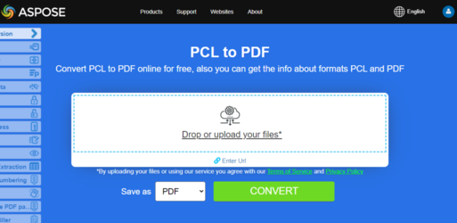

This article explains how to **convert various other types of file formats to PDF using Python**. It covers the following topics.

## Convert OFD to PDF

OFD stands for Open Fixed-layout Document (also called Open Fixed Document format). It is a Chinese national standard (GB/T 33190-2016) for electronic documents, introduced as an alternative to PDF.

Steps Convert OFD to PDF in Python:

1. Set up OFD load options using OfdLoadOptions().
1. Load the OFD document.
1. Save as PDF.

```python

    from os import path
    import aspose.pdf as ap

    path_infile = path.join(self.data_dir, infile)
    path_outfile = path.join(self.data_dir, "python", outfile)

    load_options = ap.OfdLoadOptions()
    document = ap.Document(path_infile, load_options)
    document.save(path_outfile)

    print(infile + " converted into " + outfile)
```

## Convert LaTeX/TeX to PDF

The LaTeX file format is a text file format with markup in the LaTeX derivative of the TeX family of languages and LaTeX is a derived format of the TeX system. LaTeX (ˈleɪtɛk/lay-tek or lah-tek) is a document preparation system and document markup language. It is widely used for the communication and publication of scientific documents in many fields, including mathematics, physics, and computer science. It also plays a key role in the preparation and publication of books and articles containing complex multilingual material, such as Korean, Japanese, Chinese characters, and Arabic, including special editions.

LaTeX uses the TeX typesetting program for formatting its output, and is itself written in the TeX macro language.

{}
**Try to convert LaTeX/TeX to PDF online**

Aspose.PDF for Python via .NET presents you online free application ["LaTex to PDF"](https://products.aspose.app/pdf/conversion/tex-to-pdf), where you may try to investigate the functionality and quality it works.

[](https://products.aspose.app/pdf/conversion/tex-to-pdf)
{}

Steps Convert TEX to PDF in Python:

1. Set up LaTeX load options using LatexLoadOptions().
1. Load the LaTeX document.
1. Save as PDF.

```python

    from os import path
    import aspose.pdf as ap

    path_infile = path.join(self.data_dir, infile)
    path_outfile = path.join(self.data_dir, "python", outfile)

    load_options = ap.LatexLoadOptions()
    document = ap.Document(path_infile, load_options)
    document.save(path_outfile)

    print(infile + " converted into " + outfile)
```

## Convert EPUB to PDF

**Aspose.PDF for Python via .NET** allows you simply convert EPUB files to PDF format.

EPUB (short for electronic publication) is a free and open e-book standard from the International Digital Publishing Forum (IDPF). Files have the extension .epub. EPUB is designed for reflowable content, meaning that an EPUB reader can optimize text for a particular display device.

<abbr title="electronic publication">EPUB</abbr> also supports fixed-layout content. The format is intended as a single format that publishers and conversion houses can use in-house, as well as for distribution and sale. It supersedes the Open eBook standard.The version EPUB 3 is also endorsed by the Book Industry Study Group (BISG), a leading book trade association for standardized best practices, research, information and events, for packaging of content.

{}
**Try to convert EPUB to PDF online**

Aspose.PDF for Python via .NET presents you online free application ["EPUB to PDF"](https://products.aspose.app/pdf/conversion/epub-to-pdf), where you may try to investigate the functionality and quality it works.

[](https://products.aspose.app/pdf/conversion/epub-to-pdf)
{}

Steps Convert EPUB to PDF in Python:

1. Load EPUB Document with EpubLoadOptions().
1. Convert EPUB to PDF.
1. Print Confirmation.

Next following code snippet show you how to convert EPUB files to PDF format with Python.

```python

    from os import path
    import aspose.pdf as ap

    path_infile = path.join(self.data_dir, infile)
    path_outfile = path.join(self.data_dir, "python", outfile)

    load_options = ap.EpubLoadOptions()
    document = ap.Document(path_infile, load_options)

    document.save(path_outfile)
    print(infile + " converted into " + outfile)
```

## Convert Markdown to PDF

**This feature is supported by version 19.6 or greater.**

{}
**Try to convert Markdown to PDF online**

Aspose.PDF for Python via .NET presents you online free application ["Markdown to PDF"](https://products.aspose.app/pdf/conversion/md-to-pdf), where you may try to investigate the functionality and quality it works.

[](https://products.aspose.app/pdf/conversion/md-to-pdf)
{}

This code snippet by Aspose.PDF for Python via .NET helps convert Markdown files into PDFs, allowing better document sharing, formatting preservation, and printing compatibility.o

The following code snippet shows how to use this functionality with Aspose.PDF library:

```python

    from os import path
    import aspose.pdf as ap

    path_infile = path.join(self.data_dir, infile)
    path_outfile = path.join(self.data_dir, "python", outfile)

    load_options = ap.MdLoadOptions()
    document = ap.Document(path_infile, load_options)
    document.save(path_outfile)
    print(infile + " converted into " + outfile)
```

## Convert PCL to PDF

<abbr title="Printer Command Language">PCL</abbr> (Printer Command Language) is a Hewlett-Packard printer language developed to access standard printer features. PCL levels 1 through 5e/5c are command based languages using control sequences that are processed and interpreted in the order they are received. At a consumer level, PCL data streams are generated by a print driver. PCL output can also be easily generated by custom applications.

{}
**Try to convert PCL to PDF online**

Aspose.PDF for for .NET presents you online free application ["PCL to PDF"](https://products.aspose.app/pdf/conversion/pcl-to-pdf), where you may try to investigate the functionality and quality it works.

[](https://products.aspose.app/pdf/conversion/pcl-to-pdf)
{}

To allow conversion from PCL to PDF, Aspose.PDF has the class [`PclLoadOptions`](https://reference.aspose.com/pdf/net/aspose.pdf/pclloadoptions) which is used to initialize the LoadOptions object. Later on this object is passed as an argument during Document object initialization and it helps the PDF rendering engine to determine the input format of source document.

The following code snippet shows the process of converting a PCL file into PDF format.

Steps Convert PCL to PDF in Python:

1. Load options for PCL using PclLoadOptions().
1. Load the document.
1. Save as PDF.

```python

    from os import path
    import aspose.pdf as ap

    path_infile = path.join(self.data_dir, infile)
    path_outfile = path.join(self.data_dir, "python", outfile)

    load_options = ap.PclLoadOptions()
    load_options.supress_errors = True

    document = ap.Document(path_infile, load_options)
    document.save(path_outfile)

    print(infile + " converted into " + outfile)
```

## Convert Preformatted Text to PDF

**Aspose.PDF for Python via .NET** support the feature converting plain text and pre-formatted text file to PDF format.

Converting text to PDF means adding text fragments to the PDF page. As for text files, we are dealing with 2 types of text: pre-formatting (for example, 25 lines with 80 characters per line) and non-formatted text (plain text). Depending on our needs, we can control this addition ourselves or entrust it to the library's algorithms.

{}
**Try to convert TEXT to PDF online**

Aspose.PDF for Python via .NET presents you online free application ["Text to PDF"](https://products.aspose.app/pdf/conversion/txt-to-pdf), where you may try to investigate the functionality and quality it works.

[](https://products.aspose.app/pdf/conversion/txt-to-pdf)
{}

Steps Convert TEXT to PDF in Python:

1. Read the input text file line by line.
1. Set up a monospaced font (Courier New) for consistent text alignment.
1. Create a new PDF Document and add the first page with custom margins and font settings.
1. Iterate through lines of the text file To simulate Typewriter, we use the 'monospace_font' font and size 12.
1. Limit page creation to 4 pages.
1. Save the final PDF to the specified path.

```python

    from os import path
    import aspose.pdf as ap

    path_infile = path.join(self.data_dir, infile)
    path_outfile = path.join(self.data_dir, "python", outfile)

    with open(path_infile, "r") as file:
        lines = file.readlines()

    monospace_font = ap.text.FontRepository.find_font("Courier New")

    document = ap.Document()
    page = document.pages.add()

    page.page_info.margin.left = 20
    page.page_info.margin.right = 10
    page.page_info.default_text_state.font = monospace_font
    page.page_info.default_text_state.font_size = 12
    count = 1
    for line in lines:
        if line != "" and line[0] == "\x0c":
            page = document.pages.add()
            page.page_info.margin.left = 20
            page.page_info.margin.right = 10
            page.page_info.default_text_state.font = monospace_font
            page.page_info.default_text_state.font_size = 12
            count = count + 1
        else:
            text = ap.text.TextFragment(line)
            page.paragraphs.add(text)

        if count == 4:
            break

    document.save(path_outfile)

    print(infile + " converted into " + outfile)
```

## Convert XPS to PDF

**Aspose.PDF for Python via .NET** support feature converting <abbr title="XML Paper Specification">XPS</abbr> files to PDF format. Check this article to resolve your tasks.

The XPS file type is primarily associated with the XML Paper Specification by Microsoft Corporation. The XML Paper Specification (XPS), formerly codenamed Metro and subsuming the Next Generation Print Path (NGPP) marketing concept, is Microsoft's initiative to integrate document creation and viewing into its Windows operating system.

The following code snippet shows the process of converting XPS file into PDF format with Python.

```python

    from os import path
    import aspose.pdf as ap

    path_infile = path.join(self.data_dir, infile)
    path_outfile = path.join(self.data_dir, "python", outfile)

    load_options = ap.XpsLoadOptions()
    document = ap.Document(path_infile, load_options)
    document.save(path_outfile)

    print(infile + " converted into " + outfile)
```

{}
**Try to convert XPS format to PDF online**

Aspose.PDF for Python via .NET presents you online free application ["XPS to PDF"](https://products.aspose.app/pdf/conversion/xps-to-pdf/), where you may try to investigate the functionality and quality it works.

[](https://products.aspose.app/pdf/conversion/xps-to-pdf/)
{}

## Convert XSL-FO to PDF

Following code snippet can be used to convert a XSLFO to PDF format with Aspose.PDF for Python via .NET:

```python

    from os import path
    import aspose.pdf as ap

    path_xsltfile = path.join(self.data_dir, xsltfile)
    path_xmlfile = path.join(self.data_dir, xmlfile)
    path_outfile = path.join(self.data_dir, "python", outfile)

    load_options = ap.XslFoLoadOptions(path_xsltfile)
    load_options.parsing_errors_handling_type = (
        ap.XslFoLoadOptions.ParsingErrorsHandlingTypes.ThrowExceptionImmediately
    )
    document = ap.Document(path_xmlfile, load_options)
    document.save(path_outfile)

    print(xmlfile + " converted into " + outfile)
```

## Convert PostScript to PDF

This example demonstrates how to convert a PostScript file into a PDF document using Aspose.PDF for Python via .NET.

1. Create an instance of 'PsLoadOptions' to correctly interpret the PS file.
1. Load the 'PostScript' file into a Document object using the load options.
1. Save the document in PDF format to the desired output path.

```python

    from os import path
    import aspose.pdf as ap

    path_infile = path.join(self.data_dir, infile)
    path_outfile = path.join(self.data_dir, "python", outfile)

    load_options = ap.PsLoadOptions()

    document = ap.Document(path_infile, load_options)
    document.save(path_outfile)

    print(infile + " converted into " + outfile)
```

## Convert XML with XSLT to PDF

This example demonstrates how to convert an XML file into a PDF by first transforming it into HTML using an XSLT template and then loading the HTML into Aspose.PDF.

1. Create an instance of 'HtmlLoadOptions' to configure HTML-to-PDF conversion.
1. Load the transformed HTML file into an Aspose.PDF Document object.
1. Save the document as a PDF at the specified output path.
1. Remove the temporary HTML file after successful conversion.

```python

    from os import path
    import aspose.pdf as ap

    path_infile = path.join(self.data_dir, infile)
    path_outfile = path.join(self.data_dir, "python", outfile)
    path_template = path.join(self.data_dir, template)
    path_temp_file = path.join(self.data_dir, "temp.html")

    load_options = ap.HtmlLoadOptions()
    self.transform_xml_to_html(path_infile, path_template, path_temp_file)

    document = ap.Document(path_temp_file, load_options)
    document.save(path_outfile)

    if path.exists(path_temp_file):
        os.remove(path_temp_file)

    print(infile + " converted into " + outfile)

    xml_doc = etree.parse(xml_file)

    xslt_doc = etree.parse(xslt_file)
    transform = etree.XSLT(xslt_doc)

    result = transform(xml_doc)

    with open(html_file, 'w', encoding='utf-8') as f:
        f.write(str(result))
```
