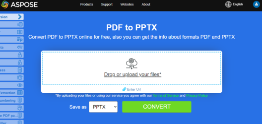

## Overview

Is it possible to convert a PDF file into a PowerPoint? Yes, you can! And it's easy!
This article explains how to **convert PDF to PowerPoint using Python**. It covers these topics.

_Format_: **PPTX**
- [Python PDF to PPTX](#python-pdf-to-pptx)
- [Python Convert PDF to PPTX](#python-pdf-to-pptx)
- [Python How to convert PDF file to PPTX](#python-pdf-to-pptx)

_Format_: **PowerPoint**
- [Python PDF to PowerPoint](#python-pdf-to-powerpoint)
- [Python Convert PDF to PowerPoint](#python-pdf-to-powerpoint)
- [Python How to convert PDF file to PowerPoint](#python-pdf-to-powerpoint)

## Python PDF to PowerPoint and PPTX Conversion

**Aspose.PDF for Python via .NET** lets you track the progress of PDF to PPTX conversion.

We have an API named Aspose.Slides which offers the feature to create as well as manipulate PPT/PPTX presentations. This API also provides the feature to convert PPT/PPTX files to PDF format. During this conversion, the individual pages of the PDF file are converted to separate slides in the PPTX file.

During PDF to <abbr title="Microsoft PowerPoint 2007 XML Presentation">PPTX</abbr> conversion, the text is rendered as Text where you can select/update it. Please note that in order to convert PDF files to PPTX format, Aspose.PDF provides a class named [PptxSaveOptions](https://reference.aspose.com/pdf/python-net/aspose.pdf/pptxsaveoptions/). An object of the PptxSaveOptions class is passed as a second argument to the [save()](https://reference.aspose.com/pdf/python-net/aspose.pdf/document/#methods). The following code snippet shows the process for converting PDF files into PPTX format.

## Simple conversion PDF to PowerPoint using Python and Aspose.PDF for Python via .NET

In order to convert PDF to PPTX, Aspose.PDF for Python advice to use the following code steps.

<a name="csharp-pdf-to-powerpoint"><strong>Steps: Convert PDF to PowerPoint in Python</strong></a> | <a name="csharp-pdf-to-pptx"><strong>Steps: Convert PDF to PPTX in Python</strong></a>

1. Create an instance of [Document](https://reference.aspose.com/pdf/python-net/aspose.pdf/document/) class.
1. Create an instance of [PptxSaveOptions](https://reference.aspose.com/pdf/python-net/aspose.pdf/pptxsaveoptions/) class.
1. Call the [document.save()](https://reference.aspose.com/pdf/python-net/aspose.pdf/document/#methods) method.

```python

    from os import path
    import aspose.pdf as apdf

    path_infile = path.join(self.data_dir, infile)
    path_outfile = path.join(self.data_dir, "python", outfile)

    document = apdf.Document(path_infile)
    save_options = apdf.PptxSaveOptions()
    document.save(path_outfile, save_options)

    print(infile + " converted into " + outfile)
```

## Convert PDF to PPTX with Slides as Images

{}
**Try to convert PDF to PowerPoint online**

Aspose.PDF for Python via .NET presents you online free application ["PDF to PPTX"](https://products.aspose.app/pdf/conversion/pdf-to-pptx), where you may try to investigate the functionality and quality it works.

[](https://products.aspose.app/pdf/conversion/pdf-to-pptx)
{}

In case if you need to convert a searchable PDF to PPTX as images instead of selectable text, Aspose.PDF provides such a feature via [PptxSaveOptions](https://reference.aspose.com/pdf/python-net/aspose.pdf/pptxsaveoptions/) class. To achieve this, set property [slides_as_images](https://reference.aspose.com/pdf/python-net/aspose.pdf/pptxsaveoptions/#properties) of [PptxSaveOptions](https://reference.aspose.com/pdf/python-net/aspose.pdf/pptxsaveoptions/) class to 'true' as shown in the following code sample.

```python

    from os import path
    import aspose.pdf as apdf

    path_infile = path.join(self.data_dir, infile)
    path_outfile = path.join(self.data_dir, "python", outfile)

    document = apdf.Document(path_infile)
    save_options = apdf.PptxSaveOptions()
    save_options.slides_as_images = True

    document.save(path_outfile, save_options)

    print(infile + " converted into " + outfile)
```

## Convert PDF to PPTX with Custom Image Resolution

This method converts a PDF document into a PowerPoint (PPTX) file while setting a custom image resolution (300 DPI) for improved quality.

1. Load the PDF into an 'apdf.Document' object.
1. Create a 'PptxSaveOptions' instance.
1. Set the 'image_resolution' property to 300 DPI for high-quality rendering.
1. Save the PDF as a PPTX file using the defined save options.

```python

    from os import path
    import aspose.pdf as apdf

    path_infile = path.join(self.data_dir, infile)
    path_outfile = path.join(self.data_dir, "python", outfile)

    document = apdf.Document(path_infile)
    save_options = apdf.PptxSaveOptions()
    save_options.image_resolution = 300

    document.save(path_outfile, save_options)

    print(infile + " converted into " + outfile)
```

## See Also

This article also covers these topics. The codes are same as above.

_Format_: **PowerPoint**
- [Python PDF to PowerPoint Code](#python-pdf-to-powerpoint)
- [Python PDF to PowerPoint API](#python-pdf-to-powerpoint)
- [Python PDF to PowerPoint Programmatically](#python-pdf-to-powerpoint)
- [Python PDF to PowerPoint Library](#python-pdf-to-powerpoint)
- [Python Save PDF as PowerPoint](#python-pdf-to-powerpoint)
- [Python Generate PowerPoint from PDF](#python-pdf-to-powerpoint)
- [Python Create PowerPoint from PDF](#python-pdf-to-powerpoint)
- [Python PDF to PowerPoint Converter](#python-pdf-to-powerpoint)

_Format_: **PPTX**
- [Python PDF to PPTX Code](#python-pdf-to-pptx)
- [Python PDF to PPTX API](#python-pdf-to-pptx)
- [Python PDF to PPTX Programmatically](#python-pdf-to-pptx)
- [Python PDF to PPTX Library](#python-pdf-to-pptx)
- [Python Save PDF as PPTX](#python-pdf-to-pptx)
- [Python Generate PPTX from PDF](#python-pdf-to-pptx)
- [Python Create PPTX from PDF](#python-pdf-to-pptx)
- [Python PDF to PPTX Converter](#python-pdf-to-pptx)
