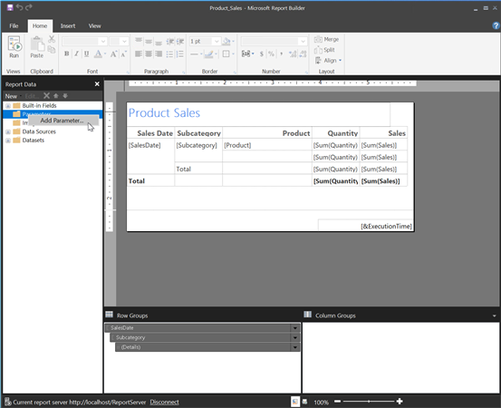
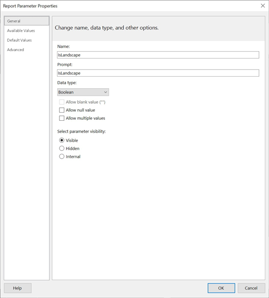

{}

You can specify certain configuration parameters that affect how Aspose.Pdf for Reporting Services generates documents. This section describes this process.

{}

To configure Aspose.Pdf for Reporting Services, you need to edit the C:\Program Files\Microsoft SQL Server\<Instance>\Reporting Services\ReportServer\rsreportserver.config file. This is an XML file and the renderer configuration is inside the ```<Extension>``` element corresponding to the Aspose.PDF renderer.

**Example**



<Render>
…
<Extension Name="APPDF" Type="Aspose.Pdf.ReportingServices.Renderer,Aspose.Pdf.ReportingServices">
<!--Insert configuration elements for exporting to PDF here. The following is an example
For PageOrientation -->
    <Configuration>
    <IsLandscape>True</IsLandscape>
    </Configuration>
</Extension>
</Render>



{}

If you want to set parameters for specific report file but not for every report on the server, you can add a report parameter for the specific report in the Report Builder as the following steps (for example, we’ll add an 'IsLandscape' parameter shown earlier):

1. Open the report in the Report Designer, right-click on the 'Parameters' folder in the 'Report Data' pane, and select 'Add Parameter…' (or, alternately, pull down the 'New' list and select 'Parameter…').
 


1. In the 'Report Parameter Properties' dialog, create the parameter named 'IsLandscape', with the data type of Boolean, and add the value True in the 'Default Values' tab.



{}
