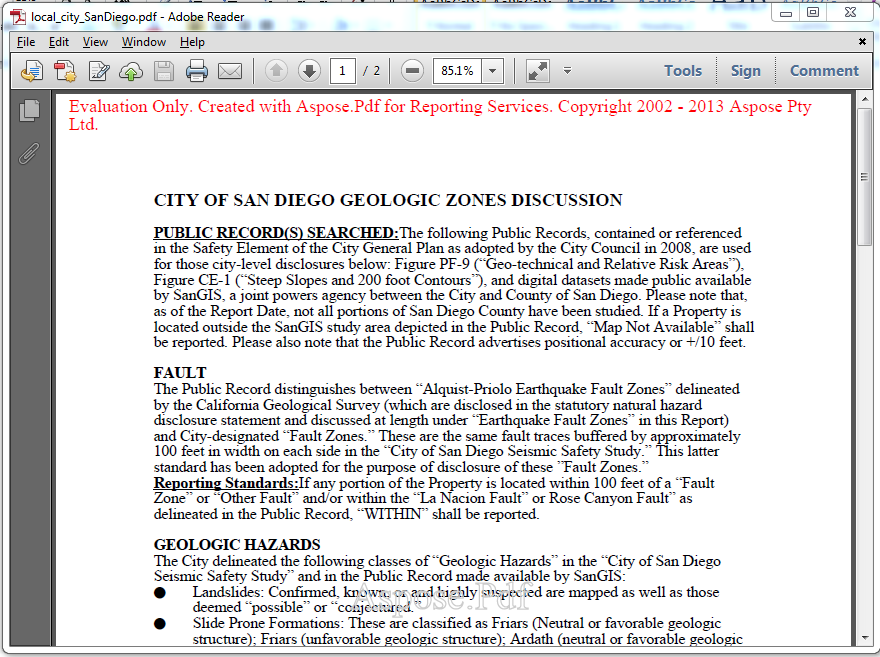

{}

This page states the difference between licensed and evaluation version of Aspose.PDF for Reporting Services

{}

You can easily download [Aspose.PDF for Reporting Services](https://downloads.aspose.com/pdf/reportingservices) for evaluation. The evaluation download is the same as the purchased download. The evaluation version simply becomes licensed when you place the license file in folder containing Aspose.PDF.ReportingServices.dll or few lines of code to initialize the license when using the component with Report Viewer in local mode. The evaluation version of Aspose.PDF for Reporting Services (without a license specified) provides full product functionality, but it inserts an evaluation watermark at the top of the document when rendering the .RDL file to PDF format. You may visit the following page for further instructions on [how to License Aspose.PDF for Reporting Services](/pdf/reportingservices/license-aspose-pdf-for-reporting-services/)

{}

If you want to test Aspose.PDF for Reporting Services without the evaluation version limitations, you can also request a 30-day Temporary License. Please refer to [How to get a Temporary License?](<https://about.aspose.com/>)

{}
