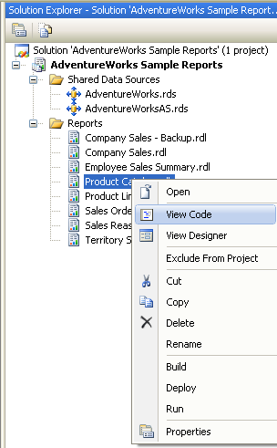

{}

You can add custom properties for some report items to expand their usage, such as ToC, line arrows and so on. This section describes this process.

{}

{}

You can add custom properties for some report items to expand their usage, such as Table of Contents, line arrows and so on. This section describes this process.

To add custom properties, you need to edit the code file of RDL document in the following steps:

1. As in the following figure, open your project, navigate to the solution explorer, and right click on the selected report file, then select the 'View Code' menu item.

2. Edit the XML code file. For example, if you want to add a custom property for chart report item, you need to add the code similar to the red text in the following example.

**Example**



<chart Name="chart1">
    <Left>5.5cm</Left>
    <Top>0.5cm</Top>
      ......
         
    <CustomProperties>
      <CustomProperty>
        <Name>IsInList</Name>
        <Value>True</Value>
      </CustomProperty>
    </CustomProperties>
</chart> 



In this code fragment example, the custom property name is IsInList, and the value is 'True'.

{}
