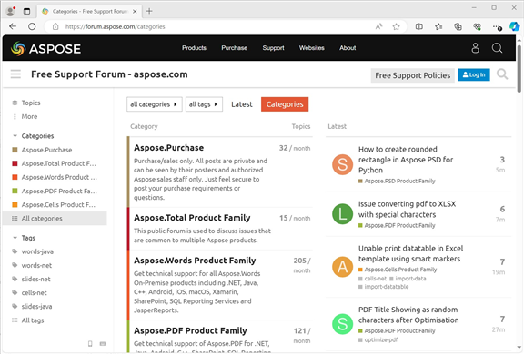

Aspose is renowned for its free and unlimited technical support, which is backed up by technical articles, manuals, forums and all-time ready support and product developers. If there is a new version or a Hot Fix of a product is released, all new releases are available free of cost if you have an active subscription.

**Aspose.Support Forums** is the place not only to resolve technical issues, but participate in development discussions with the vibrant and growing community of Aspose users. Currently there are over 129,000 users registered at the Aspose website.

Aspose.Blogs is the place to look for information about latest releases and about what Aspose developers have to say.

There is plenty of activity in Aspose.Support Forums:

 