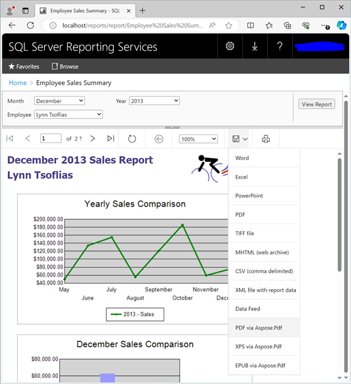

{}

You only need to follow these steps if you install Aspose.PDF for Reporting Services manually, not using the MSI installer. MSI installer performs all necessary installation and registration actions automatically.

{}

In the following steps, you will need to copy and modify files in the directory where Microsoft SQL Server Reporting Services is installed. The SSRS 2016 assembly is located in the \Bin\SSRS2016 directory of the zip package; the SSRS 2017 assembly is located in the \Bin\SSRS2017 directory; the SSRS 2019 assembly is located in the \Bin\SSRS2019 directory; the SSRS 2022 assembly is located in the \Bin\SSRS2022 directory; the Power BI Report Server assembly is located in the \Bin\PowerBI directory. 

{}

**Step 1.** Locate the Report Server installation directory. The root directory for Microsoft SQL Server is usually C:\Program Files\Microsoft SQL Server. Further process is slightly different for Reporting Services 2016, Reporting Services 2017 and later, and Power BI Report Server:

- Report Server 2016 by default is installed in the C:\Program Files\Microsoft SQL Server\MSRS13.MSSQLSERVER\Reporting Services\ReportServer directory. If you are using custom named instances instead of the default one, the default path will be C:\Program Files\Microsoft SQL Server\MSRS13.[SSRSInstanceName]\Reporting Services\ReportServer
- Report Server 2017 and later by default is installed in the C:\Program Files\Microsoft SQL Server Reporting Services\SSRS\ReportServer directory.
- Power BI Report Server by default is installed in the C:\Program Files\Microsoft Power BI Report Server\PBIRS\ReportServer directory.

In the following text the installation directory of the Reporting Services (one of the aforementioned paths) will be referenced to as ```<Instance>```.
{}

{}
**Step 2.** Copy Aspose.Pdf.ReportingServices.dll for the corresponding SSRS version to the ```<Instance>```\bin folder.
{}

{}
**Step 3.** Register Aspose.Pdf for Reporting Services as a rendering extension. Open the ```<Instance>```\rsreportserver.config file and add the following lines into the ```<Render>``` element:
{}

**Example**



 <Render>
...
<!--Start here.-->

<Extension Name="APPDF" Type="Aspose.Pdf.ReportingServices.Renderer,Aspose.Pdf.ReportingServices"/>

</Render>



{}
**Step 4.** Provide Aspose.Pdf for Reporting Services with permissions to execute. Open the ```<Instance>```\rssrvpolicy.config file and add the following text as the last item in the second to outer ```<CodeGroup>``` element (which should be ```<CodeGroup class="FirstMatchCodeGroup" version="1" PermissionSetName="Execution" Description="This code group grants MyComputer code Execution permission. ">):```
{}

**Example**



 <CodeGroup>
...

<CodeGroup>
...

<!--Start here.-->

<CodeGroup class="UnionCodeGroup" version="1" PermissionSetName="FullTrust"

Name="Aspose.Pdf_for_Reporting_Services" Description="This code group grants full trust to the AP4SSRS assembly.">

<IMembershipCondition class="StrongNameMembershipCondition" version="1" PublicKeyBlob="00240000048000009400000006020000002400005253413100040000010001005542e99cecd28842dad186257b2c7b6ae9b5947e51e0b17b4ac6d8cecd3e01c4d20658c5e4ea1b9a6c8f854b2d796c4fde740dac65e834167758cff283eed1be5c9a812022b015a902e0b97d4e95569eb8c0971834744e633d9cb4c4a6d8eda03c12f486e13a1a0cb1aa101ad94943236384cbbf5c679944b994de9546e493bf " />

</CodeGroup>

<!--End here. -->

</CodeGroup>

</CodeGroup>



{}
**Step 5.** Verify that Aspose.Pdf for Reporting Services was installed successfully. Open the Reporting Services web portal and check the list of available export formats for a report. You can launch the web portal by starting a web browser and typing the Reporting Services web portal URL in the address bar (by default it is http://```<Reporting_Services_server_name>```/reports/). Select one of the reports available in your web portal and pull the Export dropdown list. You should see the list of export formats including the ones provided by the Aspose.Pdf for Reporting Services extension. Select PDF via Aspose.PDF item.

 
{}



Click the selected item. It will generate the report in the selected format, send it to the client, and, depending on your web browser settings, either show you the Save File dialog to choose where to save the exported report, or automatically download the file to the your Downloads folder.

{}
Congratulations, you’ve successfully installed Aspose.Pdf for Reporting Services and exported a report as a PDF document!
{}

