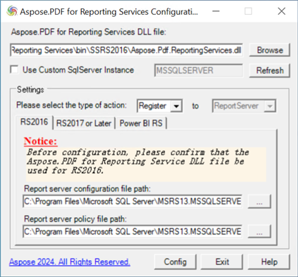

Aspose.Pdf for Reporting Services Configuring Tool can help you to configure the Aspose.Pdf for Reporting Services extension for any of the supported Report Server (RS) versions. Currently it supports RS2016, RS2017, RS2019, RS2022, and Power BI Report Server. The Configuring Tool requires .NET Framework 4.8.

If you want to install the extension and register it with the Report Server, select the 'Register' action type. For unregistering and uninstalling the extension select the 'Unregister' action type.

**The following steps describe how to use it in detail:**

1. Input or browse the path of the DLL file for Aspose.Pdf for Reporting Services extension;
1. Select the corresponding action type: Register or Unregister;
1. Select the tab corresponding to the version of the Report Server you want to configure.Please ensure that you selected the DLL file that is intended for your RS version. If the requested version of the product is not installed on the machine, the configuration tool will inform you with tips. If you are configuring the extension for the named RS2016 instance (not the default 'MSSQLSERVER' one), please input the custom instance name, then press the 'Refresh' button.
1. Make sure that the configuration files paths and names shown in the bottom textboxes are correct. If they are not, you can press the 'Refresh' button to try to find the RS instance again, or you may look them up manually.
1. Press the 'Config' button. The tool will now attempt to make the requested configuration, and will inform you whether the configuration is successful or not.
 
