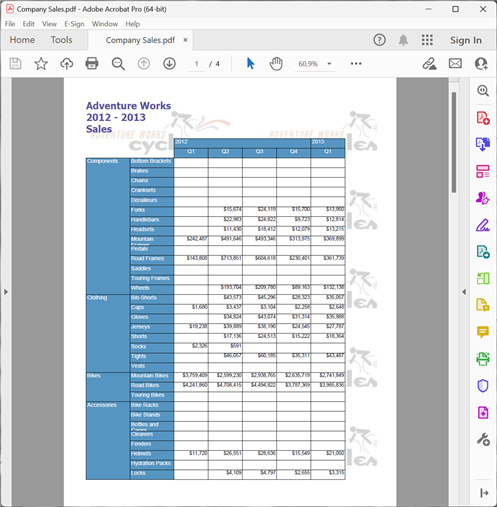
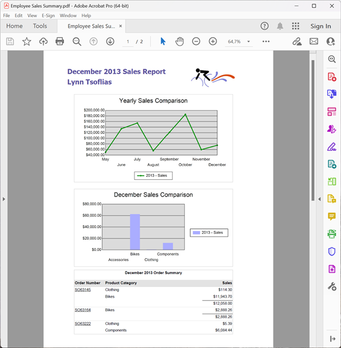
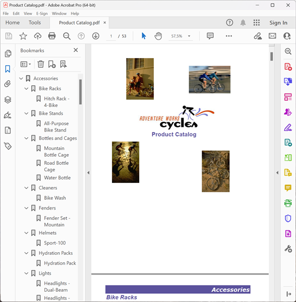
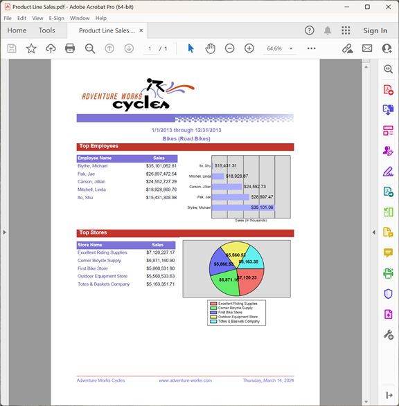
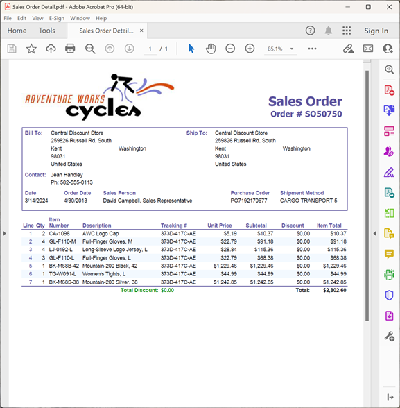

{}

This gallery demonstrates PDF reports exported by Aspose.Pdf for Reporting Services.

{}

Most of the reports shown here come from the Adventure Works database. Adventure Works is a sample database for Microsoft SQL Server, available for download from Microsoft [here](http://www.microsoft.com/downloads/details.aspx?familyid=E719ECF7-9F46-4312-AF89-6AD8702E4E6E&displaylang=en).

## Company Sales

## Employee Sales Summary

## Product Catalog

## Product Line Sales

## Sales Order Detail

