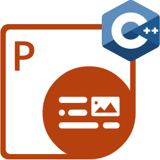

## Welcome to Aspose.PDF for Rust via C++

Rust is a cross-platform runtime environment for server-side and networking applications written in JavaScript. Essentially it allows you to run JavaScript applications outside of a browser context.

Aspose.PDF for Rust via C++ is a powerful toolkit that allows JavaScript to run and helps developers do various tasks for PDF in the Rust environment.

Aspose.PDF for Rust allows developers to manipulate PDF files directly. Aspose.PDF for Rust via C++ is built on the use of WebAssembly technology and is based on Aspose.PDF for .NET.

## Chapters

- [What's new](/pdf/rust-cpp/whatsnew/)
- [Overview](/pdf/rust-cpp/overview/)
- [Get Started](/pdf/rust-cpp/get-started/)
- [Basic operations](/pdf/rust-cpp/basic-operations/)
- [Release Notes](https://releases.aspose.com/pdf/nodejscpp/release-notes/)

## Aspose.PDF for Rust Resources

The following are the links to some useful resources you may need to accomplish your tasks.

- [Aspose.PDF for Rust Features](/pdf/rust-cpp/key-features/)
- [Aspose.PDF for Rust Release Notes](https://releases.aspose.com/pdf/nodejscpp/release-notes/)
- [Download Aspose.PDF for Rust](https://releases.aspose.com/pdf/nodejscpp/)
- [Aspose.PDF for Rust Product Page](https://products.aspose.com/pdf/rust-cpp/)
- [Aspose.PDF for Rust API Reference Guide](https://reference.aspose.com/pdf/rust-cpp/)
- [Aspose.PDF for Rust Free Support Forum](https://forum.aspose.com/c/pdf/10)
- [Aspose.PDF for Rust Paid Support Helpdesk](https://helpdesk.aspose.com/)
