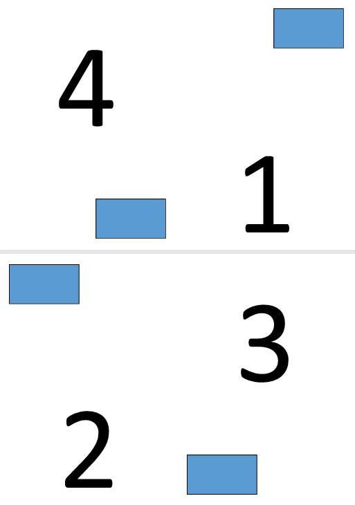
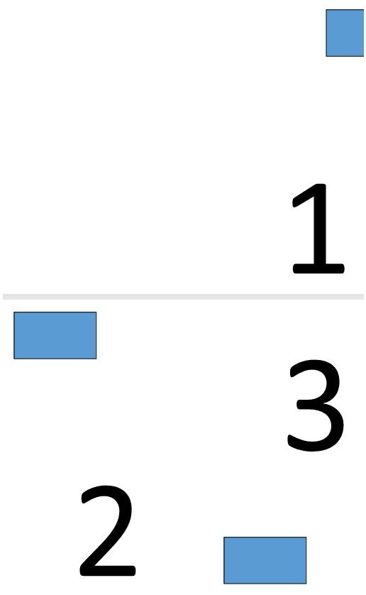

## Make N-Up of PDF

An N-Up PDF places multiple source pages onto a single output page. In this example, a 2 × 2 layout is used, so four original pages are combined into each page of the output document.

1. Open the source PDF document.
1. Save the document using an N-Up layout with the specified number of rows and columns.

```rs

    use asposepdf::Document;

    fn main() -> Result<(), Box<dyn std::error::Error>> {
        // Open a PDF-document with filename
        let pdf = Document::open("sample.pdf")?;

        // Convert and save the previously opened PDF-document as N-Up PDF-document
        pdf.save_n_up("sample_n_up.pdf", 2, 2)?;

        Ok(())
    }
```

## Make Booklet of PDF

Aspose.PDF for Rust via C++ explains how to convert a standard PDF document into a booklet-style PDF.
The booklet format rearranges pages so that, when printed and folded, the document forms a proper booklet with pages in the correct order.

1. Open the source PDF document.
1. Save the document as a booklet PDF.

```rs

  use asposepdf::Document;

  fn main() -> Result<(), Box<dyn std::error::Error>> {
      // Open a PDF-document with filename
      let pdf = Document::open("sample.pdf")?;

      // Convert and save the previously opened PDF-document as booklet PDF-document
      pdf.save_booklet("sample_booklet.pdf")?;

      Ok(())
  }
```

**Please note that a Free Trial License is required for full functionality.**

Explore the result of creating a 4-page booklet.



Explore the result of creating a 3-page booklet.

