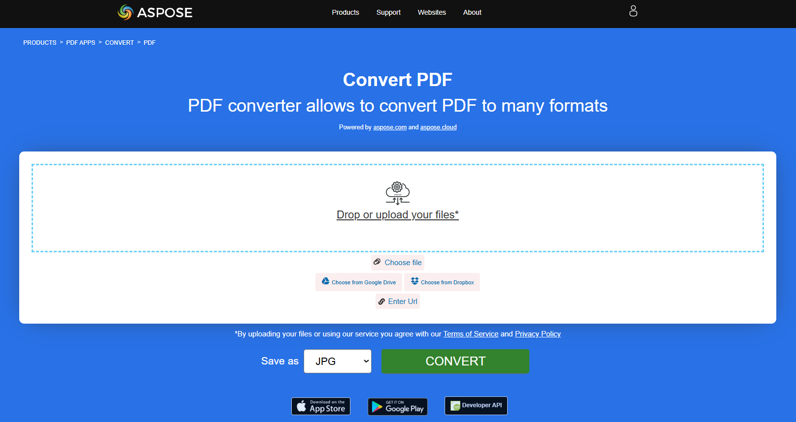

The PDF was developed to provide a standard for presenting documents and other reference materials in a format that is independent of application software, hardware, and operating system. The content of PDF files is not limited to text, it can be hyperlinks, images, clickable buttons and forms, electronic signatures, watermarks, and more. Therefore, it is often necessary to convert PDF files to some other format in order to edit or change their content.
**Our Aspose.PDF for Rust via C++** tool allows you to successfully, quickly and easily convert your PDF documents to the most popular formats. For a complete list of supported formats, see the section [Aspose.PDF Supported File Formats](https://docs.aspose.com/pdf/rust-cpp/supported-file-formats/).

**Aspose.PDF for Rust via C++** allows converting PDF documents to various formats. Also, you can check the quality of Aspose.PDF conversion and view the results online with Aspose.PDF converter app. Learn the sections of converting documents with code snippets.

## How to use Rust for conversion

Word documents are the most versatile and editable possible. Converting PDF to DOC manually is a very time-consuming task. In this article, you will learn how to convert PDF to DOC and DOCX in Rust.

- [Convert PDF to DOC](/pdf/rust-cpp/convert-pdf-to-doc/) - you can convert your PDF document to Word format with Rust.

Number formats are needed not only to make the data in the table easier to read, but also to make the table easier to use. Of course, if you need to convert such data from a PDF document to Excel format use our Aspose.PDF for Rust.

- [Convert PDF to Microsoft XLSX](/pdf/rust-cpp/convert-pdf-to-xlsx/) - this section describes how to convert PDF document to XLSX, and CSV.

The PowerPoint format is used to create various presentations. PPT files contain a large number of slides or pages containing various information.

- [Convert PDF to Microsoft PowerPoint](/pdf/rust-cpp/convert-pdf-to-powerpoint/) - here we are talking about converting PDF to PowerPoint by tracking the conversion process

HyperText Markup Language is a hypertext document description language, a standard language for creating web pages. With Aspose.PDF for Rust you can easily convert HTML documents and vice versa.

There are many image formats that need to be converted to PDF for different purposes. Aspose.PDF for Rust allows the most popular images formats.

- [Convert PDF to various Images formats](/pdf/rust-cpp/convert-pdf-to-images-format/) - convert PDF pages as images in JPEG, PNG, SVG, and other formats

This section includes such formats as: EPUB, XPS, TeX, Text, and Grayscale PDF.

- [Convert PDF file to other formats](/pdf/rust-cpp/convert-pdf-to-other-files/) - this topic describes way for conversion PDF document to various formats

## Try to convert PDF files online

{}
**Try to convert PDF files online**

You can try the conversion functionality by using our Aspose PDF APPS:

{}