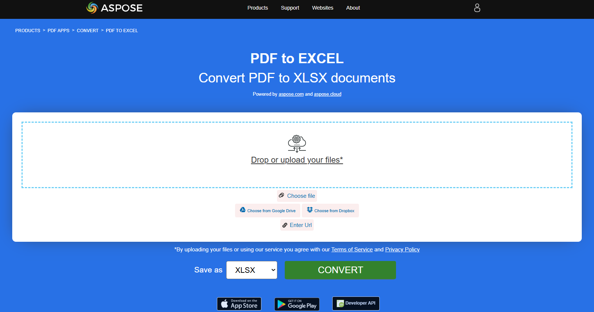

**Aspose.PDF for Rust** support the feature of converting PDF files to Excel format.

## Convert PDF to XLSX

Excel provides advanced tools for sorting, filtering, and analyzing data, making it easier to perform tasks like trend analysis or financial modeling, which are difficult with static PDF files. Manually copying data from PDFs into Excel is time-consuming and error-prone. Conversion automates this process, saving significant time for large datasets.

Aspose.PDF for Rust uses [save_xlsx](https://reference.aspose.com/pdf/rust-cpp/convert/save_xlsx/) to convert the downloaded PDF file into an Excel spreadsheet and save it.

1. Import Required Packages.
1. Open a PDF File.
1. Convert the PDF to XLSX using [save_xlsx](https://reference.aspose.com/pdf/rust-cpp/convert/save_xlsx/).
1. Close the PDF Document.

```rust

  use asposepdf::Document;

  fn main() -> Result<(), Box<dyn std::error::Error>> {
      // Open a PDF-document with filename
      let pdf = Document::open("sample.pdf")?;

      // Convert and save the previously opened PDF-document as XlsX-document
      pdf.save_xlsx("sample.xlsx")?;

      Ok(())
  }
```

{}
**Try to convert PDF to Excel online**

Aspose.PDF for Rust presents you online free application ["PDF to XLSX"](https://products.aspose.app/pdf/conversion/pdf-to-xlsx), where you may try to investigate the functionality and quality it works.

[](https://products.aspose.app/pdf/conversion/pdf-to-xlsx)
{}