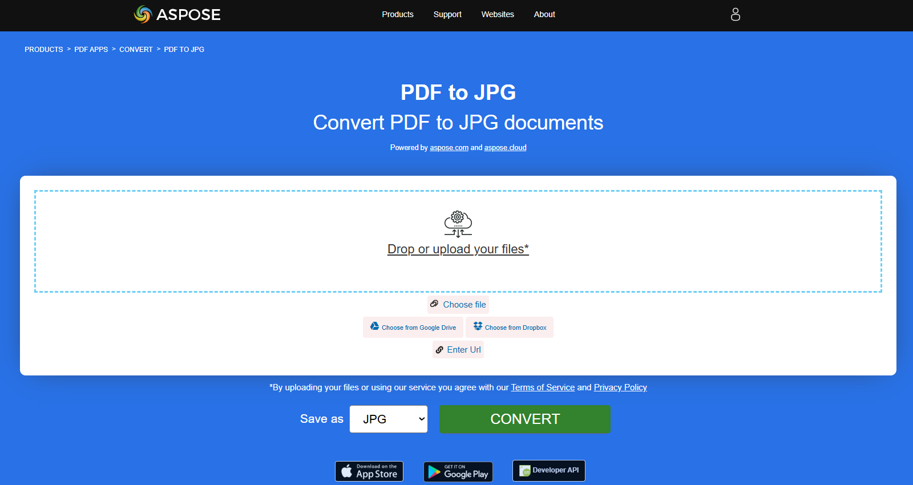
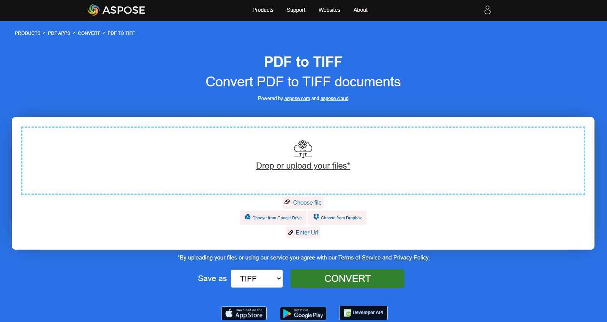
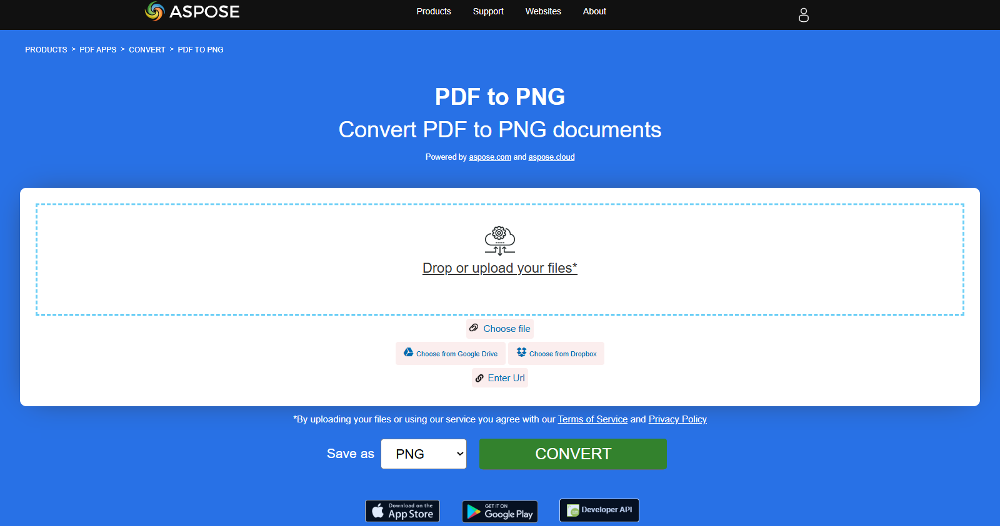
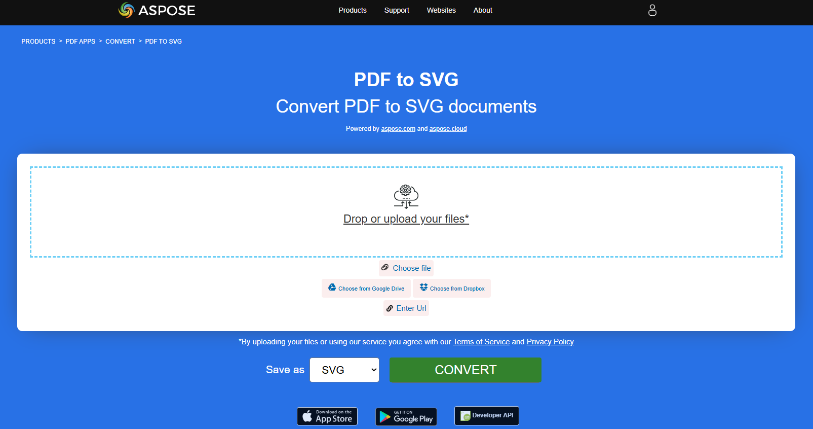

## Convert PDF to Image

In this article, we will show you the options for converting PDF to image formats.

Previously scanned documents are often saved in the PDF file format. However, do you need to edit it in a graphic editor or send it further in image format? We have a universal tool for you to convert PDF to images using **Aspose.PDF for Rust via C++**.
The most common task is when you need to save an entire PDF document or some specific pages of a document as a set of images. **Aspose.PDF for Rust via C++** allows you to convert PDF to JPG and PNG formats to simplify the steps required to get your images from a specific PDF file.

**Aspose.PDF for Rust via C++** supports various PDF to image formats conversion. Please checks the section [Aspose.PDF Supported File Formats](https://docs.aspose.com/pdf/rust-cpp/supported-file-formats/).

### Convert PDF to JPEG

The provided Rust code snippet demonstrates how to convert the first page of a PDF document into a JPEG image using the Aspose.PDF library:

1. Open a PDF document.
1. Convert a Page to JPEG using [page_to_jpg](https://reference.aspose.com/pdf/rust-cpp/convert/page_to_jpg/) function.
1. Close the PDF document and release any allocated resources.

```rs

  use asposepdf::Document;

  fn main() -> Result<(), Box<dyn std::error::Error>> {
      // Open a PDF-document with filename
      let pdf = Document::open("sample.pdf")?;

      // Convert and save the specified page as Jpg-image
      pdf.page_to_jpg(1, 100, "sample_page1.jpg")?;

      Ok(())
  }
```

{}
**Try to convert PDF to JPEG online**

Aspose.PDF for Rust presents you online free application ["PDF to JPEG"](https://products.aspose.app/pdf/conversion/pdf-to-jpg), where you may try to investigate the functionality and quality it works.

[](https://products.aspose.app/pdf/conversion/pdf-to-jpg)
{}

### Convert PDF to TIFF

The provided Rust code snippet demonstrates how to convert the first page of a PDF document into a TIFF image using the Aspose.PDF library:

1. Open a PDF document.
1. Convert a Page to TIFF using [page_to_tiff](https://reference.aspose.com/pdf/rust-cpp/convert/page_to_tiff/) function.
1. Close the PDF document and release any allocated resources.

```rs

  use asposepdf::Document;

  fn main() -> Result<(), Box<dyn std::error::Error>> {
      // Open a PDF-document with filename
      let pdf = Document::open("sample.pdf")?;

      // Convert and save the specified page as Tiff-image
      pdf.page_to_tiff(1, 100, "sample_page1.tiff")?;

      Ok(())
  }
```

{}
**Try to convert PDF to TIFF online**

Aspose.PDF for Rust presents you online free application ["PDF to TIFF"](https://products.aspose.app/pdf/conversion/pdf-to-tiff), where you may try to investigate the functionality and quality it works.

[](https://products.aspose.app/pdf/conversion/pdf-to-tiff)
{}

### Convert PDF to PNG

The provided Rust code snippet demonstrates how to convert the first page of a PDF document into a PNG image using the Aspose.PDF library:

1. Open a PDF document.
1. Convert a Page to PNG using [page_to_png](https://reference.aspose.com/pdf/rust-cpp/convert/page_to_png/) function.
1. Close the PDF document and release any allocated resources.

```rs

  use asposepdf::Document;

  fn main() -> Result<(), Box<dyn std::error::Error>> {
      // Open a PDF-document with filename
      let pdf = Document::open("sample.pdf")?;

      // Convert and save the specified page as Png-image
      pdf.page_to_png(1, 100, "sample_page1.png")?;

      Ok(())
  }
```

{}
**Try to convert PDF to PNG online**

As an example of how our free applications work please check the next feature.

Aspose.PDF for Rust presents you online free application ["PDF to PNG"](https://products.aspose.app/pdf/conversion/pdf-to-png), where you may try to investigate the functionality and quality it works.

[](https://products.aspose.app/pdf/conversion/pdf-to-png)
{}

**Scalable Vector Graphics (SVG)** is a family of specifications of an XML-based file format for two-dimensional vector graphics, both static and dynamic (interactive or animated). The SVG specification is an open standard that has been under development by the World Wide Web Consortium (W3C) since 1999.

### Convert PDF to SVG

The provided Rust code snippet demonstrates how to convert the first page of a PDF document into a SVG image using the Aspose.PDF library:

1. Open a PDF document.
1. Convert a Page to SVG using [page_to_svg](https://reference.aspose.com/pdf/rust-cpp/convert/page_to_svg/) function.
1. Close the PDF document and release any allocated resources.

```rs

  use asposepdf::Document;

  fn main() -> Result<(), Box<dyn std::error::Error>> {
      // Open a PDF-document with filename
      let pdf = Document::open("sample.pdf")?;

      // Convert and save the specified page as Svg-image
      pdf.page_to_svg(1, "sample_page1.svg")?;

      Ok(())
  }
```

{}
**Try to convert PDF to SVG online**

Aspose.PDF for Rust presents you online free application ["PDF to SVG"](https://products.aspose.app/pdf/conversion/pdf-to-svg), where you may try to investigate the functionality and quality it works.

[](https://products.aspose.app/pdf/conversion/pdf-to-svg)
{}

### Convert PDF to DICOM

The provided Rust code snippet demonstrates how to convert the first page of a PDF document into a DICOM image using the Aspose.PDF library:

1. Open a PDF document.
1. Convert a Page to DICOM using [page_to_dicom](https://reference.aspose.com/pdf/rust-cpp/convert/page_to_dicom/) function.
1. Close the PDF document and release any allocated resources.

```rs

  use asposepdf::Document;

  fn main() -> Result<(), Box<dyn std::error::Error>> {
      // Open a PDF-document with filename
      let pdf = Document::open("sample.pdf")?;

      // Convert and save the specified page as DICOM-image
      pdf.page_to_dicom(1, 100, "sample_page1.dcm")?;

      Ok(())
  }
```

### Convert PDF to BMP

The provided Rust code snippet demonstrates how to convert the first page of a PDF document into a BMP image using the Aspose.PDF library:

1. Open a PDF document.
1. Convert a Page to BMP using [page_to_bmp](https://reference.aspose.com/pdf/rust-cpp/convert/page_to_bmp/) function.
1. Close the PDF document and release any allocated resources.

```rs

  use asposepdf::Document;

  fn main() -> Result<(), Box<dyn std::error::Error>> {
      // Open a PDF-document with filename
      let pdf = Document::open("sample.pdf")?;

      // Convert and save the specified page as Bmp-image
      pdf.page_to_bmp(1, 100, "sample_page1.bmp")?;

      Ok(())
  }
```