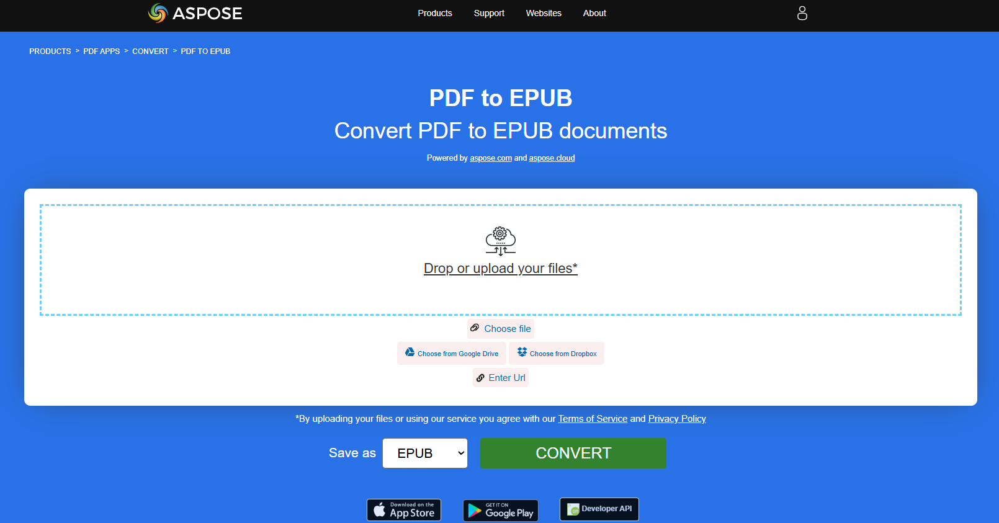
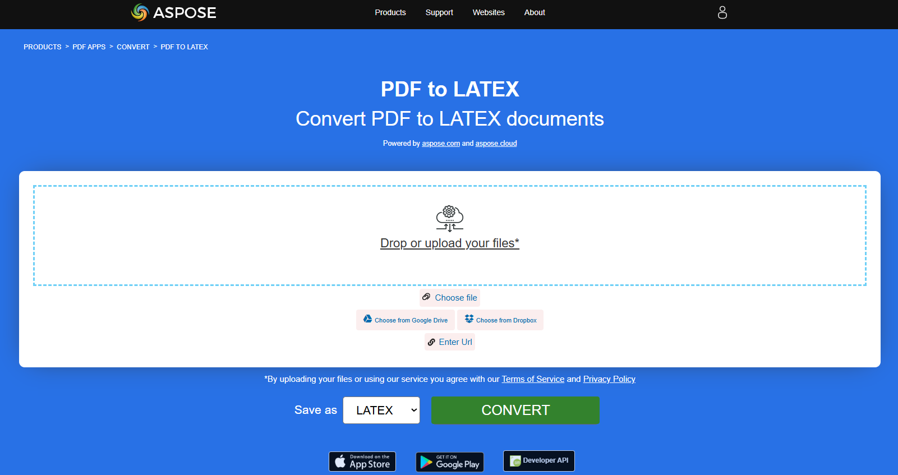
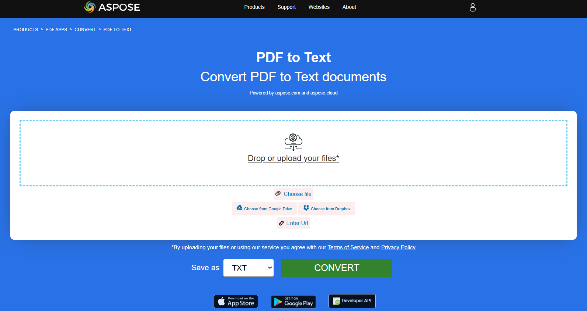
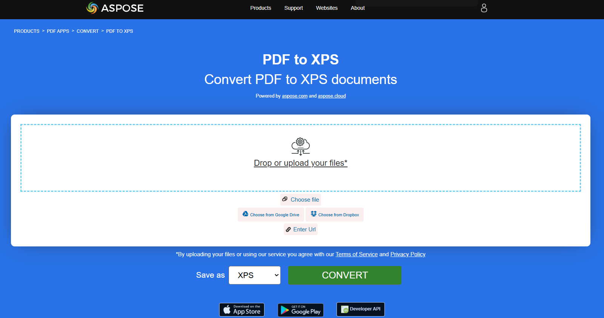

## Convert PDF to EPUB

**<abbr title="Electronic Publication">EPUB</abbr>** is a free and open e-book standard from the International Digital Publishing Forum (IDPF). Files have the extension .epub.
EPUB is designed for reflowable content, meaning that an EPUB reader can optimize text for a particular display device. EPUB also supports fixed-layout content. The format is intended as a single format that publishers and conversion houses can use in-house, as well as for distribution and sale. It supersedes the Open eBook standard.

The provided Rust code snippet demonstrates how to convert a PDF document into a EPUB using the Aspose.PDF library:

1. Open a PDF document.
1. Convert a PDF file to EPUB using [save_epub](https://reference.aspose.com/pdf/rust-cpp/convert/save_epub/) function.

```rs

  use asposepdf::Document;

  fn main() -> Result<(), Box<dyn std::error::Error>> {
      // Open a PDF-document with filename
      let pdf = Document::open("sample.pdf")?;

      // Convert and save the previously opened PDF-document as Epub-document
      pdf.save_epub("sample.epub")?;

      Ok(())
  }
```

{}
**Try to convert PDF to EPUB online**

Aspose.PDF for Rust presents you online free application ["PDF to EPUB"](https://products.aspose.app/pdf/conversion/pdf-to-epub), where you may try to investigate the functionality and quality it works.

[](https://products.aspose.app/pdf/conversion/pdf-to-epub)
{}

## Convert PDF to TeX

**Aspose.PDF for Rust** support converting PDF to TeX.
The LaTeX file format is a text file format with the special markup and used in TeX-based document preparation system for high-quality typesetting.

The provided Rust code snippet demonstrates how to convert a PDF document into a TeX using the Aspose.PDF library:

1. Open a PDF document.
1. Convert a PDF file to TeX using [save_tex](https://reference.aspose.com/pdf/rust-cpp/convert/save_tex/) function.

```rs

  use asposepdf::Document;

  fn main() -> Result<(), Box<dyn std::error::Error>> {
      // Open a PDF-document with filename
      let pdf = Document::open("sample.pdf")?;

      // Convert and save the previously opened PDF-document as TeX-document
      pdf.save_tex("sample.tex")?;

      Ok(())
  }
```

{}
**Try to convert PDF to LaTeX/TeX online**

Aspose.PDF for Rust presents you online free application ["PDF to LaTeX"](https://products.aspose.app/pdf/conversion/pdf-to-tex), where you may try to investigate the functionality and quality it works.

[](https://products.aspose.app/pdf/conversion/pdf-to-tex)
{}

## Convert PDF to TXT

The provided Rust code snippet demonstrates how to convert a PDF document into a TXT using the Aspose.PDF library:

1. Open a PDF document.
1. Convert a PDF file to TXT using [save_txt](https://reference.aspose.com/pdf/rust-cpp/convert/save_txt/) function.

```rs

  use asposepdf::Document;

  fn main() -> Result<(), Box<dyn std::error::Error>> {
      // Open a PDF-document with filename
      let pdf = Document::open("sample.pdf")?;

      // Convert and save the previously opened PDF-document as Txt-document
      pdf.save_txt("sample.txt")?;

      Ok(())
  }
```

{}
**Try to convert Convert PDF to Text online**

Aspose.PDF for Rust presents you online free application ["PDF to Text"](https://products.aspose.app/pdf/conversion/pdf-to-txt), where you may try to investigate the functionality and quality it works.

[](https://products.aspose.app/pdf/conversion/pdf-to-txt)
{}

## Convert PDF to XPS

The XPS file type is primarily associated with the XML Paper Specification by Microsoft Corporation. The XML Paper Specification (XPS), formerly codenamed Metro and subsuming the Next Generation Print Path (NGPP) marketing concept, is Microsoft's initiative to integrate document creation and viewing into the Windows operating system.

**Aspose.PDF for Rust** gives a possibility to convert PDF files to <abbr title="XML Paper Specification">XPS</abbr> format. Let try to use the presented code snippet for converting PDF files to XPS format with Rust.

The provided Rust code snippet demonstrates how to convert a PDF document into a XPS using the Aspose.PDF library:

1. Open a PDF document.
1. Convert a PDF file to XPS using [save_xps](https://reference.aspose.com/pdf/rust-cpp/convert/save_xps/) function.

```rs

  use asposepdf::Document;

  fn main() -> Result<(), Box<dyn std::error::Error>> {
      // Open a PDF-document with filename
      let pdf = Document::open("sample.pdf")?;

      // Convert and save the previously opened PDF-document as Xps-document
      pdf.save_xps("sample.xps")?;

      Ok(())
  }
```

{}
**Try to convert PDF to XPS online**

Aspose.PDF for Rust presents you online free application ["PDF to XPS"](https://products.aspose.app/pdf/conversion/pdf-to-xps), where you may try to investigate the functionality and quality it works.

[](https://products.aspose.app/pdf/conversion/pdf-to-xps)
{}

## Convert PDF to Grayscale PDF

The provided Rust code snippet demonstrates how to convert the first page of a PDF document into a Grayscale PDF using the Aspose.PDF library:

1. Open a PDF document.
1. Convert a PDF Page to Grayscale PDF using [page_grayscale](https://reference.aspose.com/pdf/rust-cpp/organize/page_grayscale/) function.

This example converts a specific page of your PDF to Grayscale:

```rs

  use asposepdf::Document;

  fn main() -> Result<(), Box<dyn std::error::Error>> {
      // Open a PDF-document from file
      let pdf = Document::open("sample.pdf")?;

      // Convert page to black and white
      pdf.page_grayscale(1)?;

      // Save the previously opened PDF-document with new filename
      pdf.save_as("sample_page1_grayscale.pdf")?;

      Ok(())
  }
```

## Convert PDF to booklet-style PDF

Aspose.PDF for Rust via C++ explains how to convert a standard PDF document into a booklet-style PDF.
The booklet format rearranges pages so that, when printed and folded, the document forms a proper booklet with pages in the correct order.

```rs

  use asposepdf::Document;

  fn main() -> Result<(), Box<dyn std::error::Error>> {
      // Open a PDF-document with filename
      let pdf = Document::open("sample.pdf")?;

      // Convert and save the previously opened PDF-document as booklet PDF-document
      pdf.save_booklet("sample_booklet.pdf")?;

      Ok(())
  }
```