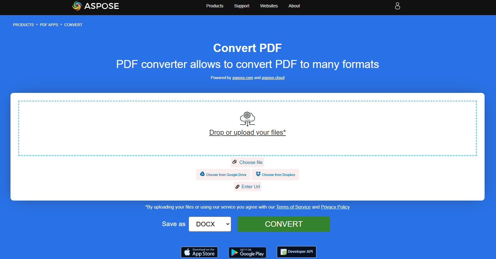

## Convert PDF to PPTX

The provided Rust code snippet demonstrates how to convert a PDF document into a PPTX using the Aspose.PDF library:

1. Open a PDF document.
1. Convert a PDF file to PPTX using [save_pptx](https://reference.aspose.com/pdf/rust-cpp/convert/save_pptx/) function.

```rust

  use asposepdf::Document;

  fn main() -> Result<(), Box<dyn std::error::Error>> {
      // Open a PDF-document with filename
      let pdf = Document::open("sample.pdf")?;

      // Convert and save the previously opened PDF-document as PptX-document
      pdf.save_pptx("sample.pptx")?;

      Ok(())
  }
```

{}
**Try to convert PDF to PowerPoint online**

Aspose.PDF for Rust presents you online free application ["PDF to PPTX"](https://products.aspose.app/pdf/conversion/pdf-to-pptx), where you may try to investigate the functionality and quality it works.

[](https://products.aspose.app/pdf/conversion/pdf-to-pptx)
{}