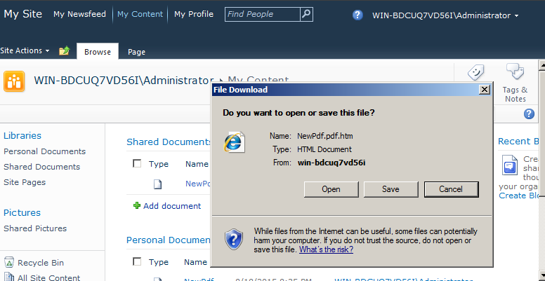

---
title: Convert PDF to HTML in SharePoint
linktitle: Convert PDF to HTML
type: docs
weight: 80
url: /sharepoint/convert-pdf-to-html/
lastmod: "2026-08-31"
description: Using the PDF SharePoint API, you can convert PDF document form SharePoint document library to HTML format.
---

{}

Aspose.PDF for SharePoint supports feature to convert PDF document form SharePoint document library to HTML format. In this article we will demonstrate PDF to HTML conversion.

{}

## Converting PDF document to HTML

Convert PDF document from SharePoint Document library to HTML as following:

1. Click **Convert to HTML** in the ECB menu of PDF document.

2. Download and save the resultant HTML file to disk.

