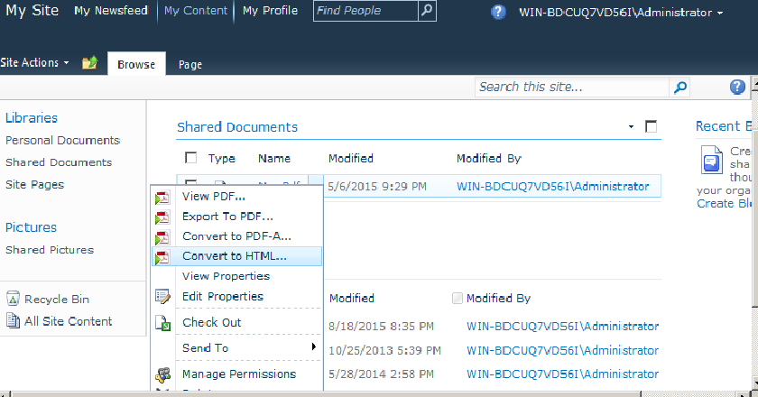
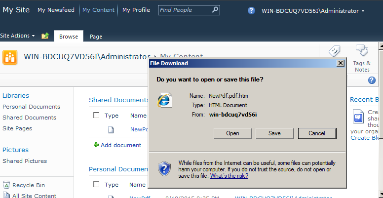

{}

Aspose.PDF for SharePoint supports feature to convert PDF document form SharePoint document library to HTML format. In this article we will demonstrate PDF to HTML conversion.

{}

## **Converting PDF document to HTML**

Convert PDF document from SharePoint Document library to HTML as following:

1. Click **Convert to HTML** in the ECB menu of PDF document.

2. Download and save the resultant HTML file to disk.

