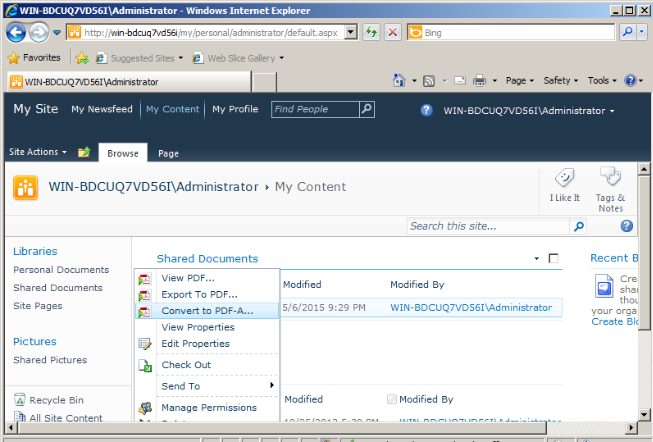
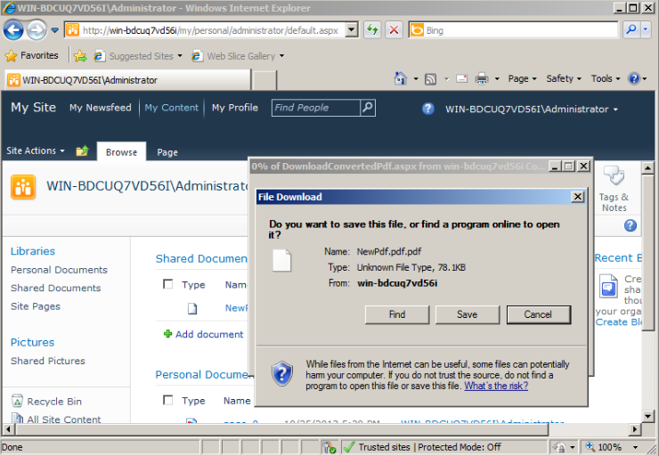

{}

In [Aspose.PDF for SharePoint 2.0](https://releases.aspose.com/pdf/sharepoint/new-releases/aspose.pdf-for-sharepoint-2.0.0/) release we have added support to create PDFA compliant PDF.

Currently Aspose.PDF for SharePoint supports only PDFA1b standard.

{}

## **Creating a PDFA compliant Document**

Convert PDF from SharePoint Document library to PDFA as following:

1. Click **Convert to PDF** in the ECB menu.

2. Download and save the resultant PDF file.

