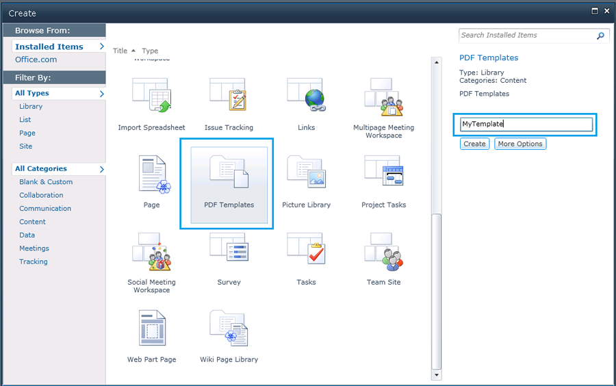
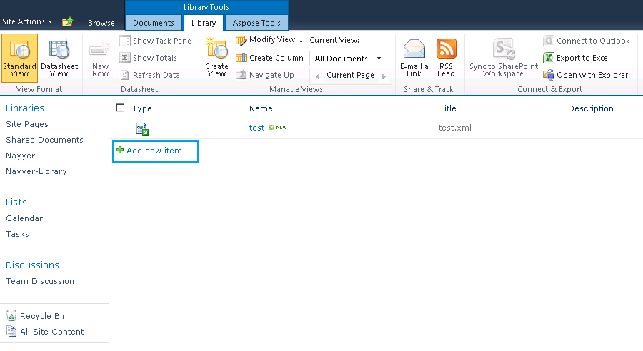
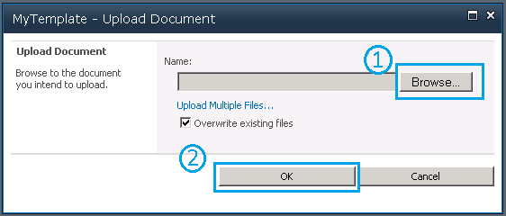
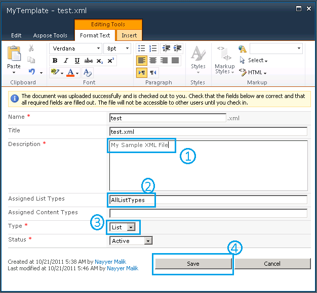
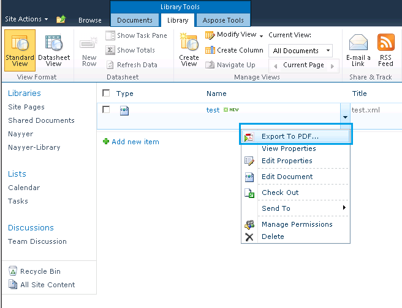
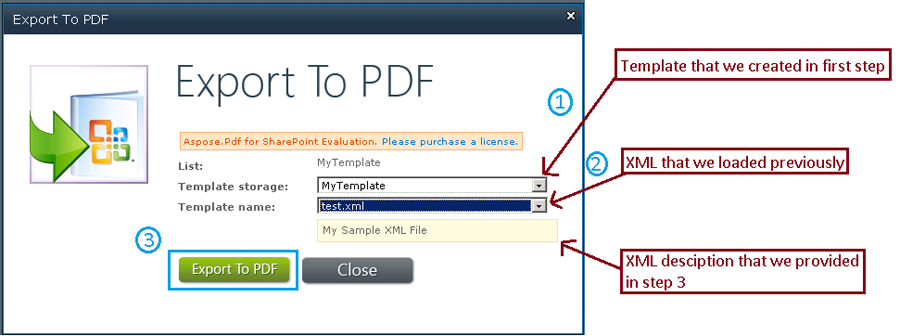
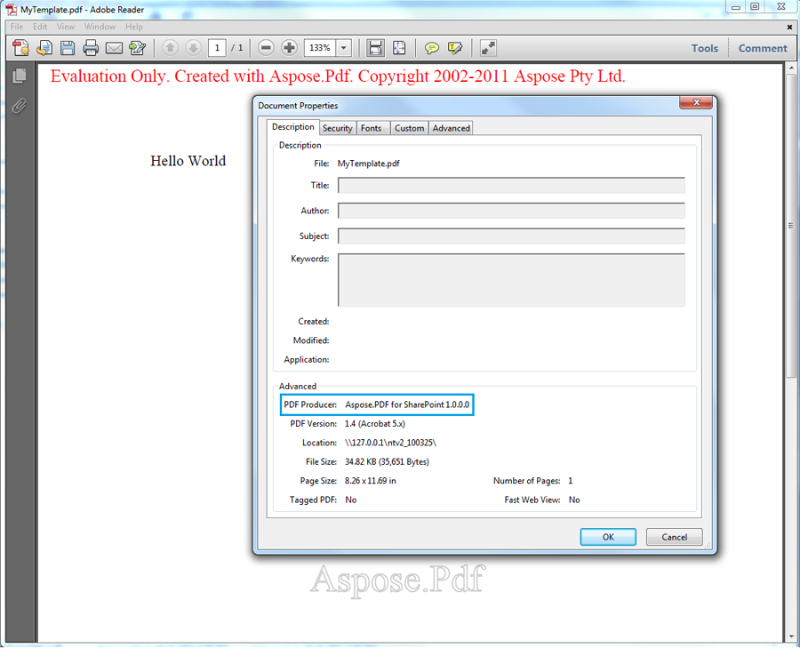

{}

Aspose.PDF for SharePoint is built on top of our award winning Aspose.PDF for .NET component. Aspose.PDF for .NET provides remarkable features from the creation of PDF document from scratch to manipulation of existing PDF files. Among these features, XML to PDF conversion is one of the great features support by this product. So we believe that Aspose.PDF for SharePoint will also be capable of converting XML files into PDF format.

{}

## **Creating and XML File and Converting it to PDF**

{}

Step by step, this article walks you through the process of creating and XML file and converting it to PDF:

1. [Create an XML file](/pdf/sharepoint/how-to-create-and-convert-an-xml-file-to-pdf/#step-1-create-xml-file).
2. [Create a PDF template](/pdf/sharepoint/how-to-create-and-convert-an-xml-file-to-pdf/#step-2-create-pdf-template).
3. [Load the XML template](/pdf/sharepoint/how-to-create-and-convert-an-xml-file-to-pdf/#step-3-load-xml-template).
4. [Specify the path to the source path](/pdf/sharepoint/how-to-create-and-convert-an-xml-file-to-pdf/#step-4-specify-source-file-path).
5. [Specify file properties](/pdf/sharepoint/how-to-create-and-convert-an-xml-file-to-pdf/#step-5-specify-file-properties).
6. [Export the file to PDF](/pdf/sharepoint/how-to-create-and-convert-an-xml-file-to-pdf/#step-6-export-to-pdf).
7. [Save the PDF file](/pdf/sharepoint/how-to-create-and-convert-an-xml-file-to-pdf/#step-7-save-pdf-document).
#### **Step 1: Create XML File**
First create an XML file based on the Aspose.PDF for .NET Document Object Model.

According to Aspose.PDF for .NET DOM, a PDF document contains a collection of Section objects, and a Section contains one or more Paragraph elements. Text is a Paragraph level object and may contain one or more segments. Below, a sample text string is added to a Segment object and added to a Text object. Finally, the Text element is added to the Section object's paragraphs collection.

**XML**



<?xml version="1.0" encoding="utf-8" ?>

  <Pdf xmlns="Aspose.PDF">

   <Section>

    <Text>

            <Segment>Hello World</Segment>

    </Text>

   </Section>

  </Pdf>


#### **Step 2: Create PDF Template**
Before continuing, make sure that SharePoint Foundation server 2010 is properly installed and configured on the system where the conversion will take place.

1. Log in to the SharePoint site.
1. Select **Site Action** and **All Items**.
1. Select the **Create** option and select **PDF Template** from the list.
1. Enter a template name.
1. Click **Create**.

#### **Step 3: Load XML Template**
Once the template has been created, load [the XML file](/pdf/sharepoint/how-to-create-and-convert-an-xml-file-to-pdf/):

1. On the PDF template page, select **Add new item**.

#### **Step 4: Specify Source File Path**
In the document upload dialog:

1. Click **Browse** and locate the XML file on your system. You may enable the check box to overwrite existing file option.
1. Press **OK** button.

#### **Step 5: Specify File Properties**
When the file is loaded, add information into the mandatory fields (marked with a red asterisk: *).

For this example, a sample description had been added and the following fields completed:

1. A brief description of the document.
1. Enter **AllListTypes** for the **Assigned List Types** field.
1. Select **List** from the **Type** menu.
   Make sure that the status remains **Active**.
1. Click **Save** to save the properties.

#### **Step 6: Export to PDF**
When the XML file has been added to the PDF template:
Either:

1. Right-click the test.xml file.
1. Select **Export to PDF** from the menu.

Or:

1. Select **Aspose Tools** from the **Library Tools**.
1. Click **Export**.

#### **Step 7: Save PDF Document**
1. In the Export to PDF dialog, select **Template storage** (the location where source file is stored).
1. Select the file to export from **Template name** menu.
1. Click **Export to PDF** to save the final PDF document.

#### **Open the PDF**
The PDF document has been saved and can be opened. In the image below, note the phrase "Hello World" that was in the {segment] tag in the XML. Also note that the PDF Producer is Aspose.PDF for SharePoint.

{}
