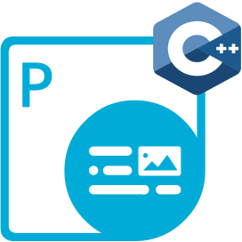

## Bienvenido a Aspose.PDF for Go via C++

{}

El **Aspose.PDF for Go via C++** es un conjunto de herramientas potente que permite a los desarrolladores manipular archivos PDF directamente y ayuda a realizar diversas tareas con PDF. Contiene funciones únicas para convertir PDF a otros formatos.

{}

## Capítulos

- [Visión general](/pdf/es/go-cpp/overview/)
- [Comenzar](/pdf/es/go-cpp/get-started/)
- [Operaciones básicas](/pdf/es/go-cpp/basic-operations/)
- [Notas de la versión](https://releases.aspose.com/pdf/gocpp/)

## Recursos de Aspose.PDF for Go

A continuación se encuentran los enlaces a algunos recursos útiles que puede necesitar para realizar sus tareas.

- [Funciones de Aspose.PDF for Go](/pdf/es/go-cpp/key-features/)
- [Notas de la versión de Aspose.PDF for Go](https://releases.aspose.com/pdf/gocpp/)
- [Descargar Aspose.PDF for Go](https://github.com/aspose-pdf/aspose-pdf-go-cpp)
- [Aspose.PDF for Go Página del producto](https://products.aspose.com/pdf/go-cpp/)
- [Aspose.PDF for Go Guía de referencia de API](https://reference.aspose.com/pdf/go-cpp/)
- [Aspose.PDF for Go Foro de soporte gratuito](https://forum.aspose.com/c/pdf/10)
- [Aspose.PDF for Go Helpdesk de soporte pagado](https://helpdesk.aspose.com/)
