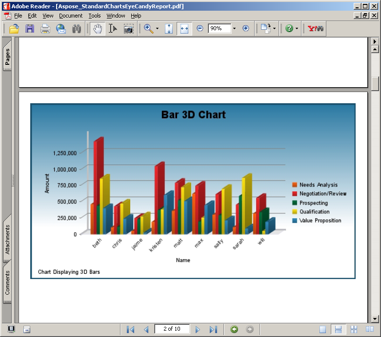

---
title: Trabajando con JasperServer
linktitle: Trabajando con JasperServer
type: docs
weight: 20
description: Explore cómo trabajar eficientemente con JasperServer usando Aspose.PDF. Exporte informes a archivos PDF profesionales con facilidad.
lastmod: "2021-06-05"
---

## <ins>Establezca el parámetro del exportador de archivos de licencia en applicationContext.xml

{}

Este método se utiliza con JasperServer.

{}

1. Descargue la licencia a su computadora y cópiela en ```<InstallDir>\apache-tomcat\webapps\jasperserver\WEB-INF``` folder, where  ```<InstallDir>``` representa el directorio de instalación de JasperServer.
2. Localice el archivo ```<InstallDir>\apache-tomcat\webapps\jasperserver\WEB-INF\applicationContext.xml``` y agregue las siguientes líneas:

```xml
 <bean id="AsposeExportParameters" class="comcom.aspose.pdf.jr3_7_0.jasperreports.JrPdfExportParametersBean">
    <property name="licenseFile" value="C:/jasperserver-pro-3.7.1/apache-tomcat/webapps/jasperserver-pro/WEB-  
    INF/Aspose.Total.JasperReports.lic"/>
</bean>
```

{}
Nota: Tenga en cuenta que la ruta de instalación no debe contener espacios, por ejemplo C:/Archivos de programa/JasperServer… ya que eso causa problemas al acceder al archivo de licencia.
{}

## Verifique que la licencia funcione

Exporte cualquier informe a formato PDF y compruebe si el informe contiene un mensaje de evaluación. Si no aparece ningún mensaje de evaluación, entonces la licencia funciona correctamente.

Aspose.PDF for JasperReportsinyecta una marca de agua cuando se trabaja en modo de evaluación


Aspose.PDF for JasperReportsinyecta una marca de agua cuando se trabaja en modo de evaluación




