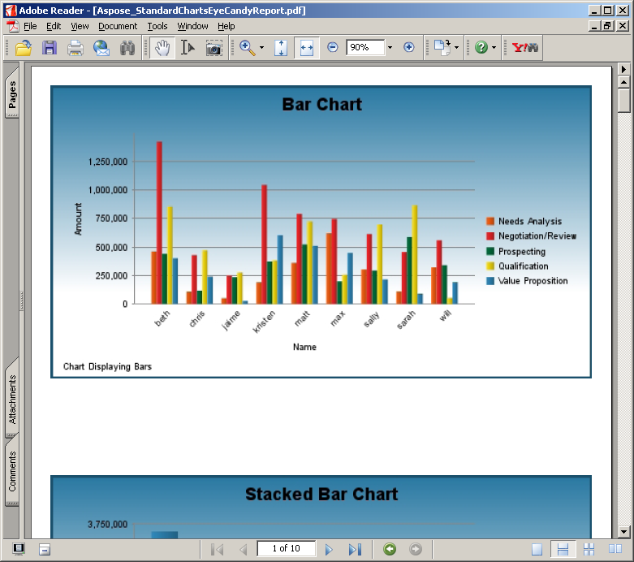

---
title: Galería de informes de muestra
linktitle: Galería de informes de muestra
type: docs
weight: 40
url: /es/jasperreports/sample-reports-gallery/
description: Vea informes de muestra creados con Aspose.PDF for JasperReports y cómo mejora las capacidades de exportación a PDF.
lastmod: "2026-08-31"
---

{}

Esta galería muestra informes en PDF exportados por Aspose.PDF for JasperReports.

{}

Los informes que se muestran a continuación se basan en datos de muestra instalados con JasperServer.

## Informe de todas las cuentas

## Informe de tiendas Supermart

## Cartas estándar Informe del Egeo

## Standard charts Aegean report

## Standard charts eye candy report

## Standard charts eye candy report

## Standard charts eye candy report

## Informe de gráficos estándar

## Standard charts report

