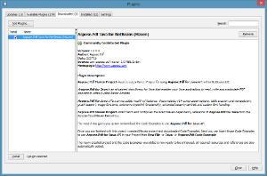

## Instalando

**Aspose.PDF Java para NetBeans (Maven)** plugin se puede instalar fácilmente desde la pestaña **Plugin** disponible en el cuadro de diálogo del Plugin.

- Para abrirlo, seleccione **Plugins** del menú **Tools** en NetBeans.

- Esto agrega el **Aspose.PDF Maven Project** en el asistente Nuevo proyecto y el **Aspose.PDF Code Example** en el asistente Nuevo archivo del NetBeans IDE.

## Usando

### Aspose.PDF Maven Project (asistente)

Para crear **Maven Project** mediante asistente para usar [Aspose.PDF for Java API](http://www.aspose.com/java/pdf-component.aspx):

1. Seleccione **New Project**.
2. Seleccione **Aspose.PDF Maven Project** en la categoría **Maven**.
3. Haga clic en **Next**.

Proporcione **Project Name, Location, GroupId, ArtifactId** y **Version** para su proyecto Maven y haga clic en **Finish.**

Esto recuperará el [Aspose.PDF for Java](http://www.aspose.com/java/pdf-component.aspx) último [Maven Dependency](http://maven.aspose.com/repository/ext-release-local/com/aspose/aspose-pdf/) referencia de [Aspose Cloud Maven Repository](https://repository.aspose.com/webapp/#/artifacts/browse/tree/General/repo) y configúralo en **pom.xml**. Si has optado por **Also Download Code Examples,** la descarga de los **Code Examples** también comenzará desde el [Aspose.PDF for Java API Examples Repository. ](https://github.com/aspose-pdf/Aspose.PDF-for-Java/tree/master/Examples)
El siguiente proyecto **Maven** se creará en tu **NetBeans IDE** al completar el asistente:

El **Maven Project** creado está configurado para usar **Aspose.PDF for Java API** y está listo para ser mejorado según los requisitos de su proyecto.
   Si ha optado por descargar [Code Examples](https://github.com/aspose-pdf/Aspose.PDF-for-Java/tree/master/Examples), puede usar **Aspose.PDF Code Example (wizard)** para importar los **Ejemplos de código** necesarios de [Aspose.PDF for Java](http://www.aspose.com/java/pdf-component.aspx) API en su proyecto.

### Aspose.PDF Code Example (wizard)

**Aspose.PDF Code Example wizard** le permite probar muchos ejemplos proporcionados para [Aspose.PDF for Java](http://www.aspose.com/java/pdf-component.aspx) API.

{}

Para poder usar **Aspose.PDF Code Example wizard** cómodamente: se recomienda siempre seleccionar **También descargar ejemplos de código** al crear **Maven Project** en **Aspose.PDF Maven Project** **wizard**,

{}

Para usar los ejemplos, solo:

1. Haga clic en **New File** en **NetBeans**.
2. Elija su proyecto y luego seleccione **Aspose.PDF Code Example** en la categoría **Java**.
3. Haga clic en **Next**.

Expanda el árbol para seleccionar la categoría **Code Example** y haga clic en **Finish**.

 Esto copiará los archivos Java de la categoría seleccionada **Code Examples** al proyecto bajo el paquete **com.aspose.pdf.examples**. Además, cualquier recurso necesario para los Code Examples se copiará en la carpeta **src/main/resources**, como se muestra a continuación:

 Revise el código de ejemplo, compílelo y ejecútelo.
 Ahora puede probar otros ejemplos y comenzar a crear su propia aplicación usando [Aspose.PDF for Java API](http://www.aspose.com/java/pdf-component.aspx).
