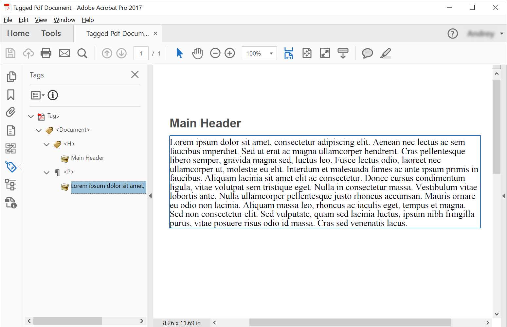

<script type="application/ld+json">
{
    "@context": "https://schema.org",
    "@type": "TechArticle",
    "headline": "Crear PDF etiquetado usando C#",
    "alternativeHeadline": "Cómo crear PDF etiquetado",
    "author": {
        "@type": "Person",
        "name":"Anastasiia Holub",
        "givenName": "Anastasiia",
        "familyName": "Holub",
        "url":"https://www.linkedin.com/in/anastasiia-holub-750430225/"
    },
    "genre": "generación de documentos pdf",
    "keywords": "crear, etiquetado, pdf",
    "wordcount": "302",
    "proficiencyLevel":"Principiante",
    "publisher": {
        "@type": "Organization",
        "name": "Equipo de Documentación de Aspose.PDF",
        "url": "https://products.aspose.com/pdf",
        "logo": "https://www.aspose.cloud/templates/aspose/img/products/pdf/aspose_pdf-for-net.svg",
        "alternateName": "Aspose",
        "sameAs": [
            "https://facebook.com/aspose.pdf/",
            "https://twitter.com/asposepdf",
            "https://www.youtube.com/channel/UCmV9sEg_QWYPi6BJJs7ELOg/featured",
            "https://www.linkedin.com/company/aspose",
            "https://stackoverflow.com/questions/tagged/aspose",
            "https://aspose.quora.com/",
            "https://aspose.github.io/"
        ],
        "contactPoint": [
            {
                "@type": "ContactPoint",
                "telephone": "+1 903 306 1676",
                "contactType": "ventas",
                "areaServed": "US",
                "availableLanguage": "en"
            },
            {
                "@type": "ContactPoint",
                "telephone": "+44 141 628 8900",
                "contactType": "ventas",
                "areaServed": "GB",
                "availableLanguage": "en"
            },
            {
                "@type": "ContactPoint",
                "telephone": "+61 2 8006 6987",
                "contactType": "ventas",
                "areaServed": "AU",
                "availableLanguage": "en"
            }
        ]
    },
    "url": "/net/create-tagged-pdf/",
    "mainEntityOfPage": {
        "@type": "WebPage",
        "@id": "/net/create-tagged-pdf/"
    },
    "dateModified": "2022-02-04",
    "description": "Este artículo explica cómo crear elementos de estructura para un documento PDF etiquetado de forma programática utilizando Aspose.PDF para .NET."
}
</script>

Crear un PDF etiquetado significa agregar (o crear) ciertos elementos al documento que permitirán que el documento sea validado de acuerdo con los requisitos de PDF/UA. Estos elementos se llaman a menudo Elementos de Estructura.

El siguiente fragmento de código también funciona con la biblioteca [Aspose.PDF.Drawing](/pdf/es/net/drawing/).

## Creando un PDF Etiquetado (Escenario Simple)

Para crear elementos de estructura en un Documento PDF Etiquetado, Aspose.PDF ofrece métodos para crear un elemento de estructura usando la interfaz [ITaggedContent](https://reference.aspose.com/pdf/net/aspose.pdf.tagged/itaggedcontent). El siguiente fragmento de código muestra cómo crear un PDF Etiquetado que contiene 2 elementos: encabezado y párrafo.

```csharp
private static void CreateTaggedPdfDocument01()
{
    // Crear Documento PDF
    var document = new Document();

    // Obtener Contenido para trabajar con TaggedPdf
    ITaggedContent taggedContent = document.TaggedContent;
    var rootElement = taggedContent.RootElement;
    // Establecer Título e Idioma para el Documento
    taggedContent.SetTitle("Documento PDF Etiquetado");
    taggedContent.SetLanguage("en-US");

    // 
    HeaderElement mainHeader = taggedContent.CreateHeaderElement();
    mainHeader.SetText("Encabezado Principal");

    ParagraphElement paragraphElement = taggedContent.CreateParagraphElement();
    paragraphElement.SetText("Lorem ipsum dolor sit amet, consectetur adipiscing elit. " +
    "Aenean nec lectus ac sem faucibus imperdiet. Sed ut erat ac magna ullamcorper hendrerit. " +
    "Cras pellentesque libero semper, gravida magna sed, luctus leo. Fusce lectus odio, laoreet" +
    "nec ullamcorper ut, molestie eu elit. Interdum et malesuada fames ac ante ipsum primis in faucibus." +
    "Aliquam lacinia sit amet elit ac consectetur. Donec cursus condimentum ligula, vitae volutpat" +
    "sem tristique eget. Nulla in consectetur massa. Vestibulum vitae lobortis ante. Nulla ullamcorper" +
    "pellentesque justo rhoncus accumsan. Mauris ornare eu odio non lacinia. Aliquam massa leo, rhoncus" +
    "ac iaculis eget, tempus et magna. Sed non consectetur elit. Sed vulputate, quam sed lacinia luctus," +
    "ipsum nibh fringilla purus, vitae posuere risus odio id massa. Cras sed venenatis lacus.");

    rootElement.AppendChild(mainHeader);
    rootElement.AppendChild(paragraphElement);

    // Guardar Documento PDF Etiquetado
    document.Save("C:\\Samples\\TaggedPDF\\Sample1.pdf");
}
```
Obtendremos el siguiente documento después de su creación:



## Creación de PDF etiquetado con elementos anidados (Creando árbol de elementos de estructura)

En algunos casos, necesitamos crear una estructura más compleja, por ejemplo, colocar citas en un párrafo.
Para crear un árbol de elementos de estructura, deberíamos usar el método [AppendChild](https://reference.aspose.com/pdf/net/aspose.pdf.logicalstructure/element/methods/appendchild).
El siguiente fragmento de código muestra cómo crear un árbol de elementos de estructura de un documento PDF etiquetado:

```csharp
private static void CreateTaggedPdfDocument02()
{
    // Crear documento PDF
    var document = new Document();

    // Obtener contenido para trabajar con TaggedPdf
    ITaggedContent taggedContent = document.TaggedContent;
    var rootElement = taggedContent.RootElement;
    // Establecer título e idioma para el documento
    taggedContent.SetTitle("Documento PDF etiquetado");
    taggedContent.SetLanguage("en-US");

    HeaderElement header1 = taggedContent.CreateHeaderElement(1);
    header1.SetText("Encabezado Nivel 1");

    ParagraphElement paragraphWithQuotes = taggedContent.CreateParagraphElement();
    paragraphWithQuotes.StructureTextState.Font = FontRepository.FindFont("Calibri");
    paragraphWithQuotes.AdjustPosition(new Aspose.Pdf.Tagged.PositionSettings
    {
        Margin = new Aspose.Pdf.MarginInfo(10, 5, 10, 5)
    });

    SpanElement spanElement1 = taggedContent.CreateSpanElement();
    spanElement1.SetText("Lorem ipsum dolor sit amet, consectetur adipiscing elit. Aenean nec lectus ac sem faucibus imperdiet. Sed ut erat ac magna ullamcorper hendrerit. Cras pellentesque libero semper, gravida magna sed, luctus leo. Fusce lectus odio, laoreet nec ullamcorper ut, molestie eu elit. Interdum et malesuada fames ac ante ipsum primis in faucibus. Aliquam lacinia sit amet elit ac consectetur. Donec cursus condimentum ligula, vitae volutpat sem tristique eget. Nulla in consectetur massa. Vestibulum vitae lobortis ante. Nulla ullamcorper pellentesque justo rhoncus accumsan. Mauris ornare eu odio non lacinia. Aliquam massa leo, rhoncus ac iaculis eget, tempus et magna. Sed non consectetur elit. ");
    QuoteElement quoteElement = taggedContent.CreateQuoteElement();
    quoteElement.SetText("Sed vulputate, quam sed lacinia luctus, ipsum nibh fringilla purus, vitae posuere risus odio id massa.");
    quoteElement.StructureTextState.FontStyle = FontStyles.Bold | FontStyles.Italic;
    SpanElement spanElement2 = taggedContent.CreateSpanElement();
    spanElement2.SetText(" Sed non consectetur elit.");

    paragraphWithQuotes.AppendChild(spanElement1);
    paragraphWithQuotes.AppendChild(quoteElement);
    paragraphWithQuotes.AppendChild(spanElement2);

    rootElement.AppendChild(header1);
    rootElement.AppendChild(paragraphWithQuotes);

    // Guardar documento PDF etiquetado
    document.Save("C:\\Samples\\TaggedPDF\\Sample2.pdf");
}
```
changefreq: "monthly"
type: docs
Obtendremos el siguiente documento después de la creación:


## Estructura de Texto de Estilo

Para estructurar el texto en un Documento PDF Etiquetado, Aspose.PDF ofrece las propiedades [Font](https://reference.aspose.com/pdf/net/aspose.pdf.logicalstructure/structuretextstate/properties/font), [FontSize](https://reference.aspose.com/pdf/net/aspose.pdf.logicalstructure/structuretextstate/properties/fontsize), [FontStyle](https://reference.aspose.com/pdf/net/aspose.pdf.logicalstructure/structuretextstate/properties/fontstyle) y [ForegroundColor](https://reference.aspose.com/pdf/net/aspose.pdf.logicalstructure/structuretextstate/properties/foregroundcolor) de la Clase [StructureTextState](https://reference.aspose.com/pdf/net/aspose.pdf.logicalstructure/structuretextstate). El siguiente fragmento de código muestra cómo estructurar el texto en un Documento PDF Etiquetado:

```csharp
// Para ejemplos completos y archivos de datos, por favor visite https://github.com/aspose-pdf/Aspose.PDF-for-.NET
// La ruta al directorio de documentos.
string dataDir = RunExamples.GetDataDir_AsposePdf_WorkingDocuments();

// Crear Documento PDF
Document document = new Document();

// Obtener Contenido para trabajar con TaggedPdf
ITaggedContent taggedContent = document.TaggedContent;

// Establecer Título e Idioma para el Documento
taggedContent.SetTitle("Documento PDF Etiquetado");
taggedContent.SetLanguage("en-US");

ParagraphElement p = taggedContent.CreateParagraphElement();
taggedContent.RootElement.AppendChild(p);

// En desarrollo
p.StructureTextState.FontSize = 18F;
p.StructureTextState.ForegroundColor = Color.Red;
p.StructureTextState.FontStyle = FontStyles.Italic;

p.SetText("Texto en rojo e itálico.");

// Guardar Documento PDF Etiquetado
document.Save(dataDir + "StyleTextStructure.pdf");
```
## Ilustrando Elementos de Estructura

Para ilustrar elementos de estructura en un Documento PDF Etiquetado, Aspose.PDF ofrece la clase [IllustrationElement](https://reference.aspose.com/pdf/net/aspose.pdf.logicalstructure/illustrationelement). El siguiente fragmento de código muestra cómo ilustrar elementos de estructura en un Documento PDF Etiquetado:

```csharp
// Para ejemplos completos y archivos de datos, por favor vaya a https://github.com/aspose-pdf/Aspose.PDF-for-.NET
// La ruta al directorio de documentos.
string dataDir = RunExamples.GetDataDir_AsposePdf_WorkingDocuments();

// Crear Documento PDF
Document document = new Document();

// Obtener Contenido para trabajar con TaggedPdf
ITaggedContent taggedContent = document.TaggedContent;

// Establecer Título e Idioma para el Documento
taggedContent.SetTitle("Documento PDF Etiquetado");
taggedContent.SetLanguage("en-US");

// En Desarrollo
IllustrationElement figure1 = taggedContent.CreateFigureElement();
taggedContent.RootElement.AppendChild(figure1);
figure1.AlternativeText = "Figura Uno";
figure1.Title = "Imagen 1";
figure1.SetTag("Fig1");
figure1.SetImage("image.png");

// Guardar Documento PDF Etiquetado
document.Save(dataDir + "IllustrationStructureElements.pdf");

```
## Validar PDF Etiquetado

Aspose.PDF para .NET proporciona la capacidad de validar el Documento PDF Etiquetado PDF/UA. La validación del estándar PDF/UA soporta:

- Verificaciones para XObjects
- Verificaciones para Acciones
- Verificaciones para Contenido Opcional
- Verificaciones para Archivos Embebidos
- Verificaciones para Campos de Acroform (Validar Lenguaje Natural y Nombre Alternativo y Firmas Digitales)
- Verificaciones para Campos de Formulario XFA
- Verificaciones para Configuraciones de Seguridad
- Verificaciones para Navegación
- Verificaciones para Anotaciones

El fragmento de código a continuación muestra cómo validar el Documento PDF Etiquetado. Los problemas correspondientes se mostrarán en el informe de registro XML.

```csharp
// Para ejemplos completos y archivos de datos, por favor vaya a https://github.com/aspose-pdf/Aspose.PDF-for-.NET
// La ruta al directorio de documentos.
string dataDir = RunExamples.GetDataDir_AsposePdf_WorkingDocuments();
string inputFileName = dataDir + "StructureElements.pdf";
string outputLogName = dataDir + "ua-20.xml";

using (var document = new Aspose.Pdf.Document(inputFileName))
{
    bool isValid = document.Validate(outputLogName, Aspose.Pdf.PdfFormat.PDF_UA_1);

}
```

<script type="application/ld+json">
{
    "@context": "http://schema.org",
    "@type": "SoftwareApplication",
    "name": "Biblioteca Aspose.PDF para .NET",
    "image": "https://www.aspose.cloud/templates/aspose/img/products/pdf/aspose_pdf-for-net.svg",
    "url": "https://www.aspose.com/",
    "publisher": {
        "@type": "Organization",
        "name": "Aspose.PDF",
        "url": "https://products.aspose.com/pdf",
        "logo": "https://www.aspose.cloud/templates/aspose/img/products/pdf/aspose_pdf-for-net.svg",
        "alternateName": "Aspose",
        "sameAs": [
            "https://facebook.com/aspose.pdf/",
            "https://twitter.com/asposepdf",
            "https://www.youtube.com/channel/UCmV9sEg_QWYPi6BJJs7ELOg/featured",
            "https://www.linkedin.com/company/aspose",
            "https://stackoverflow.com/questions/tagged/aspose",
            "https://aspose.quora.com/",
            "https://aspose.github.io/"
        ],
        "contactPoint": [
            {
                "@type": "ContactPoint",
                "telephone": "+1 903 306 1676",
                "contactType": "ventas",
                "areaServed": "US",
                "availableLanguage": "en"
            },
            {
                "@type": "ContactPoint",
                "telephone": "+44 141 628 8900",
                "contactType": "ventas",
                "areaServed": "GB",
                "availableLanguage": "en"
            },
            {
                "@type": "ContactPoint",
                "telephone": "+61 2 8006 6987",
                "contactType": "ventas",
                "areaServed": "AU",
                "availableLanguage": "en"
            }
        ]
    },
    "offers": {
        "@type": "Offer",
        "price": "1199",
        "priceCurrency": "USD"
    },
    "applicationCategory": "Biblioteca de Manipulación de PDF para .NET",
    "downloadUrl": "https://www.nuget.org/packages/Aspose.PDF/",
    "operatingSystem": "Windows, MacOS, Linux",
    "screenshot": "https://docs.aspose.com/pdf/net/create-pdf-document/screenshot.png",
    "softwareVersion": "2022.1",
    "aggregateRating": {
        "@type": "AggregateRating",
        "ratingValue": "5",
        "ratingCount": "16"
    }
}
</script>
```

