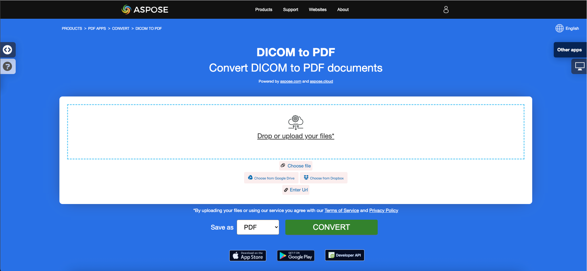

<script type="application/ld+json">
{
    "@context": "https://schema.org",
    "@type": "TechArticle",
    "headline": "Convert various Images formats to PDF in .NET",
    "alternativeHeadline": "Convert Multiple Image Formats to PDF with C#",
    "abstract": "Presentando una poderosa característica en Aspose.PDF for .NET que permite la conversión sin problemas de varios formatos de imagen, incluyendo BMP, CGM, DICOM, EMF, JPG, PNG, SVG, TIFF, CDR y DJVU en documentos PDF de alta calidad. Esta funcionalidad proporciona una forma sencilla de integrar conversiones de imagen a PDF dentro de sus aplicaciones .NET, asegurando un manejo eficiente de diversos contenidos gráficos.",
    "author": {
        "@type": "Person",
        "name": "Anastasiia Holub",
        "givenName": "Anastasiia",
        "familyName": "Holub",
        "url": "https://www.linkedin.com/in/anastasiia-holub-750430225/"
    },
    "genre": "pdf document generation",
    "wordcount": "5228",
    "proficiencyLevel": "Beginner",
    "publisher": {
        "@type": "Organization",
        "name": "Aspose.PDF for .NET",
        "url": "https://products.aspose.com/pdf",
        "logo": "https://www.aspose.cloud/templates/aspose/img/products/pdf/aspose_pdf-for-net.svg",
        "alternateName": "Aspose",
        "sameAs": [
            "https://facebook.com/aspose.pdf/",
            "https://twitter.com/asposepdf",
            "https://www.youtube.com/channel/UCmV9sEg_QWYPi6BJJs7ELOg/featured",
            "https://www.linkedin.com/company/aspose",
            "https://stackoverflow.com/questions/tagged/aspose",
            "https://aspose.quora.com/",
            "https://aspose.github.io/"
        ],
        "contactPoint": [
            {
                "@type": "ContactPoint",
                "telephone": "+1 903 306 1676",
                "contactType": "sales",
                "areaServed": "US",
                "availableLanguage": "en"
            },
            {
                "@type": "ContactPoint",
                "telephone": "+44 141 628 8900",
                "contactType": "sales",
                "areaServed": "GB",
                "availableLanguage": "en"
            },
            {
                "@type": "ContactPoint",
                "telephone": "+61 2 8006 6987",
                "contactType": "sales",
                "areaServed": "AU",
                "availableLanguage": "en"
            }
        ]
    },
    "url": "/net/convert-images-format-to-pdf/",
    "mainEntityOfPage": {
        "@type": "WebPage",
        "@id": "/net/convert-images-format-to-pdf/"
    },
    "dateModified": "2024-11-25",
    "description": "Aspose.PDF puede realizar no solo tareas simples y fáciles, sino también hacer frente a objetivos más complejos. Consulte la siguiente sección para usuarios y desarrolladores avanzados."
}
</script>

## Resumen

Este artículo explica cómo convertir varios formatos de imágenes a PDF usando C#. Cubre estos temas.

El siguiente fragmento de código también funciona con la biblioteca [Aspose.PDF.Drawing](/pdf/es/net/drawing/).

_Formato_: **BMP**
- [C# BMP a PDF](#csharp-bmp-to-pdf)
- [C# Convertir BMP a PDF](#csharp-bmp-to-pdf)
- [C# Cómo convertir imagen BMP a PDF](#csharp-bmp-to-pdf)

_Formato_: **CGM**
- [C# CGM a PDF](#csharp-cgm-to-pdf)
- [C# Convertir CGM a PDF](#csharp-cgm-to-pdf)
- [C# Cómo convertir imagen CGM a PDF](#csharp-cgm-to-pdf)

_Formato_: **DICOM**
- [C# DICOM a PDF](#csharp-dicom-to-pdf)
- [C# Convertir DICOM a PDF](#csharp-dicom-to-pdf)
- [C# Cómo convertir imagen DICOM a PDF](#csharp-dicom-to-pdf)

_Formato_: **EMF**
- [C# EMF a PDF](#csharp-emf-to-pdf)
- [C# Convertir EMF a PDF](#csharp-emf-to-pdf)
- [C# Cómo convertir imagen EMF a PDF](#csharp-emf-to-pdf)

_Formato_: **GIF**
- [C# GIF a PDF](#csharp-gif-to-pdf)
- [C# Convertir GIF a PDF](#csharp-gif-to-pdf)
- [C# Cómo convertir imagen GIF a PDF](#csharp-gif-to-pdf)

_Formato_: **JPG**
- [C# JPG a PDF](#csharp-jpg-to-pdf)
- [C# Convertir JPG a PDF](#csharp-jpg-to-pdf)
- [C# Cómo convertir imagen JPG a PDF](#csharp-jpg-to-pdf)

_Formato_: **PNG**
- [C# PNG a PDF](#csharp-png-to-pdf)
- [C# Convertir PNG a PDF](#csharp-png-to-pdf)
- [C# Cómo convertir imagen PNG a PDF](#csharp-png-to-pdf)

_Formato_: **SVG**
- [C# SVG a PDF](#csharp-svg-to-pdf)
- [C# Convertir SVG a PDF](#csharp-svg-to-pdf)
- [C# Cómo convertir imagen SVG a PDF](#csharp-svg-to-pdf)

_Formato_: **TIFF**
- [C# TIFF a PDF](#csharp-tiff-to-pdf)
- [C# Convertir TIFF a PDF](#csharp-tiff-to-pdf)
- [C# Cómo convertir imagen TIFF a PDF](#csharp-tiff-to-pdf)

_Formato_: **CDR**
- [C# CDR a PDF](#csharp-cdr-to-pdf)
- [C# Convertir CDR a PDF](#csharp-cdr-to-pdf)
- [C# Cómo convertir imagen CDR a PDF](#csharp-cdr-to-pdf)

_Formato_: **DJVU**
- [C# DJVU a PDF](#csharp-djvu-to-pdf)
- [C# Convertir DJVU a PDF](#csharp-djvu-to-pdf)
- [C# Cómo convertir imagen DJVU a PDF](#csharp-djvu-to-pdf)

Otros temas cubiertos por este artículo
- [Ver también](#see-also)

## Conversiones de imágenes a PDF en C#

**Aspose.PDF for .NET** permite convertir diferentes formatos de imágenes a archivos PDF. Nuestra biblioteca demuestra fragmentos de código para convertir los formatos de imagen más populares, como BMP, CGM, DICOM, EMF, JPG, PNG, SVG y TIFF.

## Convertir BMP a PDF

Convierte archivos BMP a documentos PDF usando la biblioteca **Aspose.PDF for .NET**.

<abbr title="Bitmap Image File">BMP</abbr> las imágenes son archivos con extensión. BMP representa archivos de imagen de mapa de bits que se utilizan para almacenar imágenes digitales de mapa de bits. Estas imágenes son independientes del adaptador gráfico y también se llaman formato de archivo de mapa de bits independiente del dispositivo (DIB).
Puedes convertir BMP a archivos PDF con la API Aspose.PDF for .NET. Por lo tanto, puedes seguir los siguientes pasos para convertir imágenes BMP:

<a name="csharp-bmp-to-pdf" id="csharp-bmp-to-pdf"><strong>Pasos: Convertir BMP a PDF en C#</strong></a>

1. Inicializa un nuevo objeto de la clase [Document](https://reference.aspose.com/pdf/es/net/aspose.pdf/document).
2. Carga la imagen **BMP** de entrada.
3. Finalmente, guarda el archivo PDF de salida.

Así que el siguiente fragmento de código sigue estos pasos y muestra cómo convertir BMP a PDF usando C#:

```csharp
// For complete examples and data files, visit https://github.com/aspose-pdf/Aspose.PDF-for-.NET
private static void ConvertBMPtoPDF()
{
    // The path to the documents directory
    var dataDir = RunExamples.GetDataDir_AsposePdf_WorkingDocuments();

    // Create PDF document
    using (var document = new Aspose.Pdf.Document())
    {
        // Add page
        var page = document.Pages.Add();
        var image = new Aspose.Pdf.Image();
        
        // Load BMP file
        image.File = dataDir + "BMPtoPDF.bmp";
        page.Paragraphs.Add(image);
        
        // Save PDF document
        document.Save(dataDir + "BMPtoPDF_out.pdf");
    }
}
```

{}
**Intenta convertir BMP a PDF en línea**

Aspose te presenta una aplicación gratuita en línea ["BMP a PDF"](https://products.aspose.app/pdf/conversion/bmp-to-pdf/), donde puedes intentar investigar la funcionalidad y la calidad con la que funciona.

[](https://products.aspose.app/pdf/conversion/bmp-to-pdf/)
{}

## Convertir CGM a PDF

<abbr title="Computer Graphics Metafile">CGM</abbr> es una extensión de archivo para un formato de Metarchivo de Gráficos por Computadora comúnmente utilizado en aplicaciones de CAD (diseño asistido por computadora) y gráficos de presentación. CGM es un formato de gráficos vectoriales que admite tres métodos de codificación diferentes: binario (mejor para la velocidad de lectura del programa), basado en caracteres (produce el tamaño de archivo más pequeño y permite transferencias de datos más rápidas) o codificación en texto claro (permite a los usuarios leer y modificar el archivo con un editor de texto).

Consulta el siguiente fragmento de código para convertir archivos CGM a formato PDF.

<a name="csharp-cgm-to-pdf" id="csharp-cgm-to-pdf"><strong>Pasos: Convertir CGM a PDF en C#</strong></a>

1. Crea una instancia de la clase [CgmLoadOptions](https://reference.aspose.com/pdf/es/net/aspose.pdf/cgmloadoptions).
2. Crea una instancia de la clase [Document](https://reference.aspose.com/pdf/es/net/aspose.pdf/document) con el nombre de archivo fuente mencionado y las opciones.
3. Guarda el documento con el nombre de archivo deseado.

```csharp
// For complete examples and data files, visit https://github.com/aspose-pdf/Aspose.PDF-for-.NET
private static void ConvertCGMtoPDF()
{
    // The path to the documents directory
    var dataDir = RunExamples.GetDataDir_AsposePdf_WorkingDocuments();

    var option = new Aspose.Pdf.CgmLoadOptions();

    // Open PDF document
    using (var document = new Aspose.Pdf.Document(dataDir + "CGMtoPDF.cgm", option))
    {
        // Save PDF document
        document.Save(dataDir + "CGMtoPDF_out.pdf");
    }
}
```

## Convertir DICOM a PDF

<abbr title="Digital Imaging and Communications in Medicine">DICOM</abbr> es el estándar de la industria médica para la creación, almacenamiento, transmisión y visualización de imágenes médicas digitales y documentos de pacientes examinados.

**Aspose.PDF para .NET** te permite convertir imágenes DICOM y SVG, pero por razones técnicas para agregar imágenes necesitas especificar el tipo de archivo que se va a agregar al PDF:

<a name="csharp-dicom-to-pdf" id="csharp-dicom-to-pdf"><strong>Pasos: Convertir DICOM a PDF en C#</strong></a>

1. Crea un objeto de la clase Image.
2. Agrega la imagen a la colección de párrafos de una página.
3. Especifica la propiedad [FileType](https://reference.aspose.com/pdf/es/net/aspose.pdf/image/properties/filetype).
4. Especifica la ruta o fuente del archivo.
    - Si una imagen está en una ubicación en el disco duro, especifica la ubicación de la ruta usando la propiedad Image.File.
    - Si una imagen está colocada en un MemoryStream, pasa el objeto que contiene la imagen a la propiedad Image.ImageStream.

El siguiente fragmento de código muestra cómo convertir archivos DICOM a formato PDF con Aspose.PDF. Debes cargar la imagen DICOM, colocar la imagen en una página en un archivo PDF y guardar la salida como PDF.

```csharp
// For complete examples and data files, visit https://github.com/aspose-pdf/Aspose.PDF-for-.NET
private static void ConvertDICOMtoPDF()
{
    // The path to the documents directory
    var dataDir = RunExamples.GetDataDir_AsposePdf_WorkingDocuments();

    // Create PDF document 
    using (var document = new Aspose.Pdf.Document())
    {
        // Add page
        var page = document.Pages.Add();
        
        var image = new Aspose.Pdf.Image
        {
            FileType = ImageFileType.Dicom,
            File = dataDir + "DICOMtoPDF.dcm"
        };
        page.Paragraphs.Add(image);

        // Save PDF document
        document.Save(dataDir + "DICOMtoPDF_out.pdf");
    }
}
```

{}
**Intenta convertir DICOM a PDF en línea**

Aspose te presenta una aplicación gratuita en línea ["DICOM a PDF"](https://products.aspose.app/pdf/conversion/dicom-to-pdf/), donde puedes intentar investigar la funcionalidad y la calidad con la que funciona.

[](https://products.aspose.app/pdf/conversion/dicom-to-pdf/)
{}

## Convertir EMF a PDF

<abbr title="Enhanced metafile format">EMF</abbr> almacena imágenes gráficas de manera independiente del dispositivo. Los metafiles de EMF comprenden registros de longitud variable en orden cronológico que pueden renderizar la imagen almacenada después de analizarla en cualquier dispositivo de salida. Además, puedes convertir EMF a imagen PDF usando los siguientes pasos:

<a name="csharp-emf-to-pdf" id="csharp-emf-to-pdf"><strong>Pasos: Convertir EMF a PDF en C#</strong></a>

1. Primero, inicializa un objeto de la clase [Document](https://reference.aspose.com/pdf/es/net/aspose.pdf/document).
2. Carga el archivo de imagen **EMF**.
3. Agrega la imagen EMF cargada a una página.
4. Guarda el documento PDF.

Además, el siguiente fragmento de código muestra cómo convertir un EMF a PDF con C# en tu fragmento de código .NET:

```csharp
// For complete examples and data files, visit https://github.com/aspose-pdf/Aspose.PDF-for-.NET
private static void ConvertEMFtoPDF()
{
    // The path to the documents directory
    var dataDir = RunExamples.GetDataDir_AsposePdf_WorkingDocuments();

    // Create PDF document 
    using (var document = new Aspose.Pdf.Document())
    {
        // Add page
        var page = document.Pages.Add();
        var image = new Aspose.Pdf.Image();
        // Load EMF file
        image.File = dataDir + "EMFtoPDF.emf";

        // Specify page dimension properties
        page.PageInfo.Margin.Bottom = 0;
        page.PageInfo.Margin.Top = 0;
        page.PageInfo.Margin.Left = 0;
        page.PageInfo.Margin.Right = 0;
        page.PageInfo.Width = image.BitmapSize.Width;
        page.PageInfo.Height = image.BitmapSize.Height;

        page.Paragraphs.Add(image);

        // Save PDF document
        document.Save(dataDir + "EMFtoPDF_out.pdf");
    }
}
```

{}
**Intenta convertir EMF a PDF en línea**

Aspose te presenta una aplicación gratuita en línea ["EMF a PDF"](https://products.aspose.app/pdf/conversion/emf-to-pdf/), donde puedes intentar investigar la funcionalidad y la calidad con la que funciona.

[](https://products.aspose.app/pdf/conversion/emf-to-pdf/)
{}

## Convertir GIF a PDF

Convierte archivos GIF a documentos PDF usando la biblioteca **Aspose.PDF for .NET**.

<abbr title="Graphics Interchange Format">GIF</abbr> puede almacenar datos comprimidos sin pérdida de calidad en un formato de no más de 256 colores. El formato GIF independiente del hardware fue desarrollado en 1987 (GIF87a) por CompuServe para transmitir imágenes de mapa de bits a través de redes.
Puedes convertir GIF a archivos PDF con la API Aspose.PDF for .NET. Por lo tanto, puedes seguir los siguientes pasos para convertir imágenes GIF:

<a name="csharp-gif-to-pdf" id="csharp-gif-to-pdf"><strong>Pasos: Convertir GIF a PDF en C#</strong></a>

1. Inicializa un nuevo objeto de la clase [Document](https://reference.aspose.com/pdf/es/net/aspose.pdf/document).
2. Carga la imagen **GIF** de entrada.
3. Finalmente, guarda el archivo PDF de salida.

Así que el siguiente fragmento de código sigue estos pasos y muestra cómo convertir BMP a PDF usando C#:

```csharp
// For complete examples and data files, visit https://github.com/aspose-pdf/Aspose.PDF-for-.NET
private static void ConvertGIFtoPDF()
{
    // The path to the documents directory
    var dataDir = RunExamples.GetDataDir_AsposePdf_WorkingDocuments();

    // Create PDF document
    using (var document = new Aspose.Pdf.Document())
    {
        // Add page
        var page = document.Pages.Add();
        var image = new Aspose.Pdf.Image();
        
        // Load sample GIF image file
        image.File = dataDir + "GIFtoPDF.gif";
        page.Paragraphs.Add(image);

        // Save PDF document
        document.Save(dataDir + "GIFtoPDF_out.pdf");
    }
}
```

{}
**Intenta convertir GIF a PDF en línea**

Aspose te presenta una aplicación gratuita en línea ["GIF a PDF"](https://products.aspose.app/pdf/conversion/gif-to-pdf/), donde puedes intentar investigar la funcionalidad y la calidad con la que funciona.

[](https://products.aspose.app/pdf/conversion/gif-to-pdf/)
{}

## Convertir JPG a PDF

No necesitas preguntarte cómo convertir JPG a PDF, porque la biblioteca **Aspose.PDF para .NET** tiene la mejor solución.

Puedes convertir muy fácilmente imágenes JPG a PDF con Aspose.PDF for .NET siguiendo estos pasos:

<a name="csharp-jpg-to-pdf" id="csharp-jpg-to-pdf"><strong>Pasos: Convertir JPG a PDF en C#</strong></a>

1. Inicializa un objeto de la clase [Document](https://reference.aspose.com/page/net/aspose.page/document).
2. Agrega una nueva página al documento PDF.
3. Carga la imagen **JPG** y agrégala al párrafo.
4. Guarda la salida PDF.

El fragmento de código a continuación muestra cómo convertir una imagen JPG a PDF usando C#:

```csharp
// For complete examples and data files, visit https://github.com/aspose-pdf/Aspose.PDF-for-.NET
private static void ConvertJPGtoPDF()
{
    // The path to the documents directory
    var dataDir = RunExamples.GetDataDir_AsposePdf_WorkingDocuments();

    // Create PDF document 
    using (var document = new Aspose.Pdf.Document())
    {
        // Add page
        var page = document.Pages.Add();
        var image = new Aspose.Pdf.Image();
        // Load input JPG file
        image.File = dataDir + "JPGtoPDF.jpg";
        
        // Add image on a page
        page.Paragraphs.Add(image);
        
        // Save PDF document
        document.Save(dataDir + "JPGtoPDF_out.pdf");
    }
}
```

Luego puedes ver cómo convertir una imagen a PDF con la **misma altura y ancho de la página**. Obtendremos las dimensiones de la imagen y, en consecuencia, estableceremos las dimensiones de la página del documento PDF con los siguientes pasos:

1. Carga el archivo de imagen de entrada.
1. Establece la altura, el ancho y los márgenes de una página.
1. Guarda el archivo PDF de salida.

El siguiente fragmento de código muestra cómo convertir una imagen a PDF con la misma altura y ancho de página usando C#:

```csharp
// For complete examples and data files, visit https://github.com/aspose-pdf/Aspose.PDF-for-.NET
private static void ConvertJPGtoPDF()
{
    // The path to the documents directory
    var dataDir = RunExamples.GetDataDir_AsposePdf_WorkingDocuments();

    // Create PDF document
    using (var document = new Aspose.Pdf.Document())
    {
        // Add page
        var page = document.Pages.Add();
        var image = new Aspose.Pdf.Image();
        // Load JPEG file
        image.File = dataDir + "JPGtoPDF.jpg";
        
        // Read Height of input image
        page.PageInfo.Height = image.BitmapSize.Height;
        // Read Width of input image
        page.PageInfo.Width = image.BitmapSize.Width;
        page.PageInfo.Margin.Bottom = 0;
        page.PageInfo.Margin.Top = 0;
        page.PageInfo.Margin.Right = 0;
        page.PageInfo.Margin.Left = 0;
        page.Paragraphs.Add(image);
        
        // Save PDF document
        document.Save(dataDir + "JPGtoPDF_out.pdf");
    }
}
```

{}
**Intenta convertir JPG a PDF en línea**

Aspose te presenta una aplicación gratuita en línea ["JPG a PDF"](https://products.aspose.app/pdf/conversion/jpg-to-pdf/), donde puedes intentar investigar la funcionalidad y la calidad con la que funciona.

[](https://products.aspose.app/pdf/conversion/jpg-to-pdf/)
{}

## Convertir PNG a PDF

**Aspose.PDF for .NET** admite la función de convertir imágenes PNG a formato PDF. Consulta el siguiente fragmento de código para realizar tu tarea.

<abbr title="Portable Network Graphics">PNG</abbr> se refiere a un tipo de formato de archivo de imagen rasterizada que utiliza compresión sin pérdida, lo que lo hace popular entre sus usuarios.

Puedes convertir PNG a imagen PDF usando los siguientes pasos:

<a name="csharp-png-to-pdf" id="csharp-png-to-pdf"><strong>Pasos: Convertir PNG a PDF en C#</strong></a>

1. Carga la imagen **PNG** de entrada.
2. Lee los valores de altura y ancho.
3. Crea un nuevo objeto [Document](https://reference.aspose.com/page/net/aspose.page/document) y agrega una página.
4. Establece las dimensiones de la página.
5. Guarda el archivo de salida.

Además, el fragmento de código a continuación muestra cómo convertir PNG a PDF con C# en tus aplicaciones .NET:

```csharp
// For complete examples and data files, visit https://github.com/aspose-pdf/Aspose.PDF-for-.NET
private static void ConvertPNGtoPDF()
{
    // The path to the documents directory
    var dataDir = RunExamples.GetDataDir_AsposePdf_WorkingDocuments();

    // Create PDF document
    using (var document = new Aspose.Pdf.Document())
    {
        // Add page
        var page = document.Pages.Add();
        var image = new Aspose.Pdf.Image();
        // Load PNG file
        image.File = dataDir + "PNGtoPDF.png";
        
        // Read Height of input image
        page.PageInfo.Height = image.BitmapSize.Height;
        // Read Width of input image
        page.PageInfo.Width = image.BitmapSize.Width;
        page.PageInfo.Margin.Bottom = 0;
        page.PageInfo.Margin.Top = 0;
        page.PageInfo.Margin.Right = 0;
        page.PageInfo.Margin.Left = 0;
        page.Paragraphs.Add(image);
        
        // Save PDF document
        document.Save(dataDir + "PNGtoPDF_out.pdf");
    }
}
```

{}
**Intenta convertir PNG a PDF en línea**

Aspose te presenta una aplicación gratuita en línea ["PNG a PDF"](https://products.aspose.app/pdf/conversion/png-to-pdf/), donde puedes intentar investigar la funcionalidad y la calidad con la que funciona.

[](https://products.aspose.app/pdf/conversion/png-to-pdf/)
{}

## Convertir SVG a PDF

**Aspose.PDF for .NET** explica cómo convertir imágenes SVG a formato PDF y cómo obtener las dimensiones del archivo <abbr title="Scalable Vector Graphics">SVG</abbr> fuente.

Los Gráficos Vectoriales Escalables (SVG) son una familia de especificaciones de un formato de archivo basado en XML para gráficos vectoriales bidimensionales, tanto estáticos como dinámicos (interactivos o animados). La especificación SVG es un estándar abierto que ha estado en desarrollo por el World Wide Web Consortium (W3C) desde 1999.

Las imágenes SVG y sus comportamientos se definen en archivos de texto XML. Esto significa que pueden ser buscados, indexados, guionizados y, si es necesario, comprimidos. Como archivos XML, las imágenes SVG pueden ser creadas y editadas con cualquier editor de texto, pero a menudo es más conveniente crearlas con programas de dibujo como Inkscape.

{}
**Intenta convertir formato SVG a PDF en línea**

Aspose.PDF for .NET te presenta una aplicación gratuita en línea ["SVG a PDF"](https://products.aspose.app/pdf/conversion/svg-to-pdf), donde puedes intentar investigar la funcionalidad y la calidad con la que funciona.

[](https://products.aspose.app/pdf/conversion/svg-to-pdf)
{}

Para convertir archivos SVG a PDF, utiliza la clase llamada [SvgLoadOptions](https://reference.aspose.com/net/pdf/aspose.pdf/svgloadoptions) que se utiliza para inicializar el objeto [`LoadOptions`](https://reference.aspose.com/pdf/es/net/aspose.pdf/loadoptions). Posteriormente, este objeto se pasa como argumento durante la inicialización del objeto Document y ayuda al motor de renderizado PDF a determinar el formato de entrada del documento fuente.

<a name="csharp-svg-to-pdf" id="csharp-svg-to-pdf"><strong>Pasos: Convertir SVG a PDF en C#</strong></a>

1. Crea una instancia de la clase [`SvgLoadOptions`](https://reference.aspose.com/pdf/es/net/aspose.pdf/loadoptions).
2. Crea una instancia de la clase [`Document`](https://reference.aspose.com/pdf/es/net/aspose.pdf/document) con el nombre de archivo fuente mencionado y las opciones.
3. Guarda el documento con el nombre de archivo deseado.

El siguiente fragmento de código muestra el proceso de conversión de un archivo SVG a formato PDF con Aspose.PDF for .NET.

```csharp
// For complete examples and data files, visit https://github.com/aspose-pdf/Aspose.PDF-for-.NET
private static void ConvertSVGtoPDF()
{
    // The path to the documents directory
    var dataDir = RunExamples.GetDataDir_AsposePdf_WorkingDocuments();

    var option = new Aspose.Pdf.SvgLoadOptions();
    // Open SVG file 
    using (var document = new Aspose.Pdf.Document(dataDir + "SVGtoPDF.svg", option))
    {
        // Save PDF document
        document.Save(dataDir + "SVGtoPDF_out.pdf");
    }
}
```

## Obtener dimensiones SVG

También es posible obtener las dimensiones del archivo SVG fuente. Esta información puede ser útil si queremos que el SVG cubra toda la página del PDF de salida. La propiedad AdjustPageSize de la clase SvgLoadOption cumple con este requisito. El valor predeterminado de esta propiedad es falso. Si el valor se establece en verdadero, el PDF de salida tendrá el mismo tamaño (dimensiones) que el SVG fuente.

El siguiente fragmento de código muestra el proceso de obtención de las dimensiones del archivo SVG fuente y la generación de un archivo PDF.

```csharp
// For complete examples and data files, visit https://github.com/aspose-pdf/Aspose.PDF-for-.NET
private static void ConvertSVGtoPDF()
{
    // The path to the documents directory
    var dataDir = RunExamples.GetDataDir_AsposePdf_DocumentConversion();

    var loadopt = new Aspose.Pdf.SvgLoadOptions();
    loadopt.AdjustPageSize = true;
    // Open SVG file
    using (var document = new Aspose.Pdf.Document(dataDir + "SVGtoPDF.svg", loadopt))
    {
        document.Pages[1].PageInfo.Margin.Top = 0;
        document.Pages[1].PageInfo.Margin.Left = 0;
        document.Pages[1].PageInfo.Margin.Bottom = 0;
        document.Pages[1].PageInfo.Margin.Right = 0;

        // Save PDF document
        document.Save(dataDir + "SVGtoPDF_out.pdf");
    }
    
}
```

### Características compatibles con SVG

<table>
    <thead>
        <tr>
            <th>
                <p>Etiqueta SVG</p>
            </th>
            <th>
                <p>Uso de muestra</p>
            </th>
        </tr>
    </thead>
    <tbody>
        <tr>
            <td>
                <p>circle</p>
            </td>
            <td>
                <code><pre>&lt circle id="r2" cx="10" cy="10" r="10" stroke="blue" stroke-width="2"&gt </pre></code>
            </td>
        </tr>
        <tr>
            <td>
                <p>defs</p>
            </td>
            <td>
                <code>&lt;defs&gt;&nbsp; <br> &lt;rect id="r1" width="15" height="15"
                    stroke="blue" stroke-width="2" /&gt;&nbsp; <br> &lt;circle id="r2"
                    cx="10" cy="10" r="10" stroke="blue" stroke-width="2"/&gt;&nbsp; <br>
                    &lt;circle id="r3" cx="10" cy="10" r="10" stroke="blue" stroke-width="3"/&gt;&nbsp; <br> &lt;/defs&gt;&nbsp; <br> &lt;use
                    x="25" y="40" xlink:href="#r1" fill="red"/&gt;&nbsp; <br> &lt;use
                    x="35" y="15" xlink:href="#r2" fill="green"/&gt;&nbsp; <br> &lt;use
                    x="58" y="50" xlink:href="#r3" fill="blue"/&gt;</code>
            </td>
        </tr>
        <tr>
            <td>
                <p>tref</p>
            </td>
            <td>
                <p>&lt;defs&gt;&nbsp; <br> &nbsp;&nbsp;&nbsp; &lt;text
                    id="ReferencedText"&gt;&nbsp; <br> &nbsp;&nbsp;&nbsp;&nbsp;&nbsp;
                    Datos de caracteres referenciados&nbsp; <br> &nbsp;&nbsp;&nbsp;
                    &lt;/text&gt;&nbsp; <br> &lt;/defs&gt;&nbsp; <br
                        class="atl-forced-newline"> &lt;text x="10" y="100" font-size="15" fill="red" &gt;&nbsp; <br
                        class="atl-forced-newline"> &nbsp;&nbsp;&nbsp; &lt;tref
                    xlink:href="#ReferencedText"/&gt;&nbsp; <br> &lt;/text&gt;</p>
            </td>
        </tr>
        <tr>
            <td>
                <p>use</p>
            </td>
            <td>
                <p>&lt;defs&gt;&nbsp; <br> &nbsp;&nbsp;&nbsp; &lt;text id="Text" x="400"
                    y="200"&nbsp; <br>
                    &nbsp;&nbsp;&nbsp;&nbsp;&nbsp;&nbsp;&nbsp;&nbsp;&nbsp; font-family="Verdana" font-size="100"
                    text-anchor="middle" &gt;&nbsp; <br> &nbsp;&nbsp;&nbsp;&nbsp;&nbsp;
                    Texto enmascarado&nbsp; <br> &nbsp;&nbsp;&nbsp; &lt;/text&gt;&nbsp; <br
                        class="atl-forced-newline"> &lt;use xlink:href="#Text" fill="blue"&nbsp; /&gt;</p>
            </td>
        </tr>
        <tr>
            <td>
                <p>ellipse&nbsp;</p>
            </td>
            <td>
                <p>&lt;ellipse cx="2.5" cy="1.5" rx="2" ry="1" fill="red" /&gt;</p>
            </td>
        </tr>
        <tr>
            <td>
                <p>g&nbsp;</p>
            </td>
            <td>
                <p>&lt;g fill="none" stroke="dimgray" stroke-width="1.5" &gt;&nbsp; <br>
                    &nbsp;&nbsp; &nbsp;&nbsp;&nbsp; &nbsp;&nbsp;&nbsp; &nbsp;&nbsp;&nbsp; &nbsp;&lt;line x1="-7"
                    y1="-7" x2="-3" y2="-3"/&gt;&nbsp; <br> &nbsp;&nbsp;
                    &nbsp;&nbsp;&nbsp; &nbsp;&nbsp;&nbsp; &nbsp;&nbsp;&nbsp; &nbsp;&lt;line x1="7" y1="7" x2="3"
                    y2="3"/&gt;&nbsp; <br> &nbsp;&nbsp; &nbsp;&nbsp;&nbsp;
                    &nbsp;&nbsp;&nbsp; &nbsp;&nbsp;&nbsp; &nbsp;&lt;line x1="-7" y1="7" x2="-3" y2="3"/&gt;&nbsp;
                    <br> &nbsp;&nbsp; &nbsp;&nbsp;&nbsp; &nbsp;&nbsp;&nbsp;
                    &nbsp;&nbsp;&nbsp; &nbsp;&lt;line x1="7" y1="-7" x2="3" y2="-3"/&gt;&nbsp; <br
                        class="atl-forced-newline"> &lt;/g&gt;&nbsp;</p>
            </td>
        </tr>
        <tr>
            <td>
                <p>image</p>
            </td>
            <td>
                <p>&lt;image id="ShadedRelief" x="24" y="4" width="64" height="82" xlink:href="relief.jpg"
                    /&gt;&nbsp;</p>
            </td>
        </tr>
        <tr>
            <td>
                <p>line</p>
            </td>
            <td>
                <p>&lt;line style="stroke:#eea;stroke-width:8" x1="10" y1="30" x2="260" y2="100"/&gt;&nbsp;</p>
            </td>
        </tr>
        <tr>
            <td>
                <p>path</p>
            </td>
            <td>
                <p>&lt;path style="fill:#daa;fill-rule:evenodd;stroke:red" d="M 230,150 C 290,30 10,255 110,140 z
                    "/&gt;&nbsp;</p>
            </td>
        </tr>
        <tr>
            <td>
                <p>style</p>
            </td>
            <td>
                <p>&lt;path style="fill:#daa;fill-rule:evenodd;stroke:red" d="M 230,150 C 290,30 10,255 110,140 z
                    "/&gt;</p>
            </td>
        </tr>
        <tr>
            <td>
                <p>polygon</p>
            </td>
            <td>
                <p>&lt;polygon style="stroke:#24a;stroke-width:1.5;fill:#eefefe" points="10,10 180,10 10,250 10,10"
                    /&gt;</p>
            </td>
        </tr>
        <tr>
            <td>
                <p>polyline</p>
            </td>
            <td>
                <p>&lt;polyline fill="none" stroke="dimgray" stroke-width="1" points="-3,-6 3,-6 3,1 5,1 0,7 -5,1
                    -3,1 -3,-5"/&gt;</p>
            </td>
        </tr>
        <tr>
            <td>
                <p>rect&nbsp;</p>
            </td>
            <td>
                <p>&lt;rect x="0" y="0" width="400" height="600" stroke="none" fill="aliceblue" /&gt;</p>
            </td>
        </tr>
        <tr>
            <td>
                <p>svg</p>
            </td>
            <td>
                <p>&lt;svg xmlns="http://www.w3.org/2000/svg" version="1.1" width="10cm" height="5cm" &gt;</p>
            </td>
        </tr>
        <tr>
            <td>
                <p>text</p>
            </td>
            <td>
                <p>&lt;text font-family="sans-serif" fill="dimgray" font-size="22px" font-weight="bold" x="58"
                    y="30" pointer-events="none"&gt;Título del mapa&lt;/text&gt;</p>
            </td>
        </tr>
        <tr>
            <td>
                <p>font</p>
            </td>
            <td>
                <p>&lt;text x="10" y="100" font-size="15" fill="red" &gt;&nbsp; <br>
                    &nbsp;&nbsp;&nbsp; Texto de muestra&nbsp; <br> &lt;/text&gt;</p>
            </td>
        </tr>
        <tr>
            <td>
                <p>tspan</p>
            </td>
            <td>
                <p>&lt;tspan dy="25" x="25"&gt;seis valores de entrada de color de tinta. Aquí estará &lt;/tspan&gt;</p>
            </td>
        </tr>
    </tbody>
</table>

## Convertir TIFF a PDF

**Aspose.PDF** admite el formato de archivo, ya sea una imagen <abbr title="Tag Image File Format">TIFF</abbr> de un solo marco o de múltiples marcos. Esto significa que puedes convertir la imagen TIFF a PDF en tus aplicaciones .NET.

TIFF o TIF, Formato de Archivo de Imagen Etiquetado, representa imágenes rasterizadas que están destinadas a ser utilizadas en una variedad de dispositivos que cumplen con este estándar de formato de archivo. La imagen TIFF puede contener varios marcos con diferentes imágenes. El formato de archivo Aspose.PDF también es compatible, ya sea una imagen TIFF de un solo marco o de múltiples marcos.

Puedes convertir TIFF a PDF de la misma manera que los demás formatos de archivo rasterizados gráficos:

<a name="csharp-tiff-to-pdf" id="csharp-tiff-to-pdf"><strong>Pasos: Convertir TIFF a PDF en C#</strong></a>

1. Crea un nuevo objeto de la clase [Document](https://reference.aspose.com/pdf/es/net/aspose.pdf/document) y agrega una página.
2. Carga la imagen **TIFF** de entrada.
3. Guarda el documento PDF.

```csharp
// For complete examples and data files, visit https://github.com/aspose-pdf/Aspose.PDF-for-.NET
private static void ConvertTIFFtoPDF()
{
    // The path to the documents directory
    var dataDir = RunExamples.GetDataDir_AsposePdf_WorkingDocuments();

    // Create PDF document
    using (var document = new Aspose.Pdf.Document())
    {
        document.Pages.Add();
        var image = new Aspose.Pdf.Image();
        
        // Load sample Tiff image file
        image.File = dataDir + "TIFFtoPDF.tiff";
        document.Pages[1].Paragraphs.Add(image);
        
        // Save PDF document
        document.Save(dataDir + "TIFFtoPDF_out.pdf");
    }
}
```

En caso de que necesites convertir una imagen TIFF de varias páginas a un documento PDF de varias páginas y controlar algunos parámetros, por ejemplo, ancho o relación de aspecto, sigue estos pasos:

1. Instancia un objeto de la clase Document.
1. Carga la imagen TIFF de entrada.
1. Obtén la FrameDimension de los marcos.
1. Agrega una nueva página para cada marco.
1. Finalmente, guarda las imágenes en las páginas PDF.

El siguiente fragmento de código muestra cómo convertir una imagen TIFF de varias páginas o de múltiples marcos a PDF con C#:

```csharp
// For complete examples and data files, visit https://github.com/aspose-pdf/Aspose.PDF-for-.NET
private static void ConvertTIFFtoPDF()
{
    // The path to the documents directory
    var dataDir = RunExamples.GetDataDir_AsposePdf_WorkingDocuments();

    // Create PDF document
    using (var document = new Aspose.Pdf.Document())
    {
        using (var bitmap = new System.Drawing.Bitmap(File.OpenRead(dataDir + "TIFFtoPDF.tif")))
        {
            // Convert multi page or multi frame TIFF to PDF
            var dimension = new FrameDimension(bitmap.FrameDimensionsList[0]);
            var frameCount = bitmap.GetFrameCount(dimension);

            // Iterate through each frame
            for (int frameIdx = 0; frameIdx <= frameCount - 1; frameIdx++)
            {
                var page = document.Pages.Add();

                bitmap.SelectActiveFrame(dimension, frameIdx);

                using (var currentImage = new MemoryStream())
                {
                    bitmap.Save(currentImage, ImageFormat.Tiff);

                    var imageht = new Aspose.Pdf.Image
                    {
                        ImageStream = currentImage,
                        //Apply some other options
                        //ImageScale = 0.5
                    };
                    page.Paragraphs.Add(imageht);
                }
            }
        }

        // Save PDF document
        document.Save(dataDir + "TIFFtoPDF_out.pdf");
    }
}
```

## Convertir CDR a PDF

<abbr title="CDR">CDR</abbr> es un formato de archivo que fue desarrollado por la Corporación Corel y se utiliza principalmente para imágenes y dibujos gráficos vectoriales. El formato de archivo CDR es reconocido por la mayoría de los programas de edición de imágenes. El formato CDR es el formato predeterminado para las aplicaciones de Corel Draw.

Consulta el siguiente fragmento de código para convertir archivos CDR a formato PDF.

<a name="csharp-cdr-to-pdf" id="csharp-cdr-to-pdf"><strong>Pasos: Convertir CDR a PDF en C#</strong></a>

1. Crea una instancia de la clase [CdrLoadOptions](https://reference.aspose.com/pdf/es/net/aspose.pdf/cdrloadoptions/) .
2. Crea una instancia de la clase [Document](https://reference.aspose.com/pdf/es/net/aspose.pdf/document) con el nombre de archivo fuente mencionado y las opciones.
3. Guarda el documento con el nombre de archivo deseado.

```csharp
// For complete examples and data files, visit https://github.com/aspose-pdf/Aspose.PDF-for-.NET
private static void ConvertCDRtoPDF()
{
    // The path to the documents directory
    var dataDir = RunExamples.GetDataDir_AsposePdf_WorkingDocuments();

    // Open CDR file
    using (var document = new Aspose.Pdf.Document(dataDir + "CDRtoPDF.cdr", new CdrLoadOptions()))
    {
        // Save PDF document
        document.Save(dataDir + "CDRtoPDF_out.pdf");
    }
}
```

## Convertir DJVU a PDF

<abbr title="DJVU">DjVu</abbr> es un formato de imagen comprimido que fue desarrollado por LizardTech. Este formato de archivo fue diseñado principalmente para almacenar diferentes tipos de documentos escaneados; especialmente documentos que contienen una combinación de texto, imágenes, imágenes en color indexadas y dibujos a línea.

Consulta el siguiente fragmento de código para convertir archivos DJVU a formato PDF.

<a name="csharp-djvu-to-pdf" id="csharp-djvu-to-pdf"><strong>Pasos: Convertir DJVU a PDF en C#</strong></a>

1. Crea una instancia de la clase [DjvuLoadOptions](https://reference.aspose.com/pdf/es/net/aspose.pdf/djvuloadoptions/) .
2. Crea una instancia de la clase [Document](https://reference.aspose.com/pdf/es/net/aspose.pdf/document) con el nombre de archivo fuente mencionado y las opciones.
3. Guarda el documento con el nombre de archivo deseado.

```csharp
// For complete examples and data files, visit https://github.com/aspose-pdf/Aspose.PDF-for-.NET
private static void ConvertDJVUtoPDF()
{
    // The path to the documents directory
    var dataDir = RunExamples.GetDataDir_AsposePdf_WorkingDocuments();
    
    // Open DJVU file
    using (var document = new Aspose.Pdf.Document(dataDir + "CDRtoPDF.djvu", new DjvuLoadOptions()))
    {
        // Save PDF document
        document.Save(dataDir + "CDRtoPDF_out.pdf");
    }
}
```

## Convertir HEIC a PDF

Un archivo HEIC es un formato de archivo de imagen de contenedor de alta eficiencia que puede almacenar múltiples imágenes como una colección en un solo archivo.
Para cargar imágenes heic, necesitas agregar una referencia al paquete nuget https://www.nuget.org/packages/FileFormat.Heic/.
Convierte imágenes HEIC a PDF usando Aspose.PDF:

```csharp
// For complete examples and data files, visit https://github.com/aspose-pdf/Aspose.PDF-for-.NET
private static void ConvertHEICtoPDF()
{
    // The path to the documents directory
    var dataDir = RunExamples.GetDataDir_AsposePdf_WorkingDocuments();

    // Open HEIC file
    using (var fs = new FileStream(dataDir + "HEICtoPDF.heic", FileMode.Open))
    {
        var image = FileFormat.Heic.Decoder.HeicImage.Load(fs);
        var pixels = image.GetByteArray(PixelFormat.Rgb24);
        var width = (int)image.Width;
        var height = (int)image.Height;

        using (var document = new Aspose.Pdf.Document())
        {
            var page = document.Pages.Add();
            var asposeImage = new Aspose.Pdf.Image();
            asposeImage.BitmapInfo = new Aspose.Pdf.BitmapInfo(pixels, width, height, Aspose.Pdf.BitmapInfo.PixelFormat.Rgb24);
            page.PageInfo.Height = height;
            page.PageInfo.Width = width;
            page.PageInfo.Margin.Bottom = 0;
            page.PageInfo.Margin.Top = 0;
            page.PageInfo.Margin.Right = 0;
            page.PageInfo.Margin.Left = 0;

            page.Paragraphs.Add(asposeImage);

            // Save PDF document
            document.Save(dataDir + "HEICtoPDF_out.pdf");
        }
    }
}
```

## Se aplica a

|**Plataforma**|**Compatible**|**Comentarios**|
| :- | :- |:- |
|Windows .NET Framework|2.0-4.6| |
|Windows .NET Core |2.0-3.1| |
|.NET 5 Windows| |
|Linux .NET Core|2.0-3.1 | |
|.NET 5 Linux | |

## Ver también

Este artículo también cubre estos temas. Los códigos son los mismos que los anteriores.

_Formato_: **BMP**
- [C# Código BMP a PDF](#csharp-bmp-to-pdf)
- [C# API BMP a PDF](#csharp-bmp-to-pdf)
- [C# BMP a PDF Programáticamente](#csharp-bmp-to-pdf)
- [C# Biblioteca BMP a PDF](#csharp-bmp-to-pdf)
- [C# Guardar BMP como PDF](#csharp-bmp-to-pdf)
- [C# Generar PDF desde BMP](#csharp-bmp-to-pdf)
- [C# Crear PDF desde BMP](#csharp-bmp-to-pdf)
- [C# Convertidor BMP a PDF](#csharp-bmp-to-pdf)

_Formato_: **CGM**
- [C# Código CGM a PDF](#csharp-cgm-to-pdf)
- [C# API CGM a PDF](#csharp-cgm-to-pdf)
- [C# CGM a PDF Programáticamente](#csharp-cgm-to-pdf)
- [C# Biblioteca CGM a PDF](#csharp-cgm-to-pdf)
- [C# Guardar CGM como PDF](#csharp-cgm-to-pdf)
- [C# Generar PDF desde CGM](#csharp-cgm-to-pdf)
- [C# Crear PDF desde CGM](#csharp-cgm-to-pdf)
- [C# Convertidor CGM a PDF](#csharp-cgm-to-pdf)

_Formato_: **DICOM**
- [C# Código DICOM a PDF](#csharp-dicom-to-pdf)
- [C# API DICOM a PDF](#csharp-dicom-to-pdf)
- [C# DICOM a PDF Programáticamente](#csharp-dicom-to-pdf)
- [C# Biblioteca DICOM a PDF](#csharp-dicom-to-pdf)
- [C# Guardar DICOM como PDF](#csharp-dicom-to-pdf)
- [C# Generar PDF desde DICOM](#csharp-dicom-to-pdf)
- [C# Crear PDF desde DICOM](#csharp-dicom-to-pdf)
- [C# Convertidor DICOM a PDF](#csharp-dicom-to-pdf)

_Formato_: **EMF**
- [C# Código EMF a PDF](#csharp-emf-to-pdf)
- [C# API EMF a PDF](#csharp-emf-to-pdf)
- [C# EMF a PDF Programáticamente](#csharp-emf-to-pdf)
- [C# Biblioteca EMF a PDF](#csharp-emf-to-pdf)
- [C# Guardar EMF como PDF](#csharp-emf-to-pdf)
- [C# Generar PDF desde EMF](#csharp-emf-to-pdf)
- [C# Crear PDF desde EMF](#csharp-emf-to-pdf)
- [C# Convertidor EMF a PDF](#csharp-emf-to-pdf)

_Formato_: **DjVu**
- [C# Código DjVu a PDF](#csharp-djvu-to-pdf)
- [C# API DjVu a PDF](#csharp-djvu-to-pdf)
- [C# DjVu a PDF Programáticamente](#csharp-djvu-to-pdf)
- [C# Biblioteca DjVu a PDF](#csharp-djvu-to-pdf)
- [C# Guardar DjVu como PDF](#csharp-djvu-to-pdf)
- [C# Generar PDF desde DjVu](#csharp-djvu-to-pdf)
- [C# Crear PDF desde DjVu](#csharp-djvu-to-pdf)
- [C# Convertidor DjVu a PDF](#csharp-djvu-to-pdf)

_Formato_: **CDR**
- [C# Código CDR a PDF](#csharp-cdr-to-pdf)
- [C# API CDR a PDF](#csharp-cdr-to-pdf)
- [C# CDR a PDF Programáticamente](#csharp-cdr-to-pdf)
- [C# Biblioteca CDR a PDF](#csharp-cdr-to-pdf)
- [C# Guardar CDR como PDF](#csharp-cdr-to-pdf)
- [C# Generar PDF desde CDR](#csharp-cdr-to-pdf)
- [C# Crear PDF desde CDR](#csharp-cdr-to-pdf)
- [C# Convertidor CDR a PDF](#csharp-cdr-to-pdf)