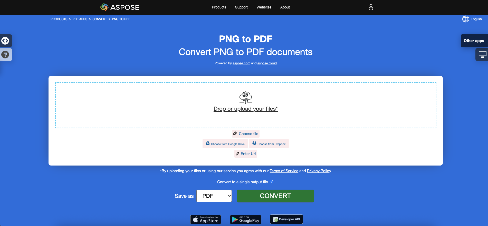

## Resumen

Este artículo explica cómo convertir varios formatos de imágenes a PDF usando C#. Cubre estos temas.

El siguiente fragmento de código también funciona con la biblioteca [Aspose.PDF.Drawing](/pdf/es/net/drawing/).

_Formato_: **BMP**
- [C# BMP a PDF](#csharp-bmp-to-pdf)
- [C# Convertir BMP a PDF](#csharp-bmp-to-pdf)
- [C# Cómo convertir una imagen BMP a PDF](#csharp-bmp-to-pdf)

_Formato_: **CGM**
- [C# CGM a PDF](#csharp-cgm-to-pdf)
- [C# Convertir CGM a PDF](#csharp-cgm-to-pdf)
- [C# Cómo convertir una imagen CGM a PDF](#csharp-cgm-to-pdf)

_Formato_: **DICOM**
- [C# DICOM a PDF](#csharp-dicom-to-pdf)
- [C# Convertir DICOM a PDF](#csharp-dicom-to-pdf)
- [C# Cómo convertir una imagen DICOM a PDF](#csharp-dicom-to-pdf)
- [C# Cómo convertir imagen DICOM a PDF](#csharp-dicom-to-pdf)

_Formato_: **EMF**
- [C# EMF a PDF](#csharp-emf-to-pdf)
- [C# Convertir EMF a PDF](#csharp-emf-to-pdf)
- [C# Cómo convertir imagen EMF a PDF](#csharp-emf-to-pdf)

_Formato_: **GIF**
- [C# GIF a PDF](#csharp-gif-to-pdf)
- [C# Convertir GIF a PDF](#csharp-gif-to-pdf)
- [C# Cómo convertir imagen GIF a PDF](#csharp-gif-to-pdf)

_Formato_: **JPG**
- [C# JPG a PDF](#csharp-jpg-to-pdf)
- [C# Convertir JPG a PDF](#csharp-jpg-to-pdf)
- [C# Cómo convertir imagen JPG a PDF](#csharp-jpg-to-pdf)

_Formato_: **PNG**
- [C# PNG a PDF](#csharp-png-to-pdf)
- [C# Convertir PNG a PDF](#csharp-png-to-pdf)
- [C# Cómo convertir imagen PNG a PDF](#csharp-png-to-pdf)

_Formato_: **SVG**
- [C# SVG a PDF](#csharp-svg-to-pdf)
- [C# Convertir SVG a PDF](#csharp-svg-to-pdf)
- [C# Cómo convertir imagen SVG a PDF](#csharp-svg-to-pdf)

_Formato_: **TIFF**
- [C# TIFF a PDF](#csharp-tiff-to-pdf)
- [C# Convertir TIFF a PDF](#csharp-tiff-to-pdf)
- [C# Cómo convertir imagen TIFF a PDF](#csharp-tiff-to-pdf)
- [C# Cómo convertir una imagen TIFF a PDF](#csharp-tiff-to-pdf)

Otros temas cubiertos por este artículo
- [Ver también](#see-also)


## Conversiones de imágenes a PDF en C#

**Aspose.PDF para .NET** permite convertir diferentes formatos de imágenes a archivos PDF. Nuestra biblioteca demuestra fragmentos de código para convertir los formatos de imagen más populares, como - BMP, CGM, DICOM, EMF, JPG, PNG, SVG y formatos TIFF.

## Convertir BMP a PDF

Convierte archivos BMP a documento PDF utilizando la biblioteca **Aspose.PDF para .NET**.

<abbr title="Archivo de imagen de mapa de bits">BMP</abbr> son archivos que tienen la extensión .BMP y representan archivos de imagen de mapa de bits que se utilizan para almacenar imágenes digitales de mapa de bits. Estas imágenes son independientes del adaptador gráfico y también se conocen como formato de archivo de mapa de bits independiente del dispositivo (DIB).
Puedes convertir imágenes BMP a archivos PDF con la API de Aspose.PDF para .NET. Por lo tanto, puedes seguir los siguientes pasos para convertir imágenes BMP:

<a name="csharp-bmp-to-pdf" id="csharp-bmp-to-pdf"><strong>Pasos: Convertir BMP a PDF en C#</strong></a>

1.
1.
2. Cargar la imagen **BMP** de entrada.
3. Finalmente, guardar el archivo PDF de salida.

Entonces, el siguiente fragmento de código sigue estos pasos y muestra cómo convertir BMP a PDF usando C#:

```csharp
//Inicializar documento PDF vacío
using (Document pdfDocument = new Document())
{
    pdfDocument.Pages.Add();
    Aspose.Pdf.Image image = new Aspose.Pdf.Image();

    // Cargar archivo de imagen BMP de muestra
    image.File = dataDir + "Sample.bmp";
    pdfDocument.Pages[1].Paragraphs.Add(image);

    // Guardar documento PDF de salida
    pdfDocument.Save(dataDir + "BMPtoPDF.pdf");
}
```

{}
**Intenta convertir BMP a PDF en línea**

Aspose te presenta la aplicación gratuita en línea ["BMP to PDF"](https://products.aspose.app/pdf/conversion/bmp-to-pdf/), donde puedes probar a investigar la funcionalidad y calidad con la que trabaja.

[](https://products.aspose.app/pdf/conversion/bmp-to-pdf/)
{}

## Convertir CGM a PDF

<abbr title="Computer Graphics Metafile">CGM</abbr> es una extensión de archivo para un formato de metarchivo de gráficos computarizados comúnmente utilizado en aplicaciones de CAD (diseño asistido por computadora) y gráficos de presentación.
<abbr title="Computer Graphics Metafile">CGM</abbr> es una extensión de archivo para un formato de Metarchivo de Gráficos por Computadora comúnmente utilizado en aplicaciones de CAD (diseño asistido por computadora) y gráficos de presentación.

Revisa el siguiente fragmento de código para convertir archivos CGM a formato PDF.

<a name="csharp-cgm-to-pdf" id="csharp-cgm-to-pdf"><strong>Pasos: Convertir CGM a PDF en C#</strong></a>

1. Crear una instancia de la clase [CgmLoadOptions](https://reference.aspose.com/pdf/net/aspose.pdf/cgmloadoptions).
2. Crear una instancia de la clase [Document](https://reference.aspose.com/pdf/net/aspose.pdf/document) con el nombre del archivo fuente y las opciones mencionadas.
3. Guardar el documento con el nombre de archivo deseado.

```csharp
public static void ConvertCGMtoPDF()
{
    CgmLoadOptions option = new CgmLoadOptions();
    Document pdfDocument= new Document(_dataDir+"corvette.cgm", option);
    pdfDocument.Save(_dataDir+"CGMtoPDF.pdf");
}
```

## Convertir DICOM a PDF

<abbr title="Digital Imaging and Communications in Medicine">DICOM</abbr> es el estándar de la industria médica para la creación, almacenamiento, transmisión y visualización de imágenes médicas digitales y documentos de pacientes examinados.
El formato <abbr title="Digital Imaging and Communications in Medicine">DICOM</abbr> es el estándar de la industria médica para la creación, almacenamiento, transmisión y visualización de imágenes médicas digitales y documentos de pacientes examinados.

**Aspsoe.PDF para .NET** permite convertir imágenes DICOM y SVG, pero por razones técnicas para agregar imágenes es necesario especificar el tipo de archivo que se añadirá al PDF:

<a name="csharp-dicom-to-pdf" id="csharp-dicom-to-pdf"><strong>Pasos: Convertir DICOM a PDF en C#</strong></a>

1. Crear un objeto de la clase Image.
2. Añadir la imagen a la colección Paragraphs de una página.
3. Especificar la propiedad [FileType](https://reference.aspose.com/pdf/net/aspose.pdf/image/properties/filetype).
4. Especificar la ruta o fuente del archivo.
    - Si una imagen se encuentra en una ubicación en el disco duro, especificar la ubicación de la ruta usando la propiedad Image.File.
    - Si una imagen está colocada en un MemoryStream, pasar el objeto que contiene la imagen a la propiedad Image.ImageStream.

El siguiente fragmento de código muestra cómo convertir archivos DICOM a formato PDF con Aspose.PDF.
El siguiente fragmento de código muestra cómo convertir archivos DICOM a formato PDF con Aspose.PDF.

```csharp
private const string _dataDir = "..\\..\\..\\..\\Samples";
// Convertir imágenes DICOM a PDF usando la clase Image
public static void ConvertDICOMtoPDF()
{
    // Instanciar el objeto Document
    Document pdfDocument = new Document();

    // Agregar una página a la colección de páginas del documento
    Page page = pdfDocument.Pages.Add();

    Image image = new Image
    {
        FileType = ImageFileType.Dicom,
        File = System.IO.Path.Combine(_dataDir,"bmode.dcm")
    };
    pdfDocument.Pages[1].Paragraphs.Add(image);
    // Guardar salida en formato PDF
    pdfDocument.Save(System.IO.Path.Combine(_dataDir,"PDFWithDicomImage_out.pdf"));
}
```

{}
**Prueba la conversión de DICOM a PDF en línea**
{}
Aspose te presenta la aplicación gratuita en línea ["DICOM to PDF"](https://products.aspose.app/pdf/conversion/dicom-to-pdf/), donde puedes explorar la funcionalidad y calidad con la que trabaja.

[](https://products.aspose.app/pdf/conversion/dicom-to-pdf/)
## Convertir EMF a PDF

<abbr title="Formato de metarchivo mejorado">EMF</abbr>EMF almacena imágenes gráficas de manera independiente al dispositivo. Los metarchivos de EMF están compuestos de registros de longitud variable en orden cronológico que pueden renderizar la imagen almacenada después de ser analizados en cualquier dispositivo de salida. Además, puedes convertir una imagen EMF a PDF utilizando los siguientes pasos:

<a name="csharp-emf-to-pdf" id="csharp-emf-to-pdf"><strong>Pasos: Convertir EMF a PDF en C#</strong></a>

1. En primer lugar, inicializa el objeto de clase [Document](https://reference.aspose.com/pdf/net/aspose.pdf/document).
2. Carga el archivo de imagen **EMF**.
3. Añade la imagen EMF cargada a una Página.
4. Guarda el documento PDF.

Además, el siguiente fragmento de código muestra cómo convertir un EMF a PDF con C# en tu fragmento de código .NET:

```csharp
// Inicializa un nuevo documento PDF
var doc = new Document();

// Especifica la ruta del archivo de imagen EMF de entrada
var imageFile = dataDir + "drawing.emf";
var page = doc.Pages.Add();
string file = imageFile;
FileStream filestream = new FileStream(file, FileMode.Open, FileAccess.Read);
BinaryReader reader = new BinaryReader(filestream);
long numBytes = new FileInfo(file).Length;
byte[] bytearray = reader.ReadBytes((int)numBytes);
Stream stream = new MemoryStream(bytearray);
var b = new Bitmap(stream);

// Especifica las propiedades de dimensión de la página
page.PageInfo.Margin.Bottom = 0;
page.PageInfo.Margin.Top = 0;
page.PageInfo.Margin.Left = 0;
page.PageInfo.Margin.Right = 0;
page.PageInfo.Width = b.Width;
page.PageInfo.Height = b.Height;
var image = new Aspose.Pdf.Image();
image.File = imageFile;
page.Paragraphs.Add(image);

// Guarda el documento PDF de salida
doc.Save(dataDir + "EMFtoPDF.pdf");
```
{}
**Intenta convertir EMF a PDF en línea**

Aspose te presenta la aplicación gratuita en línea ["EMF a PDF"](https://products.aspose.app/pdf/conversion/emf-to-pdf/), donde puedes explorar la funcionalidad y calidad con la que funciona.

[](https://products.aspose.app/pdf/conversion/emf-to-pdf/)
{}

## Convertir GIF a PDF

Convierte archivos GIF a documentos PDF utilizando la biblioteca **Aspose.PDF for .NET**.

<abbr title="Formato de Intercambio de Gráficos">GIF</abbr> es capaz de almacenar datos comprimidos sin pérdida de calidad en un formato de no más de 256 colores. El formato GIF independiente de hardware fue desarrollado en 1987 (GIF87a) por CompuServe para transmitir imágenes de mapa de bits a través de redes.
Puedes convertir archivos GIF a PDF con la API de Aspose.PDF for .NET. Por lo tanto, puedes seguir los siguientes pasos para convertir imágenes GIF:

<a name="csharp-gif-to-pdf" id="csharp-gif-to-pdf"><strong>Pasos: Convertir GIF a PDF en C#</strong></a>

1.
1.
2. Cargar la imagen **GIF** de entrada.
3. Finalmente, guardar el archivo PDF de salida.

Así que el siguiente fragmento de código sigue estos pasos y muestra cómo convertir BMP a PDF usando C#:

```csharp
//Inicializar documento PDF vacío
using (Document pdfDocument = new Document())
{
    pdfDocument.Pages.Add();
    Aspose.Pdf.Image image = new Aspose.Pdf.Image();

    // Cargar archivo de imagen GIF de muestra
    image.File = dataDir + "Sample.gif";
    pdfDocument.Pages[1].Paragraphs.Add(image);

    // Guardar documento PDF de salida
    pdfDocument.Save(dataDir + "GIFtoPDF.pdf");
}
```

{}
**Intenta convertir GIF a PDF en línea**

Aspose te presenta la aplicación gratuita en línea ["GIF to PDF"](https://products.aspose.app/pdf/conversion/gif-to-pdf/), donde puedes probar a investigar la funcionalidad y calidad con la que funciona.

[](https://products.aspose.app/pdf/conversion/gif-to-pdf/)
{}

## Convertir JPG a PDF

No es necesario preguntarse cómo convertir JPG a PDF, porque la biblioteca **Apose.PDF for .NET** tiene la mejor decisión.
No es necesario que te preguntes cómo convertir JPG a PDF, porque la biblioteca **Apose.PDF para .NET** tiene la mejor solución.

Puedes convertir imágenes JPG a PDF con Aspose.PDF para .NET siguiendo estos pasos:

<a name="csharp-jpg-to-pdf" id="csharp-jpg-to-pdf"><strong>Pasos: Convertir JPG a PDF en C#</strong></a>

1. Inicializa un objeto de la clase [Document](https://reference.aspose.com/page/net/aspose.page/document).
2. Añade una nueva página al documento PDF.
3. Carga la imagen **JPG** y añádela al párrafo.
4. Guarda el PDF resultante.

El fragmento de código a continuación muestra cómo convertir una imagen JPG a PDF usando C#:

```csharp
// Carga el archivo JPG de entrada
String path = dataDir + "Aspose.jpg";

// Inicializa un nuevo documento PDF
Document doc = new Document();

// Añade una página vacía en el documento vacío
Page page = doc.Pages.Add();
Aspose.Pdf.Image image = new Aspose.Pdf.Image();
image.File = (path);

// Añade la imagen en una página
page.Paragraphs.Add(image);

// Guarda el archivo PDF de salida
doc.Save(dataDir + "ImagetoPDF.pdf");
```

Luego puedes ver cómo convertir una imagen a PDF con la **misma altura y ancho de la página**.
Luego puedes ver cómo convertir una imagen a PDF con la **misma altura y anchura de la página**.

1. Cargar el archivo de imagen de entrada
1. Obtener la altura y anchura de la imagen
1. Establecer la altura, anchura y márgenes de una página
1. Guardar el archivo PDF de salida

El siguiente fragmento de código muestra cómo convertir una imagen a PDF con la misma altura y anchura de página usando C#:

```csharp
// Cargar archivo de imagen JPG de entrada
String path = dataDir + "Aspose.jpg";
System.Drawing.Image srcImage = System.Drawing.Image.FromFile(path);

// Leer altura de la imagen de entrada
int h = srcImage.Height;

// Leer anchura de la imagen de entrada
int w = srcImage.Width;

// Inicializar un nuevo documento PDF
Document doc = new Document();

// Añadir una página vacía
Page page = doc.Pages.Add();
Aspose.Pdf.Image image = new Aspose.Pdf.Image();
image.File = (path);

// Establecer dimensiones y márgenes de la página
page.PageInfo.Height = (h);
page.PageInfo.Width = (w);
page.PageInfo.Margin.Bottom = (0);
page.PageInfo.Margin.Top = (0);
page.PageInfo.Margin.Right = (0);
page.PageInfo.Margin.Left = (0);
page.Paragraphs.Add(image);

// Guardar archivo PDF de salida
doc.Save(dataDir + "ImagetoPDF_HeightWidth.pdf");
```
{}
**Intenta convertir JPG a PDF en línea**

Aspose te presenta la aplicación gratuita en línea ["JPG a PDF"](https://products.aspose.app/pdf/conversion/jpg-to-pdf/), donde puedes explorar la funcionalidad y la calidad con la que funciona.

[](https://products.aspose.app/pdf/conversion/jpg-to-pdf/)
{}

## Convertir PNG a PDF

**Aspose.PDF para .NET** soporta la función de convertir imágenes PNG a formato PDF. Consulta el siguiente fragmento de código para realizar tu tarea.

<abbr title="Portable Network Graphics">PNG</abbr> se refiere a un tipo de formato de archivo de imagen ráster que utiliza compresión sin pérdida, lo que lo hace popular entre sus usuarios.

Puedes convertir una imagen PNG a PDF utilizando los siguientes pasos:

<a name="csharp-png-to-pdf" id="csharp-png-to-pdf"><strong>Pasos: Convertir PNG a PDF en C#</strong></a>

1. Carga la imagen **PNG** de entrada.
2. Lee los valores de altura y anchura.
3.
Establecer las dimensiones de la página.
Guardar el archivo de salida.

Además, el fragmento de código a continuación muestra cómo convertir PNG a PDF con C# en tus aplicaciones .NET:

```csharp
// Cargar archivo PNG de entrada
String path = dataDir + "Aspose.png";
System.Drawing.Image srcImage = System.Drawing.Image.FromFile(path);
int h = srcImage.Height;
int w = srcImage.Width;

// Inicializar nuevo Documento
Document doc = new Document();
Page page = doc.Pages.Add();
Aspose.Pdf.Image image = new Aspose.Pdf.Image();
image.File = (path);

// Establecer las dimensiones de la página
page.PageInfo.Height = (h);
page.PageInfo.Width = (w);
page.PageInfo.Margin.Bottom = (0);
page.PageInfo.Margin.Top = (0);
page.PageInfo.Margin.Right = (0);
page.PageInfo.Margin.Left = (0);
page.Paragraphs.Add(image);

// Guardar el PDF de salida
doc.Save(dataDir + "ImagetoPDF.pdf");
```

{}
**Intenta convertir PNG a PDF en línea**

Aspose te presenta la aplicación gratuita en línea ["PNG to PDF"](https://products.aspose.app/pdf/conversion/png-to-pdf/), donde puedes investigar la funcionalidad y calidad con la que funciona.

Aspose te presenta la aplicación gratuita en línea ["PNG to PDF"](https://products.aspose.app/pdf/conversion/png-to-pdf/), donde puedes investigar la funcionalidad y la calidad con la que funciona.

[](https://products.aspose.app/pdf/conversion/png-to-pdf/)
{}

## Convertir SVG a PDF

**Aspose.PDF para .NET** explica cómo convertir imágenes SVG a formato PDF y cómo obtener las dimensiones del archivo <abbr title="Gráficos Vectoriales Escalables">SVG</abbr> fuente.

Los Gráficos Vectoriales Escalables (SVG) son una familia de especificaciones de un formato de archivo basado en XML para gráficos vectoriales bidimensionales, tanto estáticos como dinámicos (interactivos o animados). La especificación SVG es un estándar abierto que ha estado en desarrollo por el Consorcio World Wide Web (W3C) desde 1999.

Las imágenes SVG y sus comportamientos se definen en archivos de texto XML.
Las imágenes SVG y sus comportamientos están definidos en archivos de texto XML.

{}
**Intenta convertir el formato SVG a PDF en línea**

Aspose.PDF para .NET te presenta una aplicación gratuita en línea ["SVG a PDF"](https://products.aspose.app/pdf/conversion/svg-to-pdf), donde puedes investigar la funcionalidad y calidad con la que funciona.

[](https://products.aspose.app/pdf/conversion/svg-to-pdf)
{}

Para convertir archivos SVG a PDF, utiliza la clase llamada [SvgLoadOptions](https://reference.aspose.com/net/pdf/aspose.pdf/svgloadoptions) que se utiliza para inicializar el objeto [`LoadOptions`](https://reference.aspose.com/pdf/net/aspose.pdf/loadoptions). Posteriormente, este objeto se pasa como argumento durante la inicialización del objeto Documento y ayuda al motor de renderizado de PDF a determinar el formato de entrada del documento fuente.

<a name="csharp-svg-to-pdf" id="csharp-svg-to-pdf"><strong>Pasos: Convertir SVG a PDF en C#</strong></a>

1.
1.
2. Crea una instancia de la clase [`Document`](https://reference.aspose.com/pdf/net/aspose.pdf/document) con el nombre de archivo fuente y opciones mencionadas.
3. Guarda el documento con el nombre de archivo deseado.

El siguiente fragmento de código muestra el proceso de conversión de un archivo SVG a formato PDF con Aspose.PDF para .NET.

```csharp
public static void ConvertSVGtoPDF()
{
    SvgLoadOptions option = new SvgLoadOptions();
    Document pdfDocument= new Document(_dataDir + "car.svg", option);
    pdfDocument.Save(_dataDir + "svgtest.pdf");
}
```

## Obtener dimensiones de SVG

También es posible obtener las dimensiones del archivo SVG fuente. Esta información puede ser útil si queremos que el SVG cubra toda la página del PDF de salida. La propiedad AdjustPageSize de la clase ScgLoadOption cumple con este requisito. El valor predeterminado de esta propiedad es falso. Si el valor se establece en verdadero, el PDF de salida tendrá el mismo tamaño (dimensiones) que el SVG fuente.

El siguiente fragmento de código muestra el proceso de obtener las dimensiones del archivo SVG fuente y generar un archivo PDF.
El siguiente fragmento de código muestra el proceso de obtener las dimensiones del archivo SVG fuente y generar un archivo PDF.

```csharp
public static void ConvertSVGtoPDF_Advanced()
{
    // Para ejemplos completos y archivos de datos, por favor visite https://github.com/aspose-pdf/Aspose.PDF-for-.NET
    // La ruta al directorio de documentos.
    string dataDir = RunExamples.GetDataDir_AsposePdf_DocumentConversion();
    var loadopt = new SvgLoadOptions();
    loadopt.AdjustPageSize = true;
    var svgDoc = new Document(dataDir + "GetSVGDimensions.svg", loadopt);
    svgDoc.Pages[1].PageInfo.Margin.Top = 0;
    svgDoc.Pages[1].PageInfo.Margin.Left = 0;
    svgDoc.Pages[1].PageInfo.Margin.Bottom = 0;
    svgDoc.Pages[1].PageInfo.Margin.Right = 0;
    svgDoc.Save(dataDir + "GetSVGDimensions_out.pdf");
}
```

### Funciones soportadas de SVG

<table>
    <thead>
        <tr>
            <th>
                <p>Etiqueta SVG</p>
            </th>
            <th>
                <p>Uso de muestra</p>
            </th>
        </tr>
    </thead>
    <tbody>

<tbody>
    <tr>
        <td>
            <p>círculo</p>
        </td>
        <td>
            <code><pre>&lt circle id="r2" cx="10" cy="10" r="10" stroke="blue" stroke-width="2"&gt </pre></code>
        </td>
    </tr>
    <tr>
        <td>
            <p>defs</p>
        </td>
        <td>
            <code>&lt;defs&gt;&nbsp; <br> &lt;rect id="r1" width="15" height="15"
                stroke="blue" stroke-width="2" /&gt;&nbsp; <br> &lt;circle id="r2"
                cx="10" cy="10" r="10" stroke="blue" stroke-width="2"/&gt;&nbsp; <br>
                &lt;circle id="r3" cx="10" cy="10" r="10" stroke="blue" stroke-width="3"/&gt;&nbsp; <br> &lt;/defs&gt;&nbsp; <br> &lt;use
                x="25" y="40" xlink:href="#r1" fill="red"/&gt;&nbsp; <br> &lt;use
                x="35" y="15" xlink:href="#r2" fill="green"/&gt;&nbsp; <br> &lt;use
                x="58" y="50" xlink:href="#r3" fill="blue"/&gt;</code>
        </td>
    </tr>
</tbody>
```

<tr>
    <td>
        <p>tref</p>
    </td>
    <td>
        <p>&lt;defs&gt;&nbsp; <br> &nbsp;&nbsp;&nbsp; &lt;text
            id="ReferencedText"&gt;&nbsp; <br> &nbsp;&nbsp;&nbsp;&nbsp;&nbsp;
            Datos de caracteres referenciados&nbsp; <br> &nbsp;&nbsp;&nbsp;
            &lt;/text&gt;&nbsp; <br> &lt;/defs&gt;&nbsp; <br
                class="atl-forced-newline"> &lt;text x="10" y="100" font-size="15" fill="red" &gt;&nbsp; <br
                class="atl-forced-newline"> &nbsp;&nbsp;&nbsp; &lt;tref
            xlink:href="#ReferencedText"/&gt;&nbsp; <br> &lt;/text&gt;</p>
    </td>
</tr>
<tr>
    <td>
        <p>use</p>
    </td>
    <td>
        <p>&lt;defs&gt;&nbsp; <br> &nbsp;&nbsp;&nbsp; &lt;text id="Text" x="400"
            y="200"&nbsp; <br>
            &nbsp;&nbsp;&nbsp;&nbsp;&nbsp;&nbsp;&nbsp;&nbsp;&nbsp; font-family="Verdana" font-size="100"
```


    &nbsp;&nbsp;&nbsp;&nbsp;&nbsp;&nbsp;&nbsp;&nbsp;&nbsp; font-family="Verdana" tamaño-de-fuente="100"
    ancla-de-texto="middle" &gt;&nbsp; <br> &nbsp;&nbsp;&nbsp;&nbsp;&nbsp;
    Texto enmascarado&nbsp; <br> &nbsp;&nbsp;&nbsp; &lt;/text&gt;&nbsp; <br
        class="atl-forced-newline"> &lt;use xlink:href="#Text" fill="blue"&nbsp; /&gt;</p>
</td>
</tr>
<tr>
    <td>
        <p>elipse&nbsp;</p>
    </td>
    <td>
        <p>&lt;ellipse cx="2.5" cy="1.5" rx="2" ry="1" fill="red" /&gt;</p>
    </td>
</tr>
<tr>
    <td>
        <p>g&nbsp;</p>
    </td>
    <td>
        <p>&lt;g fill="none" stroke="gris oscuro" ancho-de-trazo="1.5" &gt;&nbsp; <br>
            &nbsp;&nbsp; &nbsp;&nbsp;&nbsp; &nbsp;&nbsp;&nbsp; &nbsp;&nbsp;&nbsp; &nbsp;&lt;line x1="-7"
            y1="-7" x2="-3" y2="-3"/&gt;&nbsp; <br> &nbsp;&nbsp;
            &nbsp;&nbsp;&nbsp; &nbsp;&nbsp;&nbsp; &nbsp;&nbsp;&nbsp; &nbsp;&lt;line x1="7" y1="7" x2="3"
```

<tr>
    <td>
        <p>&nbsp;&nbsp;&nbsp;&nbsp;&nbsp;&nbsp;&nbsp;&nbsp;&lt;line x1="7" y1="7" x2="3"
        y2="3"/&gt;&nbsp;<br>&nbsp;&nbsp;&nbsp;&nbsp;&nbsp;
        &nbsp;&nbsp;&nbsp;&nbsp;&nbsp;&nbsp;&nbsp;&lt;line x1="-7" y1="7" x2="-3" y2="3"/&gt;&nbsp;
        <br>&nbsp;&nbsp;&nbsp;&nbsp;&nbsp;&nbsp;&nbsp;
        &nbsp;&nbsp;&nbsp;&nbsp;&nbsp;&nbsp;&lt;line x1="7" y1="-7" x2="3" y2="-3"/&gt;&nbsp;<br
            class="atl-forced-newline">&lt;/g&gt;&nbsp;</p>
    </td>
</tr>
<tr>
    <td>
        <p>imagen</p>
    </td>
    <td>
        <p>&lt;image id="ShadedRelief" x="24" y="4" width="64" height="82" xlink:href="relief.jpg"
            /&gt;&nbsp;</p>
    </td>
</tr>
<tr>
    <td>
        <p>línea</p>
    </td>
    <td>
        <p>&lt;line style="stroke:#eea;stroke-width:8" x1="10" y1="30" x2="260" y2="100"/&gt;&nbsp;</p>
    </td>
</tr>
```

<tr>
    <td>
        <p>linea</p>
    </td>
    <td>
        <p>&lt;line style="stroke:#eea;stroke-width:8" x1="10" y1="30" x2="260" y2="100"/&gt;&nbsp;</p>
    </td>
</tr>
<tr>
    <td>
        <p>camino</p>
    </td>
    <td>
        <p>&lt;path style="fill:#daa;fill-rule:evenodd;stroke:red" d="M 230,150 C 290,30 10,255 110,140 z
            "/&gt;&nbsp;</p>
    </td>
</tr>
<tr>
    <td>
        <p>estilo</p>
    </td>
    <td>
        <p>&lt;path style="fill:#daa;fill-rule:evenodd;stroke:red" d="M 230,150 C 290,30 10,255 110,140 z
            "/&gt;</p>
    </td>
</tr>
<tr>
    <td>
        <p>polígono</p>
    </td>
    <td>
        <p>&lt;polygon style="stroke:#24a;stroke-width:1.5;fill:#eefefe" points="10,10 180,10 10,250 10,10"
            /&gt;</p>
    </td>
</tr>
<tr>
    <td>
        <p>polilínea</p>
```

<tr>
    <td>
        <p>polilínea</p>
    </td>
    <td>
        <p>&lt;polyline fill="none" stroke="dimgray" stroke-width="1" points="-3,-6 3,-6 3,1 5,1 0,7 -5,1
            -3,1 -3,-5"/&gt;</p>
    </td>
</tr>
<tr>
    <td>
        <p>rectángulo&nbsp;</p>
    </td>
    <td>
        <p>&lt;rect x="0" y="0" width="400" height="600" stroke="none" fill="aliceblue" /&gt;</p>
    </td>
</tr>
<tr>
    <td>
        <p>svg</p>
    </td>
    <td>
        <p>&lt;svg xmlns="http://www.w3.org/2000/svg" version="1.1" width="10cm" height="5cm" &gt;</p>
    </td>
</tr>
<tr>
    <td>
        <p>texto</p>
    </td>
    <td>
        <p>&lt;text font-family="sans-serif" fill="dimgray" font-size="22px" font-weight="bold" x="58"
            y="30" pointer-events="none"&gt;Título del Mapa&lt;/text&gt;</p>
    </td>
</tr>
```
## Convertir TIFF a PDF

**Aspose.PDF** admite el formato de archivo, ya sea una imagen <abbr title="Tag Image File Format">TIFF</abbr> de un solo cuadro o de múltiples cuadros. Esto significa que puedes convertir la imagen TIFF a PDF en tus aplicaciones .NET.

TIFF o TIF, Formato de Archivo de Imagen Etiquetada, representa imágenes ráster que están destinadas para uso en una variedad de dispositivos que cumplen con este estándar de formato de archivo.
TIFF o TIF, Formato de Archivo de Imagen Etiquetada, representa imágenes raster que están destinadas para uso en una variedad de dispositivos que cumplen con este estándar de formato de archivo.

Puedes convertir TIFF a PDF de la misma manera que los demás formatos de archivo gráfico raster:

<a name="csharp-tiff-to-pdf" id="csharp-tiff-to-pdf"><strong>Pasos: Convertir TIFF a PDF en C#</strong></a>

1. Crear un nuevo objeto de clase [Document](https://reference.aspose.com/pdf/net/aspose.pdf/document) y añadir Página.
2. Cargar la imagen **TIFF** de entrada.
3. Guardar el documento PDF.

```csharp
Inicializar documento PDF vacío
using (Document pdfDocument = new Document())
{
    pdfDocument.Pages.Add();
    Aspose.Pdf.Image image = new Aspose.Pdf.Image();

    // Cargar archivo de imagen Tiff de muestra
    image.File = dataDir + "sample.tiff";
    pdfDocument.Pages[1].Paragraphs.Add(image);

    // Guardar documento PDF de salida
    pdfDocument.Save(dataDir + "TIFFtoPDF.pdf");
}
```

En caso de que necesites convertir una imagen TIFF de múltiples páginas a un documento PDF de múltiples páginas y controlar algunos parámetros, por ejemplo.
En caso de que necesite convertir una imagen TIFF de varias páginas en un documento PDF de varias páginas y controlar algunos parámetros, por ejemplo:

1. Instanciar una instancia de la clase Document
1. Cargar la imagen TIFF de entrada
1. Obtener FrameDimension de los cuadros
1. Agregar una nueva página para cada cuadro
1. Finalmente, guardar las imágenes en las páginas PDF

El siguiente fragmento de código muestra cómo convertir una imagen TIFF de varias páginas o varios cuadros a PDF con C#:

```csharp
public static void TiffToPDF2()
{
    // Inicializar nuevo Documento
    Document pdf = new Document();

    //Cargar imagen TIFF en el flujo
    Bitmap bitmap = new Bitmap(File.OpenRead(_dataDir+"multipage.tif"));
    // Convertir TIFF de varias páginas o varios cuadros a PDF
    FrameDimension dimension = new FrameDimension(bitmap.FrameDimensionsList[0]);
    int frameCount = bitmap.GetFrameCount(dimension);

    // Iterar a través de cada cuadro
    for (int frameIdx = 0; frameIdx <= frameCount - 1; frameIdx++)
    {
        Page page = pdf.Pages.Add();

        bitmap.SelectActiveFrame(dimension, frameIdx);

        MemoryStream currentImage = new MemoryStream();
        bitmap.Save(currentImage, ImageFormat.Tiff);

        Aspose.Pdf.Image imageht = new Aspose.Pdf.Image
        {
            ImageStream = currentImage,
            //Aplicar otras opciones
            //ImageScale = 0.5
        };
        page.Paragraphs.Add(imageht);
    }

    // Guardar archivo PDF de salida
    pdf.Save(_dataDir + "TifftoPDF.pdf");
}
```
## Aplica a

|**Plataforma**|**Soportado**|**Comentarios**|
| :- | :- |:- |
|Windows .NET Framework|2.0-4.6| |
|Windows .NET Core |2.0-3.1| |
|.NET 5 Windows| |
|Linux .NET Core|2.0-3.1 | |
|.NET 5 Linux | |

## Ver También

Este artículo también cubre estos temas. Los códigos son los mismos que los de arriba.

_Formato_: **BMP**
- [Código C# BMP a PDF](#csharp-bmp-to-pdf)
- [API C# BMP a PDF](#csharp-bmp-to-pdf)
- [C# BMP a PDF Programáticamente](#csharp-bmp-to-pdf)
- [Biblioteca C# BMP a PDF](#csharp-bmp-to-pdf)
- [C# Guardar BMP como PDF](#csharp-bmp-to-pdf)
- [C# Generar PDF desde BMP](#csharp-bmp-to-pdf)
- [C# Crear PDF desde BMP](#csharp-bmp-to-pdf)
- [Convertidor C# BMP a PDF](#csharp-bmp-to-pdf)

_Formato_: **CGM**
- [Código C# CGM a PDF](#csharp-cgm-to-pdf)
- [API C# CGM a PDF](#csharp-cgm-to-pdf)
- [C# CGM a PDF Programáticamente](#csharp-cgm-to-pdf)
- [Biblioteca C# CGM a PDF](#csharp-cgm-to-pdf)
- [C# Guardar CGM como PDF](#csharp-cgm-to-pdf)
- [C# Generar PDF desde CGM](#csharp-cgm-to-pdf)
- [C# Crear PDF desde CGM](#csharp-cgm-to-pdf)
- [Convertidor C# CGM a PDF](#csharp-cgm-to-pdf)
- [Conversor de CGM a PDF en C#](#csharp-cgm-to-pdf)

_Formato_: **DICOM**
- [Código C# para convertir DICOM a PDF](#csharp-dicom-to-pdf)
- [API C# para convertir DICOM a PDF](#csharp-dicom-to-pdf)
- [Convertir DICOM a PDF programáticamente en C#](#csharp-dicom-to-pdf)
- [Biblioteca C# para convertir DICOM a PDF](#csharp-dicom-to-pdf)
- [Guardar DICOM como PDF en C#](#csharp-dicom-to-pdf)
- [Generar PDF desde DICOM en C#](#csharp-dicom-to-pdf)
- [Crear PDF desde DICOM en C#](#csharp-dicom-to-pdf)
- [Conversor de DICOM a PDF en C#](#csharp-dicom-to-pdf)

_Formato_: **EMF**
- [Código C# para convertir EMF a PDF](#csharp-emf-to-pdf)
- [API C# para convertir EMF a PDF](#csharp-emf-to-pdf)
- [Convertir EMF a PDF programáticamente en C#](#csharp-emf-to-pdf)
- [Biblioteca C# para convertir EMF a PDF](#csharp-emf-to-pdf)
- [Guardar EMF como PDF en C#](#csharp-emf-to-pdf)
- [Generar PDF desde EMF en C#](#csharp-emf-to-pdf)
- [Crear PDF desde EMF en C#](#csharp-emf-to-pdf)
- [Conversor de EMF a PDF en C#](#csharp-emf-to-pdf)
