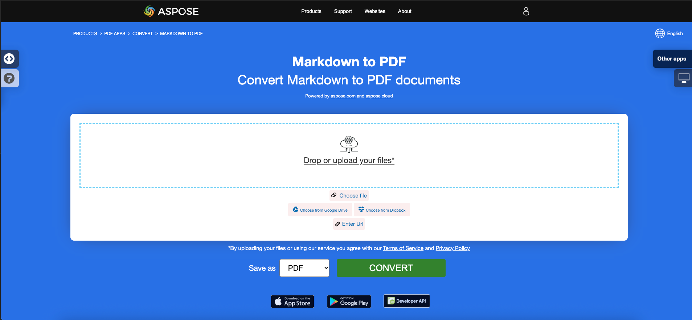
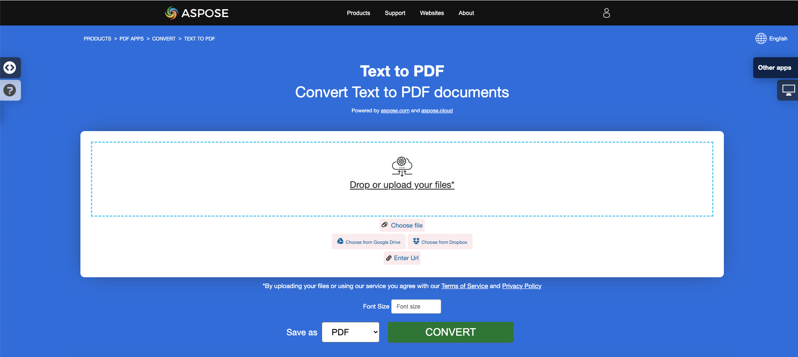
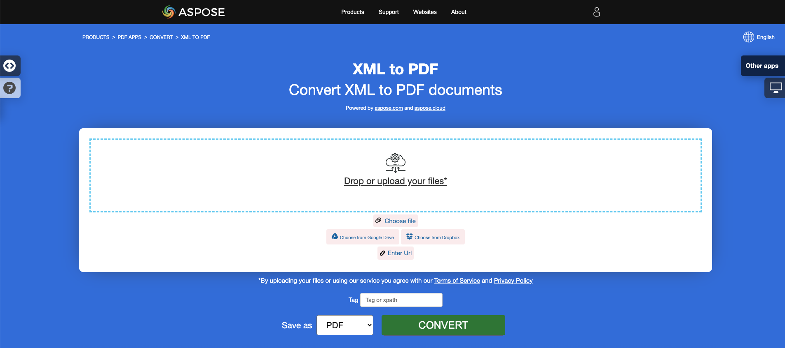

## Descripción general

Este artículo explica cómo **convertir varios otros tipos de formatos de archivo a PDF usando C#**. Cubre los siguientes temas.

El siguiente fragmento de código también funciona con la biblioteca [Aspose.PDF.Drawing](/pdf/net/drawing/).

_Formato_: **EPUB**
- [C# EPUB a PDF](#csharp-convert-epub-to-pdf)
- [C# Convertir EPUB a PDF](#csharp-convert-epub-to-pdf)
- [C# Cómo convertir un archivo EPUB a PDF](#csharp-convert-epub-to-pdf)

_Formato_: **Markdown**
- [C# Markdown a PDF](#csharp-convert-markdown-to-pdf)
- [C# Convertir Markdown a PDF](#csharp-convert-markdown-to-pdf)
- [C# Cómo convertir un archivo Markdown a PDF](#csharp-convert-markdown-to-pdf)
- [C# Cómo convertir archivo Markdown a PDF](#csharp-convert-markdown-to-pdf)

_Formato_: **MD**
- [C# MD a PDF](#csharp-convert-md-to-pdf)
- [C# Convertir MD a PDF](#csharp-convert-md-to-pdf)
- [C# Cómo convertir archivo MD a PDF](#csharp-convert-md-to-pdf)

_Formato_: **PCL**
- [C# PCL a PDF](#csharp-convert-pcl-to-pdf)
- [C# Convertir PCL a PDF](#csharp-convert-pcl-to-pdf)
- [C# Cómo convertir archivo PCL a PDF](#csharp-convert-pcl-to-pdf)

_Formato_: **Texto**
- [C# Texto a PDF](#csharp-convert-text-to-pdf)
- [C# Convertir Texto a PDF](#csharp-convert-text-to-pdf)
- [C# Cómo convertir archivo de Texto a PDF](#csharp-convert-text-to-pdf)

_Formato_: **TXT**
- [C# TXT a PDF](#csharp-convert-txt-to-pdf)
- [C# Convertir TXT a PDF](#csharp-convert-txt-to-pdf)
- [C# Cómo convertir archivo TXT a PDF](#csharp-convert-txt-to-pdf)

_Formato_: **Texto Plano**
- [C# Texto Plano a PDF](#csharp-convert-plain-text-to-pdf)
- [C# Convertir Texto Plano a PDF](#csharp-convert-plain-text-to-pdf)
- [C# Cómo convertir archivo de Texto Plano a PDF](#csharp-convert-plain-text-to-pdf)
- [C# Cómo convertir un archivo de texto plano a PDF](#csharp-convert-plain-text-to-pdf)

_Formato_: **Texto Preformateado**
- [C# Texto Preformateado a PDF](#csharp-convert-pre-formatted-txt-to-pdf)
- [C# Convertir Texto Preformateado a PDF](#csharp-convert-pre-formatted-txt-to-pdf)
- [C# Cómo convertir un archivo de Texto Preformateado a PDF](#csharp-convert-pre-formatted-txt-to-pdf)

_Formato_: **Texto Pre**
- [C# Texto Pre a PDF](#csharp-convert-pre-text-to-pdf)
- [C# Convertir Texto Pre a PDF](#csharp-convert-pre-text-to-pdf)
- [C# Cómo convertir un archivo de Texto Pre a PDF](#csharp-convert-pre-text-to-pdf)

_Formato_: **XPS**
- [C# XPS a PDF](#csharp-convert-xps-to-pdf)
- [C# Convertir XPS a PDF](#csharp-convert-xps-to-pdf)
- [C# Cómo convertir un archivo XPS a PDF](#csharp-convert-xps-to-pdf)

## Convertir EPUB a PDF

**Aspose.PDF for .NET** permite convertir archivos EPUB a formato PDF de manera sencilla.

<abbr title="publicación electrónica">EPUB</abbr> (abreviatura de publicación electrónica) es un estándar de libro electrónico gratuito y abierto del Foro Internacional de Publicación Digital (IDPF).
<abbr title="publicación electrónica">EPUB</abbr> (abreviatura de publicación electrónica) es un estándar de libro electrónico gratuito y abierto del Foro Internacional de Publicación Digital (IDPF).

EPUB también admite contenido de diseño fijo. El formato está destinado como un formato único que los editores y las casas de conversión pueden usar internamente, así como para distribución y venta. Supera el estándar Open eBook. La versión EPUB 3 también está respaldada por el Grupo de Estudio de la Industria del Libro (BISG), una asociación comercial líder para prácticas estándar, investigación, información y eventos, para el empaquetado de contenido.

{}
**Intenta convertir EPUB a PDF en línea**

Aspose.PDF para .NET te presenta una aplicación gratuita en línea ["EPUB a PDF"](https://products.aspose.app/pdf/conversion/epub-to-pdf), donde puedes probar a investigar la funcionalidad y calidad con la que funciona.

[](https://products.aspose.app/pdf/conversion/epub-to-pdf)
{}

<a name="csharp-convert-epub-to-pdf" id="csharp-convert-epub-to-pdf"><strong><em>Pasos:</em> Convertir EPUB a PDF en C#</strong></a>
<a name="csharp-convert-epub-to-pdf" id="csharp-convert-epub-to-pdf"><strong><em>Pasos:</em> Convertir EPUB a PDF en C#</strong></a>

1. Crea una instancia de la clase [EpubLoadOptions](https://reference.aspose.com/pdf/net/aspose.pdf/epubloadoptions).
2. Crea una instancia de la clase [Document](https://reference.aspose.com/pdf/net/aspose.pdf/document) con el nombre de archivo fuente y opciones mencionadas.
3. Guarda el documento con el nombre de archivo deseado.

El siguiente fragmento de código te muestra cómo convertir archivos EPUB a formato PDF con C#.

```csharp
public static void ConvertEPUBtoPDF()
{
    EpubLoadOptions option = new EpubLoadOptions();
    Document pdfDocument= new Document(_dataDir + "WebAssembly.epub", option);
    pdfDocument.Save(_dataDir + "epub_test.pdf");
}
```

También puedes establecer el tamaño de página para la conversión. Para definir un nuevo tamaño de página usa el objeto `SizeF` y pásalo al constructor de [EpubLoadOptions](https://reference.aspose.com/pdf/net/aspose.pdf/epubloadoptions/constructors/main).

```csharp
public static void ConvertEPUBtoPDFAdv()
{
    EpubLoadOptions option = new EpubLoadOptions(new SizeF(1190, 1684));
    Document pdfDocument= new Document(_dataDir + "WebAssembly.epub", option);
    pdfDocument.Save(_dataDir + "epub_test.pdf");
}
```
## Convertir Markdown a PDF

**Esta característica es compatible con la versión 19.6 o superior.**

{}
**Intenta convertir Markdown a PDF en línea**

Aspose.PDF para .NET te presenta una aplicación gratuita en línea ["Markdown a PDF"](https://products.aspose.app/pdf/conversion/md-to-pdf), donde puedes probar a investigar la funcionalidad y la calidad con la que funciona.

[](https://products.aspose.app/pdf/conversion/md-to-pdf)
{}

Aspose.PDF para .NET proporciona la funcionalidad para crear un documento PDF basado en un archivo de datos [Markdown](https://daringfireball.net/projects/markdown/syntax). Para convertir Markdown a PDF, necesitas inicializar el [Documento](https://reference.aspose.com/pdf/net/aspose.pdf/document) utilizando [MdLoadOptions](https://reference.aspose.com/pdf/net/aspose.pdf/mdloadoptions).

El siguiente fragmento de código muestra cómo usar esta funcionalidad con la biblioteca Aspose.PDF:

<a name="csharp-convert-markdown-to-pdf" id="csharp-convert-markdown-to-pdf"><strong><em>Pasos:</em> Convertir Markdown a PDF en C#</strong></a> |
<a name="csharp-convert-markdown-to-pdf" id="csharp-convert-markdown-to-pdf"><strong><em>Pasos:</em> Convertir Markdown a PDF en C#</strong></a> |
<a name="csharp-convert-md-to-pdf" id="csharp-convert-md-to-pdf"><strong><em>Pasos:</em> Convertir MD a PDF en C#</strong></a>

1. Crear una instancia de la clase [MdLoadOptions ](https://reference.aspose.com/pdf/net/aspose.pdf/mdloadoptions/).
2. Crear una instancia de la clase [Document](https://reference.aspose.com/pdf/net/aspose.pdf/document) con el nombre de archivo fuente y opciones mencionadas.
3. Guardar el documento con el nombre de archivo deseado.

```csharp
// La ruta al directorio de documentos.
string dataDir = RunExamples.GetDataDir_AsposePdf_DocumentConversion();
// Abrir documento Markdown
Document pdfDocument= new Document(dataDir + "sample.md", new MdLoadOptions());
// Guardar documento en formato PDF
pdfDocument.Save(dataDir + "MarkdownToPDF.pdf");
```

## Convertir PCL a PDF

<abbr title="Printer Command Language">PCL</abbr> (Lenguaje de Comando de Impresora) es un lenguaje de impresora desarrollado por Hewlett-Packard para acceder a características estándar de impresora.
<abbr title="Printer Command Language">PCL</abbr> (Lenguaje de Comando de Impresora) es un lenguaje de impresora desarrollado por Hewlett-Packard para acceder a las características estándar de la impresora.

{}
**Intenta convertir PCL a PDF en línea**

Aspose.PDF para .NET te presenta una aplicación gratuita en línea ["PCL a PDF"](https://products.aspose.app/pdf/conversion/pcl-to-pdf), donde puedes probar a investigar la funcionalidad y la calidad con la que funciona.

[](https://products.aspose.app/pdf/conversion/pcl-to-pdf)
{}

**Actualmente solo se admiten PCL5 y versiones anteriores**

<table>
    <thead>
        <tr>
            <th>
                Conjuntos de Comandos
            </th>
            <th>
                Soporte
            </th>
            <th>
                Excepciones
            </th>
            <th>
                Descripción
            </th>
        </tr>
    </thead>
    <tbody>
        <tr>
            <td>
                Comandos de control de trabajos

<tr>
    <td>
        Comandos de control de trabajos
    </td>
    <td>
        +
    </td>
    <td>
        Modo de impresión dúplex
    </td>
    <td>
        Controlar el proceso de impresión: número de copias, bandeja de salida, impresión simple/dúplex, márgenes izquierdo y superior, etc.
    </td>
</tr>
<tr>
    <td>
        Comandos de control de página
    </td>
    <td>
        +
    </td>
    <td>
        Comando de omisión de perforación
    </td>
    <td>
        Especificar tamaño de página, márgenes, orientación de página, distancias interlineales e intercaracterísticas, etc.
    </td>
</tr>
<tr>
    <td>
        Comandos de posicionamiento del cursor
    </td>
    <td>
        +
    </td>
    <td>
        &nbsp;
    </td>
    <td>
        Especificar la posición del cursor y, por lo tanto, los orígenes de texto, imágenes raster o vectoriales y detalles.
    </td>
</tr>
```

Especificar la posición del cursor y, por lo tanto, los orígenes de texto, imágenes raster o vectoriales y detalles.
</td>
</tr>
<tr>
    <td>
        Comandos de selección de fuente
    </td>
    <td>
        +
    </td>
    <td>
        <ol>
            <li>Comando de impresión de datos transparente.</li>
            <li>Fuentes suaves incrustadas. En la versión actual en lugar de crear una fuente suave, nuestra biblioteca selecciona
                una fuente adecuada de las fuentes TrueType "duras" existentes instaladas en la máquina objetivo. <br/>
                La idoneidad se define por la relación ancho/altura.<br/>
                Esta característica solo funciona para fuentes Bitmap y TrueType y no
                garantiza que el texto impreso con fuente suave sea relevante para el que está en un archivo fuente.<br/>
                Debido a que los códigos de caracteres en la fuente suave pueden no coincidir con los predeterminados.
            </li>
            <li>Conjuntos de símbolos definidos por el usuario.</li>
```

<li>Conjuntos de Símbolos Definidos por el Usuario.</li>
</ol>
</td>
<td>
Permitir la carga de fuentes suaves (incrustadas) desde el archivo PCL y gestionarlas en memoria.
</td>
</tr>
<tr>
<td>
Comandos de gráficos rasterizados
</td>
<td>
+
</td>
<td>
Solo en blanco y negro
</td>
<td>
Permitir la carga de imágenes rasterizadas desde el archivo PCL a la memoria, especificar parámetros del raster. <br
> como ancho, alto, tipo de compresión, resolución, etc.
</td>
</tr>
<tr>
<td>
Comandos de color
</td>
<td>
+
</td>
<td>
&nbsp;
</td>
<td>
Permitir la coloración para todos los objetos imprimibles.
</td>
</tr>
<tr>
<td>
Comandos del Modelo de Impresión
```

| Comandos de impresión de modelo          | + |   | Permiten rellenar texto, imágenes rasterizadas y áreas rectangulares con patrones rasterizados predefinidos y definidos por el usuario, especificar modo de transparencia para patrones e imagen raster fuente. Los patrones predefinidos son de tramado, tramado cruzado y sombreado. |
| Comandos de relleno de área rectangular  | + |   | Permiten la creación y relleno de áreas rectangulares con patrones.                                                                                                                                      |
| Comandos de gráficos vectoriales HP-GL/2 | + |   | Comando de gráficos vectoriales tramados (SV), Comando de modo de transparencia (TR), Comando de datos transparentes (TD), RO                                                                              |
```
Los comandos Screened Vector Command (SV), Transparency Mode Command (TR), Transparent Data Command (TD), RO (Rotar Sistema de Coordenadas), Scalable or Bitmap Fonts Command (SB), Character Slant Command (SL) y Extra Space (ES) no están implementados y los comandos DV (Definir Camino de Texto Variable) están realizados en versión beta.

Permite cargar imágenes vectoriales HP-GL/2 desde un archivo PCL en la memoria. La imagen vectorial tiene un origen en la esquina inferior izquierda del área imprimible, puede ser escalada, trasladada, rotada y recortada. La imagen vectorial puede contener texto, como etiquetas, y figuras geométricas tales como rectángulo, círculo, elipse, línea, arco, curva bezier y figuras complejas compuestas por las simples. Las figuras cerradas incluyendo letras de etiquetas pueden ser rellenadas con relleno sólido o patrón vectorial. El patrón puede ser tramado, entrecruzado, sombreado, trama definida por el usuario, tramado PCL o entrecruzado y PCL.

trama, trama cruzada, sombreado, trama definida por el usuario, trama cruzada PCL o trama definida por el usuario PCL. Los patrones PCL son de trama. Las etiquetas pueden rotarse, escalarse y dirigirse individualmente en cuatro direcciones: arriba, abajo, izquierda y derecha. Las direcciones Izquierda y Derecha involucran un arreglo de letras uno tras otro. Las direcciones Arriba y Abajo involucran un arreglo de letras uno bajo otro.

Macroses
―
Permitir cargar una secuencia de comandos PCL en la memoria y usar esta secuencia muchas veces, por ejemplo, para imprimir el encabezado de página o establecer un formato para un conjunto de páginas.

Texto Unicode
―
```
### Permitir la impresión de caracteres no ASCII
No implementado debido a la falta de archivos de muestra con texto Unicode.

### PCL6 (PCL-XL)
Realizado únicamente en versión Beta debido a la falta de archivos de prueba. Las fuentes incrustadas tampoco son compatibles. La extensión JetReady no es compatible porque es imposible tener la especificación de JetReady.

Formato de archivo binario.

### Convertir un archivo PCL en formato PDF

Para permitir la conversión de PCL a PDF, Aspose.PDF tiene la clase [`PclLoadOptions`](https://reference.aspose.com/pdf/net/aspose.pdf/pclloadoptions) que se utiliza para inicializar el objeto LoadOptions.
Para permitir la conversión de PCL a PDF, Aspose.PDF tiene la clase [`PclLoadOptions`](https://reference.aspose.com/pdf/net/aspose.pdf/pclloadoptions) que se utiliza para inicializar el objeto LoadOptions.

El siguiente fragmento de código muestra el proceso de conversión de un archivo PCL a formato PDF.

<a name="csharp-convert-pcl-to-pdf" id="csharp-convert-pcl-to-pdf"><strong><em>Pasos:</em> Convertir PCL a PDF en C#</strong></a>

1. Crear una instancia de la clase [PclLoadOptions](https://reference.aspose.com/pdf/net/aspose.pdf/pclloadoptions/).
2. Crear una instancia de la clase [Document](https://reference.aspose.com/pdf/net/aspose.pdf/document/) con el nombre de archivo fuente y las opciones mencionadas.
3. Guardar el documento con el nombre de archivo deseado.

```csharp
public static void ConvertPCLtoPDF()
{
    PclLoadOptions options = new PclLoadOptions();
    Document pdfDocument= new Document(_dataDir + "demo.pcl", options);
    pdfDocument.Save(_dataDir + "pcl_test.pdf");
}
```

También puedes monitorear la detección de errores durante el proceso de conversión.
También puedes monitorear la detección de errores durante el proceso de conversión.

```csharp
public static void ConvertPCLtoPDFAvdanced()
{
    PclLoadOptions options = new PclLoadOptions { SupressErrors = true };
    Document pdfDocument= new Document(_dataDir + "demo.pcl", options);
    if (options.Exceptions!=null)
        foreach (var ex in options.Exceptions)
        {
            Console.WriteLine(ex.Message);
        }
    pdfDocument.Save(_dataDir + "pcl_test.pdf");
}
```

### Problemas Conocidos

1. El origen de cadenas de texto e imágenes puede diferir ligeramente de los que están en un archivo PCL fuente si la dirección de impresión no es 0°. Lo mismo se aplica a imágenes vectoriales si el sistema de coordenadas del trazado vectorial está rotado (precedido por el comando RO).
1. El origen de las etiquetas en imágenes vectoriales puede diferir de los que están en un archivo PCL fuente si las etiquetas están influenciadas por una secuencia de comandos: Origen de la Etiqueta (LO), Definir Trayectoria de Texto Variable (DV), Dirección Absoluta (DI) o Dirección Relativa (DR).
1.
1. Si el archivo PCL analizado contiene fuentes Intellifont o Universal, se lanzará una excepción, porque las fuentes Intellifont y Universal no son compatibles en absoluto.
1. Si el archivo PCL analizado contiene comandos de macros, el resultado del análisis diferirá considerablemente del archivo fuente, porque los comandos de macros no son compatibles.

## Convertir texto a PDF

**Aspose.PDF para .NET** admite la función de convertir archivos de texto plano y texto preformateado a formato PDF.

Convertir texto a PDF significa añadir fragmentos de texto a la página del PDF. En cuanto a los archivos de texto, estamos tratando con 2 tipos de texto: preformateado (por ejemplo, 25 líneas con 80 caracteres por línea) y texto no formateado (texto plano). Dependiendo de nuestras necesidades, podemos controlar esta adición nosotros mismos o confiarla a los algoritmos de la biblioteca.

{}
**Prueba convertir TEXTO a PDF en línea**

Aspose.PDF para .NET te presenta la aplicación gratuita en línea ["Texto a PDF"](https://products.aspose.app/pdf/conversion/txt-to-pdf), donde puedes probar a investigar la funcionalidad y calidad con la que trabaja.
Aspose.PDF para .NET te presenta la aplicación gratuita en línea ["Texto a PDF"](https://products.aspose.app/pdf/conversion/txt-to-pdf), donde puedes probar a investigar la funcionalidad y calidad con la que funciona.

[](https://products.aspose.app/pdf/conversion/txt-to-pdf)

### Convertir archivo de texto plano a PDF

En caso de archivo de texto plano, podemos utilizar la siguiente técnica:

<a name="csharp-convert-text-to-pdf" id="csharp-convert-text-to-pdf"><strong><em>Pasos:</em> Convertir Texto a PDF en C#</strong></a> |
<a name="csharp-convert-txt-to-pdf" id="csharp-convert-txt-to-pdf"><strong><em>Pasos:</em> Convertir TXT a PDF en C#</strong></a> |
<a name="csharp-convert-plain-text-to-pdf" id="csharp-convert-plain-text-to-pdf"><strong><em>Pasos:</em> Convertir Texto Plano a PDF en C#</strong></a>

1. Utiliza un _TextReader_ para leer todo el texto;
2.

2.
3. Cree un nuevo objeto de [TextFragment](https://reference.aspose.com/pdf/net/aspose.pdf.text/textfragment/) y pase el objeto _TextReader_ a su constructor;
4. Añada el objeto _TextFragment_ como párrafo en la colección _Paragraphs_. Si la cantidad de texto es mayor que la página, el algoritmo de la biblioteca añade automáticamente páginas extras;
5. Utilice el método **Save** de la clase [Document](https://reference.aspose.com/pdf/net/aspose.pdf/document/);

```csharp
// Para ejemplos completos y archivos de datos, por favor vaya a https://github.com/aspose-pdf/Aspose.PDF-for-.NET
// La ruta al directorio de documentos.
string dataDir = RunExamples.GetDataDir_AsposePdf_DocumentConversion();
// Leer el archivo de texto fuente
TextReader tr = new StreamReader(dataDir + "log.txt");

// Instanciar un objeto Documento llamando a su constructor vacío
Document pdfDocument= new Document();

// Añadir una nueva página en la colección de Páginas del Documento
Page page = pdfDocument.Pages.Add();

// Crear una instancia de TextFragment y pasar el texto del objeto lector a su constructor como argumento
TextFragment text = new TextFragment(tr.ReadToEnd());

// Añadir un nuevo párrafo de texto en la colección de párrafos y pasar el objeto TextFragment
page.Paragraphs.Add(text);

// Guardar el archivo PDF resultante
pdfDocument.Save(dataDir + "TexttoPDF_out.pdf");
```
```
### Convertir archivo de texto preformateado a PDF

Convertir texto preformateado es como texto plano pero necesitas realizar algunas acciones adicionales como establecer márgenes, tipo de fuente y tamaño. Obviamente la fuente debe ser monoespacio (por ejemplo, Courier New).

Sigue estos pasos para convertir texto preformateado a PDF con C#:

<a name="csharp-convert-pre-text-to-pdf" id="csharp-convert-pre-text-to-pdf"><strong><em>Pasos:</em> Convertir texto pre a PDF en C#</strong></a> |
<a name="csharp-convert-pre-formatted-txt-to-pdf" id="csharp-convert-pre-formatted-txt-to-pdf"><strong><em>Pasos:</em> Convertir TXT preformateado a PDF en C#</strong></a>

1. Leer todo el texto como un arreglo de cadenas;
2. Instanciar el objeto [Document](https://reference.aspose.com/pdf/net/aspose.pdf/document/) y añadir una nueva página en la colección [Pages](https://reference.aspose.com/pdf/net/aspose.pdf/document/pages/);
En este caso, el algoritmo de la biblioteca también añade páginas extra, pero podemos controlar este proceso nosotros mismos.
El siguiente ejemplo muestra cómo convertir un archivo de texto preformateado (80x25) a un documento PDF con tamaño de página A4.

```csharp
public static void ConvertPreFormattedTextToPdf()
{
    // Leer el archivo de texto como un array de string
    var lines = System.IO.File.ReadAllLines(_dataDir + "rfc822.txt");

    // Instanciar un objeto Document llamando a su constructor vacío
    Document pdfDocument= new Document();

    // Añadir una nueva página en la colección de Páginas del Documento
    Page page = pdfDocument.Pages.Add();

    // Establecer márgenes izquierdo y derecho para una mejor presentación
    page.PageInfo.Margin.Left = 20;
    page.PageInfo.Margin.Right = 10;
    page.PageInfo.DefaultTextState.Font = FontRepository.FindFont("Courier New");
    page.PageInfo.DefaultTextState.FontSize = 12;

    foreach (var line in lines)
    {
        // verificar si la línea contiene el carácter de "salto de forma"
        // ver https://en.wikipedia.org/wiki/Page_break
        if (line.StartsWith("\x0c"))
        {
            page = pdfDocument.Pages.Add();
            page.PageInfo.Margin.Left = 20;
            page.PageInfo.Margin.Right = 10;
            page.PageInfo.DefaultTextState.Font = FontRepository.FindFont("Courier New");
            page.PageInfo.DefaultTextState.FontSize = 12;
        }
        else
        {
            // Crear una instancia de TextFragment y
            // pasar la línea a su
            // constructor como argumento
            TextFragment text = new TextFragment(line);

            // Añadir un nuevo párrafo de texto en la colección de párrafos y pasar el objeto TextFragment
            page.Paragraphs.Add(text);
        }
    }

    // Guardar el archivo PDF resultante
    pdfDocument.Save(_dataDir + "TexttoPDF_out.pdf");
}
```
## Convertir XPS a PDF

**Aspose.PDF para .NET** soporta la característica de convertir archivos <abbr title="Especificación de Papel XML">XPS</abbr> a formato PDF. Consulta este artículo para resolver tus tareas.

El tipo de archivo XPS está principalmente asociado con la Especificación de Papel XML por Microsoft Corporation. La Especificación de Papel XML (XPS), anteriormente con nombre en código Metro y que engloba el concepto de marketing de la Siguiente Generación de Ruta de Impresión (NGPP), es la iniciativa de Microsoft para integrar la creación y visualización de documentos en su sistema operativo Windows.

{}

El formato de archivo es básicamente un archivo XML comprimido que se utiliza principalmente para distribución y almacenamiento. Es muy difícil de editar y mayormente implementado por Microsoft.

{}

Para convertir XPS a PDF con Aspose.PDF para .NET, hemos introducido una clase llamada [XpsLoadOption](https://reference.aspose.com/pdf/net/aspose.pdf/xpsloadoptions) que se utiliza para inicializar un objeto [LoadOptions](https://reference.aspose.com/pdf/net/aspose.pdf/loadoptions).
Para convertir XPS a PDF con Aspose.PDF para .NET, hemos introducido una clase llamada [XpsLoadOption](https://reference.aspose.com/pdf/net/aspose.pdf/xpsloadoptions) que se utiliza para inicializar un objeto [LoadOptions](https://reference.aspose.com/pdf/net/aspose.pdf/loadoptions).

{}

Tanto en XP como en Windows 7, deberías encontrar una impresora XPS preinstalada si buscas en el Panel de Control y luego en Impresoras. Para crear estos archivos puedes usar esa impresora como dispositivo de salida. En Windows 7, deberías poder simplemente hacer doble clic en el archivo para abrirlo en un visor de XPS. También puedes descargar el visor de XPS desde el sitio web de Microsoft.

{}

El siguiente fragmento de código muestra el proceso de conversión de un archivo XPS a formato PDF con C#.

<a name="csharp-convert-xps-to-pdf" id="csharp-convert-xps-to-pdf"><strong><em>Pasos:</em> Convertir XPS a PDF en C#</strong></a>

1. Crear una instancia de la clase [XpsLoadOptions](https://reference.aspose.com/pdf/net/aspose.pdf/xpsloadoptions/).
2.
3. Guarde el documento en formato PDF con el nombre de archivo deseado.

```csharp
// Para ejemplos completos y archivos de datos, por favor visite https://github.com/aspose-pdf/Aspose.PDF-for-.NET
// La ruta al directorio de documentos.
string dataDir = RunExamples.GetDataDir_AsposePdf_DocumentConversion();

// Instancie el objeto LoadOption usando la opción de carga XPS
Aspose.Pdf.LoadOptions options = new XpsLoadOptions();

// Crear objeto de documento
Aspose.Pdf.Document pdfDocument = new Aspose.Pdf.Document(dataDir + "XPSToPDF.xps", options);

// Guardar el documento PDF resultante
document.Save(dataDir + "XPSToPDF_out.pdf");
```

{}
**Pruebe convertir el formato XPS a PDF en línea**

Aspose.PDF para .NET le presenta la aplicación gratuita en línea ["XPS to PDF"](https://products.aspose.app/pdf/conversion/xps-to-pdf/), donde puede explorar la funcionalidad y la calidad con la que trabaja.

[](https://products.aspose.app/pdf/conversion/xps-to-pdf/)
{}
{}

## Convertir PostScript a PDF

**Aspose.PDF para .NET** soporta la conversión de archivos PostScript a formato PDF. Una de las características de Aspose.PDF es que puedes establecer un conjunto de carpetas de fuentes que se utilizarán durante la conversión.

Para convertir un archivo PostScript a formato PDF, Aspose.PDF para .NET ofrece la clase [PsLoadOptions](https://reference.aspose.com/pdf/net/aspose.pdf/psloadoptions) que se utiliza para inicializar el objeto LoadOptions. Este objeto puede pasarse como argumento al constructor del objeto Document, lo que ayudará al Motor de Renderizado de PDF a determinar el formato del documento fuente.

El siguiente fragmento de código se puede utilizar para convertir un archivo PostScript en formato PDF con Aspose.PDF para .NET:

```csharp
// Para ejemplos completos y archivos de datos, por favor visite https://github.com/aspose-pdf/Aspose.PDF-for-.NET
// La ruta al directorio de documentos.
string _dataDir = RunExamples.GetDataDir_AsposePdf_DocumentConversion();
// Crear una nueva instancia de PsLoadOptions
PsLoadOptions options = new PsLoadOptions();
// Abrir el documento .ps con las opciones de carga creadas
Document pdfDocument = new Document(_dataDir + "input.ps", options);
// Guardar el documento
pdfDocument.Save(dataDir + "PSToPDF.pdf");
```
Adicionalmente, puede establecer un conjunto de carpetas de fuentes que se utilizarán durante la conversión:

```csharp
public static void ConvertPostscriptToPDFAvdanced()
{
    PsLoadOptions options = new PsLoadOptions
    {
        FontsFolders = new [] { @"c:\tmp\fonts1", @"c:\tmp\fonts2"}
    };
    Document pdfDocument = new Document(_dataDir + "input.ps", options);
    pdfDocument.Save(_dataDir + "ps_test.pdf");
}
```

## Convertir XML a PDF

El formato XML se utiliza para almacenar datos estructurados. Hay varias maneras de convertir XML a PDF en Aspose.PDF:

1. Transformar cualquier dato XML a HTML usando XSLT y convertir HTML a PDF como se describe a continuación
1. Generar documento XML utilizando el esquema XSD de Aspose.PDF
1. Usar documento XML basado en el estándar XSL-FO

{}
**Prueba convertir XML a PDF en línea**

Aspose.PDF para .NET te presenta una aplicación gratuita en línea ["XML a PDF"](https://products.aspose.app/pdf/conversion/xml-to-pdf), donde puedes probar a investigar la funcionalidad y la calidad con la que funciona.
Aspose.PDF para .NET te presenta la aplicación gratuita en línea ["XML a PDF"](https://products.aspose.app/pdf/conversion/xml-to-pdf), donde puedes probar a investigar la funcionalidad y calidad con la que funciona.

[](https://products.aspose.app/pdf/conversion/xml-to-pdf)
{}


## Convertir XSL-FO a PDF

La conversión de archivos XSL-FO a PDF puede implementarse utilizando la técnica tradicional de Aspose.PDF - instanciar el objeto [Document](https://reference.aspose.com/page/net/aspose.page/document) con [XslFoLoadOptions](https://reference.aspose.com/pdf/net/aspose.pdf/xslfoloadoptions). Pero a veces puedes encontrarte con una estructura de archivo incorrecta. Para este caso, el convertidor XSL-FO permite establecer la estrategia de manejo de errores. Puedes elegir `ThrowExceptionImmediately`, `TryIgnore` o `InvokeCustomHandler`.

```csharp
public static void Convert_XSLFO_to_PDF()
{
    // Instancia el objeto XslFoLoadOption
    var options = new XslFoLoadOptions(".\\samples\\employees.xslt");
    // Establece la estrategia de manejo de errores
    options.ParsingErrorsHandlingType = XslFoLoadOptions.ParsingErrorsHandlingTypes.ThrowExceptionImmediately;
    // Crea el objeto Document
    var pdfDocument = new Aspose.Pdf.Document(".\\samples\\employees.xml", options);
    pdfDocument.Save(_dataDir + "data_xml.pdf");
}
```
## Convertir LaTeX/TeX a PDF

El formato de archivo LaTeX es un formato de archivo de texto con marcado en la derivación LaTeX de la familia de lenguajes TeX y LaTeX es un formato derivado del sistema TeX. LaTeX (ˈleɪtɛk/lay-tek o lah-tek) es un sistema de preparación de documentos y lenguaje de marcado de documentos. Es ampliamente utilizado para la comunicación y publicación de documentos científicos en muchos campos, incluyendo matemáticas, física y ciencias de la computación. También tiene un papel prominente en la preparación y publicación de libros y artículos que contienen materiales multilingües complejos, como el sánscrito y el árabe, incluyendo ediciones críticas. LaTeX utiliza el programa de composición tipográfica TeX para formatear su salida, y está escrito en el lenguaje de macros TeX.

{}
**Intenta convertir LaTeX/TeX a PDF en línea**

Aspose.PDF para .NET te presenta la aplicación gratuita en línea ["LaTex a PDF"](https://products.aspose.app/pdf/conversion/tex-to-pdf), donde puedes explorar la funcionalidad y calidad con la que funciona.

[](https://products.aspose.app/pdf/conversion/tex-to-pdf)
[](https://products.aspose.app/pdf/conversion/tex-to-pdf)
{}

Aspose.PDF para .NET soporta la función de convertir archivos TeX a formato PDF y para lograr este requisito, el espacio de nombres Aspose.Pdf tiene una clase llamada [LatexLoadOptions](https://reference.aspose.com/pdf/net/aspose.pdf/latexloadoptions) que proporciona las capacidades para cargar archivos LaTeX y renderizar la salida en formato PDF utilizando [clase Document](https://reference.aspose.com/pdf/net/aspose.pdf/document).
El siguiente fragmento de código muestra el proceso de conversión de un archivo LaTeX a formato PDF con C#.

```csharp
public static void ConvertTeXtoPDF()
{
    // Instanciar objeto de opción de carga de LaTeX
    TeXLoadOptions options = new TeXLoadOptions();
    // Crear objeto Document
    Aspose.Pdf.Document pdfDocument= new Aspose.Pdf.Document(_dataDir + "samplefile.tex", options);
    // Guardar la salida en archivo PDF
    pdfDocument.Save(_dataDir + "TeXToPDF_out.pdf");
}
```
