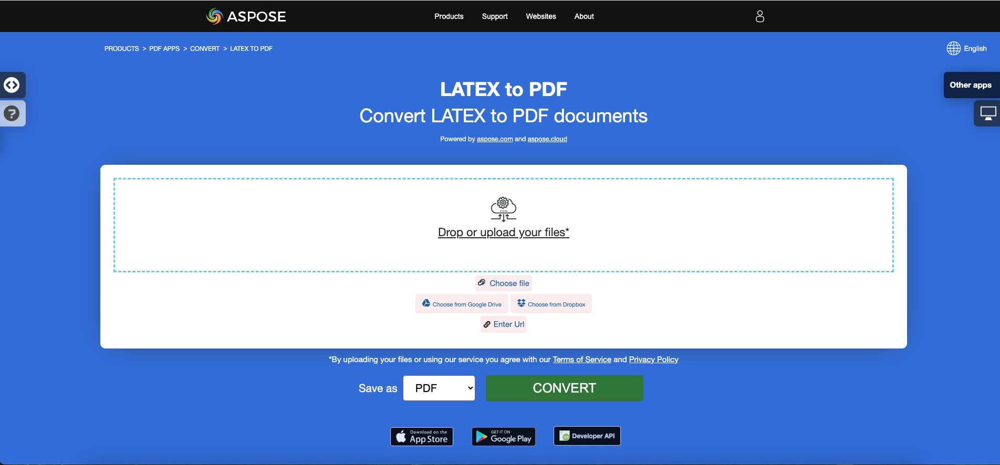

<script type="application/ld+json">
{
    "@context": "https://schema.org",
    "@type": "TechArticle",
    "headline": "Convert other file formats to PDF in .NET",
    "alternativeHeadline": "Convert Multiple File Formats to PDF in C#",
    "abstract": "Aspose.PDF for .NET introduce una característica versátil que permite a los usuarios convertir sin problemas una variedad de formatos de archivo, incluidos EPUB, Markdown, PCL, XPS, PS, XML y LaTeX, en documentos PDF de alta calidad. Esta funcionalidad mejora la gestión de documentos al garantizar la compatibilidad y accesibilidad en varias plataformas, manteniendo la integridad del contenido original.",
    "author": {
        "@type": "Person",
        "name": "Anastasiia Holub",
        "givenName": "Anastasiia",
        "familyName": "Holub",
        "url": "https://www.linkedin.com/in/anastasiia-holub-750430225/"
    },
    "genre": "pdf document generation",
    "wordcount": "4627",
    "proficiencyLevel": "Beginner",
    "publisher": {
        "@type": "Organization",
        "name": "Aspose.PDF for .NET",
        "url": "https://products.aspose.com/pdf",
        "logo": "https://www.aspose.cloud/templates/aspose/img/products/pdf/aspose_pdf-for-net.svg",
        "alternateName": "Aspose",
        "sameAs": [
            "https://facebook.com/aspose.pdf/",
            "https://twitter.com/asposepdf",
            "https://www.youtube.com/channel/UCmV9sEg_QWYPi6BJJs7ELOg/featured",
            "https://www.linkedin.com/company/aspose",
            "https://stackoverflow.com/questions/tagged/aspose",
            "https://aspose.quora.com/",
            "https://aspose.github.io/"
        ],
        "contactPoint": [
            {
                "@type": "ContactPoint",
                "telephone": "+1 903 306 1676",
                "contactType": "sales",
                "areaServed": "US",
                "availableLanguage": "en"
            },
            {
                "@type": "ContactPoint",
                "telephone": "+44 141 628 8900",
                "contactType": "sales",
                "areaServed": "GB",
                "availableLanguage": "en"
            },
            {
                "@type": "ContactPoint",
                "telephone": "+61 2 8006 6987",
                "contactType": "sales",
                "areaServed": "AU",
                "availableLanguage": "en"
            }
        ]
    },
    "url": "/net/convert-other-files-to-pdf/",
    "mainEntityOfPage": {
        "@type": "WebPage",
        "@id": "/net/convert-other-files-to-pdf/"
    },
    "dateModified": "2024-11-25",
    "description": "Aspose.PDF puede realizar no solo tareas simples y fáciles, sino también hacer frente a objetivos más complejos. Consulta la siguiente sección para usuarios avanzados y desarrolladores."
}
</script>

## Descripción general

Este artículo explica cómo **convertir varios otros tipos de formatos de archivo a PDF usando C#**. Cubre los siguientes temas.

El siguiente fragmento de código también funciona con la biblioteca [Aspose.PDF.Drawing](/pdf/es/net/drawing/).

_Formato_: **EPUB**
- [C# EPUB a PDF](#csharp-convert-epub-to-pdf)
- [C# Convertir EPUB a PDF](#csharp-convert-epub-to-pdf)
- [C# Cómo convertir archivo EPUB a PDF](#csharp-convert-epub-to-pdf)

_Formato_: **Markdown**
- [C# Markdown a PDF](#csharp-convert-markdown-to-pdf)
- [C# Convertir Markdown a PDF](#csharp-convert-markdown-to-pdf)
- [C# Cómo convertir archivo Markdown a PDF](#csharp-convert-markdown-to-pdf)

_Formato_: **MD**
- [C# MD a PDF](#csharp-convert-md-to-pdf)
- [C# Convertir MD a PDF](#csharp-convert-md-to-pdf)
- [C# Cómo convertir archivo MD a PDF](#csharp-convert-md-to-pdf)

_Formato_: **PCL**
- [C# PCL a PDF](#csharp-convert-pcl-to-pdf)
- [C# Convertir PCL a PDF](#csharp-convert-pcl-to-pdf)
- [C# Cómo convertir archivo PCL a PDF](#csharp-convert-pcl-to-pdf)

_Formato_: **Texto**
- [C# Texto a PDF](#csharp-convert-text-to-pdf)
- [C# Convertir Texto a PDF](#csharp-convert-text-to-pdf)
- [C# Cómo convertir archivo de Texto a PDF](#csharp-convert-text-to-pdf)

_Formato_: **TXT**
- [C# TXT a PDF](#csharp-convert-txt-to-pdf)
- [C# Convertir TXT a PDF](#csharp-convert-txt-to-pdf)
- [C# Cómo convertir archivo TXT a PDF](#csharp-convert-txt-to-pdf)

_Formato_: **Texto plano**
- [C# Texto plano a PDF](#csharp-convert-plain-text-to-pdf)
- [C# Convertir Texto plano a PDF](#csharp-convert-plain-text-to-pdf)
- [C# Cómo convertir archivo de Texto plano a PDF](#csharp-convert-plain-text-to-pdf)

_Formato_: **TXT preformateado**
- [C# Texto preformateado a PDF](#csharp-convert-pre-formatted-txt-to-pdf)
- [C# Convertir Texto preformateado a PDF](#csharp-convert-pre-formatted-txt-to-pdf)
- [C# Cómo convertir archivo de Texto preformateado a PDF](#csharp-convert-pre-formatted-txt-to-pdf)

_Formato_: **Texto Pre**
- [C# Texto Pre a PDF](#csharp-convert-pre-text-to-pdf)
- [C# Convertir Texto Pre a PDF](#csharp-convert-pre-text-to-pdf)
- [C# Cómo convertir archivo de Texto Pre a PDF](#csharp-convert-pre-text-to-pdf)

_Formato_: **XPS**
- [C# XPS a PDF](#csharp-convert-xps-to-pdf)
- [C# Convertir XPS a PDF](#csharp-convert-xps-to-pdf)
- [C# Cómo convertir archivo XPS a PDF](#csharp-convert-xps-to-pdf)

## Convertir EPUB a PDF

**Aspose.PDF for .NET** te permite convertir archivos EPUB a formato PDF de manera sencilla.

<abbr title="publicación electrónica">EPUB</abbr> (abreviatura de publicación electrónica) es un estándar de libro electrónico gratuito y abierto del Foro Internacional de Publicación Digital (IDPF). Los archivos tienen la extensión .epub. EPUB está diseñado para contenido refluido, lo que significa que un lector EPUB puede optimizar el texto para un dispositivo de visualización particular.

EPUB también admite contenido de diseño fijo. El formato está destinado a ser un formato único que los editores y las casas de conversión pueden usar internamente, así como para distribución y venta. Sustituye el estándar Open eBook. La versión EPUB 3 también es respaldada por el Grupo de Estudio de la Industria del Libro (BISG), una asociación comercial líder en la industria del libro para las mejores prácticas estandarizadas, investigación, información y eventos, para el empaquetado de contenido.

{}
**Intenta convertir EPUB a PDF en línea**

Aspose.PDF for .NET te presenta una aplicación gratuita en línea ["EPUB a PDF"](https://products.aspose.app/pdf/conversion/epub-to-pdf), donde puedes investigar la funcionalidad y la calidad con la que funciona.

[](https://products.aspose.app/pdf/conversion/epub-to-pdf)
{}

<a name="csharp-convert-epub-to-pdf" id="csharp-convert-epub-to-pdf"><strong><em>Pasos:</em> Convertir EPUB a PDF en C#</strong></a>

1. Crea una instancia de la clase [EpubLoadOptions](https://reference.aspose.com/pdf/net/aspose.pdf/epubloadoptions).
2. Crea una instancia de la clase [Document](https://reference.aspose.com/pdf/net/aspose.pdf/document) mencionando el nombre del archivo fuente y las opciones.
3. Guarda el documento con el nombre de archivo deseado.

El siguiente fragmento de código te muestra cómo convertir archivos EPUB a formato PDF con C#.

```csharp
// For complete examples and data files, visit https://github.com/aspose-pdf/Aspose.PDF-for-.NET
private static void ConvertEPUBtoPDF()
{
    // The path to the documents directory
    var dataDir = RunExamples.GetDataDir_AsposePdf_DocumentConversion();
    // Convert options
    var options = new Aspose.Pdf.EpubLoadOptions();

    // Open PDF document
    using (var document = new Aspose.Pdf.Document(dataDir + "EPUBToPDF.epub", options))
    {
        // Save PDF document
        document.Save(dataDir + "ConvertEPUBtoPDF_out.pdf");
    }
}
```

También puedes establecer el tamaño de página para la conversión. Para definir un nuevo tamaño de página, utiliza el objeto `SizeF` y pásalo al constructor de [EpubLoadOptions](https://reference.aspose.com/pdf/net/aspose.pdf/epubloadoptions/constructors/main).

```csharp
// For complete examples and data files, visit https://github.com/aspose-pdf/Aspose.PDF-for-.NET
private static void ConvertEPUBtoPDFAdv()
{
    // The path to the documents directory
    var dataDir = RunExamples.GetDataDir_AsposePdf_DocumentConversion();
    // Convert options
    var options = new Aspose.Pdf.EpubLoadOptions(new SizeF(1190, 1684));

    // Open PDF document
    using (var document = new Aspose.Pdf.Document(dataDir + "EPUBToPDF.epub", options))
    {
        // Save PDF document
        document.Save(dataDir + "ConvertEPUBtoPDFAdv_out.pdf");
    }
}
```

## Convertir Markdown a PDF

**Esta función es compatible con la versión 19.6 o superior.**

{}
**Intenta convertir Markdown a PDF en línea**

Aspose.PDF for .NET te presenta una aplicación gratuita en línea ["Markdown a PDF"](https://products.aspose.app/pdf/conversion/md-to-pdf), donde puedes investigar la funcionalidad y la calidad con la que funciona.

[](https://products.aspose.app/pdf/conversion/md-to-pdf)
{}

Aspose.PDF for .NET proporciona la funcionalidad para crear un documento PDF basado en el archivo de datos de entrada [Markdown](https://daringfireball.net/projects/markdown/syntax). Para convertir Markdown a PDF, necesitas inicializar el [Document](https://reference.aspose.com/pdf/net/aspose.pdf/document) utilizando [MdLoadOptions](https://reference.aspose.com/pdf/net/aspose.pdf/mdloadoptions).

El siguiente fragmento de código muestra cómo utilizar esta funcionalidad con la biblioteca Aspose.PDF:

<a name="csharp-convert-markdown-to-pdf" id="csharp-convert-markdown-to-pdf"><strong><em>Pasos:</em> Convertir Markdown a PDF en C#</strong></a> |
<a name="csharp-convert-md-to-pdf" id="csharp-convert-md-to-pdf"><strong><em>Pasos:</em> Convertir MD a PDF en C#</strong></a>

1. Crea una instancia de la clase [MdLoadOptions](https://reference.aspose.com/pdf/net/aspose.pdf/mdloadoptions/) .
2. Crea una instancia de la clase [Document](https://reference.aspose.com/pdf/net/aspose.pdf/document) mencionando el nombre del archivo fuente y las opciones.
3. Guarda el documento con el nombre de archivo deseado.

```csharp
// For complete examples and data files, visit https://github.com/aspose-pdf/Aspose.PDF-for-.NET
private static void ConvertMarkdownToPDF()
{
    // The path to the documents directory
    var dataDir = RunExamples.GetDataDir_AsposePdf_DocumentConversion();
    // Convert options
    var options = new Aspose.Pdf.MdLoadOptions();

    // Open PDF document
    using (var document = new Aspose.Pdf.Document(dataDir + "sample.md", options))
    {
        // Save PDF document
        document.Save(dataDir + "ConvertMarkdownToPDF_out.pdf");
    }
}
```

## Convertir PCL a PDF

<abbr title="Lenguaje de Comando de Impresora">PCL</abbr> (Lenguaje de Comando de Impresora) es un lenguaje de impresora de Hewlett-Packard desarrollado para acceder a las características estándar de la impresora. Los niveles PCL 1 a 5e/5c son lenguajes basados en comandos que utilizan secuencias de control que se procesan e interpretan en el orden en que se reciben. A nivel del consumidor, los flujos de datos PCL son generados por un controlador de impresión. La salida PCL también puede ser generada fácilmente por aplicaciones personalizadas.

{}
**Intenta convertir PCL a PDF en línea**

Aspose.PDF para .NET te presenta una aplicación gratuita en línea ["PCL a PDF"](https://products.aspose.app/pdf/conversion/pcl-to-pdf), donde puedes investigar la funcionalidad y la calidad con la que funciona.

[](https://products.aspose.app/pdf/conversion/pcl-to-pdf)
{}

**Actualmente solo se admiten PCL5 y versiones anteriores**

<table>
    <thead>
        <tr>
            <th>
                Conjuntos de comandos
            </th>
            <th>
                Soporte
            </th>
            <th>
                Excepciones
            </th>
            <th>
                Descripción
            </th>
        </tr>
    </thead>
    <tbody>
        <tr>
            <td>
                Comandos de control de trabajo
            </td>
            <td>
                +
            </td>
            <td>
                Modo de impresión dúplex
            </td>
            <td>
                Controlar el proceso de impresión: número de copias, bandeja de salida, impresión simple/dúplex, márgenes izquierdo y superior, etc.
            </td>
        </tr>
        <tr>
            <td>
                Comandos de control de página
            </td>
            <td>
                +
            </td>
            <td>
                Comando de salto de perforación
            </td>
            <td>
                Especificar un tamaño de página, márgenes, orientación de página, distancias entre líneas y caracteres, etc.
            </td>
        </tr>
        <tr>
            <td>
                Comandos de posicionamiento del cursor
            </td>
            <td>
                +
            </td>
            <td>
                &nbsp;
            </td>
            <td>
                Especificar la posición del cursor y, por lo tanto, los orígenes de texto, imágenes rasterizadas o vectoriales y detalles.
            </td>
        </tr>
        <tr>
            <td>
                Comandos de selección de fuente
            </td>
            <td>
                +
            </td>
            <td>
                <ol>
                    <li>Comando de datos de impresión transparente.</li>
                    <li>Fuentes suaves incrustadas. En la versión actual, en lugar de crear una fuente suave, nuestra biblioteca selecciona una fuente adecuada de las fuentes TrueType "duras" existentes instaladas en la máquina de destino. <br/>
                        La idoneidad se define por la relación ancho/alto.<br/>
                        Esta función solo funciona para fuentes de mapa de bits y TrueType y no garantiza que el texto impreso con la fuente suave sea relevante para el de un archivo fuente.<br/>
                        Debido a que los códigos de caracteres en la fuente suave pueden no coincidir con los predeterminados.
                    </li>
                    <li>Conjuntos de símbolos definidos por el usuario.</li>
                </ol>
            </td>
            <td>
                Permitir cargar fuentes suaves (incrustadas) desde el archivo PCL y gestionarlas en memoria.
            </td>
        </tr>
        <tr>
            <td>
                Comandos de gráficos rasterizados
            </td>
            <td>
                +
            </td>
            <td>
                Solo blanco y negro
            </td>
            <td>
                Permitir cargar imágenes rasterizadas desde el archivo PCL a la memoria, especificar parámetros rasterizados. <br
                    > como ancho, altura, tipo de compresión, resolución, etc.
            </td>
        </tr>
        <tr>
            <td>
                Comandos de color
            </td>
            <td>
                +
            </td>
            <td>
                &nbsp;
            </td>
            <td>
                Permitir colorear todos los objetos imprimibles.
            </td>
        </tr>
        <tr>
            <td>
                Comandos de modelo de impresión
            </td>
            <td>
                +
            </td>
            <td>
                &nbsp;
            </td>
            <td>
                Permitir rellenar texto, imágenes rasterizadas y áreas rectangulares con un patrón rasterizado predefinido y <br>
                patrones definidos por el usuario, especificar el modo de transparencia para patrones e
                imágenes rasterizadas de origen. <br> Los patrones predefinidos son de tramas, tramas cruzadas
                y de sombreado.
            </td>
        </tr>
        <tr>
            <td>
                Comandos de relleno de área rectangular
            </td>
            <td>
                +
            </td>
            <td>
                &nbsp;
            </td>
            <td>
                Permitir la creación y el relleno de áreas rectangulares con patrones.
            </td>
        </tr>
        <tr>
            <td>
                Comandos de gráficos vectoriales HP-GL/2
            </td>
            <td>
                +
            </td>
            <td>
                Comando de vectorizado con pantalla (SV), Comando de modo de transparencia (TR), Comando de datos transparentes (TD), RO
                (Rotar sistema de coordenadas), Comando de fuentes escalables o de mapa de bits (SB), Comando de inclinación de caracteres (SL) y
                Espacio adicional (ES) no están implementados y los comandos DV (Definir ruta de texto variable) se realizan en
                versión beta.
            </td>
            <td>
                Permitir cargar imágenes vectoriales HP-GL/2 desde el archivo PCL en memoria. La imagen vectorial tiene un origen en la esquina inferior
                izquierda del área imprimible, puede ser escalada, trasladada, rotada y recortada. <br>
                La imagen vectorial puede contener texto, como etiquetas, y figuras geométricas como
                rectángulos, círculos, elipses, líneas, arcos, curvas de Bezier y figuras complejas compuestas de figuras simples. <br> Las figuras cerradas, incluidas las letras de las etiquetas, pueden ser rellenadas con
                relleno sólido o patrón vectorial. <br> El patrón puede ser
                de tramas, tramas cruzadas, sombreado, rasterizado definido por el usuario, tramas PCL o tramas cruzadas y definidas por el usuario de PCL. Los patrones PCL son rasterizados. Las etiquetas pueden ser rotadas, escaladas y dirigidas individualmente en
                cuatro direcciones: arriba, abajo, izquierda y derecha. Las direcciones izquierda y derecha implican un arreglo de letras uno tras otro. Las direcciones arriba y abajo implican un arreglo de letras una debajo de la otra.
            </td>
        </tr>
        <tr>
            <td>
                Macros
            </td>
            <td>
                ―
            </td>
            <td>
                &nbsp;
            </td>
            <td>
                Permitir cargar una secuencia de comandos PCL en memoria y usar esta secuencia muchas veces, por ejemplo,
                para imprimir el encabezado de la página o establecer un formato para un conjunto de páginas.
            </td>
        </tr>
        <tr>
            <td>
                Texto Unicode
            </td>
            <td>
                ―
            </td>
            <td>
                &nbsp;
            </td>
            <td>
                Permitir imprimir caracteres no ASCII. No implementado debido a la falta de archivos de muestra con <br
                    > texto Unicode.
            </td>
        </tr>
        <tr>
            <td>
                PCL6 (PCL-XL)
            </td>
            <td>
                &nbsp;
            </td>
            <td>
                Realizado solo en versión Beta debido a la falta de archivos de prueba. Las fuentes incrustadas tampoco son
                compatibles.<br> La extensión JetReady no es compatible porque es
                imposible tener la especificación JetReady.
            </td>
            <td>
                Formato de archivo binario.
            </td>
        </tr>
    </tbody>
</table>

### Convertir un archivo PCL a formato PDF

Para permitir la conversión de PCL a PDF, Aspose.PDF tiene la clase [`PclLoadOptions`](https://reference.aspose.com/pdf/net/aspose.pdf/pclloadoptions) que se utiliza para inicializar el objeto LoadOptions. Posteriormente, este objeto se pasa como argumento durante la inicialización del objeto Document y ayuda al motor de renderizado PDF a determinar el formato de entrada del documento fuente.

El siguiente fragmento de código muestra el proceso de conversión de un archivo PCL a formato PDF.

<a name="csharp-convert-pcl-to-pdf" id="csharp-convert-pcl-to-pdf"><strong><em>Pasos:</em> Convertir PCL a PDF en C#</strong></a>

1. Crea una instancia de la clase [PclLoadOptions](https://reference.aspose.com/pdf/net/aspose.pdf/pclloadoptions/) .
2. Crea una instancia de la clase [Document](https://reference.aspose.com/pdf/net/aspose.pdf/document/) mencionando el nombre del archivo fuente y las opciones.
3. Guarda el documento con el nombre de archivo deseado.

```csharp
// For complete examples and data files, visit https://github.com/aspose-pdf/Aspose.PDF-for-.NET
private static void ConvertPCLtoPDF()
{
    // The path to the documents directory
    var dataDir = RunExamples.GetDataDir_AsposePdf_DocumentConversion();
    // Convert options
    var options = new Aspose.Pdf.PclLoadOptions();

    // Open PDF document
    using (var document = new Aspose.Pdf.Document(dataDir + "ConvertPCLtoPDF.pcl", options))
    {
        // Save PDF document
        document.Save(dataDir + "ConvertPCLtoPDF_out.pdf");
    }
}
```

También puedes monitorear la detección de errores durante el proceso de conversión. Para ello, necesitas configurar el objeto PclLoadOptions: establecer o desactivar SupressErrors.

```csharp
// For complete examples and data files, visit https://github.com/aspose-pdf/Aspose.PDF-for-.NET
private static void ConvertPCLtoPDFAdvanced()
{
    // The path to the documents directory
    var dataDir = RunExamples.GetDataDir_AsposePdf_DocumentConversion();
    // Convert options
    var options = new Aspose.Pdf.PclLoadOptions { SupressErrors = true };

    // Open PDF document
    using (var document = new Aspose.Pdf.Document(dataDir + "ConvertPCLtoPDFAdvanced.pcl", options))
    {
        if (options.Exceptions != null)
        {
            foreach (var ex in options.Exceptions)
            {
                Console.WriteLine(ex.Message);
            }
        }
        // Save PDF document
        document.Save(dataDir + "ConvertPCLtoPDFAdvanced_out.pdf");
    }
}
```

### Problemas conocidos

1. El origen de las cadenas de texto e imágenes puede diferir ligeramente de las del archivo PCL fuente si la dirección de impresión no es 0°. Lo mismo se refiere a las imágenes vectoriales si el sistema de coordenadas del gráfico vectorial está rotado (precedido por el comando RO).
2. El origen de las etiquetas en las imágenes vectoriales puede diferir de las del archivo PCL fuente si las etiquetas están influenciadas por una secuencia de comandos: Origen de etiqueta (LO), Definir ruta de texto variable (DV), Dirección absoluta (DI) o Dirección relativa (DR).
3. Un texto puede ser leído incorrectamente si debe ser renderizado con una fuente suave (incrustada) de mapa de bits o TrueType, porque actualmente estas fuentes solo son parcialmente compatibles (ver excepciones en la "tabla de características compatibles"). En esta situación, el texto puede ser leído correctamente solo si los códigos de caracteres en una fuente suave corresponden a los predeterminados. El estilo del texto leído también puede diferir del del archivo PCL fuente porque no es necesario establecer el estilo en el encabezado de la fuente suave.
4. Si el archivo PCL analizado contiene fuentes suaves Intellifont o Universal, se lanzará una excepción, porque las fuentes Intellifont y Universal no son compatibles en absoluto.
5. Si el archivo PCL analizado contiene comandos de macros, el resultado del análisis diferirá significativamente del archivo fuente, porque los comandos de macros no son compatibles.

## Convertir Texto a PDF

**Aspose.PDF for .NET** admite la función de convertir archivos de texto plano y texto preformateado a formato PDF.

Convertir texto a PDF significa agregar fragmentos de texto a la página PDF. En cuanto a los archivos de texto, estamos tratando con 2 tipos de texto: preformateado (por ejemplo, 25 líneas con 80 caracteres por línea) y texto no formateado (texto plano). Dependiendo de nuestras necesidades, podemos controlar esta adición nosotros mismos o confiar en los algoritmos de la biblioteca.

{}
**Intenta convertir TEXTO a PDF en línea**

Aspose.PDF for .NET te presenta una aplicación gratuita en línea ["Texto a PDF"](https://products.aspose.app/pdf/conversion/txt-to-pdf), donde puedes investigar la funcionalidad y la calidad con la que funciona.

[](https://products.aspose.app/pdf/conversion/txt-to-pdf)
{}

### Convertir archivo de texto plano a PDF

En el caso del archivo de texto plano, podemos usar la siguiente técnica:

<a name="csharp-convert-text-to-pdf" id="csharp-convert-text-to-pdf"><strong><em>Pasos:</em> Convertir Texto a PDF en C#</strong></a> |
<a name="csharp-convert-txt-to-pdf" id="csharp-convert-txt-to-pdf"><strong><em>Pasos:</em> Convertir TXT a PDF en C#</strong></a> |
<a name="csharp-convert-plain-text-to-pdf" id="csharp-convert-plain-text-to-pdf"><strong><em>Pasos:</em> Convertir Texto plano a PDF en C#</strong></a>

1. Usa un _TextReader_ para leer todo el texto.
2. Instancia el objeto [Document](https://reference.aspose.com/pdf/net/aspose.pdf/document/) y agrega una nueva página en la colección Pages.
3. Crea un nuevo objeto de [TextFragment](https://reference.aspose.com/pdf/net/aspose.pdf.text/textfragment/) y pasa el objeto _TextReader_ a su constructor.
4. Agrega el objeto _TextFragment_ como párrafo en la colección _Paragraphs_. Si la cantidad de texto es mayor que la página, el algoritmo de la biblioteca agrega automáticamente páginas adicionales.
5. Usa el método **Save** de la clase [Document](https://reference.aspose.com/pdf/net/aspose.pdf/document/).

```csharp
// For complete examples and data files, visit https://github.com/aspose-pdf/Aspose.PDF-for-.NET
private static void ConvertPlainTextFileToPDF()
{
    // The path to the documents directory
    var dataDir = RunExamples.GetDataDir_AsposePdf_DocumentConversion();

    // Read the source text file
    using (var streamReader = new StreamReader(dataDir + "TextToPDFInput.txt"))
    {
        // // Create PDF document
        using (var document = new Aspose.Pdf.Document())
        {
            // Add page
            var page = document.Pages.Add();
            // Create an instance of TextFragment and pass the text from reader object to its constructor as argument
            var text = new Aspose.Pdf.Text.TextFragment(streamReader.ReadToEnd());
            // Add a new text paragraph in paragraphs collection and pass the TextFragment object
            page.Paragraphs.Add(text);
            // Save PDF document
            document.Save(dataDir + "TextToPDF_out.pdf");
        }
    }
}
```

### Convertir archivo de texto preformateado a PDF

Convertir texto preformateado es similar a texto plano, pero necesitas realizar algunas acciones adicionales, como establecer márgenes, tipo y tamaño de fuente. Obviamente, la fuente debe ser monoespaciada (por ejemplo, Courier New).

Sigue estos pasos para convertir texto preformateado a PDF con C#:

<a name="csharp-convert-pre-text-to-pdf" id="csharp-convert-pre-text-to-pdf"><strong><em>Pasos:</em> Convertir Texto Pre a PDF en C#</strong></a> |
<a name="csharp-convert-pre-formatted-txt-to-pdf" id="csharp-convert-pre-formatted-txt-to-pdf"><strong><em>Pasos:</em> Convertir TXT preformateado a PDF en C#</strong></a>

1. Lee todo el texto como un arreglo de cadenas.
2. Instancia el objeto [Document](https://reference.aspose.com/pdf/net/aspose.pdf/document/) y agrega una nueva página en la colección [Pages](https://reference.aspose.com/pdf/net/aspose.pdf/document/pages/).
3. Ejecuta un bucle a través del arreglo de cadenas y agrega cada cadena como un párrafo en la colección [Paragraphs](https://reference.aspose.com/pdf/net/aspose.pdf/paragraphs/).

En este caso, el algoritmo de la biblioteca también agrega páginas adicionales, pero podemos controlar este proceso nosotros mismos.
El siguiente ejemplo muestra cómo convertir un archivo de texto preformateado a un documento PDF con tamaño de página A4.

```csharp
// For complete examples and data files, visit https://github.com/aspose-pdf/Aspose.PDF-for-.NET
private static void ConvertPreFormattedTextToPdf()
{
    // The path to the documents directory
    var dataDir = RunExamples.GetDataDir_AsposePdf_DocumentConversion();
    // Read the text file as array of string
    var lines = File.ReadAllLines(dataDir + "ConvertPreFormattedTextToPdf.txt");

    // Create PDF document
    using (var document = new Aspose.Pdf.Document())
    {
        // Add page
        var page = document.Pages.Add();
        // Set left and right margins for better presentation
        page.PageInfo.Margin.Left = 20;
        page.PageInfo.Margin.Right = 10;
        page.PageInfo.DefaultTextState.Font = Aspose.Pdf.Text.FontRepository.FindFont("Courier New");
        page.PageInfo.DefaultTextState.FontSize = 12;

        foreach (var line in lines)
        {
            // check if line contains "form feed" character
            // see https://en.wikipedia.org/wiki/Page_break
            if (line.StartsWith("\x0c"))
            {
                page = document.Pages.Add();
                page.PageInfo.Margin.Left = 20;
                page.PageInfo.Margin.Right = 10;
                page.PageInfo.DefaultTextState.Font = Aspose.Pdf.Text.FontRepository.FindFont("Courier New");
                page.PageInfo.DefaultTextState.FontSize = 12;
            }
            else
            {
                // Create an instance of TextFragment and pass the line to its constructor as argument
                var text = new Aspose.Pdf.Text.TextFragment(line);
                // Add a new text paragraph in paragraphs collection and pass the TextFragment object
                page.Paragraphs.Add(text);
            }
        }
        // Save PDF document
        document.Save(dataDir + "PreFormattedTextToPDF_out.pdf");
    }
}
```

## Convertir XPS a PDF

**Aspose.PDF for .NET** admite la función de convertir archivos <abbr title="Especificación de Papel XML">XPS</abbr> a formato PDF. Consulta este artículo para resolver tus tareas.

El tipo de archivo XPS está asociado principalmente con la Especificación de Papel XML de Microsoft Corporation. La Especificación de Papel XML (XPS), anteriormente conocida como Metro y que abarca el concepto de marketing del Camino de Impresión de Nueva Generación (NGPP), es la iniciativa de Microsoft para integrar la creación y visualización de documentos en su sistema operativo Windows.

{}

El formato de archivo es básicamente un archivo XML comprimido que se utiliza principalmente para distribución y almacenamiento. Es muy difícil de editar y se implementa principalmente por Microsoft.

{}

Para convertir XPS a PDF con Aspose.PDF for .NET, hemos introducido una clase llamada [XpsLoadOption](https://reference.aspose.com/pdf/net/aspose.pdf/xpsloadoptions) que se utiliza para inicializar un objeto [LoadOptions](https://reference.aspose.com/pdf/net/aspose.pdf/loadoptions) . Posteriormente, este objeto se pasa como argumento durante la inicialización del objeto Document y ayuda al motor de renderizado PDF a determinar el formato de entrada del documento fuente.

{}

En ambos XP y Windows 7, deberías encontrar una impresora XPS preinstalada si miras en el Panel de Control y luego en Impresoras. Para crear estos archivos, puedes usar esa impresora como dispositivo de salida. En Windows 7, deberías poder simplemente hacer doble clic en el archivo para abrirlo en un visor XPS. También puedes descargar el visor XPS desde el sitio web de Microsoft.

{}

El siguiente fragmento de código muestra el proceso de conversión de un archivo XPS a formato PDF con C#.

<a name="csharp-convert-xps-to-pdf" id="csharp-convert-xps-to-pdf"><strong><em>Pasos:</em> Convertir XPS a PDF en C#</strong></a>

1. Crea una instancia de la clase [XpsLoadOptions](https://reference.aspose.com/pdf/net/aspose.pdf/xpsloadoptions/) .
2. Crea una instancia de la clase [Document](https://reference.aspose.com/pdf/net/aspose.pdf/document/) mencionando el nombre del archivo fuente y las opciones.
3. Guarda el documento en formato PDF con el nombre de archivo deseado.

```csharp
// For complete examples and data files, visit https://github.com/aspose-pdf/Aspose.PDF-for-.NET
private static void ConvertXPSToPDF()
{
    // The path to the documents directory
    var dataDir = RunExamples.GetDataDir_AsposePdf_DocumentConversion();
    // Instantiate Options object
    var options = new Aspose.Pdf.XpsLoadOptions();

    // Open PDF document
    using (var document = new Aspose.Pdf.Document(dataDir + "XPSToPDF.xps", options))
    {
        // Save PDF document
        document.Save(dataDir + "ConvertXPSToPDF_out.pdf");
    }
}
```

{}
**Intenta convertir formato XPS a PDF en línea**

Aspose.PDF for .NET te presenta una aplicación gratuita en línea ["XPS a PDF"](https://products.aspose.app/pdf/conversion/xps-to-pdf/), donde puedes investigar la funcionalidad y la calidad con la que funciona.

[](https://products.aspose.app/pdf/conversion/xps-to-pdf/)
{}

## Convertir PostScript a PDF

**Aspose.PDF for .NET** admite funciones para convertir archivos PostScript a formato PDF. Una de las características de Aspose.PDF es que puedes establecer un conjunto de carpetas de fuentes que se utilizarán durante la conversión.

Para convertir un archivo PostScript a formato PDF, Aspose.PDF for .NET ofrece la clase [PsLoadOptions](https://reference.aspose.com/pdf/net/aspose.pdf/psloadoptions) que se utiliza para inicializar el objeto LoadOptions. Posteriormente, este objeto puede pasarse como argumento al constructor del objeto Document, lo que ayudará al motor de renderizado PDF a determinar el formato del documento fuente.

El siguiente fragmento de código se puede utilizar para convertir un archivo PostScript a formato PDF con Aspose.PDF for .NET:

```csharp
// For complete examples and data files, visit https://github.com/aspose-pdf/Aspose.PDF-for-.NET
private static void ConvertPostScriptToPDF()
{
    // The path to the documents directory
    var dataDir = RunExamples.GetDataDir_AsposePdf_DocumentConversion();
    // Convert options
    var options = new PsLoadOptions();

    // Open PDF document
    using (var document = new Aspose.Pdf.Document(dataDir + "ConvertPostscriptInput.ps", options))
    {
        // Save PDF document
        document.Save(dataDir + "PSToPDF_out.pdf");
    }
}
```

Además, puedes establecer un conjunto de carpetas de fuentes que se utilizarán durante la conversión:

```csharp
// For complete examples and data files, visit https://github.com/aspose-pdf/Aspose.PDF-for-.NET
private static void ConvertPostscriptToPDFAdvanced()
{
    // The path to the documents directory
    var dataDir = RunExamples.GetDataDir_AsposePdf_DocumentConversion();
    // Convert options with custom font folders
    var options = new Aspose.Pdf.PsLoadOptions
    {
        FontsFolders = new[] { dataDir + @"\fonts1", dataDir + @"\fonts2" }
    };

    // Open PDF document
    using (var document = new Aspose.Pdf.Document(dataDir + "ConvertPostscriptInput.ps", options))
    {
        // Save PDF document
        document.Save(dataDir + "ConvertPostscriptToPDFAdvanced_out.pdf");
    }
}
```

## Convertir XML a PDF

El formato XML se utiliza para almacenar datos estructurados. Hay varias formas de convertir <abbr title="Lenguaje de Marcado Extensible">XML</abbr> a PDF en Aspose.PDF:

1. Transformar cualquier dato XML a HTML utilizando XSLT y convertir HTML a PDF como se describe a continuación.
2. Generar un documento XML utilizando el esquema XSD de Aspose.PDF.
3. Utilizar un documento XML basado en el estándar XSL-FO.

{}
**Intenta convertir XML a PDF en línea**

Aspose.PDF for .NET te presenta una aplicación gratuita en línea ["XML a PDF"](https://products.aspose.app/pdf/conversion/xml-to-pdf), donde puedes investigar la funcionalidad y la calidad con la que funciona.

[](https://products.aspose.app/pdf/conversion/xml-to-pdf)
{}


## Convertir XSL-FO a PDF

La conversión de archivos XSL-FO a PDF se puede implementar utilizando la técnica tradicional de Aspose.PDF: instanciar el objeto [Document](https://reference.aspose.com/page/net/aspose.page/document) con [XslFoLoadOptions](https://reference.aspose.com/pdf/net/aspose.pdf/xslfoloadoptions). Pero a veces puedes encontrarte con una estructura de archivo incorrecta. Para este caso, el convertidor XSL-FO permite establecer la estrategia de manejo de errores. Puedes elegir `ThrowExceptionImmediately`, `TryIgnore` o `InvokeCustomHandler`.

```csharp
// For complete examples and data files, visit https://github.com/aspose-pdf/Aspose.PDF-for-.NET
private static void Convert_XSLFO_to_PDF()
{
    // The path to the documents directory
    var dataDir = RunExamples.GetDataDir_AsposePdf_DocumentConversion();
    // Convert options
    var options = new Aspose.Pdf.XslFoLoadOptions(dataDir + "XSLFOToPdfInput.xslt");
    // Set error handling strategy
    options.ParsingErrorsHandlingType = Aspose.Pdf.XslFoLoadOptions.ParsingErrorsHandlingTypes.ThrowExceptionImmediately;

    // Open PDF document
    using (var document = new Aspose.Pdf.Document(dataDir + "XSLFOToPdfInput.xml", options))
    {
        // Save PDF document
        document.Save(dataDir + "XSLFOToPdf_out.pdf");
    }
}
```

## Convertir LaTeX/TeX a PDF

El formato de archivo LaTeX es un formato de archivo de texto con marcado en el derivado de LaTeX de la familia de lenguajes TeX y LaTeX es un formato derivado del sistema TeX. LaTeX (ˈleɪtɛk/lay-tek o lah-tek) es un sistema de preparación de documentos y un lenguaje de marcado de documentos. Se utiliza ampliamente para la comunicación y publicación de documentos científicos en muchos campos, incluidos matemáticas, física y ciencias de la computación. También tiene un papel destacado en la preparación y publicación de libros y artículos que contienen materiales multilingües complejos, como sánscrito y árabe, incluidas ediciones críticas. LaTeX utiliza el programa de composición TeX para formatear su salida y está escrito en el lenguaje de macros TeX.

{}
**Intenta convertir LaTeX/TeX a PDF en línea**

Aspose.PDF for .NET te presenta una aplicación gratuita en línea ["LaTex a PDF"](https://products.aspose.app/pdf/conversion/tex-to-pdf), donde puedes investigar la funcionalidad y la calidad con la que funciona.

[](https://products.aspose.app/pdf/conversion/tex-to-pdf)
{}

Aspose.PDF for .NET admite la función de convertir archivos TeX a formato PDF y, para cumplir con este requisito, el espacio de nombres Aspose.Pdf tiene una clase llamada [LatexLoadOptions](https://reference.aspose.com/pdf/net/aspose.pdf/latexloadoptions) que proporciona las capacidades para cargar archivos LaTex y renderizar la salida en formato PDF utilizando la [clase Document](https://reference.aspose.com/pdf/net/aspose.pdf/document).
El siguiente fragmento de código muestra el proceso de conversión de un archivo LaTex a formato PDF con C#.

```csharp
// For complete examples and data files, visit https://github.com/aspose-pdf/Aspose.PDF-for-.NET
private static void ConvertTeXtoPDF()
{
    // The path to the documents directory
    var dataDir = RunExamples.GetDataDir_AsposePdf_DocumentConversion();
    // Convert options
    var options = new Aspose.Pdf.TeXLoadOptions();
    // Open PDF document
    using (var document = new Aspose.Pdf.Document(dataDir + "samplefile.tex", options))
    {
        // Save PDF document
        document.Save(dataDir + "TeXToPDF_out.pdf");
    }
}
```

## Convertir OFD a PDF

El formato OFD se refiere a "Documento de Diseño Fijo Abierto", establecido como el estándar nacional de China para el almacenamiento de archivos electrónicos, utilizado como alternativa al popular formato PDF. Admite documentos de diseño fijo, asegurando una visualización consistente en diferentes plataformas. Los archivos OFD se utilizan para diversos propósitos, incluidos documentos digitales y aplicaciones comerciales.

Aspose.PDF for .NET admite la función de convertir archivos OFD a formato PDF y, para cumplir con este requisito, el espacio de nombres Aspose.Pdf tiene una clase llamada [OfdLoadOptions](https://reference.aspose.com/pdf/net/aspose.pdf/ofdloadoptions/) que proporciona las capacidades para cargar archivos OFD y renderizar la salida en formato PDF utilizando la [clase Document](https://reference.aspose.com/pdf/net/aspose.pdf/document).

El siguiente fragmento de código muestra el proceso de conversión de un archivo OFD a formato PDF con C#.

```csharp
// For complete examples and data files, visit https://github.com/aspose-pdf/Aspose.PDF-for-.NET
private static void ConvertOFDToPDF()
{
    // The path to the documents directory
    var dataDir = RunExamples.GetDataDir_AsposePdf_DocumentConversion();
    // Convert options
    var options = new Aspose.Pdf.OfdLoadOptions();

    // Open PDF document
    using (var document = new Aspose.Pdf.Document(dataDir + "ConvertOFDToPDF.ofd", options))
    {
        // Save PDF document
        document.Save(dataDir + "ConvertOFDToPDF_out.pdf");
    }
}
```