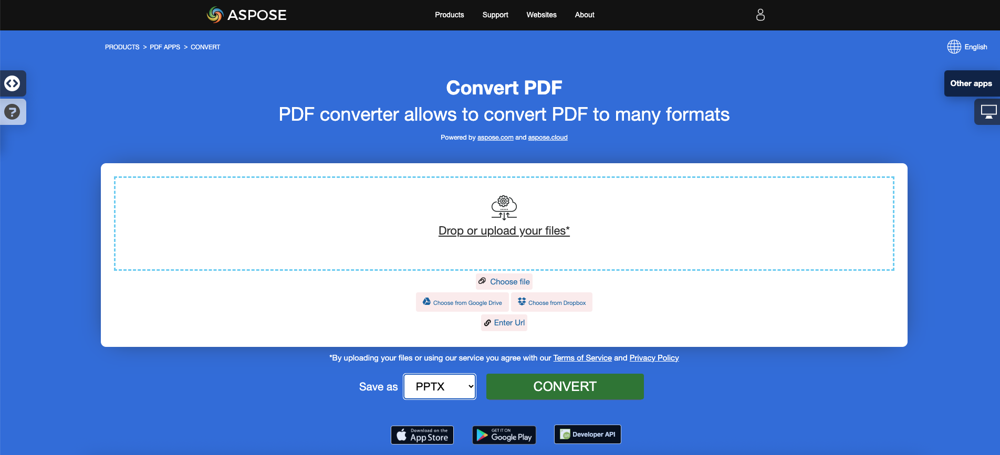

<script type="application/ld+json">
{
    "@context": "https://schema.org",
    "@type": "TechArticle",
    "headline": "Convert PDF to PowerPoint in .NET",
    "alternativeHeadline": "Convert PDF Documents to PowerPoint Presentations Efficiently in C#",
    "abstract": "Aspose.PDF for .NET introduce una poderosa característica que permite la conversión fluida de documentos PDF a formato PowerPoint (PPTX), permitiendo que cada página PDF se transforme en una diapositiva distinta. Con la opción de renderizar texto como seleccionable o como imágenes, los usuarios pueden personalizar fácilmente sus presentaciones mientras rastrean el progreso de la conversión de manera eficiente. Optimiza tu flujo de trabajo documental aprovechando esta funcionalidad innovadora para mejorar la productividad",
    "author": {
        "@type": "Person",
        "name": "Anastasiia Holub",
        "givenName": "Anastasiia",
        "familyName": "Holub",
        "url": "https://www.linkedin.com/in/anastasiia-holub-750430225/"
    },
    "genre": "pdf document generation",
    "wordcount": "1174",
    "proficiencyLevel": "Beginner",
    "publisher": {
        "@type": "Organization",
        "name": "Aspose.PDF for .NET",
        "url": "https://products.aspose.com/pdf",
        "logo": "https://www.aspose.cloud/templates/aspose/img/products/pdf/aspose_pdf-for-net.svg",
        "alternateName": "Aspose",
        "sameAs": [
            "https://facebook.com/aspose.pdf/",
            "https://twitter.com/asposepdf",
            "https://www.youtube.com/channel/UCmV9sEg_QWYPi6BJJs7ELOg/featured",
            "https://www.linkedin.com/company/aspose",
            "https://stackoverflow.com/questions/tagged/aspose",
            "https://aspose.quora.com/",
            "https://aspose.github.io/"
        ],
        "contactPoint": [
            {
                "@type": "ContactPoint",
                "telephone": "+1 903 306 1676",
                "contactType": "sales",
                "areaServed": "US",
                "availableLanguage": "en"
            },
            {
                "@type": "ContactPoint",
                "telephone": "+44 141 628 8900",
                "contactType": "sales",
                "areaServed": "GB",
                "availableLanguage": "en"
            },
            {
                "@type": "ContactPoint",
                "telephone": "+61 2 8006 6987",
                "contactType": "sales",
                "areaServed": "AU",
                "availableLanguage": "en"
            }
        ]
    },
    "url": "/net/convert-pdf-to-powerpoint/",
    "mainEntityOfPage": {
        "@type": "WebPage",
        "@id": "/net/convert-pdf-to-powerpoint/"
    },
    "dateModified": "2024-11-25",
    "description": "Aspose.PDF puede realizar no solo tareas simples y fáciles, sino también hacer frente a objetivos más complejos. Consulta la siguiente sección para usuarios avanzados y desarrolladores."
}
</script>

## Resumen

Este artículo explica cómo **convertir PDF a PowerPoint usando C#**. Cubre estos temas.

_Formato_: **PPTX**
- [C# PDF a PPTX](#csharp-pdf-to-pptx)
- [C# Convertir PDF a PPTX](#csharp-pdf-to-pptx)
- [C# Cómo convertir archivo PDF a PPTX](#csharp-pdf-to-pptx)

_Formato_: **PowerPoint**
- [C# PDF a PowerPoint](#csharp-pdf-to-powerpoint)
- [C# Convertir PDF a PowerPoint](#csharp-pdf-to-powerpoint)
- [C# Cómo convertir archivo PDF a PowerPoint](#csharp-pdf-to-powerpoint)

El siguiente fragmento de código también funciona con la biblioteca [Aspose.PDF.Drawing](/pdf/es/net/drawing/).

## Conversión de C# PDF a PowerPoint y PPTX

**Aspose.PDF for .NET** te permite rastrear el progreso de la conversión de PDF a PPTX.

Tenemos una API llamada Aspose.Slides que ofrece la función de crear y manipular presentaciones PPT/PPTX. Esta API también proporciona la función de convertir archivos PPT/PPTX a formato PDF. Recientemente recibimos solicitudes de muchos de nuestros clientes para apoyar la capacidad de transformación de PDF a formato PPTX. A partir de la versión Aspose.PDF for .NET 10.3.0, hemos introducido una función para transformar documentos PDF a formato PPTX. Durante esta conversión, las páginas individuales del archivo PDF se convierten en diapositivas separadas en el archivo PPTX.

Durante la conversión de PDF a <abbr title="Microsoft PowerPoint 2007 XML Presentation">PPTX</abbr>, el texto se renderiza como texto donde puedes seleccionarlo/actualizarlo. Ten en cuenta que para convertir archivos PDF a formato PPTX, Aspose.PDF proporciona una clase llamada [`PptxSaveOptions`](https://reference.aspose.com/pdf/net/aspose.pdf/pptxsaveoptions). Un objeto de la clase PptxSaveOptions se pasa como segundo argumento al [`Document.Save(..) method`](https://reference.aspose.com/pdf/net/aspose.pdf/document/methods/save). El siguiente fragmento de código muestra el proceso para convertir archivos PDF a formato PPTX.

## Conversión simple de PDF a PowerPoint usando C# y Aspose.PDF .NET

Para convertir PDF a PPTX, Aspose.PDF for .NET aconseja usar los siguientes pasos de código.

<a name="csharp-pdf-to-powerpoint"><strong>Pasos: Convertir PDF a PowerPoint en C#</strong></a> | <a name="csharp-pdf-to-pptx"><strong>Pasos: Convertir PDF a PPTX en C#</strong></a>

1. Crea una instancia de la clase [Document](https://reference.aspose.com/pdf/net/aspose.pdf/document).
2. Crea una instancia de la clase [PptxSaveOptions](https://reference.aspose.com/pdf/net/aspose.pdf/pptxsaveoptions).
3. Usa el método **Save** del objeto **Document** para guardar el PDF como PPTX.

```csharp
// For complete examples and data files, visit https://github.com/aspose-pdf/Aspose.PDF-for-.NET
private static void ConvertPDFToPPTX()
{
    // The path to the documents directory
    var dataDir = RunExamples.GetDataDir_AsposePdf();

    // Open PDF document
    using (var document = new Aspose.Pdf.Document(dataDir + "input.pdf"))
    {
        // Instantiate PptxSaveOptions object
        var saveOptions = new Aspose.Pdf.PptxSaveOptions();

        // Save the file in PPTX format
        document.Save(dataDir + "PDFToPPT_out.pptx", saveOptions);
    }
}
```

## Convertir PDF a PPTX con diapositivas como imágenes

{}
**Intenta convertir PDF a PowerPoint en línea**

Aspose.PDF for .NET te presenta una aplicación gratuita en línea ["PDF a PPTX"](https://products.aspose.app/pdf/conversion/pdf-to-pptx), donde puedes investigar la funcionalidad y la calidad con la que funciona.

[](https://products.aspose.app/pdf/conversion/pdf-to-pptx)
{}

En caso de que necesites convertir un PDF buscable a PPTX como imágenes en lugar de texto seleccionable, Aspose.PDF proporciona tal función a través de la clase [Aspose.Pdf.PptxSaveOptions](https://reference.aspose.com/pdf/net/aspose.pdf/pptxsaveoptions). Para lograr esto, establece la propiedad [SlidesAsImages](https://reference.aspose.com/pdf/net/aspose.pdf/pptxsaveoptions/properties/slidesasimages) de la clase [PptxSaveOptios](https://reference.aspose.com/pdf/net/aspose.pdf/pptxsaveoptions) en 'true' como se muestra en el siguiente ejemplo de código.

```csharp
// For complete examples and data files, visit https://github.com/aspose-pdf/Aspose.PDF-for-.NET
private static void ConvertPDFToPPTWithSlidesAsImages()
{
    // The path to the documents directory
    var dataDir = RunExamples.GetDataDir_AsposePdf();

    // Open PDF document
    using (var document = new Aspose.Pdf.Document(dataDir + "input.pdf"))
    {
        // Instantiate PptxSaveOptions object
        var saveOptions = new Aspose.Pdf.PptxSaveOptions
        {
            SlidesAsImages = true
        };

        // Save the file in PPTX format with slides as images
        document.Save(dataDir + "PDFToPPT_out.pptx", saveOptions);
    }
}
```

## Detalle del progreso de la conversión a PPTX

Aspose.PDF for .NET te permite rastrear el progreso de la conversión de PDF a PPTX. La clase [Aspose.Pdf.PptxSaveOptions](https://reference.aspose.com/pdf/net/aspose.pdf/pptxsaveoptions) proporciona la propiedad [CustomProgressHandler](https://reference.aspose.com/pdf/net/aspose.pdf/pptxsaveoptions/properties/customprogresshandler) que se puede especificar a un método personalizado para rastrear el progreso de la conversión como se muestra en el siguiente ejemplo de código.

```csharp
 // For complete examples and data files, visit https://github.com/aspose-pdf/Aspose.PDF-for-.NET
private static void ConvertPDFToPPTWithCustomProgressHandler()
{
    // The path to the documents directory
    var dataDir = RunExamples.GetDataDir_AsposePdf();

    // Open PDF document
    using (var document = new Aspose.Pdf.Document(dataDir + "input.pdf"))
    {

        // Instantiate PptxSaveOptions object
        var saveOptions = new Aspose.Pdf.PptxSaveOptions();

        // Specify custom progress handler
        saveOptions.CustomProgressHandler = ShowProgressOnConsole;

        // Save the file in PPTX format with progress tracking
        document.Save(dataDir + "PDFToPPTWithProgressTracking_out.pptx", saveOptions);
    }
}

 // Define the method to handle progress events and display them on the console
private static void ShowProgressOnConsole(Aspose.Pdf.UnifiedSaveOptions.ProgressEventHandlerInfo eventInfo)
{
    switch (eventInfo.EventType)
    {
        case Aspose.Pdf.ProgressEventType.TotalProgress:
            // Display overall progress of the conversion
            Console.WriteLine($"{DateTime.Now.TimeOfDay}  - Conversion progress: {eventInfo.Value}%.");
            break;

        case Aspose.Pdf.ProgressEventType.ResultPageCreated:
            // Display progress of the page layout creation
            Console.WriteLine($"{DateTime.Now.TimeOfDay}  - Result page {eventInfo.Value} of {eventInfo.MaxValue} layout created.");
            break;

        case Aspose.Pdf.ProgressEventType.ResultPageSaved:
            // Display progress of the page being exported
            Console.WriteLine($"{DateTime.Now.TimeOfDay}  - Result page {eventInfo.Value} of {eventInfo.MaxValue} exported.");
            break;

        case Aspose.Pdf.ProgressEventType.SourcePageAnalysed:
            // Display progress of the source page analysis
            Console.WriteLine($"{DateTime.Now.TimeOfDay}  - Source page {eventInfo.Value} of {eventInfo.MaxValue} analyzed.");
            break;

        default:
            break;
    }
}
```

## Véase también 

Este artículo también cubre estos temas. Los códigos son los mismos que los anteriores.

_Formato_: **PowerPoint**
- [C# Código PDF a PowerPoint](#csharp-pdf-to-powerpoint)
- [C# API PDF a PowerPoint](#csharp-pdf-to-powerpoint)
- [C# PDF a PowerPoint programáticamente](#csharp-pdf-to-powerpoint)
- [C# Biblioteca PDF a PowerPoint](#csharp-pdf-to-powerpoint)
- [C# Guardar PDF como PowerPoint](#csharp-pdf-to-powerpoint)
- [C# Generar PowerPoint desde PDF](#csharp-pdf-to-powerpoint)
- [C# Crear PowerPoint desde PDF](#csharp-pdf-to-powerpoint)
- [C# Convertidor PDF a PowerPoint](#csharp-pdf-to-powerpoint)

_Formato_: **PPTX**
- [C# Código PDF a PPTX](#csharp-pdf-to-pptx)
- [C# API PDF a PPTX](#csharp-pdf-to-pptx)
- [C# PDF a PPTX programáticamente](#csharp-pdf-to-pptx)
- [C# Biblioteca PDF a PPTX](#csharp-pdf-to-pptx)
- [C# Guardar PDF como PPTX](#csharp-pdf-to-pptx)
- [C# Generar PPTX desde PDF](#csharp-pdf-to-pptx)
- [C# Crear PPTX desde PDF](#csharp-pdf-to-pptx)
- [C# Convertidor PDF a PPTX](#csharp-pdf-to-pptx)