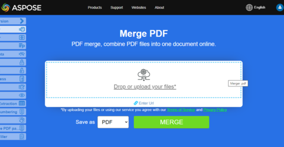

<script type="application/ld+json">
{
    "@context": "https://schema.org",
    "@type": "TechArticle",
    "headline": "Cómo Combinar PDF usando Python",
    "alternativeHeadline": "Combinar documentos PDF mediante Python",
    "author": {
        "@type": "Person",
        "name":"Anastasiia Holub",
        "givenName": "Anastasiia",
        "familyName": "Holub",
        "url":"https://www.linkedin.com/in/anastasiia-holub-750430225/"
    },
    "genre": "manipulación de documentos pdf",
    "keywords": "pdf, python, fusionar pdf, concatenar, combinar pdf",
    "wordcount": "212",
    "proficiencyLevel":"Principiante",
    "publisher": {
        "@type": "Organization",
        "name": "Equipo de Documentación de Aspose.PDF",
        "url": "https://products.aspose.com/pdf",
        "logo": "https://www.aspose.cloud/templates/aspose/img/products/pdf/aspose_pdf-for-python-net.svg",
        "alternateName": "Aspose",
        "sameAs": [
            "https://facebook.com/aspose.pdf/",
            "https://twitter.com/asposepdf",
            "https://www.youtube.com/channel/UCmV9sEg_QWYPi6BJJs7ELOg/featured",
            "https://www.linkedin.com/company/aspose",
            "https://stackoverflow.com/questions/tagged/aspose",
            "https://aspose.quora.com/",
            "https://aspose.github.io/"
        ],
        "contactPoint": [
            {
                "@type": "ContactPoint",
                "telephone": "+1 903 306 1676",
                "contactType": "ventas",
                "areaServed": "US",
                "availableLanguage": "en"
            },
            {
                "@type": "ContactPoint",
                "telephone": "+44 141 628 8900",
                "contactType": "ventas",
                "areaServed": "GB",
                "availableLanguage": "en"
            },
            {
                "@type": "ContactPoint",
                "telephone": "+61 2 8006 6987",
                "contactType": "ventas",
                "areaServed": "AU",
                "availableLanguage": "en"
            }
        ]
    },
    "url": "https://docs.aspose.com/pdf/python-net/merge-pdf-documents/",
    "mainEntityOfPage": {
        "@type": "WebPage",
        "@id": "https://docs.aspose.com/pdf/python-net/merge-pdf-documents/"
    },
    "dateModified": "2023-04-14",
    "description": "Esta página explica cómo combinar documentos PDF en un solo archivo PDF con Python a través de .NET."
}
</script>


## Fusionar o combinar varios PDF en un solo PDF en Python

Combinar archivos PDF es una consulta muy popular entre los usuarios. Esto puede ser útil cuando tienes varios archivos PDF que deseas compartir o almacenar juntos como un solo documento.

Fusionar archivos PDF puede ayudarte a organizar tus documentos, liberar espacio de almacenamiento en tu PC y compartir varios archivos PDF con otros al combinarlos en un solo documento.

Fusionar PDF en Python a través de .NET no es una tarea sencilla sin usar una biblioteca de terceros.
Este artículo muestra cómo fusionar varios archivos PDF en un solo documento PDF utilizando Aspose.PDF para Python a través de .NET.

## Fusionar archivos PDF usando Python y DOM

Para concatenar dos archivos PDF:

1. Crea dos objetos [Document](https://reference.aspose.com/pdf/python-net/aspose.pdf/document/), cada uno conteniendo uno de los archivos PDF de entrada.

1. Luego, llame al método [add()](https://reference.aspose.com/pdf/python-net/aspose.pdf/pagecollection/#methods) de la colección [PageCollection](https://reference.aspose.com/pdf/python-net/aspose.pdf/pagecollection/) para el objeto Document al que desea agregar el otro archivo PDF.
1. Pase la colección PageCollection del segundo objeto Document al método [add()](https://reference.aspose.com/pdf/python-net/aspose.pdf/pagecollection/#methods) de la primera colección PageCollection.
1. Finalmente, guarde el archivo PDF de salida usando el método [save()](https://reference.aspose.com/pdf/python-net/aspose.pdf/document/#methods).

El siguiente fragmento de código muestra cómo concatenar archivos PDF.

```python

    import aspose.pdf as ap

    # Abrir el primer documento
    document1 = ap.Document(input_pdf_1)
    # Abrir el segundo documento
    document2 = ap.Document(input_pdf_2)

    # Añadir páginas del segundo documento al primero
    document1.pages.add(document2.pages)

    # Guardar archivo de salida concatenado
    document1.save(output_pdf)
```

## Ejemplo en Vivo

[Aspose.PDF Merger](https://products.aspose.app/pdf/merger) es una aplicación web gratuita en línea que te permite investigar cómo funciona la funcionalidad de combinación de presentaciones.

[](https://products.aspose.app/pdf/merger)

<script type="application/ld+json">
{
    "@context": "http://schema.org",
    "@type": "SoftwareApplication",
    "name": "Aspose.PDF for Python via .NET Library",
    "image": "https://www.aspose.cloud/templates/aspose/img/products/pdf/aspose_pdf-for-python-net.svg",
    "url": "https://www.aspose.com/",
    "publisher": {
        "@type": "Organization",
        "name": "Aspose.PDF",
        "url": "https://products.aspose.com/pdf",
        "logo": "https://www.aspose.cloud/templates/aspose/img/products/pdf/aspose_pdf-for-python-net.svg",
        "alternateName": "Aspose",
        "sameAs": [
            "https://facebook.com/aspose.pdf/",
            "https://twitter.com/asposepdf",
            "https://www.youtube.com/channel/UCmV9sEg_QWYPi6BJJs7ELOg/featured",
            "https://www.linkedin.com/company/aspose",
            "https://stackoverflow.com/questions/tagged/aspose",
            "https://aspose.quora.com/",
            "https://aspose.github.io/"
        ],
        "contactPoint": [
            {
                "@type": "ContactPoint",
                "telephone": "+1 903 306 1676",
                "contactType": "ventas",
                "areaServed": "US",
                "availableLanguage": "en"
            },
            {
                "@type": "ContactPoint",
                "telephone": "+44 141 628 8900",
                "contactType": "ventas",
                "areaServed": "GB",
                "availableLanguage": "en"
            },
            {
                "@type": "ContactPoint",
                "telephone": "+61 2 8006 6987",
                "contactType": "ventas",
                "areaServed": "AU",
                "availableLanguage": "en"
            }
        ]
    },
    "offers": {
        "@type": "Offer",
        "price": "1199",
        "priceCurrency": "USD"
    },
    "applicationCategory": "Biblioteca de manipulación de PDF para Python",
    "downloadUrl": "https://www.nuget.org/packages/Aspose.PDF/",
    "operatingSystem": "Windows, MacOS, Linux",
    "screenshot": "https://docs.aspose.com/pdf/python-net/create-pdf-document/example.png",
    "softwareVersion": "2022.1",
    "aggregateRating": {
        "@type": "AggregateRating",
        "ratingValue": "5",
        "ratingCount": "16"
    }
}
</script>