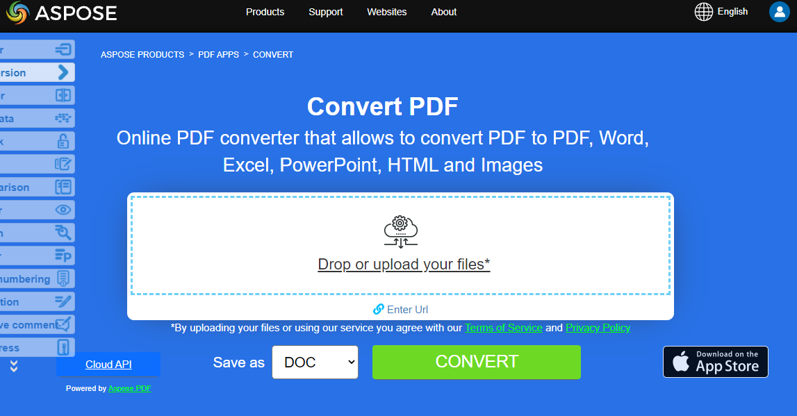

¿Quieres convertir PDF a otros formatos usando Python? **Aspose.PDF for Python** es la mejor solución para convertir documentos PDF. Recuerda que Python es un lenguaje de programación orientado a objetos que se utiliza para desarrollar prototipos de software para aplicaciones web y procesamiento de datos. Ahora aprendamos cómo puedes convertir PDF a texto usando Python.

Los archivos PDF pueden contener no solo texto sino también imágenes, botones clicables, hipervínculos, fuentes incrustadas, firmas, sellos, etc. Los usuarios que están convirtiendo un archivo PDF a otro formato están interesados en hacerlo para poder editar el contenido del PDF.
**Nuestra Aspose.PDF for Python** library permite convertir tus documentos PDF a los formatos más populares y viceversa, de forma exitosa, rápida y sencilla.

## Cómo usar Aspose.PDF para la conversión

La siguiente sección describe las opciones más populares para convertir documentos PDF.
Después de aprender los ejemplos de código, entenderás que la biblioteca Aspose.PDF for Python via .NET ofrece soluciones bastante universales que te ayudarán a resolver las tareas de conversión de documentos.
Aspose.PDF admite la mayor cantidad de formatos de documentos populares, tanto para cargar como para guardar.

Observe que la sección actual describe solo conversiones populares.
Para obtener una lista completa de los formatos compatibles, consulte la sección [Formatos de archivo compatibles con Aspose.PDF](https://docs.aspose.com/pdf/python-net/supported-file-formats/).

Aspose.PDF for Python via .NET permite convertir documentos PDF a varios formatos y también convertir desde otros formatos a PDF. Además, puede comprobar la calidad de la conversión de Aspose.PDF y ver los resultados en línea con la Aspose.PDF converter app. Aprenda las secciones de conversión de documentos con fragmentos de código.

Los documentos de Word son los más versátiles y editables posibles. Convertir PDF a Word manualmente es una tarea que consume mucho tiempo. En este artículo, aprenderá cómo convertir PDF a Word de forma programática en Python.

- [Convertir PDF a Microsoft Word](/pdf/python-net/convert-pdf-to-word/) - puedes convertir tu documento PDF al formato Word con Python

Los formatos numéricos son necesarios no solo para que los datos en la tabla sean más fáciles de leer, sino también para que la tabla sea más fácil de usar. Por supuesto, si necesitas convertir esos datos de un documento PDF al formato Excel, usa nuestra biblioteca Aspose.PDF.

- [Convertir PDF a Microsoft Excel](/pdf/python-net/convert-pdf-to-excel/) - esta sección describe cómo convertir un documento PDF a XLSX, ODS, CSV y SpreadSheetML

El formato PowerPoint se utiliza para crear diversas presentaciones. Los archivos PPT contienen un gran número de diapositivas o páginas que contienen diversa información.

- [Convertir PDF a Microsoft PowerPoint](/pdf/python-net/convert-pdf-to-powerpoint/) - aquí estamos hablando de convertir PDF a PowerPoint siguiendo el proceso de conversión.

HyperText Markup Language es un lenguaje de descripción de documentos hipertexto, un lenguaje estándar para crear páginas web. Con Aspose.PDF for Python puedes convertir fácilmente documentos HTML y viceversa.

- [Convertir formato HTML a archivo PDF](/pdf/python-net/convert-html-to-pdf/) - artículo sobre diferentes aspectos de la conversión de HTML a PDF.
- [Convertir archivo PDF a formato HTML](/pdf/python-net/convert-pdf-to-html/) - convierta sus documentos PDF a archivos HTML como páginas separadas o como una página única.

Hay muchos formatos de imagen que necesitan convertirse a PDF para diferentes propósitos. Aspose.PDF permite los formatos de imagen más populares y viceversa.

- [Convertir PDF a varios formatos de imágenes](/pdf/python-net/convert-pdf-to-images-format/) - convierta páginas PDF como imágenes en JPEG, PNG y otros formatos.

Esta sección incluye formatos como: EPUB, Markdown, PCL, XPS, LATex/TeX, Texto y PostScript.

- [Convertir archivo PDF a otros formatos](/pdf/python-net/convert-pdf-to-other-files/) - este tema describe la forma de convertir documentos PDF a varios formatos.

PDF/A es una versión de PDF diseñada para el archivo a largo plazo de documentos electrónicos.
Si honestamente, externamente, es muy difícil determinar si es PDF o PDF/A. Para verificar este archivo, se utilizan validadores. Consulte los siguientes artículos para una conversión de calidad de PDF a PDF/A y viceversa.

- [Convertir PDF a formatos PDF/A](/pdf/python-net/convert-pdf-to-pdfa/) - La biblioteca Python de Aspose.PDF tiene una forma fácil de convertir PDF a PDF/A.

- [Convertir formatos de imágenes a archivo PDF](/pdf/python-net/convert-images-format-to-pdf/) - Aspose.PDF le permite convertir diferentes formatos de imágenes a un archivo PDF.

- [Convertir otros formatos de archivo a PDF](/pdf/python-net/convert-other-files-to-pdf/) - este tema describe la conversión con varios formatos como EPUB, XPS, Postscript, texto y otros.

- [Convertir PDF/x a PDF](/pdf/python-net/convert-pdf_x-to-pdf/) - este tema describe la conversión de PDF/UA y PDF/A a PDF.

- [Convertir PDF a PDF/x](/pdf/python-net/convert-pdf-to-pdf_x/) - este tema describe la conversión de PDF a formatos PDF/A, PDF/E y PDF/X.

## Intenta convertir archivos PDF en línea

{}

Puedes probar la funcionalidad de conversión utilizando nuestras aplicaciones Aspose PDF:

{}
