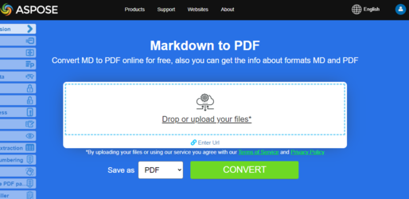

Este artículo explica cómo **convertir varios tipos de formatos de archivo a PDF usando Python**. Cubre los siguientes temas.

## Convertir OFD a PDF

OFD significa Open Fixed-layout Document (también llamado formato Open Fixed Document). Es una norma nacional china (GB/T 33190-2016) para documentos electrónicos, introducida como una alternativa al PDF.

Pasos para convertir OFD a PDF en Python:

1. Configura las opciones de carga OFD usando OfdLoadOptions().
1. Cargar el documento OFD.
1. Guardar como PDF.

```python
from os import path
import aspose.pdf as ap

path_infile = path.join(self.data_dir, infile)
path_outfile = path.join(self.data_dir, "python", outfile)

load_options = ap.OfdLoadOptions()
document = ap.Document(path_infile, load_options)
document.save(path_outfile)

print(infile + " converted into " + outfile)
```

## Convertir LaTeX/TeX a PDF

El formato de archivo LaTeX es un formato de archivo de texto con marcado en el derivado LaTeX de la familia de lenguajes TeX y LaTeX es un formato derivado del sistema TeX. LaTeX (\u02C8le\u026At\u025Bk/lay-tek o lah-tek) es un sistema de preparación de documentos y lenguaje de marcado de documentos. Se utiliza ampliamente para la comunicación y publicación de documentos científicos en muchos campos, incluyendo matemáticas, física y ciencias de la computación. También desempeña un papel clave en la preparación y publicación de libros y artículos que contienen material multilingüe complejo, como coreano, japonés, caracteres chinos y árabe, incluidas ediciones especiales.

LaTeX utiliza el programa de composición tipográfica TeX para formatear su salida, y está escrito en el lenguaje macro de TeX.

{}
**Intenta convertir LaTeX/TeX a PDF en línea**

Aspose.PDF for Python via .NET le presenta una aplicación gratuita en línea ["LaTex a PDF"](https://products.aspose.app/pdf/conversion/tex-to-pdf), donde puede intentar investigar la funcionalidad y la calidad con la que funciona.

[](https://products.aspose.app/pdf/conversion/tex-to-pdf)
{}

Pasos Convertir TEX a PDF en Python:

1. Configure las opciones de carga de LaTeX usando LatexLoadOptions().
1. Cargar el documento LaTeX.
1. Guardar como PDF.

```python
from os import path
import aspose.pdf as ap

path_infile = path.join(self.data_dir, infile)
path_outfile = path.join(self.data_dir, "python", outfile)

load_options = ap.LatexLoadOptions()
document = ap.Document(path_infile, load_options)
document.save(path_outfile)

print(infile + " converted into " + outfile)
```
## Convertir OFD a PDF

OFD significa Open Fixed-layout Document (a veces llamado formato Open Fixed Document). Es una norma nacional china (GB/T 33190-2016) para documentos electrónicos, introducida como una alternativa al PDF.

Pasos para convertir OFD a PDF en Python:

1. Configura las opciones de carga OFD usando OfdLoadOptions().
1. Cargar el documento OFD.
1. Guardar como PDF.

```python
from os import path
import aspose.pdf as ap

path_infile = path.join(self.data_dir, infile)
path_outfile = path.join(self.data_dir, "python", outfile)

load_options = ap.OfdLoadOptions()
document = ap.Document(path_infile, load_options)
document.save(path_outfile)

print(infile + " converted into " + outfile)
```

## Convertir LaTeX/TeX a PDF

El formato de archivo LaTeX es un formato de archivo de texto con marcas en el derivado LaTeX de la familia de lenguajes TeX y LaTeX es un formato derivado del sistema TeX. LaTeX (\u02C8le\u026At\u025Bk/lay-tek o lah-tek) es un sistema de preparación de documentos y un lenguaje de marcado de documentos. Es ampliamente utilizado para la comunicación y publicación de documentos científicos en muchos campos, incluidos matemáticas, física y ciencias de la computación. También tiene un papel destacado en la preparación y publicación de libros y artículos que contienen materiales multilingües complejos, como sánscrito y árabe, incluidas ediciones críticas. LaTeX utiliza el programa de composición tipográfica TeX para formatear su salida, y está escrito en el lenguaje de macros TeX.

{}
**Intenta convertir LaTeX/TeX a PDF en línea**

Aspose.PDF for Python via .NET le presenta una aplicación gratuita en línea ["LaTex a PDF"](https://products.aspose.app/pdf/conversion/tex-to-pdf), donde puede intentar investigar la funcionalidad y la calidad con la que funciona.

[](https://products.aspose.app/pdf/conversion/tex-to-pdf)
{}

Pasos Convertir TEX a PDF en Python:

1. Configure las opciones de carga de LaTeX usando LatexLoadOptions().
1. Cargar el documento LaTeX.
1. Guardar como PDF.

```python
from os import path
import aspose.pdf as ap

path_infile = path.join(self.data_dir, infile)
path_outfile = path.join(self.data_dir, "python", outfile)

load_options = ap.LatexLoadOptions()
document = ap.Document(path_infile, load_options)
document.save(path_outfile)

print(infile + " converted into " + outfile)
```

## Convertir EPUB a PDF

**Aspose.PDF for Python via .NET** permite convertir fácilmente archivos EPUB al formato PDF.

EPUB (abreviatura de electronic publication) es un estándar gratuito y abierto de libros electrónicos del International Digital Publishing Forum (IDPF). Los archivos tienen la extensión .epub. EPUB está diseñado para contenido refluible, lo que significa que un lector de EPUB puede optimizar el texto para un dispositivo de visualización determinado.

<abbr title="electronic publication">EPUB</abbr> también admite contenido de diseño fijo. El formato está destinado como un formato único que los editores y las casas de conversión pueden usar internamente, así como para distribución y venta. Sustituye el estándar Open eBook.La versión EPUB 3 también cuenta con el respaldo del Book Industry Study Group (BISG), una asociación líder en el comercio de libros para mejores prácticas estandarizadas, investigación, información y eventos, para el empaquetado de contenido.

{}
**Intenta convertir EPUB a PDF en línea**

Aspose.PDF for Python via .NET le presenta una aplicación gratuita en línea ["EPUB a PDF"](https://products.aspose.app/pdf/conversion/epub-to-pdf), donde puede intentar investigar la funcionalidad y la calidad con la que funciona.

[](https://products.aspose.app/pdf/conversion/epub-to-pdf)
{}

Pasos para convertir EPUB a PDF en Python:

1. Cargar documento EPUB con EpubLoadOptions().
1. Convertir EPUB a PDF.
1. Confirmación de impresión.

El siguiente fragmento de código le muestra cómo convertir archivos EPUB a formato PDF con Python.

```python
from os import path
import aspose.pdf as ap

path_infile = path.join(self.data_dir, infile)
path_outfile = path.join(self.data_dir, "python", outfile)

load_options = ap.EpubLoadOptions()
document = ap.Document(path_infile, load_options)

document.save(path_outfile)
print(infile + " converted into " + outfile)
```

## Convertir Markdown a PDF

**Esta característica es compatible con la versión 19.6 o superior.**

{}
**Intenta convertir Markdown a PDF en línea**

Aspose.PDF for Python via .NET le presenta una aplicación gratuita en línea ["Markdown a PDF"](https://products.aspose.app/pdf/conversion/md-to-pdf), donde puede intentar investigar la funcionalidad y la calidad con la que funciona.

[](https://products.aspose.app/pdf/conversion/md-to-pdf)
{}

Este fragmento de código de Aspose.PDF for Python via .NET ayuda a convertir archivos Markdown en PDFs, permitiendo una mejor compartición de documentos, preservación del formato y compatibilidad de impresión.o

El siguiente fragmento de código muestra cómo usar esta funcionalidad con la biblioteca Aspose.PDF:

```python
from os import path
import aspose.pdf as ap

path_infile = path.join(self.data_dir, infile)
path_outfile = path.join(self.data_dir, "python", outfile)

load_options = ap.MdLoadOptions()
document = ap.Document(path_infile, load_options)
document.save(path_outfile)
print(infile + " converted into " + outfile)
```

## Convertir PCL a PDF

<abbr title="Printer Command Language">PCL</abbr> (Printer Command Language) es un lenguaje de impresora de Hewlett-Packard desarrollado para acceder a funciones estándar de la impresora. Los niveles PCL 1 a 5e/5c son lenguajes basados en comandos que utilizan secuencias de control que se procesan e interpretan en el orden en que se reciben. A nivel de consumidor, las corrientes de datos PCL son generadas por un controlador de impresión. La salida PCL también puede ser generada fácilmente por aplicaciones personalizadas.

{}
**Intenta convertir PCL a PDF en línea**

Aspose.PDF para .NET le presenta una aplicación gratuita en línea ["PCL a PDF"](https://products.aspose.app/pdf/conversion/pcl-to-pdf), donde puede intentar investigar la funcionalidad y la calidad con la que funciona.

[](https://products.aspose.app/pdf/conversion/pcl-to-pdf)
{}

Para permitir la conversión de PCL a PDF, Aspose.PDF tiene la clase [`PclLoadOptions`](https://reference.aspose.com/pdf/net/aspose.pdf/pclloadoptions) que se usa para inicializar el objeto LoadOptions. Más adelante, este objeto se pasa como argumento durante la inicialización del objeto Document y ayuda al motor de renderizado PDF a determinar el formato de entrada del documento fuente.

El siguiente fragmento de código muestra el proceso de convertir un archivo PCL al formato PDF.

Pasos para Convertir PCL a PDF en Python:

1. Opciones de carga para PCL usando PclLoadOptions().
1. Cargar el documento.
1. Guardar como PDF.

```python
from os import path
import aspose.pdf as ap

path_infile = path.join(self.data_dir, infile)
path_outfile = path.join(self.data_dir, "python", outfile)

load_options = ap.PclLoadOptions()
load_options.supress_errors = True

document = ap.Document(path_infile, load_options)
document.save(path_outfile)

print(infile + " converted into " + outfile)
```

## Convertir texto preformateado a PDF

**Aspose.PDF for Python via .NET** soporta la función de convertir archivos de texto plano y texto preformateado a formato PDF.

Convertir texto a PDF significa añadir fragmentos de texto a la página PDF. En cuanto a los archivos de texto, estamos tratando con 2 tipos de texto: preformateado (por ejemplo, 25 líneas con 80 caracteres por línea) y texto sin formato (texto plano). Según nuestras necesidades, podemos controlar esta adición nosotros mismos o confiarla a los algoritmos de la biblioteca.

{}
**Intenta convertir TEXT a PDF en línea**

Aspose.PDF for Python via .NET le presenta una aplicación gratuita en línea ["Texto a PDF"](https://products.aspose.app/pdf/conversion/txt-to-pdf), donde puede intentar investigar la funcionalidad y la calidad con la que funciona.

[](https://products.aspose.app/pdf/conversion/txt-to-pdf)
{}

Pasos Convertir TEXT a PDF en Python:

1. Lea el archivo de texto de entrada línea por línea.
1. Configure una fuente monoespaciada (Courier New) para una alineación de texto consistente.
1. Crea un nuevo documento PDF y agrega la primera página con márgenes personalizados y configuraciones de fuente.
1. Iterar a través de las líneas del archivo de texto Para simular Typewriter, usamos la fuente \u0027monospace_font\u0027 y tamaño 12.
1. Limite la creación de páginas a 4 páginas.
1. Guarde el PDF final en la ruta especificada.

```python
from os import path
import aspose.pdf as ap

path_infile = path.join(self.data_dir, infile)
path_outfile = path.join(self.data_dir, "python", outfile)

with open(path_infile, "r") as file:
    lines = file.readlines()

monospace_font = ap.text.FontRepository.find_font("Courier New")

document = ap.Document()
page = document.pages.add()

page.page_info.margin.left = 20
page.page_info.margin.right = 10
page.page_info.default_text_state.font = monospace_font
page.page_info.default_text_state.font_size = 12
count = 1
for line in lines:
    if line != "" and line[0] == "\x0c":
        page = document.pages.add()
        page.page_info.margin.left = 20
        page.page_info.margin.right = 10
        page.page_info.default_text_state.font = monospace_font
        page.page_info.default_text_state.font_size = 12
        count = count + 1
    else:
        text = ap.text.TextFragment(line)
        page.paragraphs.add(text)

    if count == 4:
        break

document.save(path_outfile)

print(infile + " converted into " + outfile)
```

## Convertir PostScript a PDF

Este ejemplo demuestra cómo convertir un archivo PostScript en un documento PDF usando Aspose.PDF for Python via .NET.

1. Cree una instancia de 'PsLoadOptions' para interpretar correctamente el archivo PS.
1. Cargue el archivo 'PostScript' en un objeto Document usando las opciones de carga.
1. Guarde el documento en formato PDF en la ruta de salida deseada.

```python
from os import path
import aspose.pdf as ap

path_infile = path.join(self.data_dir, infile)
path_outfile = path.join(self.data_dir, "python", outfile)

load_options = ap.PsLoadOptions()

document = ap.Document(path_infile, load_options)
document.save(path_outfile)

print(infile + " converted into " + outfile)
```

## Convertir XPS a PDF

**Aspose.PDF for Python via .NET** admite la función de conversión <abbr title="XML Paper Specification">XPS</abbr> archivos a formato PDF. Consulta este artículo para resolver tus tareas.

El tipo de archivo XPS está asociado principalmente con la XML Paper Specification de Microsoft Corporation. La XML Paper Specification (XPS), anteriormente con el nombre en código Metro y que incorpora el concepto de marketing Next Generation Print Path (NGPP), es la iniciativa de Microsoft para integrar la creación y visualización de documentos en su sistema operativo Windows.

El siguiente fragmento de código muestra el proceso de convertir un archivo XPS al formato PDF con Python.

```python
from os import path
import aspose.pdf as ap

path_infile = path.join(self.data_dir, infile)
path_outfile = path.join(self.data_dir, "python", outfile)

load_options = ap.XpsLoadOptions()
document = ap.Document(path_infile, load_options)
document.save(path_outfile)

print(infile + " converted into " + outfile)
```

{}
**Intenta convertir el formato XPS a PDF en línea**

Aspose.PDF for Python via .NET le presenta una aplicación en línea gratuita ["XPS a PDF"](https://products.aspose.app/pdf/conversion/xps-to-pdf/), donde puede intentar investigar la funcionalidad y la calidad con la que funciona.

[](https://products.aspose.app/pdf/conversion/xps-to-pdf/)
{}

## Convertir XSL-FO a PDF

El siguiente fragmento de código se puede usar para convertir un XSLFO al formato PDF con Aspose.PDF for Python via .NET:

```python
from os import path
import aspose.pdf as ap

path_xsltfile = path.join(self.data_dir, xsltfile)
path_xmlfile = path.join(self.data_dir, xmlfile)
path_outfile = path.join(self.data_dir, "python", outfile)

load_options = ap.XslFoLoadOptions(path_xsltfile)
load_options.parsing_errors_handling_type = (
    ap.XslFoLoadOptions.ParsingErrorsHandlingTypes.ThrowExceptionImmediately
)
document = ap.Document(path_xmlfile, load_options)
document.save(path_outfile)

print(xmlfile + " converted into " + outfile)
```

## Convertir XML con XSLT a PDF

Este ejemplo muestra cómo convertir un archivo XML en un PDF transformándolo primero en HTML mediante una plantilla XSLT y luego cargando el HTML en Aspose.PDF.

1. Crea una instancia de 'HtmlLoadOptions' para configurar la conversión de HTML a PDF.
1. Cargue el archivo HTML transformado en un objeto Document de Aspose.PDF.
1. Guarde el documento como PDF en la ruta de salida especificada.
1. Eliminar el archivo HTML temporal después de una conversión exitosa.

```python
from os import path
import aspose.pdf as ap


def transform_xml_to_html(xml_file, xslt_file, html_file):
    from lxml import etree

    """
    Transform XML to HTML using XSLT and return as a stream
    """
    # Parse XML document
    xml_doc = etree.parse(xml_file)

    # Parse XSLT stylesheet
    xslt_doc = etree.parse(xslt_file)
    transform = etree.XSLT(xslt_doc)

    # Apply transformation
    result = transform(xml_doc)

    # Save result to HTML file
    with open(html_file, "w", encoding="utf-8") as f:
        f.write(str(result))


def convert_XML_to_PDF(template, infile, outfile):
    path_infile = path.join(data_dir, infile)
    path_outfile = path.join(data_dir, "python", outfile)
    path_template = path.join(data_dir, template)
    path_temp_file = path.join(data_dir, "temp.html")

    load_options = ap.HtmlLoadOptions()
    transform_xml_to_html(path_infile, path_template, path_temp_file)

    document = ap.Document(path_temp_file, load_options)
    document.save(path_outfile)

    if path.exists(path_temp_file):
        os.remove(path_temp_file)

    print(infile + " converted into " + outfile)
```
