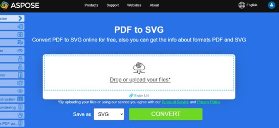

## Visión General

Este artículo explica cómo convertir PDF a diferentes formatos de imagen usando Python. Cubre los siguientes temas.

_Formato de Imagen_: **TIFF**
- [Python PDF a TIFF](#python-pdf-to-tiff)
- [Python Convertir PDF a TIFF](#python-pdf-to-tiff)
- [Python Convertir Páginas Individuales o Particulares de PDF a TIFF](#python-pdf-to-tiff-pages)

_Formato de Imagen_: **BMP**
- [Python PDF a BMP](#python-pdf-to-bmp)
- [Python Convertir PDF a BMP](#python-pdf-to-bmp)
- [Python PDF a BMP Convertidor](#python-pdf-to-bmp)

_Formato de Imagen_: **EMF**
- [Python PDF a EMF](#python-pdf-to-emf)
- [Python Convertir PDF a EMF](#python-pdf-to-emf)
- [Python PDF a EMF Converter](#python-pdf-to-emf)

_Formato de Imagen_: **JPG**
- [Python PDF a JPG](#python-pdf-to-jpg)
- [Python Convertir PDF a JPG](#python-pdf-to-jpg)
- [Python PDF a JPG Converter](#python-pdf-to-jpg)

_Formato de Imagen_: **PNG**
- [Python PDF a PNG](#python-pdf-to-png)
- [Python Convertir PDF a PNG](#python-pdf-to-png)
- [Python PDF a PNG Converter](#python-pdf-to-png)

_Formato de Imagen_: **GIF**
- [Python PDF a GIF](#python-pdf-to-gif)
- [Python Convertir PDF a GIF](#python-pdf-to-gif)
- [Python PDF a GIF Converter](#python-pdf-to-gif)

_Formato de Imagen_: **SVG**
- [Python PDF a SVG](#python-pdf-to-svg)
- [Python Convertir PDF a SVG](#python-pdf-to-svg)
- [Python PDF a SVG Converter](#python-pdf-to-svg)

## Python Convertir PDF a Imagen

**Aspose.PDF for Python** utiliza varios enfoques para convertir PDF a imagen.
 Generalmente hablando, usamos dos enfoques: conversión usando el enfoque Device y conversión usando SaveOption. Esta sección le mostrará cómo convertir documentos PDF a formatos de imagen como BMP, JPEG, GIF, PNG, EMF, TIFF y SVG utilizando uno de esos enfoques.

Hay varias clases en la biblioteca que le permiten usar un dispositivo virtual para transformar imágenes. DocumentDevice está orientado a la conversión de todo el documento, pero ImageDevice - para una página particular.

## Convertir PDF usando la clase DocumentDevice

**Aspose.PDF para Python** hace posible convertir páginas PDF a imágenes TIFF.

La clase [TiffDevice](https://reference.aspose.com/pdf/python-net/aspose.pdf.devices/tiffdevice/) (basada en DocumentDevice) le permite convertir páginas PDF a imágenes TIFF. Esta clase proporciona un método llamado [process](https://reference.aspose.com/pdf/python-net/aspose.pdf.devices/tiffdevice/#methods) que le permite convertir todas las páginas en un archivo PDF a una sola imagen TIFF.

{}

**Intente convertir PDF a TIFF en línea**
Aspose.PDF for Python via .NET te presenta la aplicación gratuita en línea ["PDF a TIFF"](https://products.aspose.app/pdf/conversion/pdf-to-tiff), donde puedes intentar investigar la funcionalidad y calidad con la que trabaja.

[](https://products.aspose.app/pdf/conversion/pdf-to-tiff)
{}

### Convertir Páginas de PDF a Una Imagen TIFF

Aspose.PDF para Python explica cómo convertir todas las páginas de un archivo PDF a una sola imagen TIFF:

<a name="csharp-pdf-to-tiff"><strong>Pasos: Convertir PDF a TIFF en Python</strong></a>

1. Crea un objeto de la clase [Document](https://reference.aspose.com/pdf/python-net/aspose.pdf/document/).
2. Crea objetos [TiffSettings](https://reference.aspose.com/pdf/python-net/aspose.pdf.devices/tiffsettings/) y [TiffDevice](https://reference.aspose.com/pdf/python-net/aspose.pdf.devices/tiffdevice/).

3. Llame al método [process](https://reference.aspose.com/pdf/python-net/aspose.pdf.devices/tiffdevice/#methods) para convertir el documento PDF a TIFF.
4. Para establecer las propiedades del archivo de salida, use la clase [TiffSettings](https://reference.aspose.com/pdf/python-net/aspose.pdf.devices/tiffsettings/).

El siguiente fragmento de código muestra cómo convertir todas las páginas del PDF en una sola imagen TIFF.

```python

    import aspose.pdf as ap

    input_pdf = DIR_INPUT + "sample.pdf"
    output_pdf = DIR_OUTPUT + "convert_pdf_to_tiff.tiff"
    # Abrir documento PDF
    document = ap.Document(input_pdf)

    # Crear objeto Resolution
    resolution = ap.devices.Resolution(300)

    # Crear objeto TiffSettings
    tiffSettings = ap.devices.TiffSettings()
    tiffSettings.compression = ap.devices.CompressionType.LZW
    tiffSettings.depth = ap.devices.ColorDepth.DEFAULT
    tiffSettings.skip_blank_pages = False

    # Crear dispositivo TIFF
    tiffDevice = ap.devices.TiffDevice(resolution, tiffSettings)

    # Convertir una página particular y guardar la imagen en el flujo
    tiffDevice.process(document, output_pdf)
```


## Convertir PDF usando la clase ImageDevice

`ImageDevice` es el ancestro de `BmpDevice`, `JpegDevice`, `GifDevice`, `PngDevice` y `EmfDevice`.

- La clase [BmpDevice](https://reference.aspose.com/pdf/python-net/aspose.pdf.devices/bmpdevice/) te permite convertir páginas PDF a imágenes <abbr title="Archivo de Imagen de Mapa de Bits">BMP</abbr>.
- La clase [EmfDevice](https://reference.aspose.com/pdf/python-net/aspose.pdf.devices/emfdevice/) te permite convertir páginas PDF a imágenes <abbr title="Archivo de Metarchivo Mejorado">EMF</abbr>.
- La clase [JpegDevice](https://reference.aspose.com/pdf/python-net/aspose.pdf.devices/jpegdevice/) te permite convertir páginas PDF a imágenes JPEG.
- La clase [PngDevice](https://reference.aspose.com/pdf/python-net/aspose.pdf.devices/pngdevice/) te permite convertir páginas PDF a imágenes <abbr title="Gráficos de Red Portátiles">PNG</abbr>.

- La clase [GifDevice](https://reference.aspose.com/pdf/python-net/aspose.pdf.devices/gifdevice/) te permite convertir páginas PDF a imágenes <abbr title="Formato de Intercambio de Gráficos">GIF</abbr>.

Echemos un vistazo a cómo convertir una página de PDF a una imagen.

La clase [BmpDevice](https://reference.aspose.com/pdf/python-net/aspose.pdf.devices/bmpdevice/) proporciona un método llamado [process](https://reference.aspose.com/pdf/python-net/aspose.pdf.devices/bmpdevice/#methods) que te permite convertir una página específica del archivo PDF al formato de imagen BMP. Las otras clases tienen el mismo método. Entonces, si necesitamos convertir una página de PDF a una imagen, simplemente instanciamos la clase requerida.

<a name="csharp-pdf-to-bmp"></a>
<a name="csharp-pdf-to-emf"></a>
<a name="csharp-pdf-to-jpg"></a>
<a name="csharp-pdf-to-png"></a>
<a name="csharp-pdf-to-gif"></a>
    
Los siguientes pasos y fragmentos de código en Python muestran esta posibilidad
 
 - [Convertir PDF a BMP en Python](#python-pdf-to-image)
 - [Convertir PDF a EMF en Python](#python-pdf-to-image)
 - [Convertir PDF a JPG en Python](#python-pdf-to-image)
 - [Convertir PDF a PNG en Python](#python-pdf-to-image)
 - [Convertir PDF a GIF en Python](#python-pdf-to-image)


<a name="csharp-pdf-to-image"><strong>Pasos: PDF a Imagen (BMP, EMF, JPG, PNG, GIF) en Python</strong></a>

1. Cargue el archivo PDF usando la clase [Document](https://reference.aspose.com/pdf/python-net/aspose.pdf/document/).
2. Cree una instancia de una subclase de [ImageDevice](https://reference.aspose.com/pdf/python-net/aspose.pdf.devices/imagedevice/), es decir:
   * [BmpDevice](https://reference.aspose.com/pdf/python-net/aspose.pdf.devices/bmpdevice/) (para convertir PDF a BMP)
   * [EmfDevice](https://reference.aspose.com/pdf/python-net/aspose.pdf.devices/emfdevice/) (para convertir PDF a Emf)
   * [JpegDevice](https://reference.aspose.com/pdf/python-net/aspose.pdf.devices/jpegdevice/) (para convertir PDF a JPG)
   * [PngDevice](https://reference.aspose.com/pdf/python-net/aspose.pdf.devices/pngdevice/) (para convertir PDF a PNG)
   * [GifDevice](https://reference.aspose.com/pdf/python-net/aspose.pdf.devices/gifdevice/) (para convertir PDF a GIF)
3. Llame al método [ImageDevice.Process()](https://reference.aspose.com/pdf/python-net/aspose.pdf.devices/imagedevice/#methods) para realizar la conversión de PDF a Imagen.

### Convertir PDF a BMP

```python

    import aspose.pdf as ap

    input_pdf = DIR_INPUT + "many_pages.pdf"
    output_pdf = DIR_OUTPUT + "convert_pdf_to_bmp"
    # Abrir documento PDF
    document = ap.Document(input_pdf)

    # Crear objeto Resolution
    resolution = ap.devices.Resolution(300)
    device = ap.devices.BmpDevice(resolution)

    for i in range(0, len(document.pages)):
        # Crear archivo para guardar
        imageStream = io.FileIO(
            output_pdf + "_page_" + str(i + 1) + "_out.bmp", 'x'
        )
        # Convertir una página en particular y guardar la imagen en el flujo
        device.process(document.pages[i + 1], imageStream)
        imageStream.close()
```


### Convertir PDF a EMF

```python

    import aspose.pdf as ap

    input_pdf = DIR_INPUT + "sample.pdf"
    output_pdf = DIR_OUTPUT + "convert_pdf_to_emf"
    # Abrir documento PDF
    document = ap.Document(input_pdf)

    # Crear objeto Resolution
    resolution = ap.devices.Resolution(300)
    device = ap.devices.EmfDevice(resolution)

    for i in range(0, len(document.pages)):
        # Crear archivo para guardar
        imageStream = io.FileIO(
            output_pdf + "_page_" + str(i + 1) + "_out.emf", 'x'
        )
        # Convertir una página particular y guardar la imagen en el flujo
        device.process(document.pages[i + 1], imageStream)
        imageStream.close()
```  

### Convertir PDF a JPEG

```python

    import aspose.pdf as ap

    input_pdf = DIR_INPUT + "many_pages.pdf"
    output_pdf = DIR_OUTPUT + "convert_pdf_to_jpeg"
    # Abrir documento PDF
    document = ap.Document(input_pdf)

    # Crear objeto Resolution
    resolution = ap.devices.Resolution(300)
    device = ap.devices.JpegDevice(resolution)

    for i in range(0, len(document.pages)):
        # Crear archivo para guardar
        imageStream = io.FileIO(
            output_pdf + "_page_" + str(i + 1) + "_out.jpeg", "x"
        )
        # Convertir una página particular y guardar la imagen en el flujo
        device.process(document.pages[i + 1], imageStream)
        imageStream.close()  
``` 


### Convertir PDF a PNG

```python

    import aspose.pdf as ap

    input_pdf = DIR_INPUT + "sample.pdf"
    output_pdf = DIR_OUTPUT + "convert_pdf_to_png"
    # Abrir documento PDF
    document = ap.Document(input_pdf)

    # Crear objeto de resolución
    resolution = ap.devices.Resolution(300)
    device = ap.devices.PngDevice(resolution)

    for i in range(0, len(document.pages)):
        # Crear archivo para guardar
        imageStream = io.FileIO(
            output_pdf + "_page_" + str(i + 1) + "_out.png", 'x'
        )
        # Convertir una página en particular y guardar la imagen en el flujo
        device.process(document.pages[i + 1], imageStream)
        imageStream.close()
``` 

### Convertir PDF a GIF

```python

    import aspose.pdf as ap

    input_pdf = DIR_INPUT + "many_pages.pdf"
    output_pdf = DIR_OUTPUT + "convert_pdf_to_gif"
    # Abrir documento PDF
    document = ap.Document(input_pdf)

    # Crear objeto de resolución
    resolution = ap.devices.Resolution(300)

    device = ap.devices.GifDevice(resolution)

    for i in range(0, len(document.pages)):
        # Crear archivo para guardar
        imageStream = io.FileIO(
            output_pdf + "_page_" + str(i + 1) + "_out.gif", 'x'
        )
        # Convertir una página en particular y guardar la imagen en el flujo
        device.process(document.pages[i + 1], imageStream)
        # Cerrar flujo
        imageStream.close()  
``` 


{}
**Intenta convertir PDF a PNG en línea**

Como ejemplo de cómo funcionan nuestras aplicaciones gratuitas, por favor revisa la siguiente función.

Aspose.PDF para Python te presenta la aplicación gratuita en línea ["PDF a PNG"](https://products.aspose.app/pdf/conversion/pdf-to-png), donde puedes intentar investigar la funcionalidad y calidad con la que trabaja.

[](https://products.aspose.app/pdf/conversion/pdf-to-png)
{}

## Convertir PDF usando la clase SaveOptions

Esta parte del artículo te muestra cómo convertir PDF a <abbr title="Gráficos Vectoriales Escalables">SVG</abbr> usando Python y la clase SaveOptions.

{}
**Intenta convertir PDF a SVG en línea**

Aspose.PDF para Python via .NET te presenta la aplicación gratuita en línea ["PDF a SVG"](https://products.aspose.app/pdf/conversion/pdf-to-svg), donde puedes intentar investigar la funcionalidad y calidad con la que trabaja.

[](https://products.aspose.app/pdf/conversion/pdf-to-svg)
{}

**Scalable Vector Graphics (SVG)** es una familia de especificaciones de un formato de archivo basado en XML para gráficos vectoriales bidimensionales, tanto estáticos como dinámicos (interactivos o animados). La especificación SVG es un estándar abierto que ha estado en desarrollo por el World Wide Web Consortium (W3C) desde 1999.

Las imágenes SVG y sus comportamientos se definen en archivos de texto XML. Esto significa que pueden ser buscados, indexados, programados y, si es necesario, comprimidos. Como archivos XML, las imágenes SVG pueden ser creadas y editadas con cualquier editor de texto, pero a menudo es más conveniente crearlas con programas de dibujo como Inkscape.

Aspose.PDF para Python admite la función de convertir imágenes SVG al formato PDF y también ofrece la capacidad de convertir archivos PDF al formato SVG.
 Para cumplir con este requisito, la clase [SvgSaveOptions](https://reference.aspose.com/pdf/python-net/aspose.pdf/svgsaveoptions/) ha sido introducida en el espacio de nombres Aspose.PDF. Instancie un objeto de SvgSaveOptions y páselo como segundo argumento al método [Document.Save()](https://reference.aspose.com/pdf/python-net/aspose.pdf/document/#methods).

El siguiente fragmento de código muestra los pasos para convertir un archivo PDF a formato SVG con Python.

<a name="csharp-pdf-to-svg"><strong>Pasos: Convertir PDF a SVG en Python</strong></a>

1. Cree un objeto de la clase [Document](https://reference.aspose.com/pdf/python-net/aspose.pdf/document/).
2. Cree un objeto [SvgSaveOptions](https://reference.aspose.com/pdf/python-net/aspose.pdf/svgsaveoptions/) con la configuración necesaria.
3. Llame al método [Document.Save()](https://reference.aspose.com/pdf/python-net/aspose.pdf/document/#methods) y pase el objeto [SvgSaveOptions](https://reference.aspose.com/pdf/python-net/aspose.pdf/svgsaveoptions/) para convertir el documento PDF a SVG.

### Convertir PDF a SVG

```python

    import aspose.pdf as ap

    input_pdf = DIR_INPUT + "sample.pdf"
    output_pdf = DIR_OUTPUT + "convert_pdf_to_svg.svg"
    # Abrir documento PDF
    document = ap.Document(input_pdf)

    # Instanciar un objeto de SvgSaveOptions
    saveOptions = ap.SvgSaveOptions()

    # No comprimir la imagen SVG en un archivo Zip
    saveOptions.compress_output_to_zip_archive = False
    saveOptions.treat_target_file_name_as_directory = True

    # Guardar la salida en archivos SVG
    document.save(output_pdf, saveOptions)
```