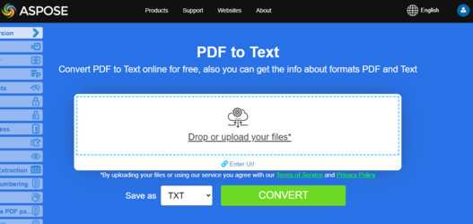
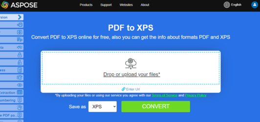

## Convertir PDF a EPUB

{}
**Intenta convertir PDF a EPUB en línea**

Aspose.PDF para Python te presenta una aplicación gratuita en línea ["PDF a EPUB"](https://products.aspose.app/pdf/conversion/pdf-to-epub), donde puedes investigar la funcionalidad y la calidad con la que trabaja.

[](https://products.aspose.app/pdf/conversion/pdf-to-epub)
{}

**<abbr title="Electronic Publication">EPUB</abbr>** es un estándar de libro electrónico libre y abierto del Foro Internacional de Publicación Digital (IDPF).
 Los archivos tienen la extensión .epub.  
EPUB está diseñado para contenido adaptable, lo que significa que un lector EPUB puede optimizar el texto para un dispositivo de visualización particular. EPUB también admite contenido de diseño fijo. El formato está destinado como un formato único que las editoriales y las casas de conversión pueden usar internamente, así como para distribución y venta. Sustituye el estándar Open eBook.

Aspose.PDF para Python también admite la función de convertir documentos PDF a formato EPUB. Aspose.PDF para Python tiene una clase llamada 'EpubSaveOptions' que se puede usar como segundo argumento en el método [save()](https://reference.aspose.com/pdf/python-net/aspose.pdf/document/#methods), para generar un archivo EPUB.  
Por favor, intente usar el siguiente fragmento de código para cumplir con este requisito con Python.

```python

    import aspose.pdf as ap

    input_pdf = DIR_INPUT + "sample.pdf"
    output_pdf = DIR_OUTPUT + "convert_pdf_to_epub.epub"
    # Abrir documento PDF
    document = ap.Document(input_pdf)

    # Instanciar opciones de guardado Epub
    save_options = ap.EpubSaveOptions()

    # Especificar el diseño para los contenidos
    save_options.content_recognition_mode = ap.EpubSaveOptions.RecognitionMode.FLOW

    # Guardar el documento ePUB
    document.save(output_pdf, save_options)
```

## Convertir PDF a LaTeX/TeX

**Aspose.PDF para Python a través de .NET** admite la conversión de PDF a LaTeX/TeX. El formato de archivo LaTeX es un formato de archivo de texto con un marcado especial y se utiliza en el sistema de preparación de documentos basado en TeX para composición tipográfica de alta calidad.

{}
**Intenta convertir PDF a LaTeX/TeX en línea**

Aspose.PDF para Python te presenta la aplicación en línea gratuita ["PDF a LaTeX"](https://products.aspose.app/pdf/conversion/pdf-to-tex), donde puedes intentar investigar la funcionalidad y la calidad con la que funciona.

[](https://products.aspose.app/pdf/conversion/pdf-to-tex)
{}

Para convertir archivos PDF a TeX, Aspose.PDF tiene la clase [LaTeXSaveOptions](https://reference.aspose.com/pdf/python-net/aspose.pdf/latexsaveoptions/) que proporciona la propiedad OutDirectoryPath para guardar imágenes temporales durante el proceso de conversión.

El siguiente fragmento de código muestra el proceso de conversión de archivos PDF al formato TEX con Python.

```python

    import aspose.pdf as ap

    input_pdf = DIR_INPUT + "sample.pdf"
    output_pdf = DIR_OUTPUT + "convert_pdf_to_tex.tex"
    # Abrir documento PDF
    document = ap.Document(input_pdf)
    # Instanciar un objeto de LaTeXSaveOptions
    saveOptions = ap.LaTeXSaveOptions()
    document.save(output_pdf, saveOptions)
```

## Convertir PDF a Texto

**Aspose.PDF para Python** soporta convertir un documento PDF completo y una sola página a un archivo de Texto.

### Convertir documento PDF a archivo de Texto

Puedes convertir un documento PDF a un archivo TXT usando la clase 'TextDevice'.

El siguiente fragmento de código explica cómo extraer los textos de todas las páginas.

```python

    import aspose.pdf as ap

    input_pdf = DIR_INPUT + "sample.pdf"
    output_pdf =  DIR_OUTPUT + "convert_pdf_to_txt.txt"
    # Abrir documento PDF
    document = ap.Document(input_pdf)

    # Crear dispositivo de Texto
    textDevice = ap.devices.TextDevice()

    # Convertir una página particular y guardar
    textDevice.process(document.pages[1], output_pdf)
```


{}
 **Intenta convertir Convertir PDF a Texto en línea**

Aspose.PDF para Python te presenta la aplicación gratuita en línea ["PDF a Texto"](https://products.aspose.app/pdf/conversion/pdf-to-txt), donde puedes intentar investigar la funcionalidad y calidad con la que trabaja.

[](https://products.aspose.app/pdf/conversion/pdf-to-txt)
{}

## Convertir PDF a XPS

**Aspose.PDF para Python** te da la posibilidad de convertir archivos PDF al formato <abbr title="Especificación de Papel XML">XPS</abbr>. Intenta usar el fragmento de código presentado para convertir archivos PDF al formato XPS con Python.

{}
**Intenta convertir PDF a XPS en línea**

Aspose.PDF para Python te presenta la aplicación gratuita en línea ["PDF a XPS"](https://products.aspose.app/pdf/conversion/pdf-to-xps), donde puedes intentar investigar la funcionalidad y calidad con la que trabaja.

[](https://products.aspose.app/pdf/conversion/pdf-to-xps)
{}

El tipo de archivo XPS está asociado principalmente con la Especificación de Papel XML de Microsoft Corporation. La Especificación de Papel XML (XPS), anteriormente con el nombre en código Metro y que subsume el concepto de marketing Next Generation Print Path (NGPP), es la iniciativa de Microsoft para integrar la creación y visualización de documentos en el sistema operativo Windows.

Para convertir archivos PDF a XPS, Aspose.PDF tiene la clase [XpsSaveOptions](https://reference.aspose.com/pdf/python-net/aspose.pdf/xpssaveoptions/) que se utiliza como segundo argumento del método [save()](https://reference.aspose.com/pdf/python-net/aspose.pdf/document/#methods) para generar el archivo XPS.

El siguiente fragmento de código muestra el proceso de conversión de un archivo PDF a formato XPS.

```python

    import aspose.pdf as ap

    input_pdf = DIR_INPUT + "sample.pdf"
    output_pdf = DIR_OUTPUT + "convert_pdf_to_xps.xps"
    # Abrir documento PDF
    document = ap.Document(input_pdf)

    # Instanciar opciones de guardado XPS
    save_options = ap.XpsSaveOptions()

    # Guardar el documento XPS
    document.save(output_pdf, save_options)
```

## Convertir PDF a XML

{}
**Intenta convertir PDF a XML en línea**

Aspose.PDF para Python te presenta una aplicación gratuita en línea ["PDF to XML"](https://products.aspose.app/pdf/conversion/pdf-to-xml), donde puedes investigar la funcionalidad y calidad con la que trabaja.

[](https://products.aspose.app/pdf/conversion/pdf-to-xml)
{}

<abbr title="Extensible Markup Language">XML</abbr> es un lenguaje de marcado y formato de archivo para almacenar, transmitir y reconstruir datos arbitrarios.

Aspose.PDF para Python también admite la función de convertir documentos PDF a formato XML. Aspose.PDF para Python tiene una clase llamada 'XmlSaveOptions' que se puede usar como segundo argumento en el método [save()](https://reference.aspose.com/pdf/python-net/aspose.pdf/document/#methods), para generar un archivo XML.
Por favor intenta usar el siguiente fragmento de código para cumplir con este requisito con Python.

```python

    import aspose.pdf as ap

    def convert_pdf_to_xml(self, infile, outfile):
        path_infile = self.dataDir + infile
        path_outfile = self.dataDir + outfile

        # Abrir documento PDF

        document = ap.Document(path_infile)

        # Instanciar opciones de guardado XML
        save_options = ap.XmlSaveOptions()

        # Guardar el documento XML
        document.save(path_outfile, save_options)
        print(infile + " convertido a " + outfile)
```