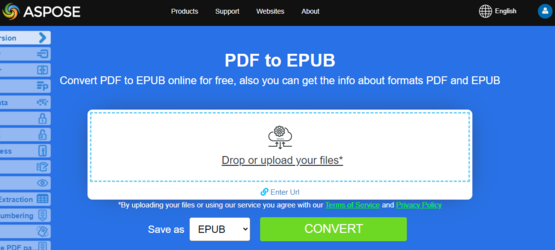
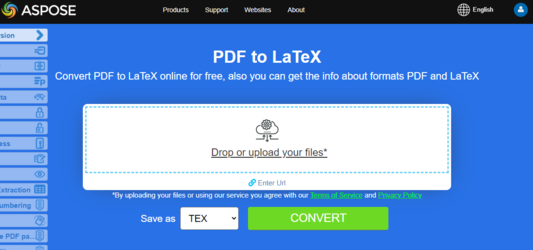

## Convertir PDF a EPUB

{}
**Intenta convertir PDF a EPUB en línea**

Aspose.PDF for Python le presenta aplicación en línea gratuita ["PDF a EPUB"](https://products.aspose.app/pdf/conversion/pdf-to-epub), donde puedes intentar investigar la funcionalidad y la calidad con la que funciona.

[](https://products.aspose.app/pdf/conversion/pdf-to-epub)
{}

<abbr title="Electronic Publication">EPUB</abbr> es un estándar de libro electrónico gratuito y abierto del International Digital Publishing Forum (IDPF). Los archivos tienen la extensión .epub.
EPUB está diseñado para contenido refluible, lo que significa que un lector EPUB puede optimizar el texto para un dispositivo de pantalla concreto. EPUB también admite contenido de diseño fijo. El formato está pensado como un único formato que los editores y casas de conversión pueden usar internamente, así como para la distribución y venta. Reemplaza el estándar Open eBook.

Aspose.PDF for Python también admite la función de convertir documentos PDF al formato EPUB. Aspose.PDF for Python tiene una clase llamada ‘EpubSaveOptions’ que puede usarse como el segundo argumento para [document.save()](https://reference.aspose.com/pdf/python-net/aspose.pdf/document/#methods) método, para generar un archivo EPUB.
Por favor, intente usar el siguiente fragmento de código para cumplir con este requisito con Python.

```python
from os import path
import aspose.pdf as ap

path_infile = path.join(self.data_dir, infile)
path_outfile = path.join(self.data_dir, "python", outfile)

document = ap.Document(path_infile)
save_options = ap.EpubSaveOptions()
save_options.content_recognition_mode = ap.EpubSaveOptions.RecognitionMode.FLOW
document.save(path_outfile, save_options)

print(infile + " converted into " + outfile)
```

## Convertir PDF a LaTeX/TeX

**Aspose.PDF for Python via .NET** admite la conversión de PDF a LaTeX/TeX.
El formato de archivo LaTeX es un formato de archivo de texto con un marcado especial y se usa en el sistema de preparación de documentos basado en TeX para la composición tipográfica de alta calidad.

{}
**Intenta convertir PDF a LaTeX/TeX en línea**

Aspose.PDF for Python le presenta aplicación en línea gratuita ["PDF a LaTeX"](https://products.aspose.app/pdf/conversion/pdf-to-tex), donde puedes intentar investigar la funcionalidad y la calidad con la que funciona.

[](https://products.aspose.app/pdf/conversion/pdf-to-tex)
{}

Para convertir archivos PDF a TeX, Aspose.PDF tiene la clase [LaTeXSaveOptions](https://reference.aspose.com/pdf/python-net/aspose.pdf/latexsaveoptions/) que proporciona la propiedad OutDirectoryPath para guardar imágenes temporales durante el proceso de conversión.

El siguiente fragmento de código muestra el proceso de convertir archivos PDF al formato TEX con Python.

```python
from os import path
import aspose.pdf as ap

path_infile = path.join(self.data_dir, infile)
path_outfile = path.join(self.data_dir, "python", outfile)

document = ap.Document(path_infile)
save_options = ap.LaTeXSaveOptions()

document.save(path_outfile, save_options)
print(infile + " converted into " + outfile)
```

## Convertir PDF a texto

**Aspose.PDF for Python** soporta la conversión de todo el documento PDF y de una sola página a un archivo de texto. Puedes convertir un documento PDF a un archivo TXT usando la clase \u0027TextDevice\u0027. El siguiente fragmento de código explica cómo extraer los textos de todas las páginas.

```python
from os import path
import aspose.pdf as ap

path_infile = path.join(self.data_dir, infile)
path_outfile = path.join(self.data_dir, "python", outfile)

document = ap.Document(path_infile)
device = ap.devices.TextDevice()
device.process(document.pages[1], path_outfile)

print(infile + " converted into " + outfile)
```

{}
**Intenta convertir Convert PDF a Texto en línea**

Aspose.PDF for Python le presenta aplicación en línea gratuita ["PDF a Texto"](https://products.aspose.app/pdf/conversion/pdf-to-txt), donde puedes intentar investigar la funcionalidad y la calidad con la que funciona.

[](https://products.aspose.app/pdf/conversion/pdf-to-txt)
{}

## Convertir PDF a XPS

**Aspose.PDF for Python** ofrece la posibilidad de convertir archivos PDF al formato XPS. Intentemos usar el fragmento de código presentado para convertir archivos PDF al formato XPS con Python.

{}
**Intenta convertir PDF a XPS en línea**

Aspose.PDF for Python le presenta aplicación en línea gratuita ["PDF a XPS"](https://products.aspose.app/pdf/conversion/pdf-to-xps), donde puedes intentar investigar la funcionalidad y la calidad con la que funciona.

[](https://products.aspose.app/pdf/conversion/pdf-to-xps)
{}

El tipo de archivo XPS está asociado principalmente con la XML Paper Specification de Microsoft Corporation. La XML Paper Specification (XPS), anteriormente con el nombre en código Metro y que engloba el concepto de marketing Next Generation Print Path (NGPP), es la iniciativa de Microsoft para integrar la creación y visualización de documentos en el sistema operativo Windows.

Para convertir archivos PDF a XPS, Aspose.PDF tiene la clase [OpcionesDeGuardadoXps](https://reference.aspose.com/pdf/python-net/aspose.pdf/xpssaveoptions/) que se usa como segundo argumento para el [document.save()](https://reference.aspose.com/pdf/python-net/aspose.pdf/document/#methods) método para generar el archivo XPS.

El siguiente fragmento de código muestra el proceso de convertir un archivo PDF al formato XPS.

```python
from os import path
import aspose.pdf as ap

path_infile = path.join(self.data_dir, infile)
path_outfile = path.join(self.data_dir, "python", outfile)

document = ap.Document(path_infile)
save_options = ap.XpsSaveOptions()
save_options.use_new_imaging_engine = True
document.save(path_outfile, save_options)

print(infile + " converted into " + outfile)
```

## Convertir PDF a MD

Aspose.PDF tiene la clase ‘MarkdownSaveOptions()’, que convierte un documento PDF al formato Markdown (MD) mientras preserva imágenes y recursos.

1. Carga el PDF de origen usando 'ap.Document'.
1. Crea una instancia de 'MarkdownSaveOptions'.
1. Establezca 'resources_directory_name' a 'images' – las imágenes extraídas se almacenarán en esta carpeta.
1. Guarde el documento Markdown convertido usando las opciones configuradas.
1. Imprime un mensaje de confirmación después de la conversión.

```python
from os import path
import aspose.pdf as ap

path_infile = path.join(self.data_dir, infile)
path_outfile = path.join(self.data_dir, "python", outfile)

document = ap.Document(path_infile)
save_options = ap.MarkdownSaveOptions()
# save_options.extract_vector_graphics = True
save_options.resources_directory_name = "images"
save_options.use_image_html_tag = True
document.save(path_outfile, save_options)

print(infile + " converted into " + outfile)
```

Un archivo Markdown con texto e imágenes vinculadas almacenadas en la carpeta de imágenes especificada.

## Convertir PDF a MobiXML

Este método convierte un documento PDF al formato MOBI (MobiXML), que se usa comúnmente para libros electrónicos en dispositivos Kindle.

1. Cargue el documento PDF de origen usando 'ap.Document'.
1. Guarde el documento con el formato 'ap.SaveFormat.MOBI_XML'.
1. Imprima un mensaje de confirmación una vez que la conversión haya finalizado.

```python
from os import path
import aspose.pdf as ap

path_infile = path.join(self.data_dir, infile)
path_outfile = path.join(self.data_dir, "python", outfile)

document = ap.Document(path_infile)
document.save(path_outfile, ap.SaveFormat.MOBI_XML)

print(infile + " converted into " + outfile)
```
