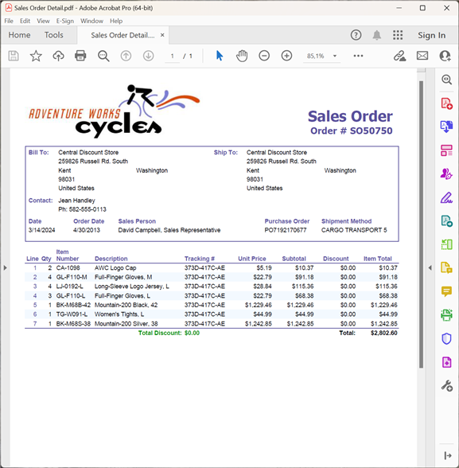

{}

Esta galería demuestra informes PDF exportados por Aspose.Pdf for Reporting Services.

{}

La mayoría de los informes mostrados aquí provienen de la base de datos Adventure Works. Adventure Works es una base de datos de muestra para Microsoft SQL Server, disponible para descargar desde Microsoft [aquí](http://www.microsoft.com/downloads/details.aspx?familyid=E719ECF7-9F46-4312-AF89-6AD8702E4E6E&displaylang=en).

## Ventas de la empresa

## Resumen de ventas de empleados

## Catálogo de productos

## Ventas de línea de producto

## Detalle de orden de venta

