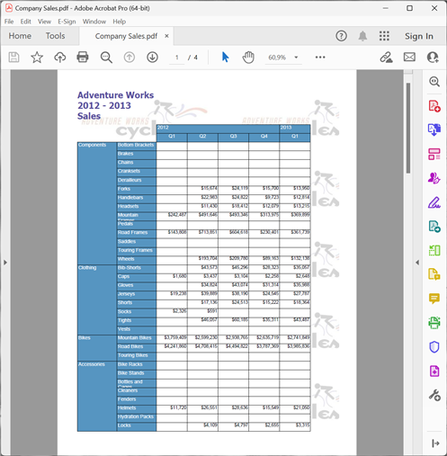
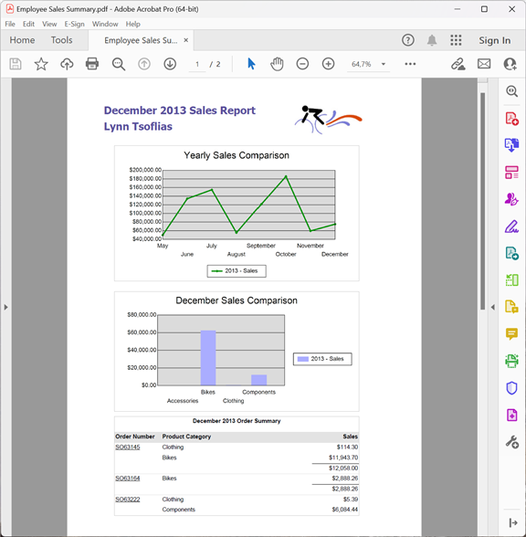

{}

Esta galería muestra informes en PDF exportados por Aspose.PDF para Reporting Services.

{}

La mayoría de los informes que se muestran aquí provienen de la base de datos de Adventure Works. Adventure Works es una base de datos de muestra para Microsoft SQL Server, disponible para descargar desde Microsoft [aquí](http://www.microsoft.com/downloads/details.aspx?familyid=E719ECF7-9F46-4312-AF89-6AD8702E4E6E&displaylang=en).

## Ventas de la empresa

## Resumen de ventas de empleados

## Catálogo de productos

## Ventas de línea de productos

## Detalle de orden de venta

