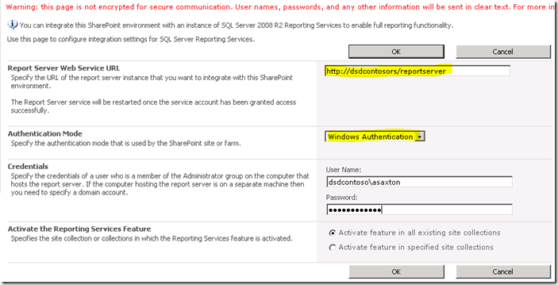
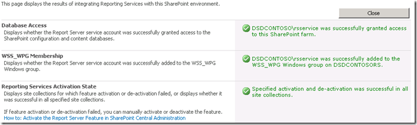

{}

Now that SharePoint is installed and configured on the RS server and RS is setup and setup through the Reporting Services Configuration Manager, we can move onto the configuration within Central Admin. RS 2008 R2 has really simplified this process. We use to have a 3 step process that you had to perform to get this to work. Now we just have one step.

{}

{}

Queremos ir al sitio web del Administrador central y luego a Configuración general de la aplicación. Hacia abajo veremos Reporting Services.

**Imagen1**:- Cuadro de diálogo de configuración de SharePoint

Seleccione el enlace "Integración de Reporting Services". Se mostrará la siguiente pantalla.

**Imagen2**: - Especifique las credenciales de integración de Reporting Services

{}

## URL del servicio web:

**Proporcionaremos la URL del servidor de informes que encontramos en el Administrador de configuración de Reporting Services.**

## Modo de autenticación:

**También seleccionaremos un Modo de autenticación. El siguiente enlace de MSDN explica en detalle cuáles son.
Security Overview for Reporting Services in SharePoint Integrated Mode**

{}

**En resumen, si su sitio utiliza la autenticación de reclamaciones, siempre utilizará la autenticación de confianza independientemente de lo que elija aquí. Si desea pasar las credenciales de Windows, deberá elegir Autenticación de Windows. Para la autenticación confiable, pasaremos el token SPUser y no dependeremos de la credencial de Windows. También querrá utilizar la autenticación de confianza si ha configurado sus sitios en modo clásico para NTLM y RS está configurado para NTLM. Se necesitaría Kerberos para usar la autenticación de Windows y transmitirla a su fuente de datos.**

{}

## Activar función:

{}

**Esto le brinda la opción de activar los Servicios de informes en todas las colecciones de sitios, o puede elegir en cuáles desea activarlos. En realidad, esto simplemente significa qué sitios podrán utilizar Reporting Services. Cuando termine, debería ver los siguientes resultados**

**Image3:**- Successful integration of Reporting Services with SharePoint environment
{}

{}

Volviendo a la URL de ReportServer, deberíamos ver algo similar a lo siguiente

**Imagen4:**- Reporting Services se conecta correctamente con el entorno de SharePoint

**NOTA:** ***Si su sitio de SharePoint está configurado para SSL, no aparecerá en esta lista. Es un problema conocido y no significa que exista un problema. Tus informes aún deberían funcionar.***
{}

{}

Ahora que hemos integrado exitosamente ambos productos, estamos listos para usar Reporting Services en SharePoint 2010. Como la versión anterior, tenemos una característica (activada cuando configuramos la integración de Reporting Services) en la "Función de colección de sitios". Además, la instalación agregó 3 tipos de contenido para agregar a nuestro sitio. En la Imagen 7 podemos ver 2 de ellos tipos de contenido agregados en una biblioteca de documentos para crear un informe personalizado usando, como podemos ver en la Imagen 5 a continuación.

**Imagen5:**- Generador de informes

El “Reporter Builder” es un control ActiveX, por lo que debemos descargarlo a través del servidor, como podemos ver en la Imagen 6 a continuación.

**Imagen6:**- Descargue e instale el Generador de informes
{}

{}

Una vez que se complete el proceso de descarga, cargue el control "Generador de informes". Ahora estamos listos para diseñar nuestro primer informe, como se muestra en la Imagen 7 a continuación.

**Imagen7:**- Generador de informes: asistente de generación de nuevos informes
{}

{}

Después de crear nuestro informe, podemos guardarlo en la biblioteca de documentos creada para colocar los informes en nuestro SharePoint 2010. El otro tipo de contenido debe usarse para crear una conexión compartida como fuente de datos y guardarlos en una biblioteca de documentos en SharePoint. Podemos crear una biblioteca de documentos, agregar este tipo de contenido y luego podemos tener nuestras conexiones disponibles para cambiar la fuente de datos de los informes.

**Imagen8:**- Integración exitosa de Aspose.PDF para Reporting Services con MS SharePoint
{}

