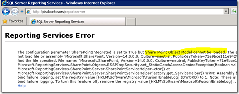

{}

Nuestra primera parada en el servidor de Reporting Services es el Administrador de configuración de Reporting Services.

{}

## Cuenta de servicio:

**Be sure to understand what service account you are using for Reporting Services. If we run into issues, it may be related to the service account you are using. The default is Network Service. When we go to deploy new builds, we always use Domain Accounts, because that is where we are likely to hit issues. For this instance of server, we have used a Domain Account called RSService.**

**Imagen 1: Configuración de cuenta de servicio**

## URL del servicio web:

{}

**Necesitaremos configurar la URL del servicio web. Este es el directorio virtual de ReportServer (vdir) que aloja los servicios web que utiliza Reporting Services y con el que se comunicará SharePoint. A menos que desee personalizar las propiedades del vdir (es decir, SSL, puertos, encabezados de host, etc.), debería poder hacer clic en Aplicar aquí y estar listo para comenzar.**

**Imagen 2: Configuración de la URL del servicio web Una vez que se haya configurado la URL del servicio web, debería poder ver los siguientes resultados**

**Imagen 3: - Configuración exitosa de la URL del servicio web**
{}

## Base de datos:

**Necesitamos crear la base de datos del catálogo de Reporting Services. Esto se puede colocar en cualquier motor de base de datos SQL 2008 o SQL 2008 R2. SQL11 también funcionaría bien, pero todavía está en BETA. Esta acción creará dos bases de datos, ReportServer y ReportServerTempDB, de forma predeterminada.**

{}
**El otro paso importante es asegurarse de elegir SharePoint integrado para el tipo de base de datos. Una vez realizada esta elección, no se puede cambiar.**

**Imagen 4: Creación de la base de datos del servidor de informes**

**Imagen 5: Configuración del servidor de base de datos y tipo de autenticación**

**Imagen 6: Configuración del nombre y modo de la base de datos**
{}

**Para las credenciales, así es como el servidor de informes se comunicará con el servidor SQL. Cualquiera que sea la cuenta que seleccione, se le otorgarán ciertos derechos dentro de la base de datos del catálogo, así como algunas de las bases de datos del sistema a través de RSExecRole. MSDB es una de estas bases de datos para uso de suscripción, ya que utilizamos el Agente SQL.**

**Imagen 7: Configuración de las credenciales de la base de datos del servidor de informes**

{}

**Una vez especificadas las credenciales de la base de datos, deberíamos poder obtener los resultados como se especifica a continuación.**

**Imagen 8: Progreso de la creación de la base de datos del servidor de informes**

**Imagen 9: Resumen de finalización de la base de datos del servidor de informes**
{}

## URL del administrador de informes:

**Podemos omitir la URL del Administrador de informes, ya que no se usa cuando estamos en el modo integrado de SharePoint. SharePoint es nuestra interfaz. El Administrador de informes no funciona.**

## Claves de cifrado:

{}
**Haga una copia de seguridad de sus claves de cifrado y asegúrese de saber dónde las guarda. Si se encuentra en una situación en la que necesita migrar la base de datos o restaurarla, los necesitará.**

**Imagen 10: - Copia de seguridad de la clave de cifrado del servidor de informes**
{}

{}
**¡Felicitaciones! Hemos configurado correctamente Reporting Services mediante Configuration Manager. Si busca la URL en la pestaña URL del servicio web, debería mostrar algo similar a lo siguiente.**

**Imagen 11: Acceso al servidor de informes después de la instalación**

**Motivo del error: SharePoint está instalado en nuestro WFE y terminamos de configurar Reporting Services. En este ejemplo, Reporting Services y SharePoint están en máquinas diferentes. Si estuvieran en la misma máquina, no habría visto este error. Técnicamente necesitamos instalar SharePoint en RS Box. Eso significa que IIS también estará habilitado.**
{}

