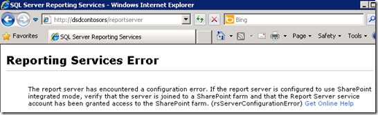

{}

Ahora necesitamos ejecutar pasos similares a los que hicimos para el SharePoint WFE. Lo primero es pasar por la instalación de los requisitos previos de uisites y, una vez completada, iniciar la configuración de SharePoint.

{}

Para la configuración elijo Server Farm y una instalación completa para que coincida con mi SharePoint Box, ya que no quiero una instalación independiente para SharePoint.

## Configuración de SharePoint

{}

**En el Asistente de Configuración de SharePoint, queremos conectarnos a una granja existente.**

**Imagen1:- Asistente de configuración de SharePoint**
{}

{}

**Luego lo apuntaremos a la base de datos SharePoint_Config que está usando nuestra granja. Si no sabes dónde está, puedes averiguarlo a través de Central Admin, en Configuración del sistema -> Manager Servers en esta granja.**

**Imagen2:- Especificar configuración de la base de datos**

**Imagen3:- Asistente de configuración de SharePoint**
{}

{}

**Una vez que el asistente haya terminado, eso es todo lo que necesitamos hacer en el servidor de informes por ahora. Volviendo a la URL del ReportServer, veremos otro error, pero eso se debe a que no lo hemos configurado a través del Administrador Central.**

**Image4:- Error del servidor de informes**
{}

