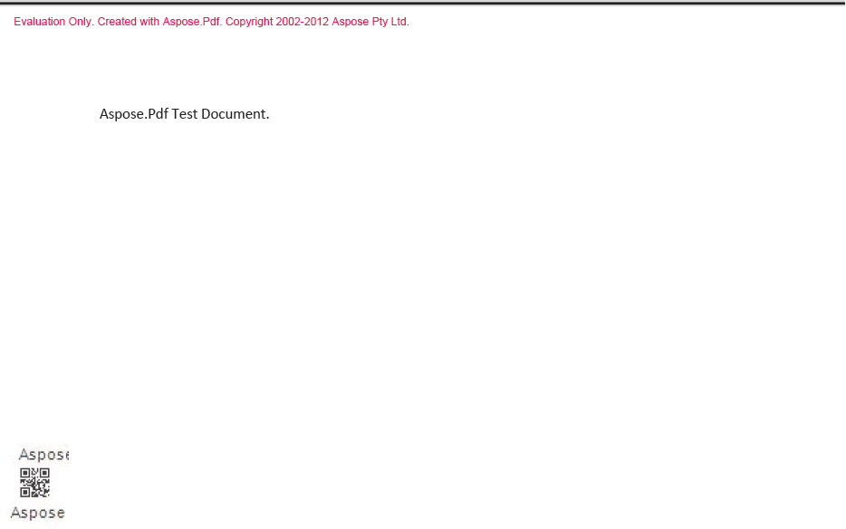

## **Agregar código de barras a un archivo PDF**

{}

Aspose.PDF for SharePoint le permite agregar un código de barras a un documento PDF. Los usuarios pueden agregar un código de barras en la esquina inferior izquierda de cada página de un documento PDF agregado a la biblioteca. La imagen a continuación brinda una idea de cómo podría verse un documento PDF con un código de barras agregado.

**Código de barras en la esquina inferior izquierda**

{}

{}

Para habilitar la función de código de barras para una biblioteca específica, use el botón **Configuración de marca de agua** en la pestaña **Herramientas de marca de agua de Aspose PDF** dentro de **Herramientas de biblioteca**, como se muestra a continuación.

**Configuración de marca de agua de PDF**

Después de habilitar los códigos de barras para la biblioteca específica, Aspose.PDF for SharePoint agrega un código de barras a cualquier documento PDF añadido a esa biblioteca.

{}
