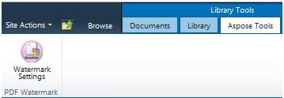

{}

Aspose.PDF for SharePoint le permite agregar una marca de agua a un documento PDF. La función agrega una marca de agua de texto en la esquina inferior izquierda de cada página de un documento PDF añadido a la biblioteca.

## **Texto de marca de agua en la esquina inferior izquierda**

{}

{}

Para habilitar la función de marca de agua para una biblioteca específica:

1. Haga clic en **Watermark Settings** en la pestaña **Aspose Tools** del cuadro de diálogo **Library Tools**.

   **Herramientas de biblioteca**

La configuración de marca de agua es específica de la lista, por lo que puede elegir una configuración de marca de agua diferente para distintas bibliotecas. La siguiente captura de pantalla muestra el cuadro de diálogo Watermark Settings para la biblioteca **Shared Documents**.

## **Configuración de marca de agua**

- Seleccione **Enable watermarking for** para habilitar la función de marca de agua para una lista específica.
- **Watermark text** – el texto que aparecerá en la página como marca de agua.
- **Font** – la fuente usada para la marca de agua.
- **Color** – el color de la marca de agua.

Después de habilitar la marca de agua para una biblioteca específica, Aspose.PDF agrega marcas de agua a cada documento PDF añadido a esa biblioteca.

{}
