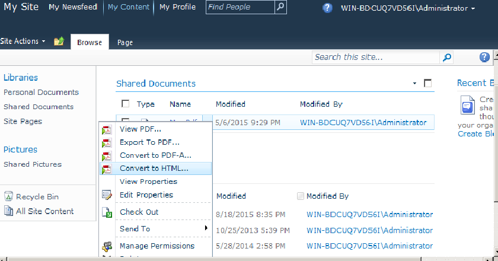
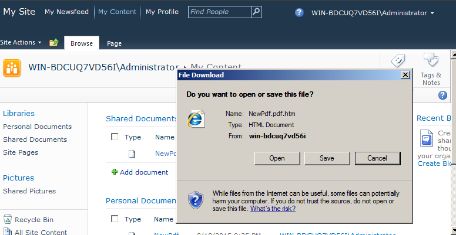

{}

Aspose.PDF for SharePoint admite la función de convertir documentos PDF de la biblioteca de documentos de SharePoint al formato HTML. En este artículo demostraremos la conversión de PDF a HTML.

{}

## **Convertir documento PDF a HTML**

Convertir documento PDF de la biblioteca de documentos de SharePoint a HTML de la siguiente manera:

1. Haga clic **Convert to HTML** en el menú ECB del documento PDF.

2. Descargue y guarde el archivo HTML resultante en el disco.

