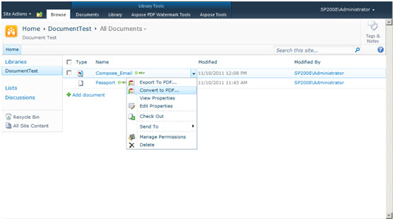

{}

Aspose.PDF for SharePoint permite convertir archivos HTML, archivos de texto y imágenes (JPG, PNG, GIF, TIFF, BMP) al formato PDF.

{}

## **Convertir un documento a PDF**

{}

Para convertir un documento a PDF:

1. Haga clic en **Convert to PDF** en el menú ECB.
1. Descargue y guarde el archivo PDF resultante.

**Opción Convertir a PDF en el menú ECB**

{}

## **Información del creador de PDF**

{}

- Tenga en cuenta que no puede establecer valores en los campos **Application** y **Producer**, porque Aspose Ltd. y Aspose.PDF for SharePoint x.x.x se mostrarán en estos campos. 

{}
