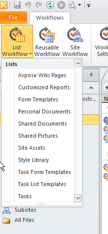
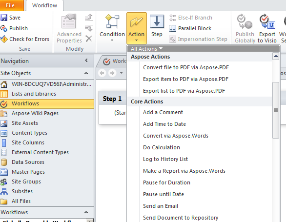
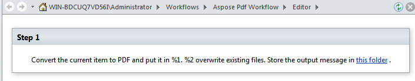
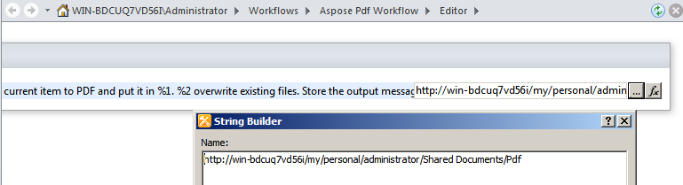
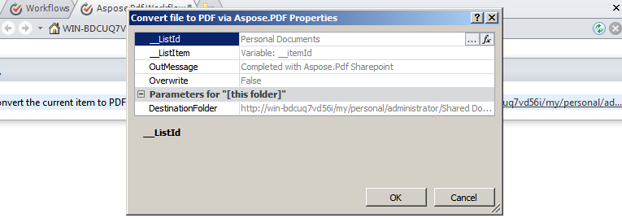
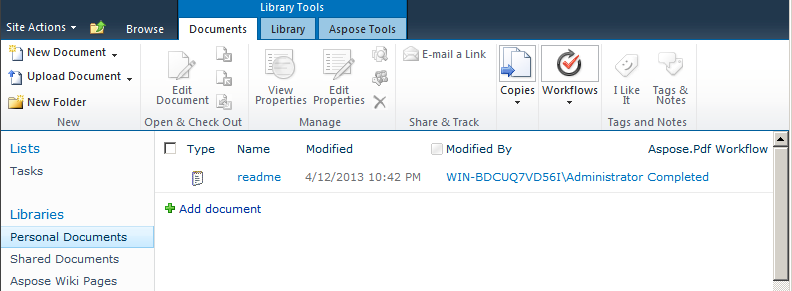
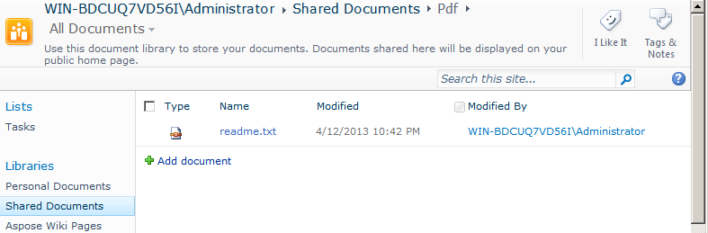

{}

El soporte para flujos de trabajo es una funcionalidad clave de Microsoft Office SharePoint Server. Los flujos de trabajo ayudan a automatizar el movimiento de documentos según la lógica empresarial y a optimizar el costo y el tiempo de la organización de documentos. Este artículo muestra cómo usar Aspose.PDF for SharePoint en un `Workflow` que convierte un documento a PDF.

{}

## **Configuración de un `Workflow`**

Este ejemplo crea un `Workflow` que convierte cualquier elemento nuevo en una biblioteca de documentos al formato PDF y lo almacena en otra biblioteca de documentos. El ejemplo utiliza la biblioteca **Personal Documents** como biblioteca de origen y la subcarpeta **Pdf** en la biblioteca **Shared Documents** como biblioteca de destino.

Aspose.PDF for SharePoint admite la conversión de archivos HTML, de texto y de imagen.

### **Diseña el `Workflow` usando SharePoint Designer**

1. Abre **SharePoint Designer** y conéctate al sitio donde se implementará el `Workflow`.
1. Selecciona **Workflows** de **objetos del sitio** y luego abre **List Workflow**.
1. Selecciona la biblioteca **Personal Documents** para crear y asociar un nuevo `Workflow` de lista a la biblioteca de documentos.

   **Seleccionar Personal Documents del menú**

1. Crea y asocia el `Workflow` de lista a la biblioteca **Personal Documents** escribiendo un nombre y una descripción para el `Workflow`.
1. Haga clic en **OK** para completar este paso.

   **Creando un `Workflow` de lista**

Aparece un editor de pasos del `Workflow`. Se utiliza para definir condiciones y acciones para los flujos de trabajo. Ahora agregue una acción para convertir un nuevo documento a PDF sin ninguna condición, desde **Aspose Actions**.

1. Seleccione la acción **Convert file to PDF via Aspose.PDF** del menú **Action**.

   **Seleccionando una acción**

1. Configure los parámetros de la acción:
   1. Establezca el parámetro **this folder** a la carpeta de destino.
   1. Deje los demás parámetros de acción con los valores predeterminados o configúrelos usando la ventana de propiedades de la acción. El valor predeterminado del parámetro **Overwrite** es false.

      **El editor de `Workflow`**

**Configuración de la biblioteca de destino**

**Configuración de las propiedades**

1. En el menú **Workflow**, seleccione **Workflow Settings**.
1. Seleccione **inicie el `Workflow` automáticamente cuando se cree un nuevo elemento** y desmarque otras opciones de **Opciones de inicio**.

   **Configuración de las opciones de inicio**

El diseño del `Workflow` está terminado.

1. Guarde y publique el `Workflow` para implementarlo en el sitio de SharePoint.

### **Probar el `Workflow`**

Para probar el `Workflow`:

1. Abra el sitio de SharePoint y cargue un nuevo documento en la biblioteca de documentos **Personal Documents**.
   Aspose.PDF for SharePoint admite la conversión de archivos HTML, archivos de texto y imágenes (JPG, PNG, GIF, TIFF y BMP*) a PDF. El `Workflow` está configurado para iniciarse automáticamente cuando se crea un nuevo elemento, por lo que los archivos se procesan automáticamente.
1. Actualice el navegador.
   El estado del `Workflow` aparece en la columna de `Workflow`, **Aspose.PDF Workflow** en este caso.

   **Añadiendo un documento a la biblioteca de origen**

1. Abra la biblioteca de documentos de destino para ver el documento convertido. **Shared Documents/Pdf** es la ruta en este ejemplo.

   **La biblioteca de destino**

